# 📘 Oracle Master Bronze DBA — สรุปเนื้อหาฉบับสมบูรณ์

> **หนังสือ**: ORACLE MASTER Bronze DBA 教科書 (Textbook)
> **สอบ**: 1Z0-085-JPN — Bronze DBA Oracle Database Fundamentals
> **เวอร์ชัน**: Oracle Database 12c R1 – 19c (ข้อสอบรวมทุกเวอร์ชัน)
> **จำนวนข้อสอบ**: 70 ข้อ ใน 2 ชั่วโมง (เลือกตอบ)

---

## 📖 สารบัญ

- [[#บทที่ 1 — ภาพรวมการจัดการ Oracle Database]]
- [[#บทที่ 2 — การติดตั้ง Oracle Software และสร้าง Database]]
- [[#บทที่ 3 — EM Express และเครื่องมือ SQL]]
- [[#บทที่ 4 — การกำหนดค่า Oracle Network]]
- [[#บทที่ 5 — การจัดการ Oracle Instance]]
- [[#บทที่ 6 — โครงสร้างพื้นที่จัดเก็บข้อมูล (Storage)]]
- [[#บทที่ 7 — การจัดการ User และ Security]]
- [[#บทที่ 8 — การจัดการ Schema Objects]]
- [[#บทที่ 9 — การ Monitor และ Advisor]]
- [[#บทที่ 10 — Backup Recovery และ High Availability]]

---

## บทที่ 1 — ภาพรวมการจัดการ Oracle Database

### 1-1 พื้นฐาน Database

- **Database** = ข้อมูลที่จัดระเบียบเพื่อจุดประสงค์เฉพาะ
- **DBMS** (Database Management System) = ซอฟต์แวร์จัดการ DB → Oracle คือหนึ่งใน DBMS
- **RDBMS** = DBMS สำหรับ Relational Database โดยเฉพาะ

#### คุณสมบัติที่ DBMS ต้องมี
| คุณสมบัติ | รายละเอียด |
|---|---|
| **จัดการข้อมูลขนาดใหญ่** | รองรับปริมาณข้อมูลมหาศาล |
| **แชร์ข้อมูล** | ผู้ใช้หลายคนเข้าถึงพร้อมกัน |
| **ประสิทธิภาพสูง** | อ่าน/เขียนข้อมูลเร็ว |
| **ความพร้อมใช้งาน** | กู้คืนจากความเสียหายได้รวดเร็ว |
| **ความปลอดภัย** | ควบคุมสิทธิ์การเข้าถึง |

#### โครงสร้าง Relational Database

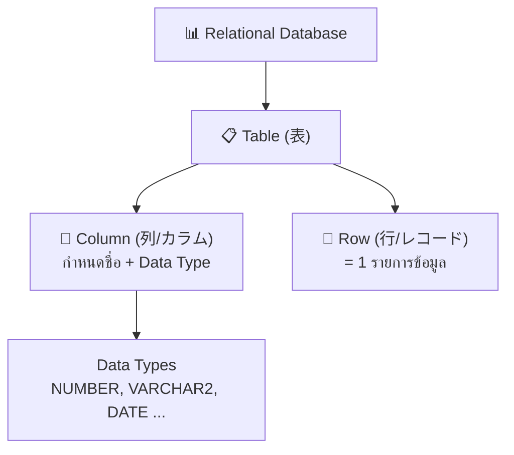

### 1-2 พื้นฐาน SQL

SQL คือภาษามาตรฐานสำหรับจัดการ Relational Database (มาตรฐาน ANSI/ISO)

#### การแบ่งประเภท SQL Commands

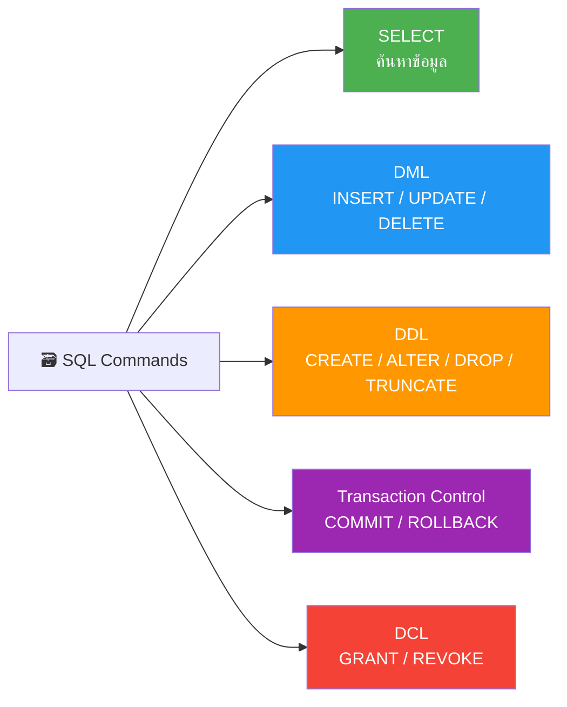

> [!important] ความแตกต่างของคำสั่งลบ
> - `DELETE` (DML) → ลบ **แถว** ตามเงื่อนไข (ROLLBACK ได้)
> - `TRUNCATE` (DDL) → ลบ **ทุกแถว** แต่ตารางยังอยู่ (ROLLBACK ไม่ได้)
> - `DROP` (DDL) → ลบ **ตารางทั้งหมด** รวมโครงสร้าง (ROLLBACK ไม่ได้)

> [!warning] Implicit COMMIT (暗黙のコミット)
> เมื่อรัน DDL หรือ DCL ระหว่าง Transaction → Transaction ที่ค้างอยู่จะถูก **COMMIT อัตโนมัติ** ก่อน

### 1-3 ภาพรวม Oracle Database

Oracle ทำงานแบบ **Client / Server Architecture**

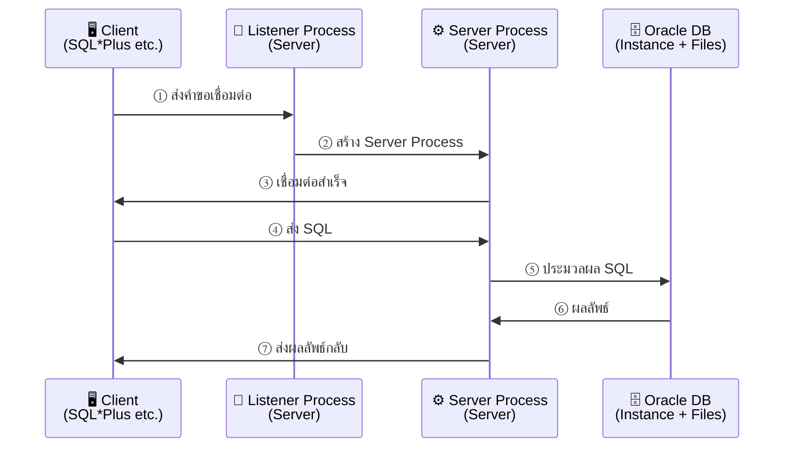

### 1-4 โครงสร้างภายใน Oracle Database

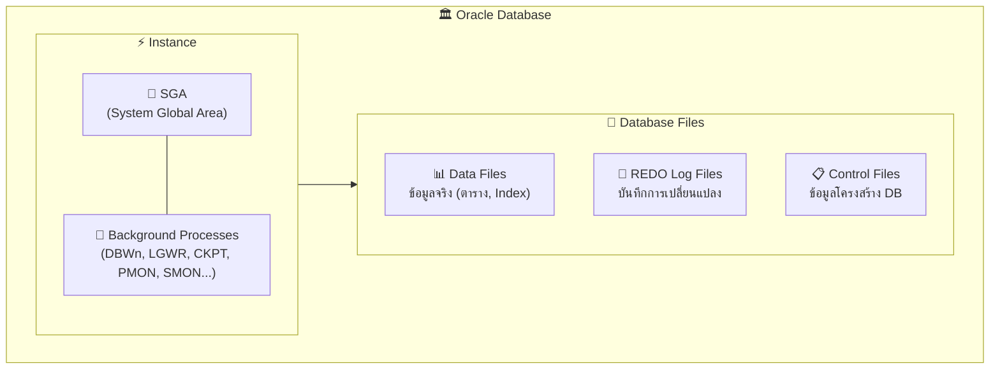

> [!tip] กระบวนการหลัก (Processes)
> - **User Process** (Client) → ส่ง SQL ไปยัง Server
> - **Listener Process** (Server) → รับคำขอเชื่อมต่อ → สร้าง Server Process
> - **Server Process** (Server) → รัน SQL → ส่งผลลัพธ์กลับ Client

---

## บทที่ 2 — การติดตั้ง Oracle Software และสร้าง Database

### 2-1 ขั้นตอนการติดตั้ง

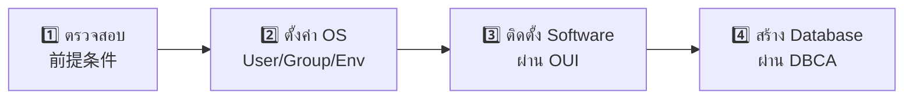

#### OS User & Groups ที่ต้องสร้าง
| ชื่อ | ประเภท | บทบาท |
|---|---|---|
| `oracle` | OS User | เจ้าของ Oracle Software |
| `oinstall` | OS Group | กลุ่ม Inventory (บันทึก product ที่ติดตั้ง) |
| `dba` | OS Group | กลุ่ม OSDBA (สิทธิ์ SYSDBA) |

#### Environment Variables (Linux/UNIX)
| ตัวแปร | คำอธิบาย |
|---|---|
| `ORACLE_BASE` | Top-level directory (เช่น `/u01/app/oracle`) |
| `ORACLE_HOME` | ที่ติดตั้ง Software เฉพาะรุ่น |
| `ORACLE_SID` | System Identifier (= Database Name ในกรณีปกติ) |

> [!important] ความสัมพันธ์ ORACLE_HOME กับ Database
> - 1 `ORACLE_HOME` = Software **1 เวอร์ชัน** เท่านั้น
> - 1 Server มี **หลาย** `ORACLE_HOME` ได้ (คนละเวอร์ชัน)
> - 1 `ORACLE_HOME` สร้าง **หลาย** Database ได้

### 2-2 สร้าง Database ด้วย DBCA

**DBCA** (Database Configuration Assistant) → เครื่องมือ GUI สำหรับ:
- สร้าง / ลบ Database
- เปลี่ยนค่า Config
- จัดการ Template

#### Template มี 2 ประเภท

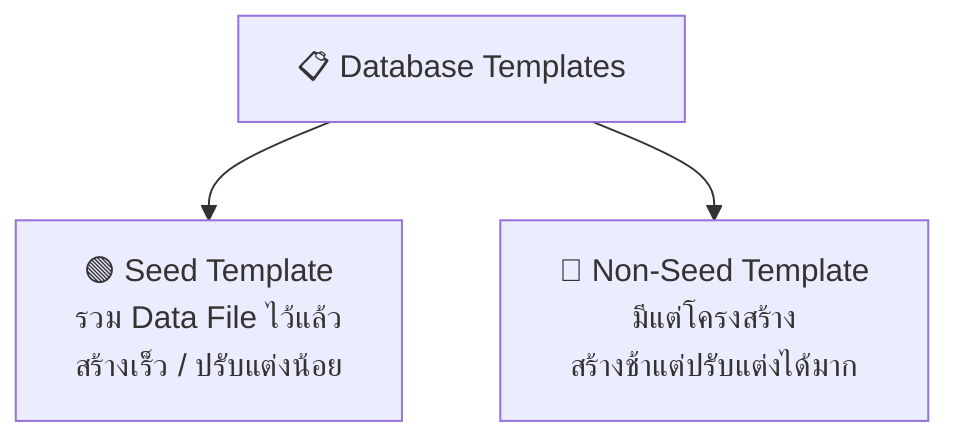

> [!warning] DBCA ≠ DBUA
> - **DBCA** = สร้าง/ลบ Database
> - **DBUA** (Database Upgrade Assistant) = อัปเกรด Database เป็นเวอร์ชันใหม่

---

## บทที่ 3 — EM Express และเครื่องมือ SQL

### 3-1 Enterprise Manager Database Express (EM Express)

- Web-based GUI สำหรับจัดการ **DB เดียว** (ไม่ต้องติดตั้งเพิ่ม)
- URL: `https://<hostname>:5500/em`
- ตั้งค่า Port: `EXEC DBMS_XDB_CONFIG.SETHTTPSPORT(5500);`

#### สิ่งที่ทำได้ vs ทำไม่ได้

| ✅ ทำได้ | ❌ ทำไม่ได้ |
|---|---|
| แก้ไข初期化パラメータ | **เปิด/ปิด Database** |
| จัดการ Tablespace | **Backup / Recovery** |
| จัดการ User & Role | **สร้าง/แก้ไข Table** |
| ดู ADDM, AWR, SQL Tuning | **จัดการ DB หลายตัว** |

#### เปรียบเทียบ EM Express vs Cloud Control

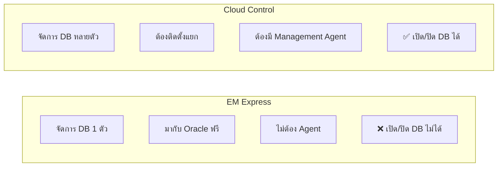

### 3-2 SQL*Plus

- เครื่องมือ Command-line มาตรฐาน
- รันได้: **SQL**, **PL/SQL**, **SQL*Plus Commands**

#### วิธีเชื่อมต่อ
| คำสั่ง | คำอธิบาย |
|---|---|
| `sqlplus` | ใส่ username/password แบบ interactive |
| `sqlplus user/pass` | เชื่อมต่อทันที |
| `sqlplus /nolog` | เปิด SQL*Plus โดยไม่เชื่อมต่อ → ใช้ `CONNECT` ภายหลัง |
| `sqlplus / as sysdba` | เชื่อมต่อแบบ OS Authentication (ต้อง login เป็น `oracle` user) |

> [!important] SYS User ต้องใช้ `AS SYSDBA` เสมอ

---

## บทที่ 4 — การกำหนดค่า Oracle Network

### 4-1 Oracle Net

Oracle Net = Component ที่จัดการเชื่อมต่อระหว่าง Client กับ DB Server ผ่าน Network

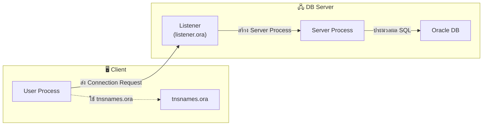

### 4-2 Listener

- **Listener** = Process บน Server ที่รอรับคำขอเชื่อมต่อจาก Client
- แยกจาก Instance → ต้อง start แยก
- 1 Listener ให้บริการหลาย DB ได้

#### ไฟล์ Config: `listener.ora`
- ที่อยู่: `$ORACLE_HOME/network/admin/listener.ora`
- Default: ชื่อ `LISTENER`, Port `1521`, Protocol `TCP/IP`
- ถ้าใช้ค่า Default → ไม่จำเป็นต้องมี `listener.ora`

#### คำสั่ง `lsnrctl`
| คำสั่ง | ผลลัพธ์ |
|---|---|
| `lsnrctl start` | เปิด Listener |
| `lsnrctl stop` | ปิด Listener (session ที่เชื่อมต่ออยู่ยังไม่หลุด) |
| `lsnrctl status` | ดูสถานะ Listener |
| `lsnrctl services` | ดู Service ที่ Listener รู้จัก |

### 4-3 วิธีเชื่อมต่อจาก Client

#### Local vs Remote Connection
| ประเภท | ต้องการ | ตัวอย่าง |
|---|---|---|
| **Local** | `ORACLE_SID` | `sqlplus user/pass` |
| **Remote** | 接続識別子 (Connection Identifier) | `sqlplus user/pass@identifier` |

#### Naming Methods (วิธีระบุปลายทาง)

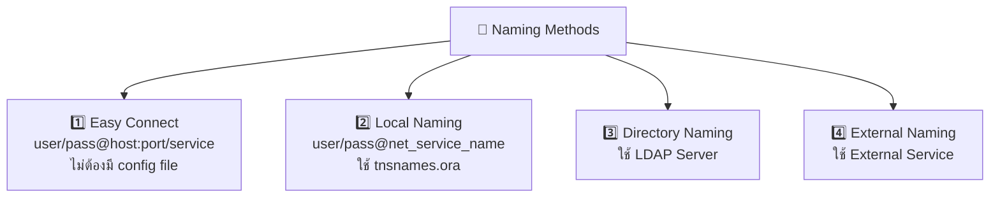

---

## บทที่ 5 — การจัดการ Oracle Instance

### 5-1 ส่วนประกอบของ Instance

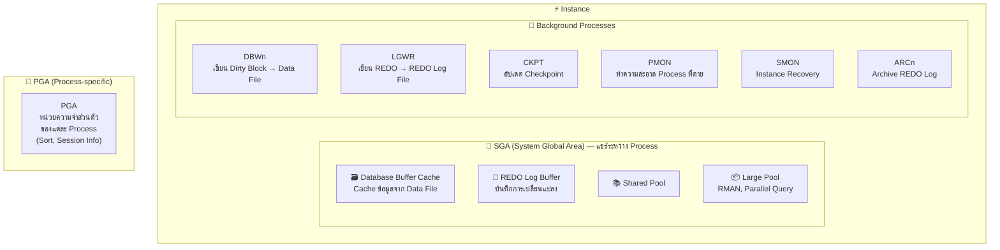

#### Shared Pool ประกอบด้วย

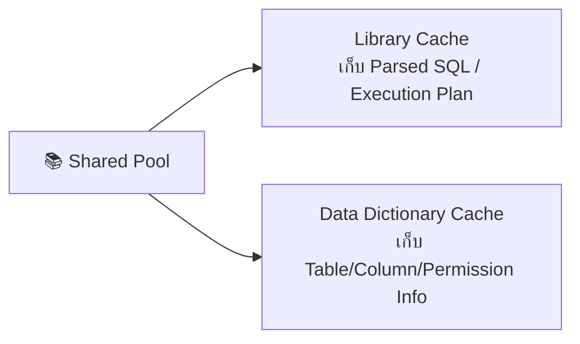

### 5-2 การเปิด/ปิด Instance

#### Startup Phases


> [!important] สิทธิ์การเชื่อมต่อ
> - **NOMOUNT / MOUNT** → เฉพาะ SYSDBA / SYSOPER
> - **OPEN** → ผู้ใช้ทั่วไปเชื่อมต่อได้

#### Shutdown Modes

| Mode | รอ Session หลุด | รอ Transaction จบ | Rollback อัตโนมัติ | สถานะ File |
|---|---|---|---|---|
| `NORMAL` | ✅ | ✅ | ❌ | สอดคล้อง |
| `TRANSACTIONAL` | ❌ | ✅ | ❌ | สอดคล้อง |
| `IMMEDIATE` ⭐ | ❌ | ❌ | ✅ | สอดคล้อง |
| `ABORT` | ❌ | ❌ | ❌ | **ไม่สอดคล้อง** (ต้อง Instance Recovery) |

### 5-2-2 Initialization Parameters

#### SPFILE vs PFILE
| รายการ | SPFILE (Server Parameter File) | PFILE (Text Parameter File) |
|---|---|---|
| รูปแบบ | Binary | Text |
| แก้ไข | `ALTER SYSTEM SET` | Text Editor |
| ลำดับความสำคัญ | **สูงกว่า** (ใช้ก่อน) | ใช้เมื่อไม่มี SPFILE |

#### Dynamic vs Static Parameters
| ประเภท | แก้ไขขณะ DB เปิด | วิธีแก้ |
|---|---|---|
| **Dynamic** | ✅ | `ALTER SYSTEM SET param=value` |
| **Static** | ❌ | `ALTER SYSTEM SET param=value SCOPE=SPFILE` → Restart |

### 5-3 การจัดการ Memory

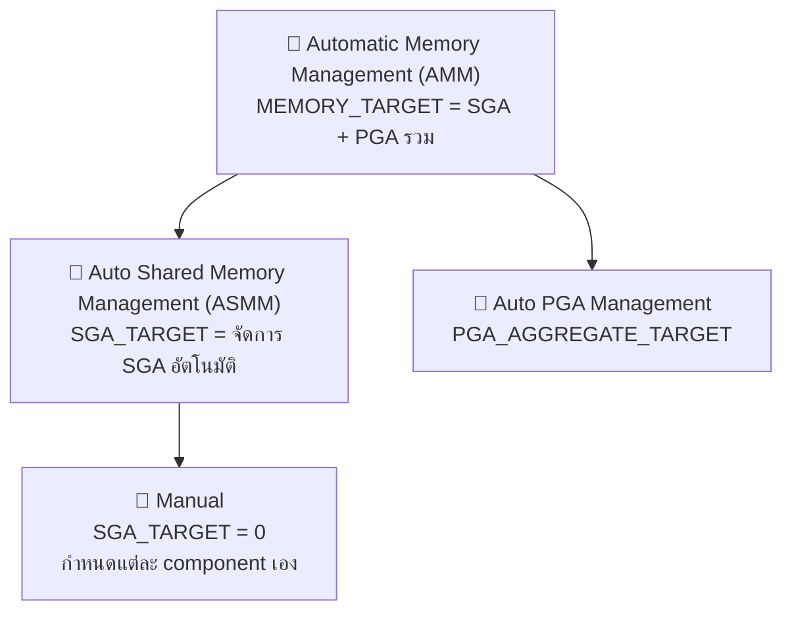

---

## บทที่ 6 — โครงสร้างพื้นที่จัดเก็บข้อมูล (Storage)

### 6-1 Database Files

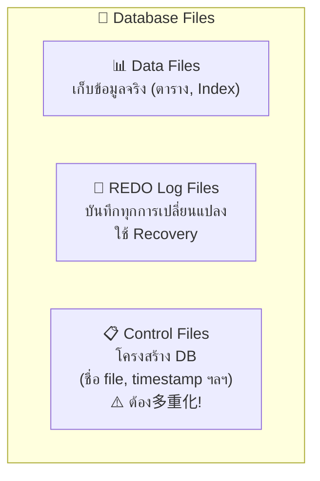

#### REDO Log File — โครงสร้าง Group / Member

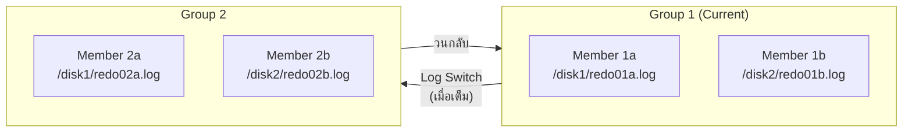

> [!important] REDO Log
> - ต้องมีอย่างน้อย **2 Groups**
> - 多重化 (Multiplexing) = มีหลาย Member ต่อ Group (แนะนำเพื่อป้องกัน)
> - ขนาดไม่ auto-extend

### 6-2 Tablespace & Storage Hierarchy

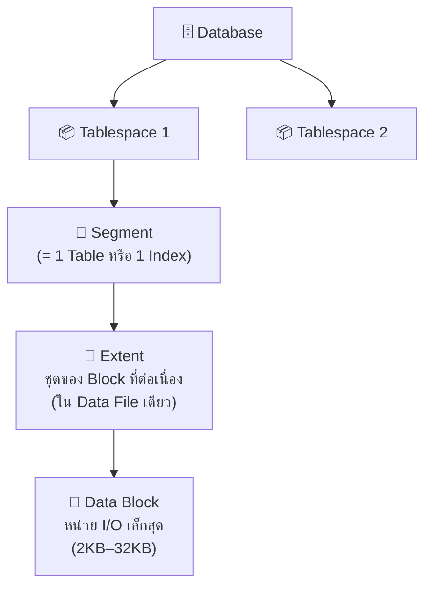

#### Tablespace ที่สำคัญ
| Tablespace | บทบาท | หมายเหตุ |
|---|---|---|
| **SYSTEM** | เก็บ Data Dictionary | ขาดไม่ได้ / เปลี่ยนชื่อไม่ได้ |
| **SYSAUX** | ช่วย SYSTEM (AWR ฯลฯ) | ขาดไม่ได้ / เปลี่ยนชื่อไม่ได้ |

### 6-3 การสร้าง/ขยาย/ลบ Tablespace

```sql
-- สร้าง
CREATE TABLESPACE ts1 DATAFILE '/path/file.dbf' SIZE 100M;

-- ขยาย (3 วิธี)
ALTER DATABASE DATAFILE '/path/file.dbf' RESIZE 200M;         -- Resize
ALTER TABLESPACE ts1 ADD DATAFILE '/path/file2.dbf' SIZE 100M; -- เพิ่ม File
-- เปิด AUTOEXTEND ON

-- ลบ
DROP TABLESPACE ts1 INCLUDING CONTENTS AND DATAFILES;
```

#### Smallfile vs Bigfile Tablespace
| รายการ | Smallfile (ปกติ) | Bigfile |
|---|---|---|
| จำนวน Data File | หลายไฟล์ได้ | **1 ไฟล์เท่านั้น** |
| เพิ่ม Data File | ✅ ได้ | ❌ ไม่ได้ |
| ขนาดสูงสุด | ตาม OS | สูงสุด 32 TB (8KB block) |

### 6-4 UNDO Tablespace & Temporary Tablespace

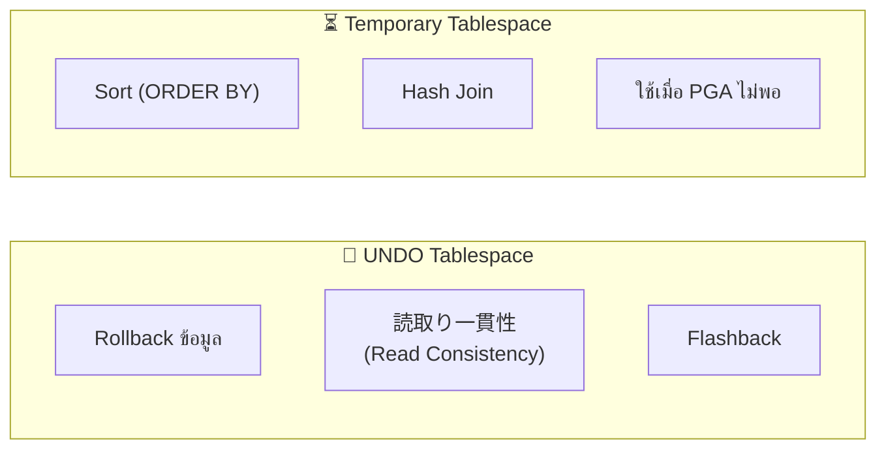

> [!warning] ORA-01555: Snapshot Too Old
> เกิดเมื่อ UNDO Data ถูก overwrite ก่อนที่ Query จะเสร็จ
> แก้ไข: เพิ่ม `UNDO_RETENTION` / ขยาย UNDO Tablespace

---

## บทที่ 7 — การจัดการ User และ Security

### 7-1 การสร้าง/แก้ไข/ลบ User

```sql
CREATE USER app_user
  IDENTIFIED BY password123
  DEFAULT TABLESPACE users
  TEMPORARY TABLESPACE temp
  QUOTA 100M ON users
  PROFILE default
  PASSWORD EXPIRE       -- บังคับเปลี่ยน Password ตอน Login ครั้งแรก
  ACCOUNT UNLOCK;
```

> [!important] Quota
> ถ้าไม่กำหนด **QUOTA** บน Tablespace ใด → User จะสร้าง Object ใน Tablespace นั้นไม่ได้

#### Account Lock vs Password Expire
| สถานะ | ผลกระทบ |
|---|---|
| **Password Expire** | Login ได้ด้วย Password เก่า → แต่ต้องเปลี่ยน Password ใหม่ |
| **Account Lock** | Login **ไม่ได้เลย** → ต้อง UNLOCK ก่อน |

#### การลบ User
- User ที่กำลัง Connect → **ลบไม่ได้**
- User ที่มี Object → ต้องใช้ `DROP USER username CASCADE` (ลบ Object ทั้งหมด)

### 7-2 สิทธิ์ (Privileges) และ Role

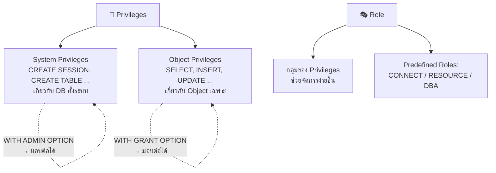

#### Predefined Roles
| Role | สิทธิ์ |
|---|---|
| `CONNECT` | สิทธิ์พื้นฐานสำหรับเชื่อมต่อ |
| `RESOURCE` | สร้าง Object พื้นฐาน |
| `DBA` | System Privileges ทั้งหมด (แต่ เปิด/ปิด DB ไม่ได้) |

### 7-2-3 SYSDBA / SYSOPER

| สิทธิ์ | สามารถทำ | จุดเด่น |
|---|---|---|
| **SYSDBA** | สร้าง/ลบ DB, เปิด/ปิด, Incomplete Recovery, เข้าถึงข้อมูลทุก User | สิทธิ์สูงสุด |
| **SYSOPER** | เปิด/ปิด, Complete Recovery, MOUNT/OPEN | **เข้าถึงข้อมูล User ไม่ได้** |

> [!tip] การ Connect แบบ SYSDBA
> - OS Authentication: `sqlplus / as sysdba` (login เป็น `oracle` user บน OS)
> - Password File Authentication: `sqlplus sys/pass as sysdba`

---

## บทที่ 8 — การจัดการ Schema Objects

### 8-1 Schema คืออะไร

- **Schema** = พื้นที่เก็บ Object ของ User (ชื่อเดียวกับ Username)
- สร้าง User → สร้าง Schema อัตโนมัติ
- Object คนละ Schema → ชื่อซ้ำได้ → อ้างอิงด้วย `schema.object`

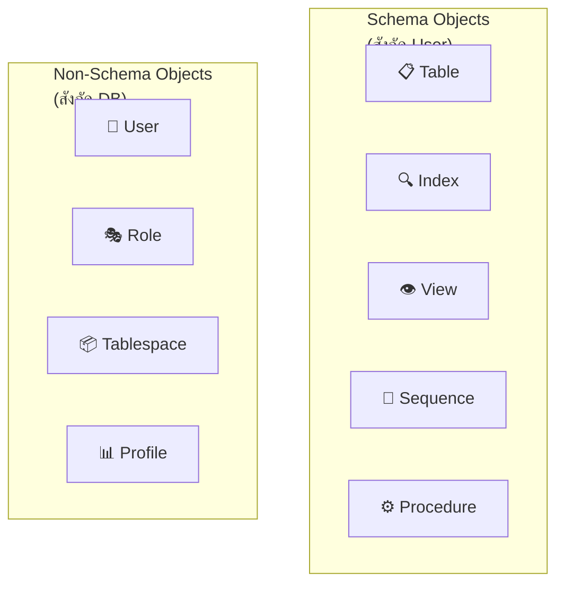

### 8-2 Data Types หลัก

| Data Type | คำอธิบาย |
|---|---|
| `NUMBER(n,m)` | ตัวเลข (n=ทั้งหมด, m=ทศนิยม) |
| `CHAR(n)` | ข้อความคงที่ (เติมช่องว่าง) |
| `VARCHAR2(n)` | ข้อความแปรผัน |
| `DATE` | วันที่+เวลา |
| `TIMESTAMP` | วันที่+เวลา+เศษวินาที |
| `CLOB` | ข้อความขนาดใหญ่ |
| `BLOB` | ข้อมูล Binary (รูป, เสียง) |

### 8-2-2 Constraints (ข้อจำกัด)

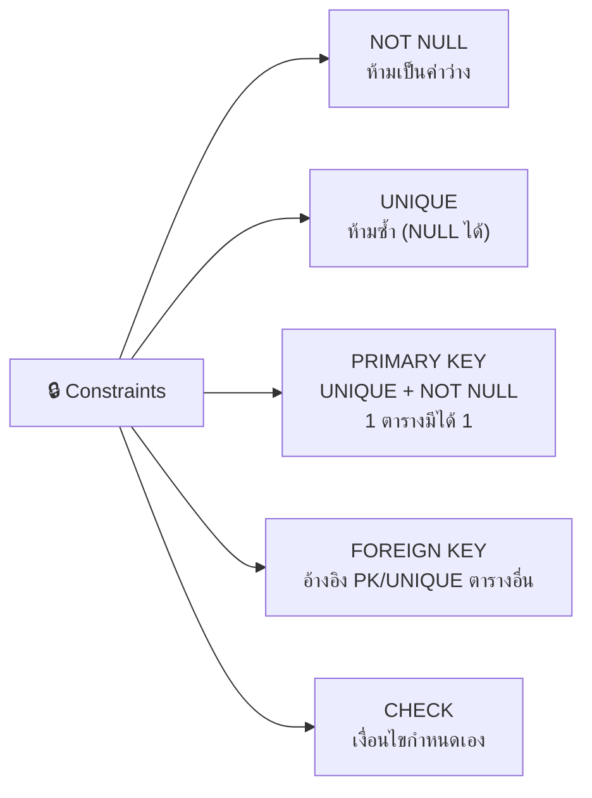

### 8-3 Recycle Bin & Flashback Drop

```mermaid
graph LR
    A["DROP TABLE t1"] -->|"RECYCLEBIN = ON"| B["🗑️ ย้ายไป Recycle Bin<br>(ไม่ลบจริง)"]
    B -->|"FLASHBACK TABLE t1<br>TO BEFORE DROP"| C["✅ กู้คืนสำเร็จ"]
    A -->|"PURGE"| D["❌ ลบถาวร"]
```

### 8-4 Index & View

#### Index (B-tree)
```mermaid
graph TD
    ROOT["🔝 Root Block"] --> B1["Branch Block"]
    ROOT --> B2["Branch Block"]
    B1 --> L1["🍃 Leaf Block<br>ค่า + ROWID"]
    B1 --> L2["🍃 Leaf Block<br>ค่า + ROWID"]
    B2 --> L3["🍃 Leaf Block<br>ค่า + ROWID"]
    B2 --> L4["🍃 Leaf Block<br>ค่า + ROWID"]
```

> [!warning] สร้าง Index มากเกินไป → DML (INSERT/UPDATE/DELETE) **ช้าลง** เพราะต้องอัปเดต Index ด้วย

#### View = Virtual Table
- นิยามด้วย `SELECT` statement → ไม่เก็บข้อมูลจริง
- ประโยชน์: ซ่อนความซับซ้อนของ SQL + ควบคุมสิทธิ์การเข้าถึง

### 8-5 เครื่องมือย้ายข้อมูล

| เครื่องมือ | จุดประสงค์ | ทิศทาง |
|---|---|---|
| **SQL*Loader** | โหลด CSV/Text ภายนอก → Table | นอก → ใน |
| **Data Pump** (`expdp`/`impdp`) | Export/Import ข้อมูลระหว่าง DB | DB ↔ DB |

---

## บทที่ 9 — การ Monitor และ Advisor

### 9-1 การ Monitor ด้วย EM Express

- **Database Home Page** → ดูสถานะ, Workload, SQL Monitoring
- **Performance Hub** → ดู Performance แบบ Real-time + ย้อนหลัง (ASH)

### 9-2 AWR & ADDM

```mermaid
graph LR
    MMON["🔄 MMON Process"] -->|"ทุก 60 นาที"| AWR["📊 AWR Snapshot<br>(เก็บใน SYSAUX)<br>เก็บไว้ 8 วัน"]
    AWR -->|"ทุกครั้งที่สร้าง Snapshot"| ADDM["🧠 ADDM<br>วิเคราะห์อัตโนมัติ<br>ให้คำแนะนำ"]
```

| Component | คำอธิบาย |
|---|---|
| **AWR** (Automatic Workload Repository) | เก็บสถิติ Performance อัตโนมัติ |
| **ADDM** (Automatic Database Diagnostic Monitor) | วิเคราะห์ Bottleneck จาก AWR → แนะนำวิธีแก้ |

### 9-3 Advisors

```mermaid
graph TD
    ADV["🛠️ Advisors"] --> STA["SQL Tuning Advisor<br>วิเคราะห์ SQL ตัวเดียว<br>(Top Activity, STS)"]
    ADV --> SAA["SQL Access Advisor<br>วิเคราะห์ Workload ทั้งหมด<br>แนะนำ Index/MView/Partition"]
    STA --> REC["คำแนะนำ:<br>• เก็บ Statistics<br>• สร้าง Index<br>• เขียน SQL ใหม่<br>• SQL Profile"]
```

---

## บทที่ 10 — Backup Recovery และ High Availability

### 10-1 พื้นฐาน Backup & Recovery

#### ARCHIVELOG vs NOARCHIVELOG Mode

```mermaid
graph TD
    subgraph NOARCH["🔴 NOARCHIVELOG Mode"]
        N1["REDO Log ถูก overwrite"]
        N2["❌ Recovery ถึงจุดล่าสุดไม่ได้"]
        N3["❌ Online Backup ไม่ได้"]
    end
    subgraph ARCH["🟢 ARCHIVELOG Mode"]
        A1["ARCn บันทึก REDO → Archive Log"]
        A2["✅ Recovery ถึงจุดล่าสุดได้"]
        A3["✅ Online Backup ได้"]
    end
```

> [!important] เปลี่ยน Mode
> ต้องอยู่ใน **MOUNT** state → `ALTER DATABASE ARCHIVELOG;`

#### ประเภท Backup

| ประเภท | ชื่อเรียก | เงื่อนไข | ต้อง Recovery ไหม |
|---|---|---|---|
| **Consistent** (一貫性) | Offline / Cold | DB ต้องปิดปกติ | ❌ Restore แล้วเปิดได้เลย |
| **Inconsistent** (非一貫性) | Online / Hot | DB เปิดอยู่ (ต้อง ARCHIVELOG) | ✅ ต้อง Recovery หลัง Restore |

### 10-1-4 Restore vs Recovery

```mermaid
graph LR
    BK["💾 Backup"] -->|"Restore<br>คืน File จาก Backup"| RS["📂 Restored Files<br>(ข้อมูล ณ ตอน Backup)"]
    RS -->|"Recovery<br>Apply REDO/Archive Logs"| RC["✅ Recovered DB<br>(ข้อมูลล่าสุด)"]
```

| ประเภท Recovery | คำอธิบาย |
|---|---|
| **Complete Recovery** | กู้คืนจนถึงจุดล่าสุดก่อนเกิดปัญหา |
| **Incomplete (Point-in-Time)** | กู้คืนถึงจุดที่กำหนด → ต้อง `OPEN RESETLOGS` |

#### RMAN (Recovery Manager)
```
RMAN> BACKUP DATABASE;    -- Backup ทั้ง DB
RMAN> RESTORE DATABASE;   -- คืน File
RMAN> RECOVER DATABASE;   -- Apply REDO Logs
```

### 10-1-7 ประเภทความเสียหายและการแก้ไข

```mermaid
graph TD
    F["⚠️ ประเภทความเสียหาย"] --> UF["👤 User Process Failure<br>(Session หลุด)"]
    F --> IF["⚡ Instance Failure<br>(DB Crash)"]
    F --> MF["💥 Media Failure<br>(Disk เสีย)"]
    
    UF -->|"PMON ทำ Rollback<br>อัตโนมัติ"| U_OK["✅ อัตโนมัติ"]
    IF -->|"SMON ทำ Instance Recovery<br>ตอน OPEN ครั้งถัดไป"| I_OK["✅ อัตโนมัติ"]
    MF -->|"DBA ใช้ RMAN<br>Restore + Recovery"| M_OK["⚠️ ต้องทำเอง"]
```

### 10-2 High Availability

```mermaid
graph TB
    HA["🏗️ High Availability Solutions"] --> RAC["Oracle RAC<br>หลาย Instance<br>แชร์ 1 DB<br>→ Scale Out"]
    HA --> DG["Oracle Data Guard<br>Primary → Standby<br>→ Disaster Recovery"]
    HA --> ASM["Oracle ASM<br>จัดการ Storage อัตโนมัติ<br>Striping + Mirroring"]
    HA --> CW["Oracle Clusterware<br>จัดการ Cluster<br>Failover อัตโนมัติ"]
```

| Solution | จุดประสงค์หลัก |
|---|---|
| **Oracle RAC** | หลาย Server แชร์ 1 DB → Failover + Scale-out |
| **Oracle Data Guard** | จำลอง DB ไปยังไซต์สำรอง → Disaster Recovery |
| **Oracle ASM** | จัดการ Storage อัตโนมัติ (Striping + Mirroring) |
| **Oracle Clusterware** | จัดการ Cluster → Failover อัตโนมัติ |

---

## 📊 สรุปภาพรวมทั้งเล่ม

```mermaid
graph TB
    subgraph CH1["Ch.1 ภาพรวม"]
        DB_Basics["DB/RDBMS/SQL พื้นฐาน"]
        ORA_Arch["Oracle Architecture"]
    end
    subgraph CH23["Ch.2-3 เตรียมระบบ"]
        Install["ติดตั้ง (OUI)"]
        CreateDB["สร้าง DB (DBCA)"]
        Tools["EM Express / SQL*Plus"]
    end
    subgraph CH45["Ch.4-5 Network & Instance"]
        Net["Oracle Net / Listener"]
        Inst["Instance (SGA/PGA/BG)"]
        StartStop["เปิด/ปิด Instance"]
    end
    subgraph CH67["Ch.6-7 Storage & Security"]
        Storage["Tablespace / Files"]
        UserSec["User / Privileges / Roles"]
    end
    subgraph CH89["Ch.8-9 Objects & Monitor"]
        Schema["Schema / Table / Index / View"]
        Monitor["AWR / ADDM / Advisors"]
    end
    subgraph CH10["Ch.10 Backup & HA"]
        Backup["Backup / Recovery (RMAN)"]
        HighAvail["RAC / Data Guard / ASM"]
    end
    
    CH1 --> CH23 --> CH45 --> CH67 --> CH89 --> CH10
```

---

> [!note] แหล่งข้อมูล
> สรุปจากหนังสือ: **オラクルマスター教科書 Bronze DBA**
> สำนักพิมพ์: 翔泳社 (Shoeisha)
> ผู้เขียน: 株式会社コーソル 渡部亮太
