# 📘 Oracle Master Bronze DBA — 完全まとめ

> **書籍**: ORACLE MASTER Bronze DBA 教科書
> **試験**: 1Z0-085-JPN — Bronze DBA Oracle Database Fundamentals
> **対応バージョン**: Oracle Database 12c R1 – 19c（複数バージョン共通出題）
> **試験概要**: 70問 / 2時間（選択式）

---

## 📖 目次

- [[#第1章 — Oracleデータベース管理の概要]]
- [[#第2章 — Oracleソフトウェアのインストールとデータベースの作成]]
- [[#第3章 — EM ExpressおよびSQL管理ツール]]
- [[#第4章 — Oracle Network環境の構成]]
- [[#第5章 — Oracleインスタンスの管理]]
- [[#第6章 — データベース記憶域構造の管理]]
- [[#第7章 — ユーザーおよびセキュリティの管理]]
- [[#第8章 — スキーマオブジェクトの管理]]
- [[#第9章 — データベースの監視およびアドバイザの使用]]
- [[#第10章 — バックアップ・リカバリと高可用性構成]]

---

## 第1章 — Oracleデータベース管理の概要

### 1-1 データベースの基礎知識

- **データベース** = 特定の目的に必要なデータを整理・保管したもの
- **DBMS**（Database Management System）= データベースの構築・運用を管理する専用ソフトウェア → OracleはDBMSの1つ
- **RDBMS** = リレーショナルデータベース向けのDBMS

#### DBMSが備えるべき要件
| 要件 | 説明 |
|---|---|
| **大量データの管理** | 膨大な量のデータを管理できる |
| **データの共有** | 複数の利用者が同時にアクセスできる |
| **高パフォーマンス** | 高速にデータを参照・変更できる |
| **可用性** | 障害発生時に迅速に復旧できる |
| **セキュリティ** | ユーザーごとにアクセスを制御できる |

#### リレーショナルデータベースの構造

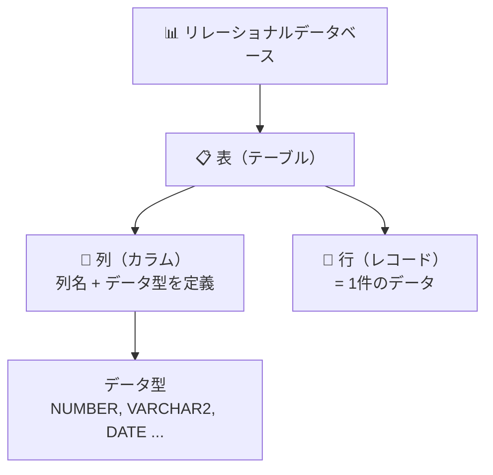

### 1-2 SQLの基礎知識

SQLはリレーショナルデータベースを操作するための標準言語（ANSI/ISO規格）

#### SQLコマンドの分類

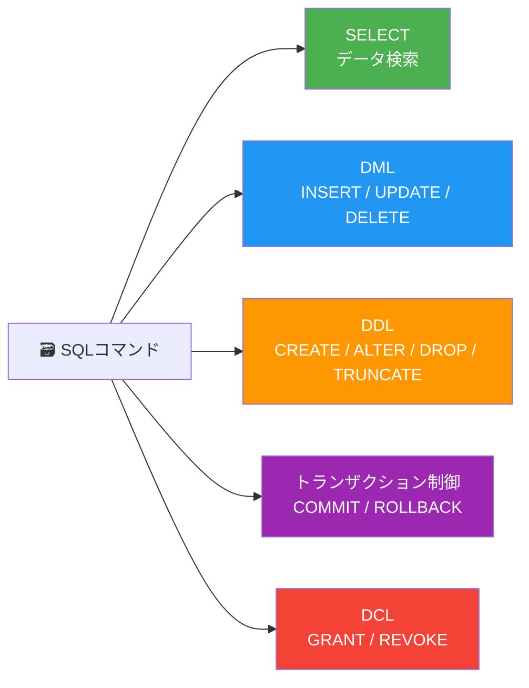

> [!important] 削除コマンドの違い
> - `DELETE`（DML）→ 条件に一致する**行**を削除（ROLLBACKが可能）
> - `TRUNCATE`（DDL）→ 表内の**全行**を切り捨て、表自体は残る（ROLLBACKは不可）
> - `DROP`（DDL）→ **表自体**（構造とデータ）を削除（ROLLBACKは不可）

> [!warning] 暗黙のコミット
> トランザクション実行中にDDLまたはDCLを実行すると → 実行中のトランザクションが**自動的にコミット**される

### 1-3 Oracleデータベースの概要

Oracleは **クライアント／サーバーアーキテクチャ** に基づく

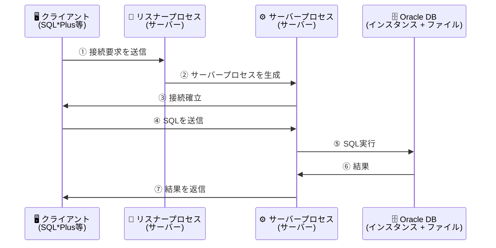

### 1-4 Oracleデータベースの内部構造

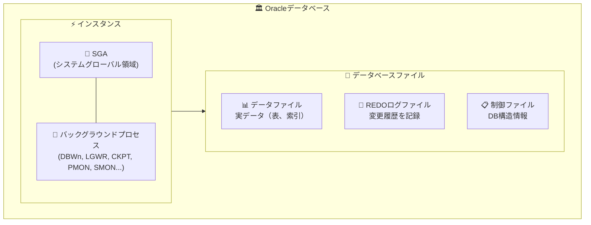

> [!tip] 主なプロセス
> - **ユーザープロセス**（クライアント側）→ SQLをサーバーに送信
> - **リスナープロセス**（サーバー側）→ 接続要求を受け付け → サーバープロセスを生成
> - **サーバープロセス**（サーバー側）→ SQLを実行 → 結果をクライアントに返信

---

## 第2章 — Oracleソフトウェアのインストールとデータベースの作成

### 2-1 インストール手順

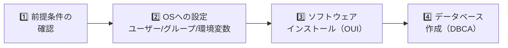

#### 作成するOSユーザー＆グループ
| 名前 | 種類 | 役割 |
|---|---|---|
| `oracle` | OSユーザー | Oracleソフトウェア所有者 |
| `oinstall` | OSグループ | インベントリグループ（製品情報の記録・管理） |
| `dba` | OSグループ | OSDBAグループ（SYSDBA権限） |

#### 環境変数（Linux/UNIX環境）
| 環境変数 | 説明 |
|---|---|
| `ORACLE_BASE` | 最上位ディレクトリ（例：`/u01/app/oracle`） |
| `ORACLE_HOME` | 特定リリースのソフトウェアインストール先 |
| `ORACLE_SID` | システム識別子（通常はデータベース名と一致） |

> [!important] ORACLE_HOMEとデータベースの関係
> - 1つの `ORACLE_HOME` = ソフトウェア **1つのバージョン** のみ格納可能
> - 1つのサーバーに **複数の** `ORACLE_HOME` を作成可能（異なるバージョン）
> - 1つの `ORACLE_HOME` から **複数の** データベースを作成可能

### 2-2 DBCAによるデータベース作成

**DBCA**（Database Configuration Assistant）→ GUIツール：
- データベースの作成・削除
- 構成の変更
- テンプレートの管理

#### テンプレートの種類

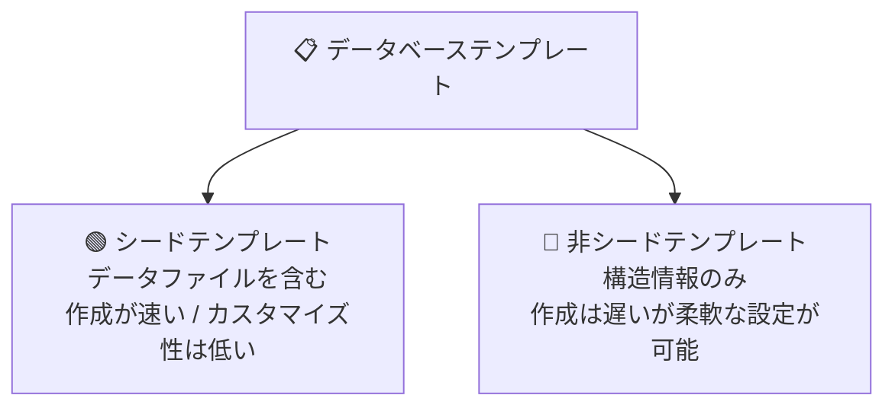

> [!warning] DBCA ≠ DBUA
> - **DBCA** = データベースの作成・削除
> - **DBUA**（Database Upgrade Assistant）= データベースのアップグレード

---

## 第3章 — EM ExpressおよびSQL管理ツール

### 3-1 Enterprise Manager Database Express（EM Express）

- Webブラウザから**単一のDB**をGUIで管理・監視する軽量コンソール（追加インストール不要）
- URL：`https://<ホスト名>:5500/em`
- ポート設定：`EXEC DBMS_XDB_CONFIG.SETHTTPSPORT(5500);`

#### 実行可能な作業 vs 実行不可能な作業

| ✅ 実行可能 | ❌ 実行不可能 |
|---|---|
| 初期化パラメータの編集 | **データベースの起動・停止** |
| 表領域の管理 | **バックアップ／リカバリ** |
| ユーザー＆ロールの管理 | **表の作成・変更** |
| ADDM、AWR、SQLチューニング | **複数DBの一元管理** |

#### EM Express と Cloud Control の比較

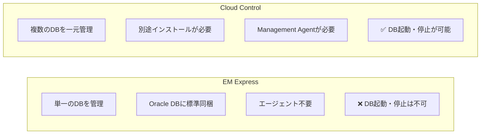

### 3-2 SQL*Plus

- 標準のコマンドラインツール
- 実行可能：**SQL**、**PL/SQL**、**SQL*Plusコマンド**

#### 接続方法
| コマンド | 説明 |
|---|---|
| `sqlplus` | ユーザー名/パスワードを対話的に入力 |
| `sqlplus user/pass` | 直接接続 |
| `sqlplus /nolog` | DB接続なしでSQL*Plusのみ起動 → 後から `CONNECT` で接続 |
| `sqlplus / as sysdba` | OS認証による接続（`oracle` OSユーザーでログイン時） |

> [!important] SYSユーザーでの接続には `AS SYSDBA` が必須

---

## 第4章 — Oracle Network環境の構成

### 4-1 Oracle Net

Oracle Net = クライアントとDBサーバー間のネットワーク接続を管理するコンポーネント

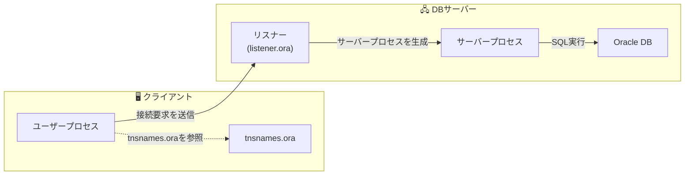

### 4-2 リスナー

- **リスナー** = サーバー上でクライアントからの接続要求を待ち受けるプロセス
- インスタンスとは独立 → 別途起動が必要
- 1つのリスナーで複数のDBに対応可能

#### 設定ファイル：`listener.ora`
- 配置場所：`$ORACLE_HOME/network/admin/listener.ora`
- デフォルト：リスナー名 `LISTENER`、ポート `1521`、プロトコル `TCP/IP`
- デフォルト設定使用時 → `listener.ora` は不要

#### `lsnrctl` コマンド
| コマンド | 機能 |
|---|---|
| `lsnrctl start` | リスナーの起動 |
| `lsnrctl stop` | リスナーの停止（確立済みセッションには影響しない） |
| `lsnrctl status` | リスナーの状態を確認 |
| `lsnrctl services` | 認識しているサービスを確認 |

### 4-3 クライアントからの接続

#### ローカル接続 vs リモート接続
| 接続形態 | 必要な情報 | 例 |
|---|---|---|
| **ローカル接続** | `ORACLE_SID` | `sqlplus user/pass` |
| **リモート接続** | 接続識別子 | `sqlplus user/pass@接続識別子` |

#### ネーミングメソッド（接続先の解決方法）

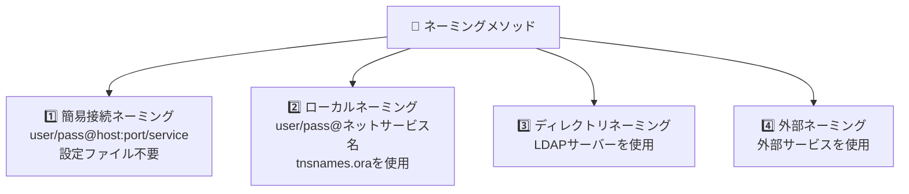

---

## 第5章 — Oracleインスタンスの管理

### 5-1 インスタンスの構成要素

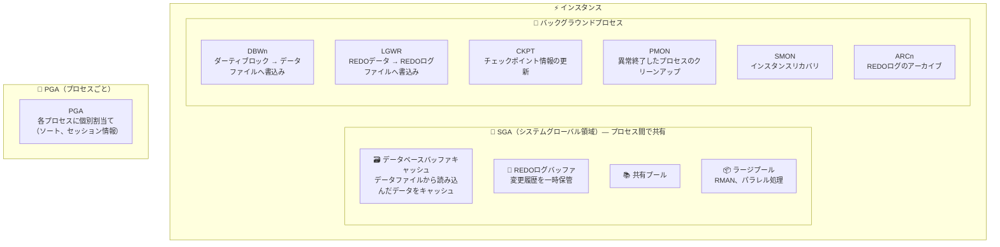

#### 共有プールの構成

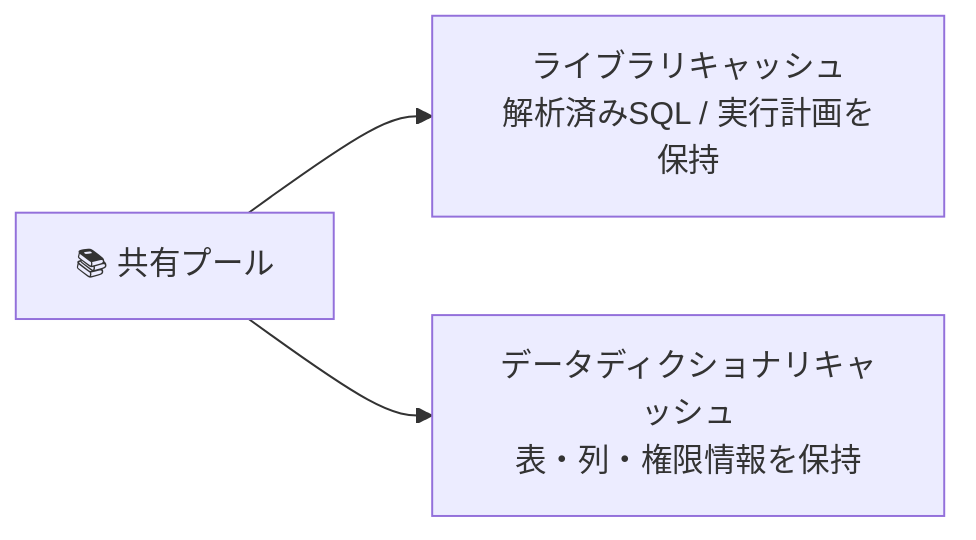

### 5-2 インスタンスの起動／停止

#### 起動フェーズ


> [!important] 接続権限
> - **NOMOUNT / MOUNT** → SYSDBA / SYSOPER権限が必要
> - **OPEN** → 一般ユーザーが接続可能

#### 停止モード

| モード | セッション切断を待機 | トランザクション終了を待機 | 自動ロールバック | ファイル状態 |
|---|---|---|---|---|
| `NORMAL` | ✅ | ✅ | ❌ | 整合性あり |
| `TRANSACTIONAL` | ❌ | ✅ | ❌ | 整合性あり |
| `IMMEDIATE` ⭐ | ❌ | ❌ | ✅ | 整合性あり |
| `ABORT` | ❌ | ❌ | ❌ | **不整合**（インスタンスリカバリが必要） |

### 5-2-2 初期化パラメータ

#### SPFILE vs PFILE
| 項目 | SPFILE（サーバーパラメータファイル） | PFILE（テキストパラメータファイル） |
|---|---|---|
| 形式 | バイナリ | テキスト |
| 変更方法 | `ALTER SYSTEM SET` | テキストエディタ |
| 優先度 | **高い**（優先使用） | SPFILEがない場合に使用 |

#### 動的パラメータ vs 静的パラメータ
| 種類 | DB稼働中の変更 | 変更方法 |
|---|---|---|
| **動的パラメータ** | ✅ 可能 | `ALTER SYSTEM SET パラメータ=値` |
| **静的パラメータ** | ❌ 不可 | `ALTER SYSTEM SET パラメータ=値 SCOPE=SPFILE` → 再起動 |

### 5-3 メモリー管理

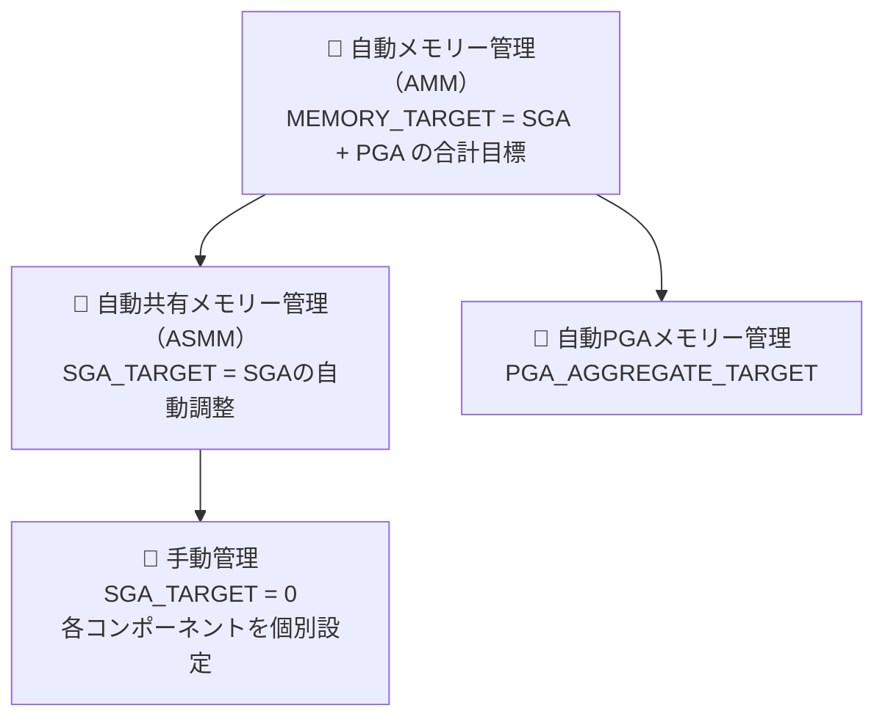

---

## 第6章 — データベース記憶域構造の管理

### 6-1 データベースファイル

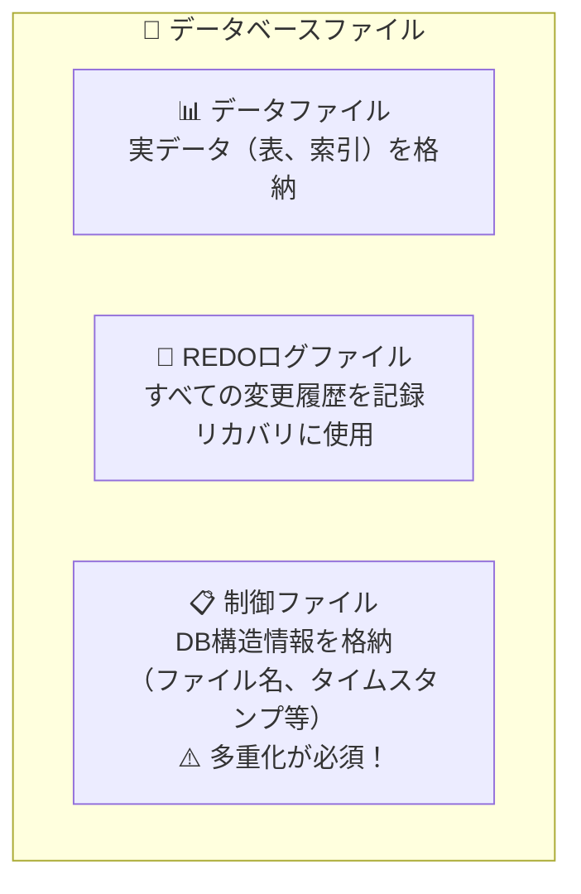

#### REDOログファイル — グループ／メンバー構成

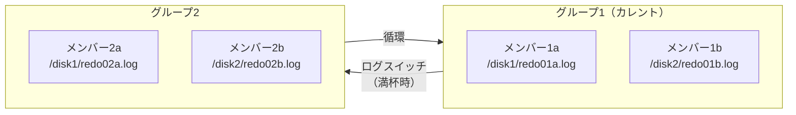

> [!important] REDOログのポイント
> - 最低 **2グループ** が必要
> - 多重化 = 1グループに複数メンバーを構成（障害対策として推奨）
> - サイズは自動拡張されない

### 6-2 表領域と記憶域の階層構造

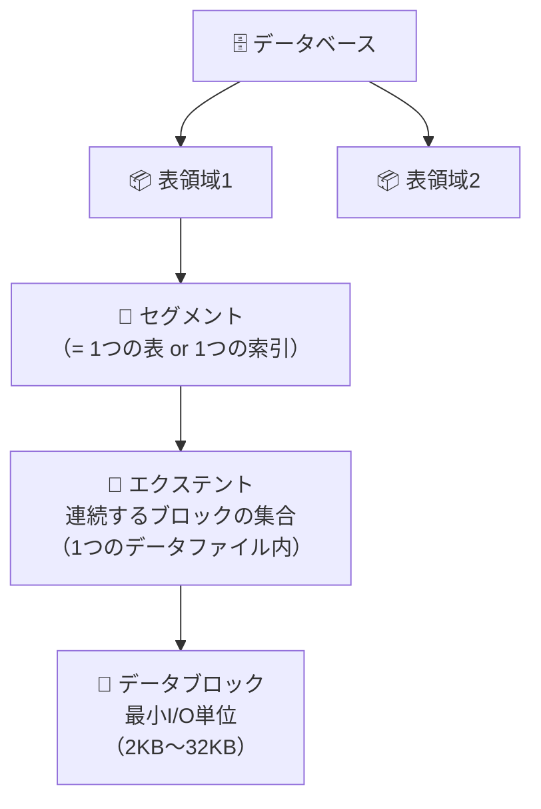

#### 重要な表領域
| 表領域 | 役割 | 備考 |
|---|---|---|
| **SYSTEM** | データディクショナリを格納 | 必須 / 名前変更不可 |
| **SYSAUX** | SYSTEMの補助（AWR等） | 必須 / 名前変更不可 |

### 6-3 表領域の作成・拡張・削除

```sql
-- 作成
CREATE TABLESPACE ts1 DATAFILE '/path/file.dbf' SIZE 100M;

-- 拡張（3つの方法）
ALTER DATABASE DATAFILE '/path/file.dbf' RESIZE 200M;         -- リサイズ
ALTER TABLESPACE ts1 ADD DATAFILE '/path/file2.dbf' SIZE 100M; -- ファイル追加
-- AUTOEXTEND ON を有効化

-- 削除
DROP TABLESPACE ts1 INCLUDING CONTENTS AND DATAFILES;
```

#### smallfile表領域 vs bigfile表領域
| 項目 | smallfile（標準） | bigfile |
|---|---|---|
| データファイル数 | 複数可能 | **1ファイルのみ** |
| ファイル追加 | ✅ 可能 | ❌ 不可 |
| 最大サイズ | OS依存 | 最大32TB（8KBブロック） |

### 6-4 UNDO表領域と一時表領域

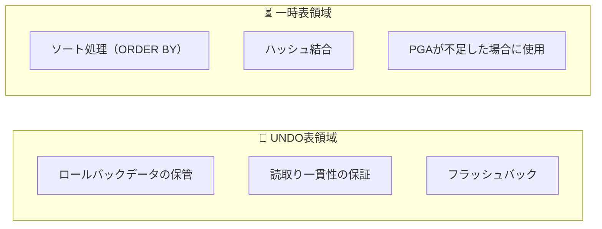

> [!warning] ORA-01555: Snapshot Too Old
> 長時間の問合せ実行中に必要なUNDOデータが上書きされた場合に発生
> 対策：`UNDO_RETENTION` の調整 / UNDO表領域の拡張

---

## 第7章 — ユーザーおよびセキュリティの管理

### 7-1 ユーザーの作成・変更・削除

```sql
CREATE USER app_user
  IDENTIFIED BY password123
  DEFAULT TABLESPACE users
  TEMPORARY TABLESPACE temp
  QUOTA 100M ON users
  PROFILE default
  PASSWORD EXPIRE       -- 初回ログイン時にパスワード変更を強制
  ACCOUNT UNLOCK;
```

> [!important] クオータについて
> 表領域に **QUOTA**（割当て制限）を設定しないと → その表領域にオブジェクトを作成できない

#### アカウントロック vs パスワード期限切れ
| 状態 | 影響 |
|---|---|
| **パスワード期限切れ** | 旧パスワードでログイン → 新パスワードの設定が必要 |
| **アカウントロック** | ログイン**自体が不可能** → 先にUNLOCKが必要 |

#### ユーザーの削除
- 接続中のユーザー → **削除不可**
- オブジェクトを所有しているユーザー → `DROP USER ユーザー名 CASCADE` が必要（所有オブジェクトも一括削除）

### 7-2 権限とロール

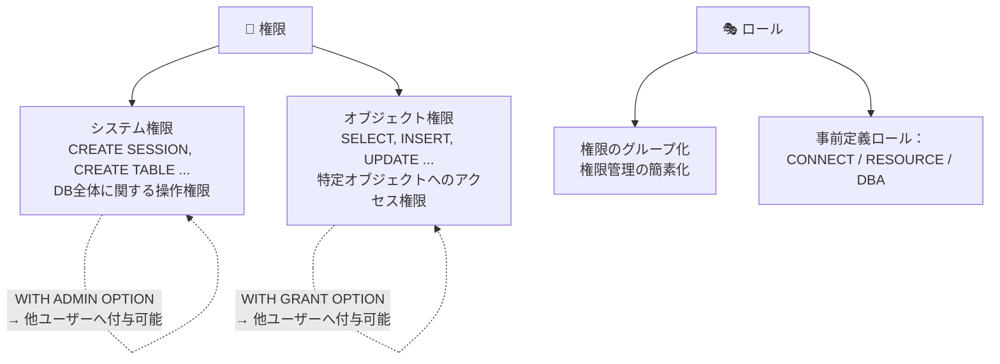

#### 事前定義ロール
| ロール | 権限 |
|---|---|
| `CONNECT` | 接続に必要な基本権限 |
| `RESOURCE` | オブジェクト作成に必要な基本権限 |
| `DBA` | すべてのシステム権限（ただしDB起動・停止は不可） |

### 7-2-3 SYSDBA／SYSOPER

| 権限 | 可能な操作 | 特徴 |
|---|---|---|
| **SYSDBA** | DB作成・削除、起動・停止、不完全リカバリ、全ユーザーデータへのアクセス | 最高管理権限 |
| **SYSOPER** | 起動・停止、完全リカバリ、MOUNT/OPEN | **ユーザーデータへのアクセス不可** |

> [!tip] SYSDBA接続方法
> - OS認証：`sqlplus / as sysdba`（OSで `oracle` ユーザーとしてログイン時）
> - パスワードファイル認証：`sqlplus sys/pass as sysdba`

---

## 第8章 — スキーマオブジェクトの管理

### 8-1 スキーマとは

- **スキーマ** = ユーザーが所有するオブジェクトの格納領域（ユーザー名と同名）
- ユーザー作成 → スキーマが自動的に作成される
- 異なるスキーマ → 同名オブジェクトが作成可能 → `スキーマ.オブジェクト` で参照

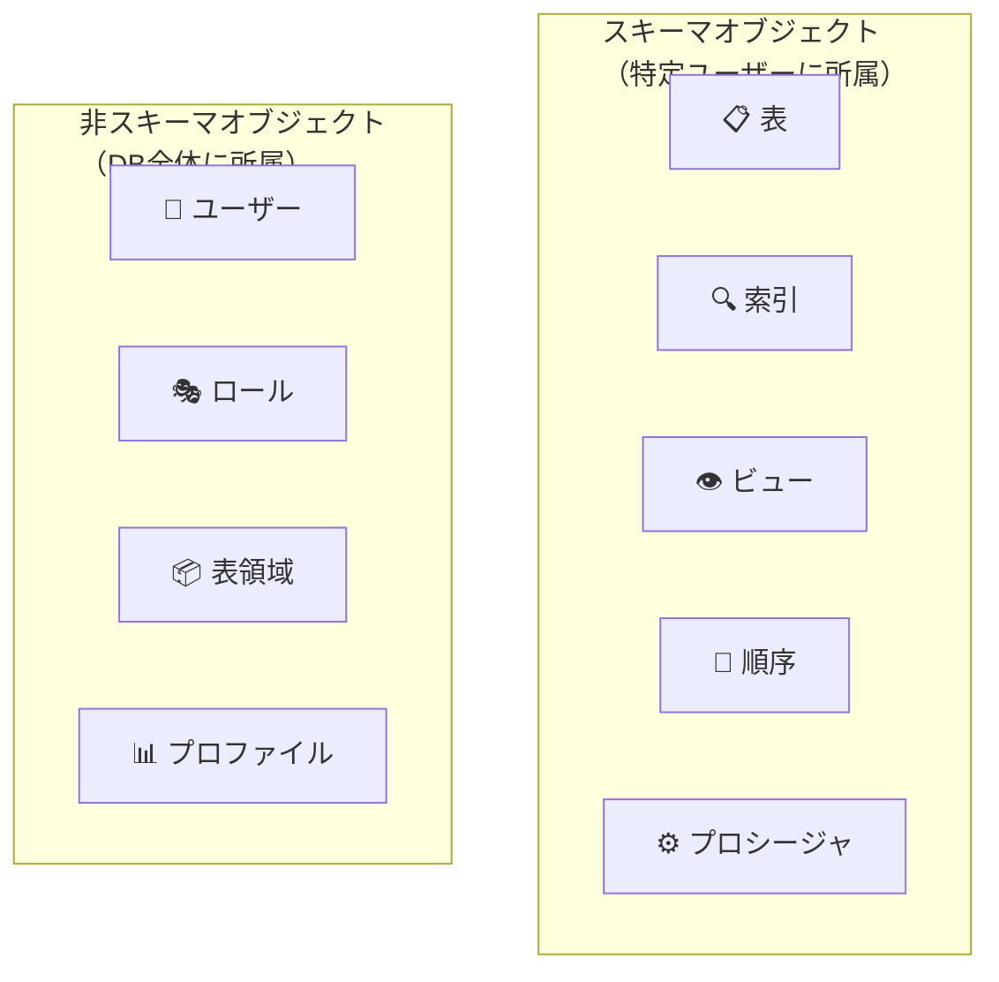

### 8-2 主なデータ型

| データ型 | 説明 |
|---|---|
| `NUMBER(n,m)` | 数値（n=全桁数、m=小数点以下桁数） |
| `CHAR(n)` | 固定長文字列（末尾を空白で補完） |
| `VARCHAR2(n)` | 可変長文字列 |
| `DATE` | 日付＋時刻 |
| `TIMESTAMP` | 日付＋時刻＋秒未満の精度 |
| `CLOB` | 大容量テキスト |
| `BLOB` | バイナリデータ（画像、音声） |

### 8-2-2 制約

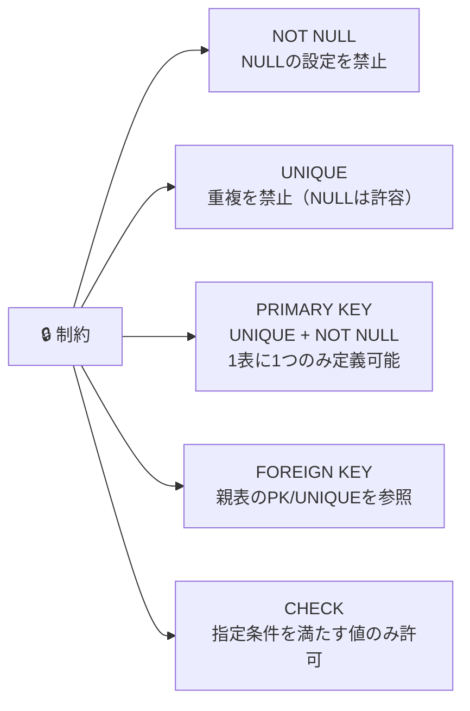

### 8-3 ごみ箱とフラッシュバックドロップ

```mermaid
graph LR
    A["DROP TABLE t1"] -->|"RECYCLEBIN = ON"| B["🗑️ ごみ箱に移動<br>（実際には削除されない）"]
    B -->|"FLASHBACK TABLE t1<br>TO BEFORE DROP"| C["✅ 復元成功"]
    A -->|"PURGE"| D["❌ 完全削除"]
```

### 8-4 索引とビュー

#### 索引（B-tree構造）
```mermaid
graph TD
    ROOT["🔝 ルートブロック"] --> B1["ブランチブロック"]
    ROOT --> B2["ブランチブロック"]
    B1 --> L1["🍃 リーフブロック<br>値 + ROWID"]
    B1 --> L2["🍃 リーフブロック<br>値 + ROWID"]
    B2 --> L3["🍃 リーフブロック<br>値 + ROWID"]
    B2 --> L4["🍃 リーフブロック<br>値 + ROWID"]
```

> [!warning] 索引の過剰作成に注意 → DML（INSERT/UPDATE/DELETE）のパフォーマンスが**低下**する（索引の自動更新コストが増加）

#### ビュー = 仮想表
- `SELECT` 文で定義 → 実データは保持しない
- 利点：複雑なSQLの隠蔽 + アクセス制御によるセキュリティ向上

### 8-5 データ移動ツール

| ツール | 用途 | 方向 |
|---|---|---|
| **SQL*Loader** | 外部ファイル（CSV/Text）→ 表へロード | 外部 → DB |
| **Data Pump**（`expdp`/`impdp`） | DB間のデータエクスポート/インポート | DB ↔ DB |

---

## 第9章 — データベースの監視およびアドバイザの使用

### 9-1 EM Expressによる監視

- **データベース・ホームページ** → 稼働状態、ワークロード、SQLモニタリングの概要
- **パフォーマンス・ハブ** → リアルタイム＋過去のパフォーマンス情報（ASH）

### 9-2 AWRとADDM

```mermaid
graph LR
    MMON["🔄 MMONプロセス"] -->|"60分ごと"| AWR["📊 AWRスナップショット<br>（SYSAUXに格納）<br>8日間保持"]
    AWR -->|"スナップショット生成ごと"| ADDM["🧠 ADDM<br>自動診断<br>推奨事項を提示"]
```

| コンポーネント | 説明 |
|---|---|
| **AWR**（自動ワークロードリポジトリ） | パフォーマンス統計を自動収集・蓄積 |
| **ADDM**（自動データベース診断モニター） | AWRからボトルネックを分析 → 解決策を推奨 |

### 9-3 アドバイザ

```mermaid
graph TD
    ADV["🛠️ アドバイザ"] --> STA["SQLチューニングアドバイザ<br>個別SQLの分析・最適化<br>（Top Activity、STS）"]
    ADV --> SAA["SQLアクセスアドバイザ<br>ワークロード全体の最適化<br>索引/MView/パーティションを推奨"]
    STA --> REC["推奨事項：<br>• 統計情報の収集<br>• 索引の作成<br>• SQL文の書き換え<br>• SQLプロファイル"]
```

---

## 第10章 — バックアップ・リカバリと高可用性構成

### 10-1 バックアップ・リカバリの基礎

#### ARCHIVELOGモード vs NOARCHIVELOGモード

```mermaid
graph TD
    subgraph NOARCH["🔴 NOARCHIVELOGモード"]
        N1["REDOログは上書きされる"]
        N2["❌ 障害直前までのリカバリは不可"]
        N3["❌ オンラインバックアップは不可"]
    end
    subgraph ARCH["🟢 ARCHIVELOGモード"]
        A1["ARCnがREDOログ → アーカイブログとして保存"]
        A2["✅ 障害直前までの完全リカバリが可能"]
        A3["✅ オンラインバックアップが可能"]
    end
```

> [!important] モード変更
> **MOUNT** 状態で → `ALTER DATABASE ARCHIVELOG;` を実行

#### バックアップの種類

| 種類 | 別名 | 条件 | リカバリの要否 |
|---|---|---|---|
| **一貫性バックアップ** | オフライン/コールド | DBを正常停止した状態で取得 | ❌ リストアのみでオープン可能 |
| **非一貫性バックアップ** | オンライン/ホット | DBオープン中に取得（ARCHIVELOG必須） | ✅ リカバリが必要 |

### 10-1-4 リストアとリカバリ

```mermaid
graph LR
    BK["💾 バックアップ"] -->|"リストア<br>バックアップからファイルを復元"| RS["📂 リストア後のファイル<br>（バックアップ取得時点のデータ）"]
    RS -->|"リカバリ<br>REDO/アーカイブログを適用"| RC["✅ リカバリ済みDB<br>（最新データ）"]
```

| リカバリ種類 | 説明 |
|---|---|
| **完全リカバリ** | 障害発生直前の最新状態まで復旧 |
| **不完全リカバリ（Point-in-Timeリカバリ）** | 指定した過去の時点まで復旧 → `OPEN RESETLOGS` が必要 |

#### RMAN（Recovery Manager）
```
RMAN> BACKUP DATABASE;    -- DB全体をバックアップ
RMAN> RESTORE DATABASE;   -- ファイルを復元
RMAN> RECOVER DATABASE;   -- REDOログを適用
```

### 10-1-7 障害の種類と対処

```mermaid
graph TD
    F["⚠️ 障害の種類"] --> UF["👤 ユーザープロセス障害<br>（セッション切断等）"]
    F --> IF["⚡ インスタンス障害<br>（異常終了、電源断等）"]
    F --> MF["💥 メディア障害<br>（ディスク破損等）"]
    
    UF -->|"PMONが自動ロールバック<br>リソース解放"| U_OK["✅ 自動対処"]
    IF -->|"SMONがインスタンスリカバリ<br>次回OPEN時に自動実行"| I_OK["✅ 自動対処"]
    MF -->|"DBAがRMAN等を使用<br>リストア + リカバリ"| M_OK["⚠️ 手動対処が必要"]
```

### 10-2 高可用性構成

```mermaid
graph TB
    HA["🏗️ 高可用性ソリューション"] --> RAC["Oracle RAC<br>複数インスタンスが<br>1つのDBを共有<br>→ スケールアウト"]
    HA --> DG["Oracle Data Guard<br>プライマリ → スタンバイ<br>→ 災害対策"]
    HA --> ASM["Oracle ASM<br>ストレージ自動管理<br>ストライピング + ミラーリング"]
    HA --> CW["Oracle Clusterware<br>クラスタ管理<br>自動フェイルオーバー"]
```

| ソリューション | 主な用途 |
|---|---|
| **Oracle RAC** | 複数サーバーで1つのDBを共有 → フェイルオーバー + スケールアウト |
| **Oracle Data Guard** | 遠隔地にDBを複製 → 災害対策（ディザスタリカバリ） |
| **Oracle ASM** | ストレージの自動管理（ストライピング + ミラーリング） |
| **Oracle Clusterware** | クラスタ管理 → 自動フェイルオーバー |

---

## 📊 全体の構成まとめ

```mermaid
graph TB
    subgraph CH1["第1章 概要"]
        DB_Basics["DB/RDBMS/SQL基礎"]
        ORA_Arch["Oracleアーキテクチャ"]
    end
    subgraph CH23["第2-3章 環境構築"]
        Install["インストール（OUI）"]
        CreateDB["DB作成（DBCA）"]
        Tools["EM Express / SQL*Plus"]
    end
    subgraph CH45["第4-5章 ネットワーク＆インスタンス"]
        Net["Oracle Net / リスナー"]
        Inst["インスタンス（SGA/PGA/BG）"]
        StartStop["起動／停止"]
    end
    subgraph CH67["第6-7章 記憶域＆セキュリティ"]
        Storage["表領域 / ファイル"]
        UserSec["ユーザー / 権限 / ロール"]
    end
    subgraph CH89["第8-9章 オブジェクト＆監視"]
        Schema["スキーマ / 表 / 索引 / ビュー"]
        Monitor["AWR / ADDM / アドバイザ"]
    end
    subgraph CH10["第10章 バックアップ＆HA"]
        Backup["バックアップ / リカバリ（RMAN）"]
        HighAvail["RAC / Data Guard / ASM"]
    end
    
    CH1 --> CH23 --> CH45 --> CH67 --> CH89 --> CH10
```

---

> [!note] 出典
> **書籍**：オラクルマスター教科書 Bronze DBA
> **出版社**：翔泳社（Shoeisha）
> **著者**：株式会社コーソル 渡部亮太
