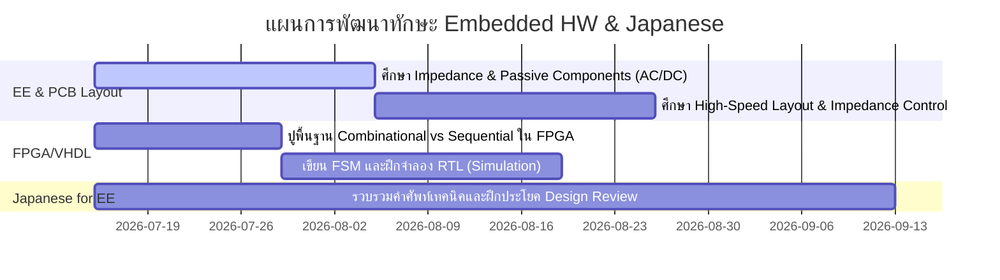

# Embedded Hardware Developer Assessment Tracker

ยินดีต้อนรับสู่โปรแกรมประเมินและพัฒนาทักษะ (Skill Assessment & Development Tracker) 
เอกสารนี้จะใช้สำหรับติดตามสถานะการประเมินผล การพัฒนาทักษะ และแผนการเรียนรู้ (Roadmap) ของคุณ

---

## 👤 โปรไฟล์ของผู้เรียน (User Profile)
* **สายงานปัจจุบัน:** Embedded Hardware Developer (ทำงานในบริษัทญี่ปุ่น)
* **พื้นฐานการศึกษา:** ปริญญาตรี วิศวกรรมไฟฟ้า (Electrical Engineering)
* **ทักษะการโปรแกรม/ดิจิทัล:** ความรู้พื้นฐานทั่วไป, เขียน VHDL ได้บ้าง (ยังไม่ถึงขั้นโปร)
* **ทักษะภาษาญี่ปุ่น:** JLPT N3 (สื่อสารทำงานได้ในระดับหนึ่ง ศัพท์ทั่วไปและศัพท์เทคนิคบางส่วน)
* **เป้าหมาย:** 
  1. เสริมฐานความรู้ด้านวิศวกรรมไฟฟ้า (EE Foundation) ให้แน่นปึก
  2. พัฒนาทักษะด้าน Embedded Hardware & Digital Design (VHDL)
  3. เพิ่มพูนคำศัพท์และประโยคภาษาญี่ปุ่นเฉพาะทางที่ใช้ในการทำงานให้มีประสิทธิภาพมากขึ้น

---

## 📝 แผนการประเมินผล (Assessment Steps)
1. **รอบที่ 1 (ประเมินพื้นฐาน):** คำถามเกี่ยวกับทฤษฎีไฟฟ้าวงจรพื้นฐาน, อุปกรณ์อิเล็กทรอนิกส์, VHDL เบื้องต้น และสถานการณ์ภาษาญี่ปุ่นในการทำงาน
2. **รอบที่ 2 (ประเมินเชิงลึก):** วิเคราะห์คำตอบจากรอบแรก และถามเจาะลึกเฉพาะจุดที่ยังไม่เคลียร์
3. **การประเมินผลและสร้าง Roadmap:** วิเคราะห์จุดแข็ง-จุดอ่อน และจัดทำแผนการศึกษาด้วยตัวเองเพื่อพัฒนาทักษะแบบจับต้องได้

---

## ❓ คำถามรอบที่ 1 (Assessment Round 1)

กรุณาตอบคำถามเหล่านี้ตามความเข้าใจจริงของคุณ (สามารถตอบเป็นภาษาไทย ภาษาญี่ปุ่น หรือภาษาอังกฤษปนกันได้ตามสะดวกครับ) ไม่จำเป็นต้องค้นหาข้อมูล เพื่อที่เราจะได้ประเมินพื้นฐานปัจจุบันได้อย่างแม่นยำที่สุดครับ

### หมวดที่ 1: พื้นฐานวิศวกรรมไฟฟ้าและอิเล็กทรอนิกส์ (EE Foundations)
1. **Circuit Analysis:** ถ้าเรามีตัวต้านทาน (Resistor) 2 ตัว ต่อขนานกัน ตัวหนึ่งค่า $10\ \Omega$ อีกตัวหนึ่งค่า $100\ \text{k}\Omega$ ความต้านทานรวมจะมีค่าประมาณเท่าใด (ใกล้เคียงกับตัวไหน) และเพราะอะไร?
2. **Passive Components:** ตัวเก็บประจุ (Capacitor) และตัวเหนี่ยวนำ (Inductor) ทำหน้าที่อะไรในวงจรไฟฟ้ากระแสตรง (DC) และกระแสสลับ (AC)? ยกตัวอย่างการใช้งานในการออกแบบ Embedded Hardware มาสัก 1-2 ตัวอย่าง
3. **Semiconductors:** ไดโอด (Diode) มีหน้าที่อะไรในวงจร และ "Voltage Drop" (หรือ $V_f$) ของซิลิคอนไดโอดปกติมีค่าประมาณเท่าใด?

### หมวดที่ 2: Embedded Hardware & VHDL (Digital Design)
4. **Microcontroller Interfacing:** หากคุณต้องการเชื่อมต่อไมโครคอนโทรลเลอร์กับเซนเซอร์ภายนอก คุณมักจะเลือกใช้ Protocol สื่อสารแบบใดบ้าง (เช่น I2C, SPI, UART)? แต่ละแบบมีข้อดี/ข้อจำกัดต่างกันอย่างไรในมุมมองการออกแบบ Hardware?
5. **VHDL & Digital Logic:** อธิบายความแตกต่างระหว่างวงจรแบบ Combinational Logic (เช่น ประตูลอจิกทั่วไป) กับ Sequential Logic (เช่น Flip-Flop/Register) ใน VHDL คุณจะแยกแยะการเขียนสองแบบนี้อย่างไร?
6. **Hardware Design Challenges:** ในการออกแบบแผงวงจร (PCB) สิ่งที่คุณต้องคำนึงถึงในการจัดวางสายสัญญาณที่เป็นสัญญาณความถี่สูง (High-speed signals) คืออะไรบ้าง?

### หมวดที่ 3: ภาษาญี่ปุ่นสำหรับงานวิศวกรรม (Technical Japanese for EE)
7. **Vocabulary Match:** คำศัพท์เหล่านี้ในภาษาญี่ปุ่นที่ใช้ในงานเขียนแบบหรือรีวิววงจรเรียกว่าอะไร (หรือถ้าไม่ทราบ ลองบอกคำที่คุ้นเคยสะกดด้วยคานะ/โรมันจิ):
   - แผงวงจรพิมพ์ (PCB / Printed Circuit Board)
   - ไฟฟ้าลัดวงจร (Short Circuit)
   - สัญญาณรบกวน (Noise)
   - การบัดกรี (Soldering)
8. **Work Situation:** สมมติว่าในการประชุมรีวิวแบบวงจร (Design Review) คุณต้องการบอกวิศวกรญี่ปุ่นว่า *"วงจรส่วนนี้อาจจะมีปัญหาเรื่องความร้อนสะสม แนะนำให้เพิ่มพื้นที่ทองแดง (Copper plane) หรือติดแผ่นระบายความร้อน (Heatsink)"* คุณจะพูดหรืออธิบายเป็นภาษาญี่ปุ่นอย่างไรบ้าง? (ลองเขียนมาตามที่คิดได้เลยครับ ไม่ต้องกังวลเรื่องไวยากรณ์)

---

## 📈 ผลการประเมินและแผนการพัฒนา (Assessment & Roadmap)

### 📊 ผลการวิเคราะห์แยกตามหมวดหมู่ (Evaluation Results)

#### **1. ด้านวิศวกรรมไฟฟ้าพื้นฐาน (EE Foundations) - [ระดับ: เริ่มต้น-กลาง 🟡]**
* **Circuit Analysis:** 
  * *วิเคราะห์:* ตอบสูตรการคำนวณขนานได้ถูกต้อง ($R = \frac{R_1 \times R_2}{R_1 + R_2}$) แต่มีจุดลืมแปลงหน่วยเล็กน้อย ($100\ \text{k}\Omega$ เป็น $100,000\ \Omega$ ไม่ใช่ $100\ \Omega$) ทำให้คำนวณได้ $9.09\ \Omega$ แทนที่จะเป็น $9.999\ \Omega$ ซึ่งใกล้เคียง $10\ \Omega$
  * *ข้อแนะนำ:* ในทางปฏิบัติ ถ้าตัวต้านทานขนานกันและค่าต่างกันเกิน 10 เท่าขึ้นไป ค่าความต้านทานรวมจะวิ่งเข้าใกล้ตัวที่น้อยที่สุดเสมอ (สามารถปัดเป็นค่าตัวน้อยได้เลยเพื่อความรวดเร็วในการประเมินวงจรเบื้องต้น)
* **Passive Components:** 
  * *วิเคราะห์:* ทราบว่าตัวเก็บประจุทำหน้าที่กรอง (Filter) ใน DC แต่ยังไม่เห็นภาพการทำงานของ Capacitor/Inductor ในย่านความถี่ (AC / Signal noise)
  * *ข้อแนะนำ:* ควรศึกษาเพิ่มเติมเรื่อง **Impedance ($X_C, X_L$) ในย่านความถี่** ซึ่งเป็นหัวใจของการเลือกขนาด Decoupling Capacitor เพื่อลดสัญญาณรบกวนในบอร์ด Embedded
* **Semiconductors:**
  * *วิเคราะห์:* เข้าใจหน้าที่ป้องกันกระแสไหลย้อนกลับ (Reverse polarity/Current protection) แต่สับสนค่า $V_f$ (Voltage Drop) ของ Silicon Diode ($0.7\text{V}$) กับ Schottky Diode ($0.3\text{V}$)
  * *ข้อแนะนำ:* จดจำพารามิเตอร์ทั่วไป (Silicon Diode $V_f \approx 0.7\text{V}$, Schottky Diode $V_f \approx 0.3\text{V}$) เพราะมีผลต่อการคำนวณ Power Dissipation ($P = I \times V_f$) และการลดลงของแรงดันไฟเลี้ยงในวงจร

#### **2. ด้าน Embedded Hardware & VHDL - [ระดับ: กลาง 🟢]**
* **Microcontroller Interfacing:** 
  * *วิเคราะห์:* อธิบายคุณสมบัติเด่นของ I2C, SPI, UART ได้ถูกต้องเป็นอย่างดีในแง่การใช้งาน (I2C ต่อได้หลายตัว/มี Address, SPI ส่งเร็ว/Full Duplex, UART ใช้ Debug)
  * *ข้อแนะนำ:* เพิ่มเติมในแง่ Hardware เช่น I2C ใช้ Open-drain/Collector (ต้องมี Pull-up Resistor เสมอ) ส่วน SPI ใช้ Push-pull (ไม่ต้องมี Pull-up สัญญาณวิ่งได้เร็วกว่าแต่ใช้สายเยอะกว่า)
* **VHDL & Digital Logic:**
  * *วิเคราะห์:* มีความเข้าใจคลาดเคลื่อนว่า VHDL ไม่ค่อยใช้ Combinational Logic แต่ความจริงแล้ว **ทั้งสองส่วนทำงานร่วมกันเสมอ** ใน FPGA/CPLD เช่น ใน Finite State Machine (FSM) จะมีทั้ง Sequential (จำสถานะปัจจุบันด้วย Register) และ Combinational (คำนวณสถานะถัดไปและควบคุมเอาต์พุต)
  * *ข้อแนะนำ:* ศึกษาความสัมพันธ์ระหว่าง Syntax ใน VHDL (เช่น Process ที่มี Clock vs Process ไม่มี Clock) กับวงจร Logic Gate จริงๆ บนชิป เพื่อเลี่ยงปัญหาการเกิด Latch โดยไม่ตั้งใจ
* **High-speed Signals (PCB Layout):**
  * *วิเคราะห์:* มีความตระหนักรู้ที่ดีมากในการระบุสัญญาณความถี่สูง (CLK, DDR, USB, Differential) และผลกระทบต่อ Analog
  * *ข้อแนะนำ:* ศึกษาเพิ่มเติมในเรื่อง Impedance Control (เช่น $50\ \Omega$ Single-ended, $90\ \Omega / 100\ \Omega$ Differential) และกฎการจัดเส้นลายทองแดง (เช่น Length Matching, Ground Return Path)

#### **3. ด้านภาษาญี่ปุ่นเพื่อการทำงาน (Technical Japanese) - [ระดับ: ดีมาก 🟢]**
* **คำศัพท์เทคนิค:** ตอบได้ถูกต้อง 100% และเป็นคำศัพท์มาตรฐานที่ใช้จริงในโรงงานและบริษัทญี่ปุ่น
  * PCB $\rightarrow$ 基板 (きばん)
  * Short Circuit $\rightarrow$ 短絡 (たんらく) หรือ ショート
  * Noise $\rightarrow$ ノイズ
  * Soldering $\rightarrow$ 半田付け (はんだづけ)
* **การสื่อสารใน Design Review:** 
  * *ประโยคของวิศวกร:* `この回路の部分は放熱の問題があるかもしれないので、放熱のため、パタン面に大きいパタン、ヒートシンクなどを付けた方がいいです。`
  * *วิเคราะห์:* สื่อสารได้เข้าใจชัดเจน ไวยากรณ์ถูกต้องดีมาก!
  * *คำแนะนำการปรับปรุงเพื่อความโปร่งใสและเป็นมืออาชีพขึ้น (Business Japanese):*
    * คำว่า "พื้นที่ทองแดงขนาดใหญ่" วิศวกรญี่ปุ่นมักจะเรียกว่า **ベタパターン** (Beta Pattern) หรือ **銅箔エリア** (Dōhaku Area)
    * คำว่า "ความร้อนสะสม/ระบายความร้อนไม่ทัน" มักใช้คำว่า **熱がこもる** (Netsu ga komoru) หรือ **放熱性 (ほうねつせい)**
    * *ตัวอย่างประโยคที่ขัดเกลาแล้ว (Keigo):*
      > 「こちらの回路部分は**熱がこもりやすい**（放熱性に課題がある）ため、**ベタパターン**を広げるか、ヒートシンクを追加した方がよろしいかと思います。」
      > (เนื่องจากส่วนวงจรนี้ความร้อนสะสมได้ง่าย ผมคิดว่าควรจะขยายพื้นที่เบลตทองแดงหรือเพิ่มฮีตซิงก์น่าจะดีกว่าครับ)

---

### 🗺️ แผนการพัฒนาทักษะ (Learning Roadmap)

เพื่อเตรียมความพร้อมสู่การเป็น Senior Embedded Developer ที่เชี่ยวชาญทั้งบอร์ดและดิจิทัลลอจิก พร้อมสื่อสารอย่างมั่นใจในองค์กรญี่ปุ่น แนะนำแผนการเรียนรู้แบ่งเป็น 3 ระยะดังนี้ครับ:

#### **ระยะที่ 1: ปรับพื้นฐานวิศวกรรมไฟฟ้าและ Digital Design (สัปดาห์ที่ 1 - 4)**
1. **วงจร AC และ Impedance ของ Passive Components:**
   * เรียนรู้ความหมายทางคณิตศาสตร์และการประยุกต์ใช้ $X_C = \frac{1}{2\pi f C}$ และ $X_L = 2\pi f L$
   * ทำความเข้าใจว่าทำไม Decoupling Capacitor จึงต้องใช้หลายขนาดขนานกัน (เช่น $0.1\ \mu\text{F}$ ขนานกับ $10\ \mu\text{F}$)
2. **ปรับทัศนคติ VHDL (FPGA):**
   * ทำความเข้าใจโครงสร้างฮาร์ดแวร์พื้นฐานภายใน FPGA (LUTs, Flip-Flops, Multiplexers)
   * ฝึกเขียนโค้ดแยกแยะระหว่าง **Combinational Process** (ไม่มี clock, ต้องใส่ input ทุกตัวใน sensitivity list ป้องกันการเกิด Latch) กับ **Sequential Process** (ใช้ Clock/Reset เสมอ)
   * เรียนรู้โครงสร้าง State Machine แบบ 2-Process (แยก State register ออกจาก Next state logic)

#### **ระยะที่ 2: การออกแบบ PCB ระดับสูงและการอินเตอร์เฟสอุปกรณ์ (สัปดาห์ที่ 5 - 8)**
1. **High-Speed Layout & Signal Integrity:**
   * ศึกษาแนวคิดเรื่อง Ground Return Path (กระแสไฟฟ้าไหลกลับทางไหนในสัญญาณความถี่สูง)
   * ศึกษาเรื่อง Impedance Control บน PCB (Microstrip, Stripline) และการใช้โปรแกรมช่วยคำนวณความกว้างเส้นทองแดง
2. **Hardware Interfacing Deep Dive:**
   * ศึกษาพฤติกรรมทางกายภาพของบัสสื่อสาร เช่น ผลของ Bus Capacitance ต่อความเร็ว I2C และวิธีการคำนวณค่า Pull-up resistor

#### **ระยะที่ 3: ภาษาญี่ปุ่นเพื่อการรายงานตัวและการรีวิวงาน (ทำควบคู่ไปตลอด)**
* จดบันทึกประโยคและคำศัพท์จากการประชุมและเอกสารของบริษัทญี่ปุ่นลงในสมุดบันทึกส่วนตัว
* ฝึกใช้ประโยคแสดงความเห็น (意見表明) และการเสนอแนะทางเทคนิคอย่างสุภาพ เช่น `〜した方がよろしいかと思います` (คิดว่าทำ...น่าจะดีกว่าครับ) หรือ `〜の懸念があります` (มีความกังวลเรื่อง...)

---

## 📅 สมุดบันทึกการเรียนรู้ (Learning Log)
* **2026-07-13:** เริ่มต้นการเรียนรู้ Phase 1 - หัวข้อ: **วงจร AC และ Impedance ของ Passive Components (C, L กับความถี่)**
  * *สถานะ:* ตอบคำถาม Quiz 1.1 ถูกต้อง (เลือก Option B วาง C ใกล้ขา VCC MCU) และเรียนรู้เชิงลึกเรื่อง AC Noise ขี่บน DC กับความถี่เรโซแนนซ์ของตัวเก็บประจุ (SRF)
* **2026-07-13:** เริ่มเรียนรู้หัวข้อ: **Digital Logic & VHDL (Combinational vs Sequential)**
  * *สถานะ:* ตอบคำถาม Quiz 1.2 ถูกต้อง (ระบุปัญหากรณี "11" ที่ขาดหายไปได้ถูกต้อง และเสนอทางแก้โดยใช้ `when others` เพื่อป้องกัน `意図しないラッチ` บน FPGA)
* **2026-07-13:** เริ่มเรียนรู้หัวข้อ: **Digital Logic & VHDL (2-Process FSM Structure)**
  * *สถานะ:* ตอบคำถาม Quiz 1.3 แล้ว และเรียนรู้เชิงลึกเรื่องกลไกการสร้าง Latch ของ Synthesizer เมื่อไม่มีการกำหนดค่าเริ่มต้นใน Combinational Process
* **2026-07-13:** เริ่มเรียนรู้ Phase 2 - หัวข้อ: **High-Speed Layout & Signal Integrity (Ground Return Path)**
  * *สถานะ:* ตอบคำถาม Quiz 2.1 แล้ว (ระบุเรื่อง Crosstalk ได้ถูกต้อง และได้เรียนรู้ข้อจำกัดของการใช้ Ground Guard เมื่อขาด Return Path ใต้ลายวงจร พร้อมแนวทางแก้ไขด้วย Stitching Cap / Ground Bridge)
* **2026-07-13:** เริ่มเรียนรู้ Phase 2 - หัวข้อ: **Hardware Interfacing Deep Dive (I2C/SPI/UART & Pull-up Resistors)**
  * *สถานะ:* ตอบคำถาม Quiz 2.2 ถูกต้อง (วิเคราะห์แนวทางการลดค่า $R_{pullup}$ เพื่อให้มีค่าคงที่เวลา $\tau = RC$ ต่ำลง ส่งผลให้ขอบขาขึ้นเร็วขึ้น และเข้าใจพฤติกรรมความจุแฝง $C$ จากบอร์ดและไอซี)
* **2026-07-14:** เริ่มเรียนรู้ Phase 3 - หัวข้อ: **ภาษาญี่ปุ่นสำหรับการทำงานและการรีวิวงาน (Technical Japanese)**
  * *สถานะ:* ตอบคำถามภาษาญี่ปุ่นสำหรับการอธิบายปัญหา Ground Split Crossing และได้รับการแนะนำคำศัพท์เฉพาะทางเพิ่มเติม (เช่น 跨ぐ, 高周波信号) เพื่อให้ประโยคมีความเป็นธรรมชาติแบบวิศวกรญี่ปุ่นมืออาชีพ
* **2026-07-16:** เริ่มเรียนรู้หัวข้อพิเศษ: **Nios II Processor & Custom Avalon-MM LED IP**
  * *สถานะ:* ปรับปรุง VHDL IP ให้ได้มาตรฐานบัส (เพิ่ม `avl_read`), แก้ไขพิกัดไฟล์ `.tcl` สำเร็จ, ปรับจูนไฟล์ Top-level, และสรุปบทเรียนทั้งหมดรวมถึงการทำงานของไฟล์ `.sopcinfo` ลงใน nios_custom_ip_summary.md เรียบร้อยครบถ้วน
* **2026-07-23:** เริ่มเรียนรู้หัวข้อ: **Signal Integrity & Termination Resistors (波形整形と終端抵抗)**
  * *สถานะ:* ตอบคำถาม Quiz 2.3 ถูกต้อง 100% (เลือก Option A วาง R_damping ชิดฝั่งส่ง Driver และเข้าใจกลไกการสะท้อนกลับของคลื่นเมื่อวางผิดตำแหน่ง)
* **2026-07-27:** เริ่มเรียนรู้หัวข้อ: **FPGA Advanced Design - Clock Domain Crossing (CDC) & Metastability**
  * *สถานะ:* ตอบคำถาม Quiz 3.1 แล้ว (ระบุความเสี่ยง Metastability ได้ถูกต้อง ตระหนักถึงเรื่อง Debouncing/Chattering และเรียนรู้เพิ่มเติมว่า Synchronizer ต้องใช้ Clock ของเป้าหมาย (Destination Clock 100 MHz))
* **2026-09-18:** กลับมาลุยต่อ! เริ่มเรียนรู้ Phase 6: **Failure Analysis & Technical Japanese (不具合解析と報告書)**
  * *สถานะ:* เริ่มต้นเคาะสนิมด้วยหัวข้อ การแยกแยะ 応急対策 (Temporary) vs 恒久対策 (Permanent)
* **2026-09-23:** เรียนรู้หัวข้อพิเศษ: **Technical Japanese for Circuit & PCB Design Review (回路図・基板検図)**
  * *สถานะ:* สร้างคู่มือคำศัพท์และรูปประโยคสำหรับการประชุม Design Review (การใช้คำว่า 懸念, パスコン直近配置, 許容電力, etc.) เรียบร้อยแล้ว

