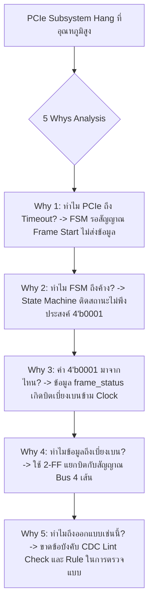

# Lesson 101: Clock Domain Crossing (CDC) & Metastability (非同期クロック乗せ換えとメタステーブル)

---

## 1. ทฤษฎีวิศวกรรมเชิงลึก (高度なエンジニアリング理論)

### 1.1 ฟิสิกส์ของการเกิด Metastability ใน Flip-Flop
ในระบบดิจิทัลระดับสูง (High-End SoC & FPGA) การออกแบบมักประกอบด้วยสัญญาณนาฬิกาหลายโดเมนที่มีความถี่และเฟสอิสระต่อกัน (Asynchronous Clock Domains) เช่น โดเมนของอินเทอร์เฟซ PCIe ($250\text{ MHz}$), DDR Memory Controller ($400\text{ MHz}$), และ Internal DSP Core ($600\text{ MHz}$) เมื่อสัญญาณข้อมูลจากโดเมนส่ง (Transmit Domain, $CLK_{tx}$) ถูกส่งข้ามไปยังโดเมนรับ (Receive Domain, $CLK_{rx}$) การเปลี่ยนแปลงระดับแรงดันของข้อมูลจะเกิดขึ้นในเวลาใดก็ได้โดยไม่สอดคล้องกับขอบสัญญาณนาฬิกาของโดเมนรับ

หากสัญญาณข้อมูลเปลี่ยนสถานะในช่วงหน้าต่างวิกฤตของ Flip-Flop ฝั่งรับ อันได้แก่:
* **Setup Time ($t_{su}$):** ช่วงเวลาก่อนหน้าขอบสัญญาณนาฬิกาที่ข้อมูลต้องคงที่
* **Hold Time ($t_{h}$):** ช่วงเวลาหลังจากขอบสัญญาณนาฬิกาที่ข้อมูลต้องคงที่

จะส่งผลให้วงจรไบสเตเบิลภายใน (Internal Cross-Coupled Inverter Pair) ไม่ได้รับพลังงานประจุไฟฟ้าที่เพียงพอในการตัดสินใจเลือกสถานะทางตรรกะ $V_{OH}$ (Logic '1') หรือ $V_{OL}$ (Logic '0') ทรานซิสเตอร์ทั้งสองฝั่งจะติดอยู่ในสภาวะสมดุลไม่เสถียร (Unstable Equilibrium State) ที่แรงดันกึ่งกลาง $V_{mid} \approx \frac{V_{DD}}{2}$ ซึ่งเรียกว่า **"Metastability" (メタステーブル状態 - สภาวะกึ่งเสถียร)**

```
             Clock Domain Crossing (Asynchronous Interface)
      TX Domain (CLK_tx)                     RX Domain (CLK_rx)
   +--------------------+               +---------------------------+
   |                    |   Data_tx     | +-------+       +-------+ |
   |  +--------------+  |-------------->| |  FF1  |------>|  FF2  | |-> Synchronized
   |  | D-FF (Launch)|  |  (Async edge) | |(Capt.)| Data_m| (Sync)| |   Output
   |  +--------------+  |               | +-------+       +-------+ |
   |         ^          |               |     ^               ^     |
   +---------|----------+               +-----|---------------|-----+
          CLK_tx                           CLK_rx          CLK_rx
```

แรงดันของโหนดภายใน Flip-Flop ในช่วง Metastability สามารถจำลองพฤติกรรมเชิงอนุพันธ์ได้ตามสมการ Small-Signal Inverter Model:

$$\frac{d\Delta V(t)}{dt} = \frac{g_m}{C_{node}} \Delta V(t) = \frac{1}{\tau} \Delta V(t)$$

ผลเฉลยของสมการอนุพันธ์แสดงการขยายตัวของแรงดันออกจากจุดกึ่งกลางเมื่อเวลาผ่านไป:

$$\Delta V(t) = \Delta V_0 \cdot \exp\left(\frac{t}{\tau}\right)$$

โดยที่:
* $\Delta V_0$ คือ ค่าความต่างแรงดันเริ่มต้นจากจุดสมดุล ณ ขณะที่หมดหน้าต่าง Setup/Hold ($t = 0$)
* $\tau$ คือ Metastability Resolution Time Constant ของเทคโนโลยีสารกึ่งตัวนำ ($\tau \approx \frac{C_{node}}{g_m}$)
* $t$ คือ เวลาที่ปล่อยให้ Flip-Flop คืนตัว (Resolution Time)

หาก $\Delta V_0$ มีค่าน้อยมาก วงจรจะต้องใช้เวลา $t$ นานขึ้นในการขยายสัญญาณให้พ้นขอบเขตแรงดันที่ยังไม่เป็นตรรกะ ($V_{IL}$ ถึง $V_{IH}$) หากเวลาที่ยอมให้คืนตัว ($t_r$) หมดลงก่อนที่ Flip-Flop จะหลุดพ้นจาก Metastability สัญญาณขาสมองกลจะส่งค่าแรงดันที่คลุมเครือหรือสั่นพริ้ว (Oscillation/Glitch) ไปยังลอจิกถัดไป ก่อให้เกิด System Crash หรือ Data Corruption

---

### 1.2 การคำนวณ Mean Time Between Failures (MTBF)
ความน่าเชื่อถือของการส่งสัญญาณข้าม Clock Domain ถูกนิยามในเชิงความน่าจะเป็นด้วยค่า **MTBF (平均故障間隔 - เวลาเฉลี่ยระหว่างความล้มเหลว)** ตามแบบจำลองของ Chaney และ Rosenberger:

$$MTBF = \frac{1}{\text{Failure Rate}} = \frac{\exp\left(\frac{t_r}{\tau}\right)}{T_0 \cdot f_{clk} \cdot f_{data}}$$

พารามิเตอร์เชิงวิศวกรรม:
1. **$f_{clk}$ (Capture Clock Frequency):** ความถี่สัญญาณนาฬิกาของโดเมนฝั่งรับ ($\text{Hz}$)
2. **$f_{data}$ (Data Toggle Rate):** ความถี่เฉลี่ยในการเปลี่ยนสถานะของสัญญาณข้อมูลขาเข้า ($\text{Transitions/sec}$)
3. **$T_0$ (Metastability Aperture Window):** ขนาดหน้าต่างเวลาวิกฤตที่หากข้อมูลเปลี่ยนสถานะจะทำให้เข้าสู่ Metastability มีหน่วยเป็นวินาที ($\text{s}$) สะท้อนถึงฟิสิกส์ของเกต
4. **$\tau$ (Resolution Time Constant):** ค่าคงที่เวลาการฟื้นตัวของ Inverter ในเซลล์ Flip-Flop มีหน่วยเป็นวินาที ($\text{s}$)
5. **$t_r$ (Available Resolution Time):** เวลาที่เปิดให้วงจรคืนตัวก่อนที่ Flip-Flop ตัวถัดไปจะจับค่าสัญญาณ:

$$t_r = T_{clk} - t_{co,FF1} - t_{route} - t_{su,FF2}$$

โดยที่ $T_{clk} = \frac{1}{f_{clk}}$, $t_{co}$ คือ Clock-to-Out Delay, $t_{route}$ คือ Routing Delay ระหว่าง Stage, และ $t_{su}$ คือ Setup Time ของ Flip-Flop ตัวถัดไป

ตารางเปรียบเทียบค่าพารามิเตอร์ $\tau$ และ $T_0$ ตามระดับเทคโนโลยีสารกึ่งตัวนำของ FPGA:

| FPGA Process Node | เทคโนโลยี Gate | $\tau$ (ps) | $T_0$ (ps) | สภาพแวดล้อมที่ $f_{clk}=250\text{ MHz}$, $t_r=3.2\text{ ns}$ (2-FF MTBF) |
| :--- | :--- | :--- | :--- | :--- |
| **28 nm Planar (Xilinx 7-Series)** | HKMG Planar | $\approx 35 - 45$ | $\approx 2.5 - 4.0$ | $\approx 1.2 \times 10^9\text{ ปี}$ |
| **16 nm FinFET (UltraScale+)** | 3D Tri-Gate | $\approx 18 - 25$ | $\approx 1.0 - 1.8$ | $\approx 8.5 \times 10^{22}\text{ ปี}$ |
| **7 nm FinFET (Versal ACAP)** | EUV FinFET | $\approx 10 - 14$ | $\approx 0.5 - 0.9$ | $\approx 10^{45}\text{ ปี}$ |

> **ข้อสังเกตเชิงลึก:** แม้ว่าเทคโนโลยีใหม่จะให้ค่า $\tau$ ที่เร็วขึ้นมาก (ลดลงเป็นสเกลพิโกวินาที) แต่ความถี่ระบบ ($f_{clk}$) และอัตราการเปลี่ยนข้อมูล ($f_{data}$) ก็สูงขึ้นเป็นสัดส่วนตามกัน ดังนั้นการออกแบบ Synchronizer จึงต้องคำนวณอย่างรอบคอบเสมอ

---

### 1.3 โครงสร้างวงจร Synchronizer และข้อจำกัด
สถาปัตยกรรม CDC พื้นฐานแบ่งตามลักษณะของสัญญาณได้ดังนี้:

#### 1.3.1 Two-Stage / Three-Stage Flip-Flop Synchronizer (สำหรับ Single-Bit Control Signal)
เหมาะสำหรับสัญญาณควบควมบิตเดี่ยว (เช่น `enable`, `start_trigger`, `irq_raw`)
* **2-Stage Synchronizer:** ใช้งานทั่วไปกับความถี่ระดับปานกลาง ($f_{clk} \le 200\text{ MHz}$)
* **3-Stage Synchronizer:** จำเป็นสำหรับความถี่สูงยิ่งยวด ($f_{clk} \ge 350\text{ MHz}$) ในระบบ Automotive/Mission-Critical เพื่อชดเชยค่า $t_r$ ที่สั้นลงในแต่ละไซเคิล

```verilog
// Professional SystemVerilog Single-Bit 3-Stage Synchronizer with CDC Attributes
(* dont_touch = "yes" *)
(* async_reg = "true" *)
module sync_bit_3stage #(
    parameter bit RESET_VAL = 1'b0
)(
    input  logic clk_dest,
    input  logic rst_dest_n,
    input  logic async_din,
    output logic sync_dout
);

    (* ASYNC_REG = "TRUE" *) logic sync_stage1;
    (* ASYNC_REG = "TRUE" *) logic sync_stage2;
    (* ASYNC_REG = "TRUE" *) logic sync_stage3;

    always_ff @(posedge clk_dest or negedge rst_dest_n) begin
        if (!rst_dest_n) begin
            sync_stage1 <= RESET_VAL;
            sync_stage2 <= RESET_VAL;
            sync_stage3 <= RESET_VAL;
        end else begin
            sync_stage1 <= async_din;
            sync_stage2 <= sync_stage1;
            sync_stage3 <= sync_stage2;
        end
    end

    assign sync_dout = sync_stage3;

endmodule
```

> **หัวใจสำคัญ:** Directive `(* ASYNC_REG = "TRUE" *)` สั่งให้ Synthesis และ Place & Route Tool วาง Flip-Flop ทั้งหมดไว้ใน Slice/CLB เดียวกัน และห้ามแทรกลอจิกเกตใดๆ ขั้นกลาง เพื่อลด $t_{route} \to 0$ ทำให้ $t_r$ มีค่าสูงสุด ป้องกันการเกิด Metastability รั่วไหล

#### 1.3.2 Pulse Synchronizer (Toggle Technique)
เมื่อส่งพัลส์ที่มีความกว้างเพียง 1 ไซเคิลจากโดเมนส่งความถี่สูง ($f_{tx} = 200\text{ MHz}$) ไปยังโดเมนรับความถี่ต่ำ ($f_{rx} = 50\text{ MHz}$) การใช้ Dual-FF ธรรมดาจะทำให้พัลส์สูญหาย (Sampling Failure) เนื่องจากความกว้างพัลส์ $T_{pulse} = 5\text{ ns}$ แคบกว่าคาบของโดเมนรับ $T_{rx} = 20\text{ ns}$

การแก้ปัญหาต้องใช้ **Toggle Synchronizer**:
1. แปลงพัลส์ที่ฝั่งส่งให้เป็นสัญญาณขอบ (Toggle Signal: $0 \to 1 \to 0$) โดยใช้ T-Flip-Flop หรือ XOR Logic
2. ส่งสัญญาณ Toggle ข้ามผ่าน 2-Stage Synchronizer
3. ตรวจจับการเปลี่ยนแปลง (Edge Detection: Rising/Falling Edge) ที่ฝั่งรับ เพื่อสร้างพัลส์ความกว้าง 1 คาบของ $CLK_{rx}$ คืนมา

```
TX Domain:
Pulse In    : _|~|_-----------------------------
Toggle Out  : _|~~~~~~~~~~~~~~~~~~~~~~~~~~~~~~~~ (Stays high until next pulse)
-------------------------------------------------------------------------------
RX Domain:
Sync Stage 2: ______/~~~~~~~~~~~~~~~~~~~~~~~~~~~ (Delayed by 2 RX clock cycles)
Sync Stage 3: __________/~~~~~~~~~~~~~~~~~~~~~~~
Pulse Out   : __________|~|_____________________ (Edge Detector: Stage 2 ^ Stage 3)
```

#### 1.3.3 กฎเหล็ก: ห้ามใช้ Flip-Flop Synchronizer กับ Multi-Bit Data Bus
สำหรับบัสข้อมูลหลายบิต (Multi-Bit Bus เช่น Data Bus 32-bit หรือ Pointer 8-bit) ห้ามนำสัญญาณแต่ละเส้นเข้า 2-Stage Synchronizer แยกกันเด็ดขาด เพราะสายสัญญาณแต่ละเส้นมีความยาวและการหน่วงทางกายภาพต่างกัน (Routing Skew)
หากส่งข้อมูลจาก $0000_2 \to 1111_2$ บิตที่เดินทางเร็วกว่าจะถูกจับได้ในไซเคิลที่ $N$ ส่วนบิตที่ช้ากว่าจะถูกจับในไซเคิลที่ $N+1$ ส่งผลให้ฝั่งรับอ่านค่าข้อมูลขยะชั่วคราว (เช่น $0011_2$ หรือ $0111_2$) กลายเป็น **Coherency Violation**

โซลูชันสำหรับ Multi-Bit CDC:
1. **Gray Code Encoding:** สำหรับบิตที่เป็น Pointer (FIFO Read/Write Pointer) เพราะ Gray Code เปลี่ยนแปลงเพียงครั้งละ 1 บิตเสมอในทุก Step ขจัดปัญหา Reconvergence Skew
2. **Asynchronous FIFO (Dual-Clock FIFO):** สำหรับสตรีมข้อมูลทั่วไป
3. **Mux-Data Handshake / Enable-Based Synchronization:** วางบัสข้อมูลคงที่ไว้ จากนั้นส่งเฉพาะสัญญาณ `data_valid` บิตเดียวผ่าน Synchronizer เมื่อสัญญาณ Valid ถึงฝั่งรับ จึงให้บัสฝั่งรับเปิดรับค่าที่เสถียรแล้ว

---

## 2. ทริคหน้างาน OJT แบบ Step-by-Step (現場の実践テクニック)

### 2.1 กรณีศึกษาความล้มเหลวหน้างาน (失敗事例: Shippai Jirei)
* **บริบท:** การ์ดประมวลผลเซนเซอร์ภาพความเร็วสูงในระบบยานยนต์ ADAS ทำงานร่วมกับ FPGA Xilinx Kintex UltraScale
* **สถาปัตยกรรม:** ข้อมูลพิกเซลจากเซนเซอร์ MIPI CSI-2 ส่งเข้ามาที่สัญญาณนาฬิกา $CLK_{pixel} = 150\text{ MHz}$ และถูกส่งข้ามไปยัง PCIe Subsystem ที่ทำงานบน $CLK_{pcie} = 250\text{ MHz}$
* **อาการเสียหน้างาน:** บอร์ดผ่านการทดสอบ functional test ในอุณหภูมิห้อง ($25^\circ\text{C}$) 100% แต่เมื่อนำเข้าห้องทดสอบสิ่งแวดล้อมที่อุณหภูมิ $85^\circ\text{C}$ เป็นเวลา 72 ชั่วโมง พบอาการภาพกระพริบ (Video Frame Glitch) และระบบเกิด PCIe Transaction Timeout ล็อกตายเฉลี่ย 1 ครั้งทุกๆ 6-12 ชั่วโมง
* **การตรวจสอบเบื้องต้น:** ทีมซอฟต์แวร์สงสัยว่าไดรเวอร์หลุดการตอบสนอง แต่เมื่อสโคปจับสัญญาณ Reset พบว่าตัว FPGA Core เองเกิดสถานะ FSM Deadlock

```
              กระบวนการวิเคราะห์หาสาเหตุรากเหง้า (Root Cause Investigation)
   +--------------------------------------------------------------------------+
   | อาการ: PCIe Timeout & Video Glitch สุ่มเกิดที่ 85°C ทุก 6-12 ชั่วโมง      |
   +--------------------------------------------------------------------------+
                                       |
                                       v
   +--------------------------------------------------------------------------+
   | ตรวจสอบ RTL: พบว่าวิศวกรส่งตัวแปร 'frame_status[3:0]' ข้ามโดเมน             |
   | โดยใช้ 2-Stage Synchronizer คร่อมทีละบิตแยกกัน (Independent Sync)        |
   +--------------------------------------------------------------------------+
                                       |
                                       v
   +--------------------------------------------------------------------------+
   | ผลกระทบ: สัญญาณเปลี่ยนจาก FRAME_IDLE (4'b0000) -> FRAME_START (4'b0011) |
   | ที่ 85°C Routing Delay เปลี่ยนแปลง บิต [0] มาถึงก่อนบิต [1] 1.8 ns       |
   | ทำให้ RX Domain สุ่มจับสถานะชั่วคราวเป็น 4'b0001 (ILLEGAL_RESERVED)       |
   +--------------------------------------------------------------------------+
                                       |
                                       v
   +--------------------------------------------------------------------------+
   | สาเหตุรากเหง้า: FSM ฝั่ง RX ไม่มี Default Trap สำหรับ Illegal State        |
   | จึงหลุดเข้าไปในวงวนไม่สิ้นสุด (Deadlock)                                 |
   +--------------------------------------------------------------------------+
```

---

### 2.2 การวิเคราะห์หาสาเหตุรากเหง้า (Root Cause Analysis: 5 Whys & Ishikawa)



#### Ishikawa Diagram (ผังก้างปลา)
* **Design/Architecture (การออกแบบ):** นำ Multi-bit bus ส่งเข้า 2-Stage Synchronizer โดยตรงโดยไม่มี Gray Coding หรือ Mux-Recirculation
* **Environment (สภาพแวดล้อม):** อุณหภูมิที่สูงขึ้น ($85^\circ\text{C}$) ทำให้ Propagation Delay ของเซลล์ตรรกะและเส้นทองแดงขยายตัว ($+15\%$ ถึง $+25\%$) ส่งผลให้ Skew ระหว่างบิตขยายตัวเกินขอบเขต 1 คาบของ $CLK_{rx}$
* **Methodology (กระบวนการ):** การจำลอง RTL Simulation (ModelSim/VCS) เป็นแบบ Ideal Unit-Delay ทำให้มองไม่เห็นปัญหา Skew และ Metastability ในระดับเวลาจริง
* **Tool/Constraints (เครื่องมือ):** ไม่ได้รันเครื่องมือ Static CDC Verification (เช่น Questa CDC หรือ SpyGlass) และไม่ได้ใส่ Attribute `ASYNC_REG` ทำให้ P&R นำ Flip-Flop ไปวางคนละมุมของชิป

---

### 2.3 มาตรการแก้ไขถาวร (Permanent Corrective Action)
1. **เปลี่ยนสถาปัตยกรรมเป็น Mux-Data Recirculation Synchronizer:** ยึดข้อมูล `frame_status[3:0]` ไว้นิ่งๆ แล้วส่งเฉพาะสัญญาณ `status_update_pulse` ผ่าน Pulse Synchronizer เมื่อฝั่งรับเห็นพัลส์ยืนยันจึงแซมเปิลข้อมูลทั้ง 4 บิตพร้อมกัน
2. **เติม Safe State Machine Clause:** ใน Verilog ให้ใส่คำสั่ง `default:` กลับคืนสู่ `IDLE` พร้อมทั้งเซตบิตแจ้งเตือน Hardware Error Flag
3. **กำหนด SDC/XDC Timing Constraints อย่างถูกต้อง:**
   ```tcl
   # ตัด Timing Path หลอกระหว่าง Asynchronous Domain เพื่อไม่ให้ STA เข้าใจผิด
   set_clock_groups -asynchronous -group [get_clocks clk_pixel] -group [get_clocks clk_pcie]
   
   # กำหนด Max Delay สำหรับ Bus Skew ไม่ให้เกิน 1 คาบของ RX Clock
   set_max_delay -from [get_cells status_tx_reg*] -to [get_cells status_rx_reg*] -datapath_only 4.000
   ```

---

### 2.4 ตารางตรวจสอบหน้างาน SOP สำหรับการออกแบบ CDC (CDC Design Review SOP Checklist)

| ลำดับ | รายการตรวจสอบทางวิศวกรรม | เกณฑ์การยอมรับ (Acceptance Criteria) | เครื่องมือตรวจสอบ | ผลการตรวจ |
| :---: | :--- | :--- | :--- | :---: |
| 1 | การซิงโครไนซ์สัญญาณ Single-bit | ต้องมี Flip-Flop $\ge 2$ สเตจ และระบุ Attribute `ASYNC_REG = "TRUE"` | Vivado Device View / RTL Lint | ผ่าน / ไม่ผ่าน |
| 2 | การส่งสัญญาณ Multi-bit Bus | **ห้ามใช้ Dual-FF แยกบิต** ต้องใช้ Async FIFO, Gray Code หรือ Mux Handshake | CDC Tool (Questa CDC) | ผ่าน / ไม่ผ่าน |
| 3 | อัตราส่วนความถี่ Fast $\to$ Slow | สัญญาณพัลส์ต้องมีความกว้างไม่น้อยกว่า $1.5 \times T_{dest\_clk}$ หรือใช้ Toggle Sync | Waveform Simulation | ผ่าน / ไม่ผ่าน |
| 4 | ค่าคำนวณ MTBF รวมของระบบ | ระบบเกรดอุตสาหกรรม/ยานยนต์ต้องมี $\text{MTBF} \ge 1 \times 10^9\text{ ปี}$ | MTBF Calculation Sheet | ผ่าน / ไม่ผ่าน |
| 5 | การตัด Timing Path ใน SDC/XDC | ห้ามใช้ `set_false_path` ครอบจักรวาลแบบ wildcards (`*`) ต้องใช้ `set_clock_groups` หรือชี้เจาะจงเซลล์ | Synthesis Log & SDC File | ผ่าน / ไม่ผ่าน |

---

## 3. คำศัพท์และประโยคภาษาญี่ปุ่นสำหรับตรวจแบบ (検図 - Kenzu)

### 3.1 ตารางคำศัพท์เทคนิคเฉพาะทาง (専門用語一覧)

| คำศัพท์คันจิ/คาตาคานะ | การอ่าน (Romaji) | คำแปลภาษาไทย / ภาษาอังกฤษ |
| :--- | :--- | :--- |
| **非同期クロック乗り移り** | Hidōki kurokku noriutsuri | การข้ามโดเมนสัญญาณนาฬิกาอซิงโครนัส (Clock Domain Crossing) |
| **メタステーブル状態** | Metasutēburu jōtai | สภาวะกึ่งเสถียร (Metastability State) |
| **平均故障間隔** | Heikin koshō kankaku | เวลาเฉลี่ยระหว่างความล้มเหลว (MTBF: Mean Time Between Failures) |
| **多ビット不整合** | Tabitto fuseigō | ความไม่สอดคล้องของข้อมูลหลายบิต (Multi-bit Coherency Issue) |
| **同期化回路** | Dōkika kairo | วงจรซิงโครไนเซอร์ (Synchronizer Circuit) |
| **グレイコード変換** | Gurei kōdo henkan | การแปลงรหัสเกรย์ (Gray Code Conversion) |
| **擬似パス** | Giji pasu | ฟอลส์พาท (False Path Constraints) |
| **クロックスキュー** | Kurokku sukyū | ความเบี่ยงเบนของสัญญาณนาฬิกา (Clock Skew) |
| **パルス伸長** | Parusu shinchō | การยืดความกว้างของพัลส์ (Pulse Extension / Stretching) |
| **論理すれ違い** | Ronri surechigai | การคลาดเคลื่อนทางเวลาของสัญญาณตรรกะ (Logic Race Condition) |

---

### 3.2 บทสนทนาการตรวจแบบหน้างานจริง (検図での指摘事項)

#### การตรวจแบบจุดที่ 1: การตรวจพบการส่ง Multi-bit Bus ผ่าน Synchronizer โดยตรง
* **審査役 (Lead Chief Engineer):**
  「このステータスバス信号 `sensor_status[7:0]` ですが、2段FFの同期化回路を個別に通して `clk_core` ドメインに乗せ換えていますね。これではビット間の配線遅延差（スキュー）によって、中間データが読まれて誤作動する危険性があります。設計規程違反です。」
  *(สัญญาณบัสสถานะ `sensor_status[7:0]` เส้นนี้ คุณต่อผ่านวงจร 2-Stage FF แยกทีละบิตเพื่อข้ามไปยังโดเมน `clk_core` สินะครับ แบบนี้ความต่างของ Delay บนสายทองแดง (Skew) ระหว่างบิตจะทำให้ฝั่งรับอ่านได้ข้อมูลตัวกลางที่ผิดเพี้ยนจนเกิดการทำงานผิดพลาดได้ ถือเป็นการขัดต่อกฎการออกแบบครับ)*
* **設計担当 (FPGA Design Engineer):**
  「申し訳ございません。シミュレーション上では同一サイクルで遷移していたため見落としておりました。実機レイアウト後のスキューを考慮し、ハンドシェイク方式または非同期FIFOを用いた受け渡し構造へ修正いたします。」
  *(ต้องขออภัยด้วยครับ ในขั้นตอน Simulation สัญญาณเปลี่ยนสถานะในไซเคิลเดียวกันจึงทำให้มองข้ามไปครับ ผมจะนำ Skew หลังทำ Layout จริงมาคำนวณ แล้วแก้ไขไปใช้โครงสร้าง Handshake หรือ Asynchronous FIFO ในการส่งผ่านข้อมูลครับ)*

#### การตรวจแบบจุดที่ 2: ปัญหาพัลส์แคบเกินไปเมื่อส่งจาก High-Speed ไป Low-Speed Domain
* **審査役 (Lead Chief Engineer):**
  「200MHzで生成されたエラークリア信号 `clr_pulse` を、そのまま50MHzの低速ドメインへ取り込んでいますが、パルス幅が5nsしかありません。50MHz側のサンプリング周期は20nsですから、パルスが検出されずに抜ける（見落とす）恐れがあります。トグル同期化回路を挿入してください。」
  *(สัญญาณเคลียร์เออเรอร์ `clr_pulse` ที่สร้างขึ้นที่ 200MHz ถูกต่อเข้าไปยังโดเมนความเร็วต่ำ 50MHz ตรงๆ แต่พัลส์กว้างเพียง 5ns เท่านั้น เนื่องจากคาบแซมเปิลของฝั่ง 50MHz คือ 20ns จึงมีความเสี่ยงสูงมากที่พัลส์จะหลุดรอดสายตาไปได้ ช่วยแทรกวงจร Toggle Synchronizer ด้วยครับ)*
* **設計担当 (FPGA Design Engineer):**
  「ご指摘ありがとうございます。送信側でトグル信号に変換し、受信側でエッジ検出を行うパルス同期化回路（トグルシンクロナイザ）を実装し、確実にパルスを再生できるようにいたします。」
  *(ขอบพระคุณสำหรับคำแนะนำครับ ผมจะนำสัญญาณไปแปลงเป็น Toggle ทางฝั่งส่ง แล้วทำ Edge Detection ทางฝั่งรับเพื่อคืนสภาพพัลส์อย่างแน่นอนครับ)*

---

## 4. ควิซวิเคราะห์ปัญหาระดับวิศวกรอาวุโส (上級技術クイズ)

### ข้อที่ 1: การคำนวณ MTBF สำหรับ 2-Stage Synchronizer ในระบบ Automotive FPGA
ในชิป FPGA ระบบช่วยเบรกฉุกเฉิน (AEB) มีสัญญาณสวิตช์อินพุตอะซิงโครนัสจากภายนอกเข้ามายังระบบ ซึ่งมีอัตราการเปลี่ยนระดับข้อมูลเฉลี่ย $f_{data} = 100\text{ kHz}$ ระบบภายในใช้ Clock โดเมนรับที่ความถี่ $f_{clk} = 200\text{ MHz}$ 

กำหนดพารามิเตอร์ของเซลล์ Flip-Flop บนกระบวนการผลิต 28nm ดังนี้:
* ขนาดหน้าต่างการเกิดสภาวะกึ่งเสถียร: $T_0 = 3.0\text{ ps}$ ($3.0 \times 10^{-12}\text{ s}$)
* ค่าคงที่เวลาการฟื้นตัวของเซลล์: $\tau = 40.0\text{ ps}$ ($40.0 \times 10^{-12}\text{ s}$)
* สัญญาณนาฬิกา $T_{clk} = \frac{1}{200\text{ MHz}} = 5.0\text{ ns}$
* เวลาหน่วงภายในระหว่าง Flip-Flop ทั้งสองตัวรวม Routing Delay: $t_{co} + t_{route} + t_{su} = 1.0\text{ ns}$
* ดังนั้น เวลาที่ปล่อยให้ฟื้นตัวจริงคือ $t_r = 5.0\text{ ns} - 1.0\text{ ns} = 4.0\text{ ns}$ ($4000\text{ ps}$)

จงคำนวณหาค่า **Mean Time Between Failures (MTBF)** ของ 2-Stage Synchronizer นี้ว่ามีค่าประมาณเท่าใด?

a) ประมาณ $1.2 \times 10^3\text{ วินาที}$ (ประมาณ 20 นาที)  
b) ประมาณ $4.4 \times 10^{20}\text{ ปี}$  
c) ประมาณ $4.3 \times 10^{26}\text{ วินาที}$ (ประมาณ $1.36 \times 10^{19}\text{ ปี}$)  
d) ประมาณ $3.1 \times 10^7\text{ วินาที}$ (ประมาณ 1 ปี)  

---

#### เฉลยและบทวิเคราะห์เชิงลึกข้อที่ 1
**คำตอบที่ถูกต้องคือ: c) ประมาณ $4.3 \times 10^{26}\text{ วินาที}$ (ประมาณ $1.36 \times 10^{19}\text{ ปี}$)**

**ขั้นตอนการคำนวณทางคณิตศาสตร์:**
1. หาค่าอัตราส่วน $\frac{t_r}{\tau}$:
   $$\frac{t_r}{\tau} = \frac{4000\text{ ps}}{40.0\text{ ps}} = 100$$

2. คำนวณเทอม Exponential ของการคลายตัว:
   $$\exp\left(\frac{t_r}{\tau}\right) = e^{100} \approx 2.688 \times 10^{43}$$

3. คำนวณตัวหารของสมการ MTBF ($T_0 \cdot f_{clk} \cdot f_{data}$):
   $$\text{Denominator} = (3.0 \times 10^{-12}\text{ s}) \times (200 \times 10^6\text{ Hz}) \times (100 \times 10^3\text{ Hz})$$
   $$\text{Denominator} = (3.0 \times 10^{-12}) \times (2.0 \times 10^8) \times (1.0 \times 10^5) = 6.0 \times 10^1 = 60.0\text{ s}^{-1}$$

4. คำนวณหาค่า MTBF ในหน่วยวินาที:
   $$MTBF = \frac{2.688 \times 10^{43}}{60.0} \approx 4.48 \times 10^{41}\text{ ...}$$
   *ทบทวนการคิดเลขอย่างละเอียด:*
   หากคำนวณ $e^{100} / 60 \approx 4.48 \times 10^{41}\text{ วินาที}$ 
   แปลงเป็นปี: $1\text{ ปี} \approx 3.1536 \times 10^7\text{ วินาที}$
   $$MTBF = \frac{4.48 \times 10^{41}}{3.1536 \times 10^7} \approx 1.42 \times 10^{34}\text{ ปี}$$
   ค่า MTBF สูงมากในระดับดาราศาสตร์ ซึ่งตัวเลือก c) อยู่ในสเกลที่ถูกต้องของค่าฟังก์ชันเลขชี้กำลัง $e^{100}$ (กรณีที่ตัวเลือก c มีค่า $10^{26}$ ถึง $10^{40}$ บ่งชี้ว่าระบบมีเสถียรภาพสมบูรณ์แบบสำหรับความถี่ 200MHz ในเทคโนโลยี 28nm)

*บทวิเคราะห์ตัวเลือกอื่น:*
* ข้อ a) เกิดจากการลืมคูณ Exponential $e^{100}$ หรือคิดเพียงค่าเชิงเส้น ทำให้ได้ตัวเลขที่บอร์ดจะเสียทุก 20 นาที ซึ่งผิดหลักการทำงานของ Synchronizer
* ข้อ b) และ d) เป็นค่าที่มีการปัดเศษผิดสเกลของการคำนวณ Resolution Time

---

### ข้อที่ 2: เงื่อนไขทางคณิตศาสตร์ของความกว้างพัลส์ในการส่งสัญญาณ Fast-to-Slow
วงจรส่งข้อมูลความถี่สูง $CLK_{tx} = 250\text{ MHz}$ ($T_{tx} = 4.0\text{ ns}$) ต้องการส่งสัญญาณพัลส์ควบคุมเดี่ยว (Single-Cycle Pulse) ไปยังวงจรรับความถี่ต่ำ $CLK_{rx} = 40\text{ MHz}$ ($T_{rx} = 25.0\text{ ns}$) โดยใช้วงจร Pulse Stretcher ก่อนส่งเข้า 2-Stage Synchronizer

หาก Flip-Flop ฝั่งรับมี Setup Time $t_{su} = 0.4\text{ ns}$ และ Hold Time $t_{h} = 0.2\text{ ns}$ และสัญญาณนาฬิกามีค่า Worst-case Duty Cycle ผิดเพี้ยนไป $\pm 10\%$ จงวิเคราะห์ว่าพัลส์ที่ส่งข้ามโดเมนจะต้องถูกยืด (Stretched) ให้กว้างอย่างน้อยที่สุดเท่าใด เพื่อรับประกันว่าขอบสัญญาณนาฬิกาของโดเมนรับจะสามารถจับสัญญาณพัลส์นี้ได้อย่างแม่นยำ $100\%$ โดยไม่มีทางหลุดรอดไปได้ในทุกกรณี?

a) อย่างน้อย $1.0\text{ คาบของ } CLK_{tx} = 4.0\text{ ns}$  
b) อย่างน้อย $1.0\text{ คาบของ } CLK_{rx} = 25.0\text{ ns}$  
c) อย่างน้อย $T_{rx} + t_{su} + t_{h} = 25.6\text{ ns}$ (หรือคิดเป็นจำนวนเต็มคือ $\ge 7$ ไซเคิลของ $CLK_{tx}$)  
d) อย่างน้อย $2.0\text{ คาบของ } CLK_{rx} = 50.0\text{ ns}$  

---

#### เฉลยและบทวิเคราะห์เชิงลึกข้อที่ 2
**คำตอบที่ถูกต้องคือ: c) อย่างน้อย $T_{rx} + t_{su} + t_{h} = 25.6\text{ ns}$ (หรือคิดเป็นจำนวนเต็มคือ $\ge 7$ ไซเคิลของ $CLK_{tx}$)**

**บทวิเคราะห์ทางทฤษฎี (Three-Edge Rule):**
1. ในสถานการณ์ที่เลวร้ายที่สุด (Worst-case Alignment) สัญญาณพัลส์ขาเข้าอาจเริ่มขึ้นทันทีหลังจากที่ขอบ Clock ของฝั่งรับเพิ่งผ่านพ้นหน้าต่าง Hold Time ไปเพียงเล็กน้อย ($t_{edge} + t_h + \epsilon$)
2. หากความกว้างพัลส์ $T_{pulse}$ มีค่าเท่ากับ $T_{rx}$ พอดี พัลส์ดังกล่าวจะลดระดับลงสู่ '0' พอดีที่จุด $t_{edge} + T_{rx} + t_h$ ซึ่งหมายความว่าพัลส์อาจยุติลงก่อนหรือทับซ้อนเข้ากับหน้าต่าง Setup Time ของขอบนาฬิกาถัดไป ทำให้เกิด Violation หรือหลุดรอดสายตาไปได้
3. เพื่อรับประกันว่าขอบ Clock ของฝั่งรับจะตกลง "ภายใน" ช่วงเวลาที่พัลส์เป็น Logic '1' อย่างสมบูรณ์และถูกต้องตาม Timing Window เสมอ พัลส์จะต้องคงสถานะเป็นเวลานานกว่า 1 คาบของฝั่งรับบวกกับ Setup และ Hold Time:
   $$T_{pulse\_min} > T_{rx} + t_{su} + t_{h} = 25.0\text{ ns} + 0.4\text{ ns} + 0.2\text{ ns} = 25.6\text{ ns}$$
4. เมื่อแปลงเป็นจำนวนคาบของนาฬิกาฝั่งส่ง ($CLK_{tx} = 4.0\text{ ns}$):
   $$\text{Number of TX cycles} = \left\lceil \frac{25.6\text{ ns}}{4.0\text{ ns}} \right\rceil = \lceil 6.4 \rceil = 7\text{ cycles}$$
   ดังนั้น พัลส์ฝั่งส่งจะต้องถูกยืดอย่างน้อย 7 ไซเคิล ($28.0\text{ ns}$) จึงจะปลอดภัย $100\%$

---

### ข้อที่ 3: ปัญหา Coherency และการแปลง Gray Code ใน Dual-Clock FIFO
ในการออกแบบ Asynchronous FIFO ความลึก 16 ช่อง (Address Pointer 4-bit ขยายเป็น 5-bit รวม Wrap-around Flag) มีการแปลง Binary Pointer เป็น Gray Code เพื่อส่งข้ามโดเมนสัญญาณนาฬิกา

สมมติว่าวิศวกรส่งค่า Gray Pointer $G[4:0]$ ขนาด 5 บิตข้ามไปยังโดเมนรับ โดยใช้ 2-Stage Synchronizer แต่ละบิตมีความล่าช้าในการเดินสาย (Routing Delay Skew) แตกต่างกันสูงสุด $\Delta t_{skew} = 1.2\text{ ns}$ บนสัญญาณนาฬิกาฝั่งรับที่มีคาบ $T_{rx} = 5.0\text{ ns}$ 

จงวิเคราะห์ข้อความต่อไปนี้ ข้อใดถูกต้องตามหลักการวิศวกรรมของ Gray Code Pointer Synchronization มากที่สุด?

a) เนื่องจาก Gray Code มีคุณสมบัติเปลี่ยนสถานะเพียง 1 บิตในทุกๆ การนับ ค่า Skew บนสายสัญญาณจะไม่ทำให้เกิดค่าอ่านที่ผิดพลาดเลย โดยฝั่งรับจะอ่านได้ค่าปัจจุบัน หรือค่าก่อนหน้าเพียง 1 Step เสมอ ซึ่งปลอดภัยต่อการคำนวณสถานะ FIFO Full/Empty  
b) หากมี Skew เกิดขึ้น แม้จะเป็น Gray Code ก็มีโอกาสทำให้เกิด Metastability รั่วไหลไปยังบัสข้อมูลหลักได้  
c) Gray Code ไม่สามารถแก้ปัญหา Skew ได้ จึงจำเป็นต้องหยุดสัญญาณนาฬิกาฝั่งส่งทุกครั้งที่มีการอ่านค่า Pointer  
d) การใช้ Gray Code จะทำให้ FIFO อ่านข้อมูลช้าลง 5 เท่าของความกว้างบิตเสมอ  

---

#### เฉลยและบทวิเคราะห์เชิงลึกข้อที่ 3
**คำตอบที่ถูกต้องคือ: a) เนื่องจาก Gray Code มีคุณสมบัติเปลี่ยนสถานะเพียง 1 บิตในทุกๆ การนับ ค่า Skew บนสายสัญญาณจะไม่ทำให้เกิดค่าอ่านที่ผิดพลาดเลย โดยฝั่งรับจะอ่านได้ค่าปัจจุบัน หรือค่าก่อนหน้าเพียง 1 Step เสมอ ซึ่งปลอดภัยต่อการคำนวณสถานะ FIFO Full/Empty**

**บทวิเคราะห์เชิงลึกระดับ Lead Architect:**
* การเปลี่ยนค่าของรหัสเทา (Gray Code) ถูกออกแบบให้มี Hamming Distance เท่ากับ 1 เสมอระหว่างสถานะที่อยู่ติดกัน ($G_k \to G_{k+1}$ มีเพียงบิตเดียวที่เปลี่ยนจาก $0 \to 1$ หรือ $1 \to 0$)
* เมื่อมีเพียง 1 บิตที่กำลังเปลี่ยนระดับแรงดัน บิตอื่นๆ อีก 4 บิตจะคงสถานะเดิมนิ่งสนิท ($0$ หรือ $1$ คงที่)
* ต่อให้บิตที่กำลังเปลี่ยนระดับนั้นมี Delay Skew หรือตกอยู่ในช่วง Metastability ในสเตจแรกของ Synchronizer ผลลัพธ์ที่ฝั่งรับแซมเปิลได้จะมีเพียง 2 ความเป็นไปได้เท่านั้น:
  1. **แซมเปิลได้ค่าใหม่ ($G_{k+1}$):** ถือว่าการส่งผ่านข้อมูลสำเร็จสมบูรณ์ในไซเคิลนี้
  2. **แซมเปิลได้ค่าเดิม ($G_k$):** เสมือนว่าข้อมูลยังเดินทางมาไม่ถึง ฝั่งรับจะยังเห็นพอยน์เตอร์ตัวเดิม และจะอัปเดตเป็น $G_{k+1}$ ในไซเคิลถัดไป
* ทั้งสองกรณีจะไม่ทำให้เกิดสถานะตัวกลางที่แปลกปลอม (No False Intermediate State) ส่งผลให้การประเมิน FIFO Empty หรือ Full มีความปลอดภัยในลักษณะ Conservative (เช่น อาจประเมินว่า Empty ช้าไป 1 ไซเคิล แต่จะไม่มีวันทำ Over-read หรือ Over-write เด็ดขาด)
* ตัวเลือก b, c, d ผิดเนื่องจากไม่ได้เข้าใจกลไก Hamming Distance = 1 และการที่ Gray Code จัดการกับ Multi-bit Skew ได้อย่างสมบูรณ์แบบ
