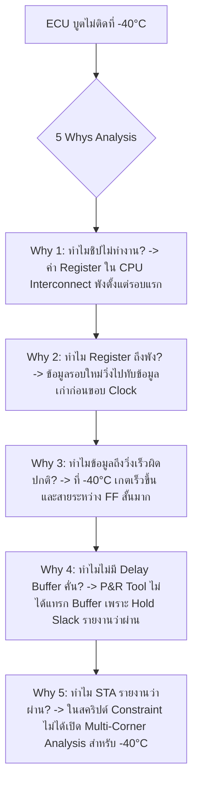

# Lesson 102: Timing Closure & Static Timing Analysis (STA) (タイミング収束と静的タイミング解析)

---

## 1. ทฤษฎีวิศวกรรมเชิงลึก (高度なエンジニアリング理論)

### 1.1 คณิตศาสตร์และสมการหลักมูลของ Static Timing Analysis (STA)
Static Timing Analysis (STA) คือระเบียบวิธีเชิงกำหนด (Deterministic Methodology) ในการตรวจสอบความถูกต้องเชิงเวลาของทุกเส้นทางสัญญาณ (Timing Path) ในวงจรดิจิทัล โดยไม่ต้องอาศัยเวกเตอร์การทดสอบ (Test Vectors) จากการจำลองทางตรรกะ วัตถุประสงค์หลักคือการพิสูจน์ว่าสัญญาณทั้งหมดสามารถเดินทางและถูกบันทึกค่าได้อย่างถูกต้องภายใต้เงื่อนไขความถี่สัญญาณนาฬิกาเป้าหมายในทุกสภาวะแวดล้อม

เส้นทางเวลามาตรฐานระหว่าง Flip-Flop ตัวส่ง (Source/Launch FF) และ Flip-Flop ตัวรับ (Destination/Capture FF) ถูกนิยามด้วยสมการหลักมูล 2 ประการ:

```
               Typical Synchronous Timing Path Architecture
        +--------------+                           +--------------+
        |  Launch FF   |      Data Combinational   |  Capture FF  |
        |    (Source)  |            Logic          | (Destination)|
  CLK --+-> CLK     Q  +-----[ LUT / Carry / Net ]-+-> D        Q |
        |              |                           |              |
        +-------+------+                           +-------+------+
                |                                          |
          Clock | Path (Launch)                      Clock | Path (Capture)
          Latency $T_{clk1}$                         Latency $T_{clk2}$
                |                                          |
                +-------------------[ PLL / BUFG ]---------+
```

#### 1.1.1 สมการ Setup Time Slack ($S_{setup}$)
Setup Time Slack คือค่าความเผื่อเวลาที่สัญญาณข้อมูลเดินทางมาถึงก่อนหน้าต่าง Setup Time ของ Capture Flip-Flop หากค่า $S_{setup} \ge 0$ แสดงว่าวงจรทำงานได้ตามสเปก หาก $S_{setup} < 0$ (Negative Slack) แสดงว่าเกิด **Setup Violation**:

$$S_{setup} = T_{required\_setup} - T_{arrival}$$

โดยที่:
* **เวลาที่ข้อมูลมาถึงจริง (Data Arrival Time):**
  $$T_{arrival} = T_{clk1} + t_{co} + t_{data\_comb} + t_{net}$$
* **เวลาที่ต้องการให้ข้อมูลพร้อม (Data Required Time):**
  $$T_{required\_setup} = T_{clk\_period} + T_{clk2} - t_{su} - T_{uncertainty}$$

เมื่อกระจายพจน์ทั้งหมด จะได้สมการความสัมพันธ์ของ Setup Slack:

$$S_{setup} = \left( T_{clk\_period} + (T_{clk2} - T_{clk1}) \right) - \left( t_{co} + t_{data\_comb} + t_{net} \right) - t_{su} - T_{uncertainty}$$

โดยกำหนดให้ Clock Skew คือ $T_{skew} = T_{clk2} - T_{clk1}$:

$$S_{setup} = T_{clk\_period} + T_{skew} - (t_{co} + t_{data\_delay} + t_{su}) - T_{uncertainty}$$

#### 1.1.2 สมการ Hold Time Slack ($S_{hold}$)
Hold Time Slack คือค่าความเผื่อเวลาที่สัญญาณข้อมูลใหม่จะยังไม่เดินทางมาทับสัญญาณข้อมูลเดิมก่อนที่ Capture Flip-Flop จะบันทึกค่าเสร็จสิ้น หาก $S_{hold} < 0$ แสดงว่าเกิด **Hold Violation**:

$$S_{hold} = T_{arrival} - T_{required\_hold}$$

โดยที่:
* **เวลาที่ข้อมูลรอบใหม่เดินทางมาถึงเร็วที่สุด (Earliest Data Arrival Time):**
  $$T_{arrival} = T_{clk1} + t_{co\_min} + t_{data\_comb\_min} + t_{net\_min}$$
* **เวลาที่กำหนดให้คงสถานะ (Data Required Time for Hold):**
  $$T_{required\_hold} = T_{clk2} + t_{h} + T_{uncertainty}$$

จะได้สมการ Hold Slack:

$$S_{hold} = (t_{co\_min} + t_{data\_delay\_min}) - T_{skew} - t_{h} - T_{uncertainty}$$

> **ข้อแตกต่างเชิงวิกฤต:**
> * **Setup Time** ขึ้นอยู่กับคาบเวลาของสัญญาณนาฬิกา ($T_{clk\_period}$) หาก Setup ไม่ผ่าน วิศวกรสามารถลดความถี่ของสัญญาณนาฬิกาลงเพื่อกู้คืนระบบได้
> * **Hold Time ไม่ขึ้นอยู่กับความถี่สัญญาณนาฬิกาเลย** หาก Hold Violation เกิดขึ้นในซิลิคอน วงจรจะไม่สามารถทำงานได้อย่างถูกต้องแม้จะลดความถี่ลงเหลือ $1\text{ Hz}$ ก็ตาม การแก้ Hold Time ในระดับ RTL/Layout จึงถือเป็นภารกิจความเป็นความตายของชิป

---

### 1.2 Clock Uncertainty และการสวิงของ PVT Corners
ในระบบฮาร์ดแวร์จริง พารามิเตอร์ของสัญญาณนาฬิกาและลอจิกไม่ได้มีค่าคงที่ แต่ขึ้นอยู่กับ 3 ตัวแปรหลักที่เรียกว่า **PVT (Process, Voltage, Temperature)**:

1. **Process (P):** ความเบี่ยงเบนในการผลิตเวเฟอร์ซิลิคอน แบ่งเป็น Fast Silicon (เกตสวิตช์เร็ว, กระแสรั่วไหลสูง) และ Slow Silicon (เกตสวิตช์ช้า)
2. **Voltage (V):** ความแปรปรวนของรางจ่ายแรงดันไฟเลี้ยง เช่น ราง $V_{core} = 0.90\text{V} \pm 3\%$ จาก Transient Load
3. **Temperature (T):** อุณหภูมิการทำงานของหัวต่อรอยต่อสารกึ่งตัวนำ (Junction Temperature, $T_J$) ในเกรดยานยนต์ (AEC-Q100 Grade 1) อยู่ระหว่าง $-40^\circ\text{C}$ ถึง $+125^\circ\text{C}$

```
                             PVT Operating Corners Matrix
      +-----------------------------------+-----------------------------------+
      |      Slow Corner (Max Delay)      |      Fast Corner (Min Delay)      |
      |-----------------------------------|-----------------------------------|
      | * Process: Slow Silicon           | * Process: Fast Silicon           |
      | * Voltage: Min Vdd (e.g., 0.87V)  | * Voltage: Max Vdd (e.g., 0.93V)  |
      | * Temp   : Max Temp (+125°C)      | * Temp   : Min Temp (-40°C)       |
      | * Critical for: SETUP TIME CHECK  | * Critical for: HOLD TIME CHECK   |
      +-----------------------------------+-----------------------------------+
```

#### Clock Uncertainty ($T_{uncertainty}$)
ประกอบด้วยผลรวมของความไม่แน่นอนในโครงข่าย Clock:

$$T_{uncertainty} = T_{jitter\_period} + T_{jitter\_phase} + T_{phase\_error} + T_{clock\_pvt\_drift}$$

* **Period Jitter ($T_{jitter}$):** การแกว่งของขอบสัญญาณนาฬิการะหว่างไซเคิลที่เกิดจาก Phase-Locked Loop (PLL) หรือ Oscillator
* **Phase Error ($T_{phase\_error}$):** ความคลาดเคลื่อนของเอาต์พุต Differential Clock หรือ Duty Cycle Distortion

---

### 1.3 ดัชนีวัดผลทางสถิติของ Timing Closure
ในการวิเคราะห์รายงาน STA เครื่องมือ (Vivado, Quartus, PrimeTime) จะสรุปตัวเลขชี้วัดสำคัญดังนี้:

| เมตริก (Metric) | คำนิยามทางคณิตศาสตร์ | ความหมายเชิงวิศวกรรม | เกณฑ์การยอมรับ (Target) |
| :--- | :--- | :--- | :--- |
| **WNS (Worst Negative Slack)** | $\min(S_{setup, i})$ สำหรับทุก path $i$ | Slack ของเส้นทางที่เลวร้ายที่สุดสำหรับ Setup Time | $\text{WNS} \ge 0.000\text{ ns}$ |
| **TNS (Total Negative Slack)** | $\sum_{i, S_{setup, i} < 0} S_{setup, i}$ | ผลรวมของ Slack ที่ติดลบทั้งหมดของ Setup Paths | $\text{TNS} = 0.000\text{ ns}$ |
| **WHS (Worst Hold Slack)** | $\min(S_{hold, j})$ สำหรับทุก path $j$ | Slack ของเส้นทางที่เลวร้ายที่สุดสำหรับ Hold Time | $\text{WHS} \ge 0.000\text{ ns}$ |
| **THS (Total Hold Slack)** | $\sum_{j, S_{hold, j} < 0} S_{hold, j}$ | ผลรวมของ Slack ที่ติดลบทั้งหมดของ Hold Paths | $\text{THS} = 0.000\text{ ns}$ |

---

### 1.4 ไวยากรณ์ SDC/XDC สำหรับการควบคุมเวลาขั้นสูง
การกำหนดข้อจำกัดเวลา (Timing Constraints) ที่ถูกต้องเป็นสิ่งจำเป็นอย่างยิ่งเพื่อไม่ให้เครื่องมือสังเคราะห์วงจรทำงานผิดทิศทาง:

```tcl
# 1. การสร้างสัญญาณนาฬิกาหลัก (Primary Clock)
create_clock -name sys_clk_100 -period 10.000 [get_ports clk_in_p]

# 2. การกำหนด Clock Uncertainty (Jitter + Margin)
set_clock_uncertainty -setup 0.250 [get_clocks sys_clk_100]
set_clock_uncertainty -hold  0.100 [get_clocks sys_clk_100]

# 3. การกำหนด Multicycle Path (สำหรับลอจิกที่ยอมให้อัปเดตทุก 2 ไซเคิล)
# บังคับ Setup Check ไปที่ไซเคิลที่ 2
set_multicycle_path 2 -setup -from [get_cells filter_inst/coeff_reg*] -to [get_cells filter_inst/accum_reg*]
# ปรับ Hold Check ให้อยู่ที่ไซเคิลที่ 1 (มิฉะนั้น Hold Check จะถูกเลื่อนไปที่ไซเคิล 1 อัตโนมัติซึ่งผิด)
set_multicycle_path 1 -hold  -from [get_cells filter_inst/coeff_reg*] -to [get_cells filter_inst/accum_reg*]

# 4. การตัดเส้นทางที่ไม่ต้องการวิเคราะห์ (False Path)
set_false_path -from [get_ports btn_reset_n]
```

---

## 2. ทริคหน้างาน OJT แบบ Step-by-Step (現場の実践テクニック)

### 2.1 กรณีศึกษาความล้มเหลวหน้างาน (失敗事例: Shippai Jirei)
* **บริบท:** กล่องควบคุมเรดาร์ความถี่มิลลิเมตร (77GHz Radar ECU) สำหรับระบบขับขี่กึ่งอัตโนมัติ ใช้ชิป Xilinx Zynq UltraScale+ MPSoC
* **อาการเสียหน้างาน:** บอร์ดผ่านการตรวจเช็กและทำงานสมบูรณ์แบบในการทดสอบในแล็บที่อุณหภูมิห้อง ($+25^\circ\text{C}$) และผ่านการเบิร์นอินความร้อนสูง ($+105^\circ\text{C}$) ต่อเนื่อง 100 ชั่วโมง แต่เมื่อนำรถยนต์ไปทดสอบ Cold Chamber ที่อุณหภูมิ $-40^\circ\text{C}$ ระบบเรดาร์เกิดอาการ **"Cold Boot Failure"** บูตไม่ขึ้น มีอัตราความล้มเหลว $100\%$ ในรอบแรกของการจ่ายไฟ
* **การตรวจวิเคราะห์:** ทีมฮาร์ดแวร์สงสัยเรื่องไฟเลี้ยงตก (Inrush/Brownout) แต่จากการตรวจวัดระดับไฟ $V_{core}$ ด้วยสโคปพบว่าแรงดันนิ่งสนิท เมื่อดึง JTAG เข้าไปตรวจสอบ Register ในสถานะบูต พบว่าตัวนับคำสั่งภายใน CPU Interconnect หยุดชะงักที่ค่ากระโดดผิดปกติ

```
            การสืบสวนหาสาเหตุการล้มเหลวที่อุณหภูมิต่ำ (-40°C Cold Boot Failure)
   +--------------------------------------------------------------------------+
   | อาการ: บูตไม่ติดที่ -40°C (Cold Chamber) แต่ทำงานปกติที่ +25°C และ +105°C |
   +--------------------------------------------------------------------------+
                                       |
                                       v
   +--------------------------------------------------------------------------+
   | เปิดดูรายงาน STA ของโปรเจกต์:                                            |
   | พบว่า Setup Slack WNS = +0.120 ns (ผ่าน)                                 |
   | แต่ Hold Slack WHS ถูกปิดการตรวจ Fast Corner โดยไม่ได้ตั้งใจ             |
   +--------------------------------------------------------------------------+
                                       |
                                       v
   +--------------------------------------------------------------------------+
   | ฟิสิกส์ของความเร็ว: ที่ -40°C และแรงดันไฟสูงสุด (Best-case Fast Corner)    |
   | ทรานซิสเตอร์มี Mobility สูงขึ้น สัญญาณเดินเร็วขึ้นกว่าเดิม 30%            |
   | Flip-Flop ตัวส่งส่งข้อมูลใหม่ไปถึง Capture FF ภายในเวลา 0.15 ns          |
   | แต่ Hold Time ต้องการ 0.22 ns -> เกิด HOLD VIOLATION ข้อมูลลื่นไถล       |
   +--------------------------------------------------------------------------+
```

---

### 2.2 การวิเคราะห์หาสาเหตุรากเหง้า (Root Cause Analysis: 5 Whys & Ishikawa)



#### Ishikawa Diagram (ผังก้างปลา)
* **Design/Constraints:** ขาดการกำหนด `set_operating_conditions` ให้ครอบคลุม Fast Corner ($-40^\circ\text{C}$, $V_{DD\_max}$)
* **Layout/Routing:** Flip-Flop สองตัววางอยู่ติดกันใน Slice เดียวกัน ทำให้ $t_{net} \approx 0.05\text{ ns}$ สั้นเกินไปจนต้านทาน Hold Time ไม่ไหว
* **Verification:** ข้ามการรัน Post-Route Timing Simulation ที่ Fast Timing Corner
* **Management/Standard:** เช็กลิสต์ตรวจแบบไม่ได้กำหนดเกณฑ์ Hold Slack Zero Tolerance แยกตามอุณหภูมิเกรดยานยนต์

---

### 2.3 มาตรการแก้ไขและกฎทองการทำ Timing Closure (Pipelining Strategy)
หากพบปัญหา **Setup Violation ($S_{setup} < 0$)** บนเส้นทางที่มีลอจิกลึก (Deep Logic Levels):
1. **เทคนิค Pipelining:** ตัดแบ่งกลุ่ม Combinational Logic ด้วยการแทรก Register ขั้นกลาง (Register Retiming)
2. **การลด Fan-out:** หากสัญญาณควบคุมตัวเดียวจ่ายให้ 5,000 ปลายทาง จะเกิด Net Delay มหาศาล ให้ใส่คำสั่ง `(* max_fanout = 50 *)` หรือสั่งให้เครื่องมือทำ Register Duplication

```
                  การทำ Pipelining เพื่อขจัด Setup Time Violation
  แบบเดิม (Unpipelined - Setup Violation):
  +----+                                                              +----+
  | FF |--->[ Adder 32b ]--->[ Shifter 32b ]--->[ Multiplier 32b ]--->| FF |
  +----+ <---------------- Total Delay = 6.8 ns (> 5.0 ns) ---------> +----+
  
  แบบใหม่ (2-Stage Pipelining - Timing Met at 250 MHz):
  +----+                                       +----+                 +----+
  | FF |--->[ Adder 32b ]--->[ Shifter 32b ]--->| FF |--->[ Mult ]--->| FF |
  +----+ <------ Delay = 3.2 ns -------------> +----+ <-- 2.9 ns ---> +----+
```

---

### 2.4 ตารางตรวจสอบหน้างาน SOP สำหรับ Timing Closure (STA SOP Checklist)

| ลำดับ | จุดตรวจสอบทางวิศวกรรม | เกณฑ์การผ่าน (Sign-off Criteria) | เครื่องมือตรวจสอบ | ผลการตรวจ |
| :---: | :--- | :--- | :--- | :---: |
| 1 | Worst Negative Slack (WNS) | $\text{WNS} \ge 0.000\text{ ns}$ ที่ Worst-case Slow Corner ($+125^\circ\text{C}, V_{min}$) | Vivado Timing Report | ผ่าน / ไม่ผ่าน |
| 2 | Worst Hold Slack (WHS) | $\text{WHS} \ge 0.000\text{ ns}$ (แนะนำ $\ge +0.050\text{ ns}$) ที่ Fast Corner ($-40^\circ\text{C}, V_{max}$) | Fast Corner STA Report | ผ่าน / ไม่ผ่าน |
| 3 | Total Negative Slack (TNS) | $\text{TNS} = 0.000\text{ ns}$ (ไม่มี Setup Violation ตกค้างแม้แต่พาทเดียว) | Implementation Summary | ผ่าน / ไม่ผ่าน |
| 4 | Clock Uncertainty Specification | ต้องระบุค่า Jitter ของ PLL/MMCM จาก Datasheet ครบทุกโดเมน | XDC / SDC Constraints | ผ่าน / ไม่ผ่าน |
| 5 | Unconstrained Paths Check | ต้องไม่มีพาทที่หลุดการวิเคราะห์ ($\text{Unconstrained Paths} = 0$) | Report Timing Summary | ผ่าน / ไม่ผ่าน |

---

## 3. คำศัพท์และประโยคภาษาญี่ปุ่นสำหรับตรวจแบบ (検図 - Kenzu)

### 3.1 ตารางคำศัพท์เทคนิคเฉพาะทาง (専門用語一覧)

| คำศัพท์คันจิ/คาตาคานะ | การอ่าน (Romaji) | คำแปลภาษาไทย / ภาษาอังกฤษ |
| :--- | :--- | :--- |
| **タイミング収束** | Taimingu shūsoku | การทำให้ไทม์มิ่งบรรลุเป้าหมาย (Timing Closure) |
| **静的タイミング解析** | Seiteki taimingu kaiseki | การวิเคราะห์ไทม์มิ่งแบบสถิต (Static Timing Analysis: STA) |
| **タイミング余裕度** | Taimingu yoyūdo | ค่าความเผื่อเวลา (Timing Slack) |
| **最悪遅延条件** | Saiaku chien jōken | สภาวะความล่าช้าเลวร้ายที่สุด (Worst-Case / Slow Corner) |
| **最速遅延条件** | Saisoku chien jōken | สภาวะความเร็วสูงสุด (Best-Case / Fast Corner) |
| **クロック不確実性** | Kurokku fukakujitsusei | ความไม่แน่นอนของสัญญาณนาฬิกา (Clock Uncertainty / Jitter) |
| **パイプライン段数** | Paipurain dansū | จำนวนสเตจของไปป์ไลน์ (Pipelining Stages) |
| **ファンアウト制限** | Fan'auto seigen | การจำกัดจำนวนโหลดปลายทาง (Fan-out Limit) |
| **未制約パス** | Miseiyaku pasu | เส้นทางที่ขาดข้อกำหนดเวลา (Unconstrained Path) |
| **ホールド違反** | Hōrudo ihan | ความผิดพลาดของเวลาคงสถานะ (Hold Time Violation) |

---

### 3.2 บทสนทนาการตรวจแบบหน้างานจริง (検図での指摘事項)

#### การตรวจแบบจุดที่ 1: การตรวจพบ Unconstrained Path ในการออกแบบความเร็วสูง
* **審査役 (Lead Chief Engineer):**
  「タイミング解析レポートを確認しましたが、DSPとメモリインターフェースの間に `Unconstrained Path` が12本残っていますね。制約ファイル（XDC）でクロック定義が漏れているか、誤って `set_false_path` を広範囲に適用していませんか？このままでは実機で誤動作を起こします。」
  *(ผมได้ตรวจสอบรายงานวิเคราะห์ไทม์มิ่งแล้ว พบว่ายังมี `Unconstrained Path` ตกค้างอยู่ 12 เส้นทางระหว่าง DSP และ Memory Interface ครับ ในไฟล์ Constraints (XDC) นิยาม Clock ตกหล่น หรือเผลอใช้คำสั่ง `set_false_path` กว้างเกินไปหรือเปล่าครับ? ปล่อยไว้แบบนี้ฮาร์ดแวร์จริงจะทำงานผิดพลาดได้นะครับ)*
* **設計担当 (FPGA Design Engineer):**
  「ご指摘ありがとうございます。確認したところ、非同期FIFOのステータス信号に対するクロック定義が一部漏れておりました。適切なクロック制約を追加し、すべてのパスが完全に解析対象に含まれるよう修正いたします。」
  *(ขอบพระคุณสำหรับข้อสังเกตครับ เมื่อตรวจสอบดูพบว่านิยามสัญญาณนาฬิกาสำหรับสัญญาณสถานะของ Asynchronous FIFO ตกหล่นไปบางส่วนครับ ผมจะเพิ่ม Clock Constraints ที่ถูกต้องและแก้ไขให้ทุกเส้นทางถูกนำมาวิเคราะห์อย่างสมบูรณ์ครับ)*

#### การตรวจแบบจุดที่ 2: การเตือนความเสี่ยงของ Hold Time Violation ที่อุณหภูมิต่ำ
* **審査役 (Lead Chief Engineer):**
  「車載仕向け（AEC-Q100）であるにもかかわらず、ファストコーナー（$-40^\circ\text{C}$）でのホールドマージンが $+0.008\text{ ns}$ しかありません。基板の電源電圧変動やプロセスのバラツキを考慮すると、量産時にホールド違反で起動不能に陥る懸念があります。最低でも $+0.050\text{ ns}$ のスラックを確保してください。」
  *(แม้ว่าจะเป็นงานเกรดยานยนต์ (AEC-Q100) แต่ค่า Hold Margin ที่ Fast Corner ($-40^\circ\text{C}$) มีเหลือเพียง $+0.008\text{ ns}$ เท่านั้นครับ เมื่อคำนึงถึงความผันผวนของแรงดันไฟและ Process Variation ของซิลิคอน มีความกังวลว่าตอนผลิตจำนวนมากจะเกิด Hold Violation จนเครื่องบูตไม่ติดได้ ช่วยปรับปรุงให้มี Slack อย่างน้อยที่สุด $+0.050\text{ ns}$ ด้วยครับ)*
* **設計担当 (FPGA Design Engineer):**
  「承知いたしました。該当箇所のレジスタ配置を見直し、配置配線オプションでホールド優先（Hold Fix Priority）を設定して遅延バッファを適切に挿入させ、$+0.050\text{ ns}$ 以上のマージンを確保いたします。」
  *(รับทราบครับ ผมจะทบทวนการวางตำแหน่ง Register ในจุดดังกล่าวใหม่ และตั้งค่าออปชันในการทำ P&R ให้ความสำคัญกับการแก้ Hold Time เพื่อให้เครื่องมือแทรก Delay Buffer อย่างเหมาะสม และการันตีมาร์จินมากกว่า $+0.050\text{ ns}$ ครับ)*

---

## 4. ควิซวิเคราะห์ปัญหาระดับวิศวกรอาวุโส (上級技術クイズ)

### ข้อที่ 1: การคำนวณความถี่สัญญาณนาฬิกาสูงสุด ($F_{max}$) ของระบบ
ในการออกแบบสถาปัตยกรรมตัวประมวลผลบน FPGA 16nm UltraScale+ มีเส้นทางข้อมูลวิกฤต (Critical Timing Path) ระหว่าง Register $A$ และ Register $B$ 

กำหนดพารามิเตอร์เวลาที่ Worst-case Slow Corner ดังนี้:
* คาบเวลา Clock ปัจจุบัน: $T_{clk} = 4.000\text{ ns}$ ($250\text{ MHz}$)
* Clock-to-Out Delay ของ Register A: $t_{co} = 0.450\text{ ns}$
* ความล่าช้าของลอจิกและสายสัญญาณรวม: $t_{data\_comb} + t_{net} = 2.650\text{ ns}$
* Setup Time ของ Register B: $t_{su} = 0.150\text{ ns}$
* Clock Skew ระหว่าง Register A และ B: $T_{skew} = T_{clk2} - T_{clk1} = +0.100\text{ ns}$ (สัญญาณนาฬิกามาถึงปลายทางช้ากว่าต้นทาง)
* Clock Uncertainty (Jitter + Noise Margin): $T_{uncertainty} = 0.250\text{ ns}$

จงคำนวณหาค่า **Setup Slack ($S_{setup}$)** ปัจจุบัน และ **ความถี่สูงสุดในทางทฤษฎี ($F_{max}$)** ที่เส้นทางนี้สามารถทำงานได้อย่างปลอดภัยโดยที่ $S_{setup} = 0.000\text{ ns}$?

a) $S_{setup} = +0.600\text{ ns}$, $F_{max} = 294.1\text{ MHz}$  
b) $S_{setup} = +0.400\text{ ns}$, $F_{max} = 277.8\text{ MHz}$  
c) $S_{setup} = -0.200\text{ ns}$, $F_{max} = 238.1\text{ MHz}$  
d) $S_{setup} = +0.850\text{ ns}$, $F_{max} = 317.5\text{ MHz}$  

---

#### เฉลยและบทวิเคราะห์เชิงลึกข้อที่ 1
**คำตอบที่ถูกต้องคือ: a) $S_{setup} = +0.600\text{ ns}$, $F_{max} = 294.1\text{ MHz}$**

**ขั้นตอนการคำนวณทางคณิตศาสตร์:**
1. คำนวณเวลาที่ข้อมูลเดินทางมาถึงจริง (Data Arrival Time):
   $$T_{arrival} = T_{clk1} + t_{co} + t_{data\_comb} + t_{net} = 0 + 0.450\text{ ns} + 2.650\text{ ns} = 3.100\text{ ns}$$
2. คำนวณเวลาที่กำหนดให้ข้อมูลพร้อม (Data Required Time):
   $$T_{required} = T_{clk} + T_{clk2} - t_{su} - T_{uncertainty}$$
   เนื่องจาก $T_{skew} = T_{clk2} - T_{clk1} = +0.100\text{ ns}$:
   $$T_{required} = 4.000\text{ ns} + 0.100\text{ ns} - 0.150\text{ ns} - 0.250\text{ ns} = 3.700\text{ ns}$$
3. คำนวณ Setup Slack ($S_{setup}$):
   $$S_{setup} = T_{required} - T_{arrival} = 3.700\text{ ns} - 3.100\text{ ns} = +0.600\text{ ns}$$
4. คำนวณหาคาบเวลาต่ำสุด ($T_{min}$) ที่ทำให้ $S_{setup} = 0$:
   $$0 = T_{min} + T_{skew} - (t_{co} + t_{data} + t_{su}) - T_{uncertainty}$$
   $$T_{min} = (t_{co} + t_{data} + t_{su}) + T_{uncertainty} - T_{skew}$$
   $$T_{min} = (0.450 + 2.650 + 0.150) + 0.250 - 0.100 = 3.250 + 0.250 - 0.100 = 3.400\text{ ns}$$
5. คำนวณความถี่สัญญาณนาฬิกาสูงสุด ($F_{max}$):
   $$F_{max} = \frac{1}{T_{min}} = \frac{1}{3.400 \times 10^{-9}\text{ s}} \approx 294.117 \times 10^6\text{ Hz} \approx 294.1\text{ MHz}$$

---

### ข้อที่ 2: การวิเคราะห์ Hold Time Violation ที่ Fast Corner
ในวงจรไปป์ไลน์ความเร็วสูง สัญญาณถูกส่งตรงจาก Flip-Flop $X$ ไปยัง Flip-Flop $Y$ บนสายสัญญาณสั้นมากใน Slice เดียวกัน
กำหนดพารามิเตอร์ที่ Fast Corner ($-40^\circ\text{C}$, $V_{DD} = 1.05 \times V_{nom}$):
* $t_{co\_min} = 0.120\text{ ns}$
* $t_{net\_min} = 0.030\text{ ns}$ (เส้นทองแดงสั้นมาก ไม่มี Logic Gate คั่นกลาง)
* Hold Time ของตัวรับ: $t_{h} = 0.090\text{ ns}$
* Clock Uncertainty สำหรับ Hold: $T_{uncertainty\_hold} = 0.050\text{ ns}$
* Clock Skew ระหว่างสองจุด: $T_{skew} = T_{clk\_Y} - T_{clk\_X} = +0.060\text{ ns}$ (Clock ของตัวรับมาช้ากว่าตัวส่ง)

จงคำนวณ Hold Slack ($S_{hold}$) และวิเคราะห์ว่าวงจรเกิด Hold Violation หรือไม่? หากเกิด จะต้องแทรกความล่าช้า (Buffer Delay) เพิ่มเติมอย่างน้อยเท่าใดเพื่อให้ได้ Hold Slack ปลอดภัยที่ $+0.040\text{ ns}$?

a) $S_{hold} = +0.020\text{ ns}$ (ไม่เกิด Violation), ไม่ต้องแทรกบัฟเฟอร์  
b) $S_{hold} = -0.050\text{ ns}$ (เกิด Violation), ต้องแทรกดีเลย์อย่างน้อย $0.090\text{ ns}$  
c) $S_{hold} = -0.010\text{ ns}$ (เกิด Violation), ต้องแทรกดีเลย์อย่างน้อย $0.050\text{ ns}$  
d) $S_{hold} = -0.080\text{ ns}$ (เกิด Violation), ต้องแทรกดีเลย์อย่างน้อย $0.120\text{ ns}$  

---

#### เฉลยและบทวิเคราะห์เชิงลึกข้อที่ 2
**คำตอบที่ถูกต้องคือ: b) $S_{hold} = -0.050\text{ ns}$ (เกิด Violation), ต้องแทรกดีเลย์อย่างน้อย $0.090\text{ ns}$**

**ขั้นตอนการคำนวณทางคณิตศาสตร์:**
1. คำนวณ Data Arrival Time สำหรับ Hold (เวลาที่ข้อมูลใหม่มาถึงเร็วที่สุด):
   $$T_{arrival\_hold} = t_{co\_min} + t_{net\_min} = 0.120\text{ ns} + 0.030\text{ ns} = 0.150\text{ ns}$$
2. คำนวณ Data Required Time สำหรับ Hold:
   $$T_{required\_hold} = T_{skew} + t_{h} + T_{uncertainty\_hold}$$
   $$T_{required\_hold} = 0.060\text{ ns} + 0.090\text{ ns} + 0.050\text{ ns} = 0.200\text{ ns}$$
3. คำนวณ Hold Slack ($S_{hold}$):
   $$S_{hold} = T_{arrival\_hold} - T_{required\_hold} = 0.150\text{ ns} - 0.200\text{ ns} = -0.050\text{ ns}$$
   *ผลลัพธ์ติดลบ แสดงว่าเกิด Hold Time Violation อย่างชัดเจน*
4. คำนวณ Delay เพิ่มเติม ($\Delta t_{buf}$) เพื่อให้ได้ $S_{hold\_new} = +0.040\text{ ns}$:
   $$S_{hold\_new} = (T_{arrival\_hold} + \Delta t_{buf}) - T_{required\_hold}$$
   $$+0.040\text{ ns} = (0.150\text{ ns} + \Delta t_{buf}) - 0.200\text{ ns} = -0.050\text{ ns} + \Delta t_{buf}$$
   $$\Delta t_{buf} = 0.040\text{ ns} - (-0.050\text{ ns}) = 0.090\text{ ns}$$
   ดังนั้น ต้องแทรกดีเลย์อย่างน้อย $0.090\text{ ns}$ ($90\text{ ps}$)

---

### ข้อที่ 3: พฤติกรรมของ Multicycle Path ในการคำนวณ Hold Check
วิศวกรทำการออกแบบวงจรตัวคูณ Floating-Point ซึ่งยอมให้ข้อมูลใช้เวลาคำนวณได้ 2 รอบสัญญาณนาฬิกา ($T_{clk} = 10\text{ ns}$) วิศวกรจึงเขียนคำสั่ง SDC ดังนี้:
`set_multicycle_path 2 -setup -from [get_cells Reg_A] -to [get_cells Reg_B]`
แต่ **ลืมใส่** คำสั่ง `set_multicycle_path -hold` ตามหลักการ

จงวิเคราะห์ว่าเครื่องมือวิเคราะห์เวลา (STA Tool) จะทำการตรวจสอบ Hold Time (Hold Check) ณ ขอบสัญญาณนาฬิการอบใด และส่งผลกระทบต่อวงจรอย่างไร?

a) ตรวจสอบ Hold Check ที่ขอบเวลา $0\text{ ns}$ (ไซเคิลเดิม) ซึ่งถูกต้องและไม่มีผลเสียใดๆ  
b) ตรวจสอบ Hold Check ที่ขอบเวลา $10\text{ ns}$ (ก่อนหน้า Setup Check 1 ไซเคิล) ซึ่งจะบังคับให้เส้นทางข้อมูลต้องมีค่า Delay ต่ำสุดมากกว่า $10\text{ ns}$ ส่งผลให้ P&R พยายามแทรก Delay Buffer จำนวนมหาศาลโดยไม่จำเป็นและอาจทำให้พื้นที่ชิปเต็ม  
c) เครื่องมือจะเกิด Error และปฏิเสธการสังเคราะห์วงจร  
d) เครื่องมือจะยกเลิกการตรวจ Hold Time ทั้งหมดบนเส้นทางนั้นโดยอัตโนมัติ  

---

#### เฉลยและบทวิเคราะห์เชิงลึกข้อที่ 3
**คำตอบที่ถูกต้องคือ: b) ตรวจสอบ Hold Check ที่ขอบเวลา $10\text{ ns}$ (ก่อนหน้า Setup Check 1 ไซเคิล) ซึ่งจะบังคับให้เส้นทางข้อมูลต้องมีค่า Delay ต่ำสุดมากกว่า $10\text{ ns}$ ส่งผลให้ P&R พยายามแทรก Delay Buffer จำนวนมหาศาลโดยไม่จำเป็นและอาจทำให้พื้นที่ชิปเต็ม**

**บทวิเคราะห์เชิงลึกระดับ Lead Architect:**
* โดยค่าดีฟอลต์ของอัลกอริทึม STA ทุกค่าย (Synopsys Design Compiler, PrimeTime, Vivado):
  * ขอบ Setup Check ปกติจะอยู่ที่ Capture Edge = ไซเคิล 1 ($10\text{ ns}$) และ Hold Check จะอยู่ที่ Capture Edge ก่อนหน้า Setup Edge 1 ไซเคิลเสมอ นั่นคือ ไซเคิล 0 ($0\text{ ns}$)
* เมื่อผู้ใช้สั่ง `set_multicycle_path 2 -setup` ขอบ Setup Check จะถูกเลื่อนจากไซเคิล 1 ไปเป็นไซเคิล 2 ($20\text{ ns}$)
* **ผลข้างเคียง (Default Side Effect):** อัลกอริทึมจะรักษาความสัมพันธ์เดิม คือ Hold Check จะตั้งอยู่ก่อนหน้า Setup Check 1 ไซเคิลเสมอ ดังนั้น Hold Check จะถูกเลื่อนตามไปอยู่ที่ไซเคิล 1 ($10\text{ ns}$) โดยอัตโนมัติ!
* การที่ Hold Check อยู่ที่ $10\text{ ns}$ หมายความว่า ข้อมูลใหม่ที่ส่งออกจาก Reg_A จะต้องเดินทางช้ากว่า $10\text{ ns}$ จึงจะไม่เกิด Hold Violation เครื่องมือ P&R จะเข้าใจว่าเส้นทางนี้ต้องการ Delay ขั้นต่ำ $10\text{ ns}$ จึงระดมใส่ Buffer ต่อเรียงกันเป็นขบวน (Cascade of Look-Up Tables/Buffers) เพื่อหน่วงเวลา ส่งผลให้สิ้นเปลืองพื้นที่ซิลิคอนและพลังงานอย่างมหาศาล
* **วิธีแก้ที่ถูกต้อง:** ต้องกำหนดคำสั่งคู่เสมอ:
  `set_multicycle_path 2 -setup -from Reg_A -to Reg_B`
  `set_multicycle_path 1 -hold -from Reg_A -to Reg_B`
  เพื่อดึงขอบ Hold Check ถอยกลับมาอยู่ที่ไซเคิล 0 ($0\text{ ns}$) ตามความเป็นจริง
