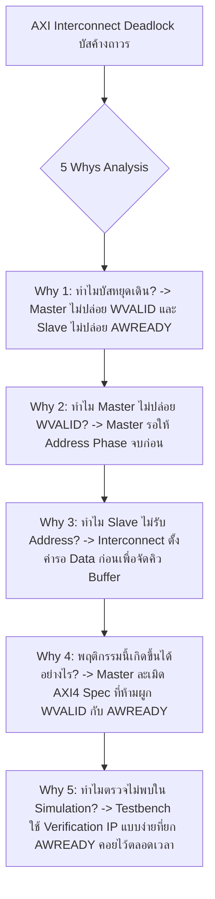

# Lesson 103: AXI4 Protocol & High-Speed Interconnects (AXI4プロトコルとオンチップ高速インターコネクト)

---

## 1. ทฤษฎีวิศวกรรมเชิงลึก (高度なエンジニアリング理論)

### 1.1 สถาปัตยกรรมช่องสัญญาณอิสระ 5 ช่องของ AMBA AXI4
โปรโตคอล ARM AMBA AXI4 (Advanced eXtensible Interface 4 ตามมาตรฐาน ARM IHI 0022E) คือมาตรฐานอินเทอร์เฟซการสื่อสารแบบขนานความเร็วสูงบนชิป (On-Chip Interconnect) ที่ใช้แพร่หลายที่สุดในสถาปัตยกรรม High-Performance FPGA (Xilinx UltraScale+, Intel Stratix 10) และ SoC ความเร็วสูง

หัวใจของ AXI4 คือการแยกช่องสัญญาณแอดเดรสและข้อมูลออกจากกันโดยสิ้นเชิง ทำให้เกิดการสื่อสารแบบ **Full-Duplex** พร้อมสถาปัตยกรรมช่องสัญญาณอิสระ 5 ช่อง (5 Independent Channels):

```
                   ARM AMBA AXI4 Point-to-Point Architecture
        +-------------------+                      +-------------------+
        |                   |===[ 1. AW Channel ]==>|                   |
        |                   |===[ 2. W  Channel ]==>|                   |
        |    AXI4 Master    |<==[ 3. B  Channel ]===|    AXI4 Slave     |
        |  (e.g., DMA Core) |                       | (e.g., DDR4 Ctrl) |
        |                   |===[ 4. AR Channel ]==>|                   |
        |                   |<==[ 5. R  Channel ]===|                   |
        +-------------------+                      +-------------------+
```

1. **Write Address Channel (AW):** ส่งข้อมูลแอดเดรสตั้งต้น, ความยาวเบิสต์ (`AWLEN`), ขนาดข้อมูล (`AWSIZE`), ชนิดเบิสต์ (`AWBURST`), และแท็กธุรกรรม (`AWID`)
2. **Write Data Channel (W):** ส่งเพย์โหลดข้อมูลขาเขียน (`WDATA`), สัญญาณระบุความถูกต้องของไบต์ (`WSTRB`), และแฟล็กสิ้นสุดเบิสต์ (`WLAST`)
3. **Write Response Channel (B):** ส่งสถานะผลการบันทึกข้อมูล (`BRESP`: OKAY, EXOKAY, SLVERR, DECERR) และยืนยันการจบธุรกรรมเขียน
4. **Read Address Channel (AR):** ส่งข้อมูลแอดเดรสตั้งต้นและเงื่อนไขการอ่าน (`ARADDR`, `ARLEN`, `ARSIZE`, `ARBURST`, `ARID`)
5. **Read Data Channel (R):** ส่งเพย์โหลดข้อมูลขาอ่าน (`RDATA`), สถานะการอ่าน (`RRESP`), และแฟล็กบีตสุดท้าย (`RLAST`)

---

### 1.2 กลไก 2-Way Handshake และกฎเหล็กการป้องกัน Deadlock
ทุกช่องสัญญาณใน AXI4 ควบคุมการไหลของข้อมูลด้วยสัญญาณคู่ **`VALID`** และ **`READY`**:
* **การส่งข้อมูลจะสำเร็จ (Data Transfer Beat) เกิดขึ้น ณ ขอบขาขึ้นของสัญญาณนาฬิกา (`posedge ACLK`) เมื่อและต่อเมื่อ `VALID == 1` และ `READY == 1` พร้อมกันเท่านั้น**

```
             AXI4 Handshake Timing Diagram (Case 1, 2, 3)
                   _   _   _   _   _   _   _   _   _   _
  ACLK           _| |_| |_| |_| |_| |_| |_| |_| |_| |_| |_
  (Case 1: VALID first)
  VALID          _______/~~~~~~~~~~~~~~~~~~~\_____________
  READY          _______________/~~~~~~~~~~~\_____________
  Data Transfer                 ^ Beat Transferred here
  
  (Case 2: READY first)
  READY          _______/~~~~~~~~~~~~~~~~~~~\_____________
  VALID          _______________/~~~~~~~~~~~\_____________
  Data Transfer                 ^ Beat Transferred here
```

#### กฎความสัมพันธ์ (Handshake Dependencies Rule) ตามมาตรฐาน ARM
เพื่อป้องกันการเกิดสภาวะ **Mutual Deadlock (相互デッドロック - การล็อกตายแบบวงกลม)** มาตรฐาน AXI4 ได้วางข้อกำหนดความสัมพันธ์เชิงสาเหตุอย่างเข้มงวด:

```
        AXI4 Official Specification Dependency Graph (Prevent Deadlock)
   
   Write Transaction:                 Read Transaction:
   +---------+                        +---------+
   | AWVALID |                        | ARVALID |
   +----+----+                        +----+----+
        | (Must NOT depend)                | (Must NOT depend)
        v                                  v
   +---------+                        +---------+
   | AWREADY |                        | ARREADY |
   +---------+                        +---------+
        |                                  |
        v (Can depend)                     v (Can depend)
   +---------+                        +---------+
   | WVALID  |                        | RVALID  |
   +----+----+                        +----+----+
        | (Must NOT depend)                | (Must NOT depend)
        v                                  v
   +---------+                        +---------+
   | WREADY  |                        | RREADY  |
   +---------+                        +---------+
```

1. **กฎข้อที่ 1 (ห้าม Master รอ Slave):** สัญญาณ `VALID` ทางฝั่งส่ง (Master หรือ Slave ในช่อง R/B) **ห้ามขึ้นอยู่กับสัญญาณ `READY` เป็นอันขาด** (ห้ามเขียนลอจิก: `assign VALID = READY & internal_req;`) ผู้ส่งต้องยก `VALID = 1` ให้เสร็จสิ้นโดยอิสระ และเมื่อยก `VALID` แล้ว **ห้ามลดระดับลงสู่ '0' เด็ดขาดจนกว่า `READY` จะขึ้นมาจับคู่สำเร็จ**
2. **กฎข้อที่ 2 (Slave สามารถรอ Master ได้):** สัญญาณ `READY` ทางฝั่งรับสามารถรอให้ `VALID` ขึ้นมาก่อนแล้วจึงยก `READY` ตอบสนอง หรือจะยก `READY = 1` คอยไว้ล่วงหน้า (Speculative Assert) ก็ได้
3. **กฎข้อที่ 3 (ความสัมพันธ์ข้ามช่องสัญญาณ):**
   * ในการเขียน: `BVALID` ของ Slave ต้องรอให้ได้รับข้อมูลครบทุกบีตจนถึง `WLAST == 1` ก่อนจึงจะยกขึ้นมาได้
   * แต่ `WVALID` **ห้ามรอ `AWREADY` เป็นอันขาด** มาตรฐานอนุญาตให้ Master ส่ง Write Data ออกมาก่อนหรือพร้อมกับ Write Address ได้

---

### 1.3 การคำนวณ Throughput และ Burst Types
AXI4 รองรับการส่งข้อมูลเป็นกลุ่มก้อน (Burst Transfer) ได้สูงสุดถึง 256 บีตต่อ 1 แอดเดรส (`AxLEN = 0` ถึง `255`, โดยจำนวนบีตจริงคือ $\text{Length} = \text{AxLEN} + 1$)

ชนิดของเบิสต์ตามสัญญาณ `AxBURST[1:0]`:
1. **FIXED (`2'b00`):** แอดเดรสคงที่ทุกบีต เหมาะสำหรับอ่าน/เขียน FIFO Port
2. **INCR (`2'b01`):** แอดเดรสเพิ่มขึ้นทีละ $2^{\text{AxSIZE}}$ ไบต์ในทุกบีต เหมาะสำหรับการเข้าถึงหน่วยความจำทั่วไป (DDR SDRAM)
3. **WRAP (`2'b10`):** แอดเดรสจะเพิ่มขึ้นจนถึงขอบเขต (Boundary Limit) แล้ววนกลับมาที่ต้นขอบเขต เหมาะสำหรับ Cache Line Fill

#### สมการคำนวณปริมาณการส่งข้อมูลจริง (Effective Throughput)
ปริมาณแบนด์วิดท์สูงสุดที่ทำได้จริงบนบัสข้อมูลความกว้าง $W_{data}$ บิต ที่ความถี่ $f_{clk}$ เมื่อมีจำนวน Wait States ($N_{wait}$) และ Overhead ในการส่งแอดเดรส:

$$\text{Throughput} = \frac{\text{Payload Data (Bytes)}}{\text{Total Execution Time (Seconds)}} = f_{clk} \cdot \left(\frac{W_{data}}{8}\right) \cdot \left( \frac{\text{AxLEN} + 1}{(\text{AxLEN} + 1) + N_{wait\_data} + N_{addr\_latency}} \right)$$

---

### 1.4 โครงสร้าง Skid Buffer (Register Slice) ขั้นสูง
เมื่อระบบต้องการความถี่สัญญาณนาฬิกาสูง ($> 300\text{ MHz}$) สายสัญญาณ `READY` ที่วิ่งย้อนกลับ (Backward Feedback Path) จาก Slave มายัง Master จะกลายเป็น Critical Timing Path หากแทรก Register ธรรมดาคั่นสาย `READY` จะทำให้เกิดฟองอากาศในไปป์ไลน์ (Bubble Latency) สูญเสีย Throughput เหลือเพียง $50\%$

โซลูชันระดับมืออาชีพคือการใช้ **Skid Buffer (2-Stage Registered Slice)** ซึ่งยอมให้เก็บข้อมูลสำรองไว้ได้ 1 บีตขณะที่ Slave สั่งหยุด:

```verilog
// Professional High-Performance AXI Skid Buffer / Register Slice
module axi_skid_buffer #(
    parameter int DATA_WIDTH = 32
)(
    input  logic                  clk,
    input  logic                  rst_n,
    // Upstream Interface
    input  logic                  s_valid,
    output logic                  s_ready,
    input  logic [DATA_WIDTH-1:0] s_data,
    // Downstream Interface
    output logic                  m_valid,
    input  logic                  m_ready,
    output logic [DATA_WIDTH-1:0] m_data
);

    logic [DATA_WIDTH-1:0] reg_data;
    logic [DATA_WIDTH-1:0] skid_data;
    logic                  reg_valid;
    logic                  skid_valid;

    // Ready upstream if skid buffer is currently empty
    assign s_ready = !skid_valid;

    always_ff @(posedge clk or negedge rst_n) begin
        if (!rst_n) begin
            reg_valid  <= 1'b0;
            skid_valid <= 1'b0;
            reg_data   <= '0;
            skid_data  <= '0;
        end else begin
            // When downstream accepts data, clear main register valid
            if (m_ready) begin
                reg_valid <= 1'b0;
            end

            // Main register loading logic
            if (s_valid && s_ready) begin
                if (!reg_valid || m_ready) begin
                    reg_data  <= s_data;
                    reg_valid <= 1'b1;
                end else begin
                    // Skid buffer absorbs data when downstream is not ready
                    skid_data  <= s_data;
                    skid_valid <= 1'b1;
                end
            end else if (m_ready && skid_valid) begin
                // Drain skid buffer into main path
                reg_data   <= skid_data;
                reg_valid  <= 1'b1;
                skid_valid <= 1'b0;
            end
        end
    end

    assign m_valid = reg_valid;
    assign m_data  = reg_data;

endmodule
```

---

## 2. ทริคหน้างาน OJT แบบ Step-by-Step (現場の実践テクニック)

### 2.1 กรณีศึกษาความล้มเหลวหน้างาน (失敗事例: Shippai Jirei)
* **บริบท:** การ์ดประมวลผลวิดีโอ 4K UHD 60fps บนบอร์ด PCIe Accelerator ใช้ชิป UltraScale+ เชื่อมต่อ DMA Master เข้ากับ DDR4 Controller ผ่าน AXI Interconnect Crossbar
* **อาการเสียหน้างาน:** ระบบทดสอบการสตรีมวิดีโอทำงานได้ปกติในช่วงเริ่มต้น แต่หลังจากเปิดสตรีมไปประมาณ 15 ถึง 45 นาที บัส AXI จะเกิดอาการ **"Hard Lockup / Bus Freeze"** ปริมาณข้อมูลส่งกลายเป็นศูนย์ (Throughput = 0) สัญญาณ Interrupt ขาดหาย และ CPU กลายเป็น Kernel Panic
* **การตรวจสอบทางกายภาพ:** ทีมวิศวกรนำเครื่องมือ Integrated Logic Analyzer (Vivado ILA) เข้าไปส่องสัญญาณบัส AXI ระหว่างเกิดอาการ Hang

```
             การตรวจจับรูปคลื่น ILA ณ จังหวะเกิด Deadlock บนระบบจริง
                   _   _   _   _   _   _   _   _   _   _
  ACLK           _| |_| |_| |_| |_| |_| |_| |_| |_| |_| |_
  AWVALID        ~~~~~~~~~~~~~~~~~~~~~~~~~~~~~~~~~~~~~~~~~ (High: Master ขอส่ง Address)
  AWREADY        _________________________________________ (Low: Interconnect ไม่รับ Address)
  WVALID         _________________________________________ (Low: Master ยังไม่ยอมส่ง Data)
  WREADY         ~~~~~~~~~~~~~~~~~~~~~~~~~~~~~~~~~~~~~~~~~ (High: Slave พร้อมรับ Data)
```

* **ผลการวิเคราะห์ ILA:**
  1. Master ส่ง `AWVALID = 1` เพื่อร้องขอเปิดการเขียน
  2. แต่ตัว Interconnect รุ่นใหม่มีกลไกจัดสรรคิว โดยจะยอมยก `AWREADY = 1` ก็ต่อเมื่อ Master เริ่มส่งข้อมูล `WVALID = 1` บีตแรกเข้ามาในบัฟเฟอร์คิว เพื่อป้องกัน Address Buffer ล้น
  3. ทว่าวิศวกรออกแบบ DMA Master ด้วย FSM แบบเก่าที่ตั้งเงื่อนไขว่า: *"ต้องรอให้ `AWREADY == 1` ยืนยันแอดเดรสสำเร็จก่อน จึงจะเปลี่ยนสเตตไปยก `WVALID = 1`"*
  4. ผลลัพธ์: **Master รอ Interconnect ยก `AWREADY` $\leftrightarrow$ Interconnect รอ Master ยก `WVALID`** ทั้งสองฝ่ายรอซึ่งกันและกันตลอดกาล กลายเป็น **Circular Dependency Deadlock**

---

### 2.2 การวิเคราะห์หาสาเหตุรากเหง้า (Root Cause Analysis: 5 Whys & Ishikawa)



#### Ishikawa Diagram (ผังก้างปลา)
* **RTL Coding:** เขียน State Machine ใน DMA Controller แยก Address และ Data ออกเป็น Sequential Phases อย่างผิดหลักเกณฑ์ AXI4
* **Verification Environment:** ในระดับ Simulation ตัว AXI Slave Dummy ตอบสนองทันทีแบบ Zero-Delay (`AWREADY = 1` ทันที) ทำให้ไม่เคยจำลองสภาวะ Backpressure จริง
* **Specification Compliance:** ผู้ออกแบบไม่อ่านเอกสาร ARM AMBA Specification หัวข้อ *"Relationships between handshake signals"* อย่างถ่องแท้

---

### 2.3 มาตรการแก้ไขและปรับปรุงสถาปัตยกรรม (Architectural Fix)
1. **แยก AW FSM และ W FSM ออกจากกันโดยสมบูรณ์ (Independent Channels):** ในตัว DMA Master ต้องสร้างวงจรควบคุมช่องแอดเดรสและช่องข้อมูลขนานกันอย่างอิสระ เมื่อมีคำสั่งเขียน Master ต้องยกทั้ง `AWVALID = 1` และ `WVALID = 1` ออกมาพร้อมกันโดยไม่ต้องรอกัน
2. **ใช้ AXI Protocol Checker VIP:** ใส่โมดูล `axi_protocol_checker` ในโค้ด RTL เพื่อให้เครื่องมือฟ้องทันทีเมื่อมีการละเมิดกฎ Handshake หรือเกิด Timeout
3. **เปิด Randomized Backpressure ใน Testbench:** สุ่มให้ `AWREADY` และ `WREADY` ดีเลย์ 0 ถึง 50 ไซเคิลในการรัน UVM Testbench

---

### 2.4 ตารางตรวจสอบหน้างาน SOP สำหรับการออกแบบ AXI4 (AXI SOP Checklist)

| ลำดับ | จุดตรวจสอบการออกแบบ | เกณฑ์การยอมรับ (Acceptance Criteria) | วิธีการตรวจวัด | ผลการตรวจ |
| :---: | :--- | :--- | :--- | :---: |
| 1 | Handshake Independence | `VALID` ต้องไม่ขึ้นอยู่กับ `READY` ในช่องเดียวกันเด็ดขาด | Static Code Lint / RTL Review | ผ่าน / ไม่ผ่าน |
| 2 | Signal Stability Rule | เมื่อ `VALID` ขึ้นสูงแล้ว ห้ามลดลงจนกว่า `READY` จะเป็น '1' | AXI Protocol Checker Assertion | ผ่าน / ไม่ผ่าน |
| 3 | Burst Termination Flag | สัญญาณ `WLAST` และ `RLAST` ต้องยกสูงเฉพาะที่บีตสุดท้ายของเบิสต์จริง | Simulation Waveform Check | ผ่าน / ไม่ผ่าน |
| 4 | Write Response Handling | Slave ต้องไม่ส่ง `BVALID` ก่อนที่จะได้รับบีตที่มี `WLAST == 1` | SystemVerilog Assertion (SVA) | ผ่าน / ไม่ผ่าน |
| 5 | Crossbar Skid Buffering | จุดเชื่อมต่อที่มี Timing Critical ต้องใส่ Skid Buffer เพื่อตัดสาย `READY` | Post-Route Timing Report | ผ่าน / ไม่ผ่าน |

---

## 3. คำศัพท์และประโยคภาษาญี่ปุ่นสำหรับตรวจแบบ (検図 - Kenzu)

### 3.1 ตารางคำศัพท์เทคนิคเฉพาะทาง (専門用語一覧)

| คำศัพท์คันจิ/คาตาคานะ | การอ่าน (Romaji) | คำแปลภาษาไทย / ภาษาอังกฤษ |
| :--- | :--- | :--- |
| **相互デッドロック** | Sōgo deddorokku | การติดล็อกตายซึ่งกันและกัน (Mutual Deadlock) |
| **バースト転送** | Bāsuto tensō | การส่งข้อมูลแบบเบิสต์ (Burst Transfer) |
| **ハンドシェイク制御** | Handosheiku seigyo | การควบคุมการจับมือสื่อสาร (Handshake Control) |
| **スキッドバッファ** | Sukiddo baffa | บัฟเฟอร์สำรองฉุกเฉิน (Skid Buffer / Pipeline Register Slice) |
| **未完了トランザクション** | Mikanryō toranzakushon | ธุรกรรมที่ยังไม่เสร็จสิ้น (Outstanding Transaction) |
| **順不同応答** | Junfudō ōtō | การตอบสนองแบบไม่เรียงลำดับ (Out-of-Order Response) |
| **背圧制御** | Haiatsu seigyo | การควบคุมแรงดันย้อนกลับ (Backpressure Control) |
| **境界またぎ** | Kyōkai matagi | การข้ามขอบเขตแอดเดรส (Address Boundary Crossing) |
| **転送効率** | Tensō kōritsu | ประสิทธิภาพการส่งข้อมูล (Transfer Efficiency / Throughput) |
| **調停回路** | Chōtei kairo | วงจรจัดสรรสิทธิ์/อาร์บิเตอร์ (Arbiter Circuit) |

---

### 3.2 บทสนทนาการตรวจแบบหน้างานจริง (検図での指摘事項)

#### การตรวจแบบจุดที่ 1: การตรวจพบสัญญาณ VALID รอสัญญาณ READY (Deadlock Hazard)
* **審査役 (Lead Chief Engineer):**
  「この独自のAXI4-Liteスレーブ回路のソースコードですが、`awready` が '1' になるのを待ってから内部ステートを進めて `wready` をアサートする構造になっています。AXI仕様書では、アドレスチャネルとデータチャネルの間にこのような依存関係を持たせることを禁止しています。相互デッドロックを引き起こすため、チャネルを完全に独立制御してください。」
  *(ในซอร์สโค้ดของวงจร AXI4-Lite Slave ตัวนี้ มีโครงสร้างที่รอให้ `awready` เป็น '1' ก่อนจึงจะเดินสเตตภายในไปยก `wready` ครับ ในข้อกำหนด AXI ห้ามสร้างความสัมพันธ์ที่ขึ้นต่อกันระหว่างช่องแอดเดรสและช่องข้อมูลเช่นนี้อย่างเด็ดขาด เพราะจะทำให้เกิด Mutual Deadlock ได้ ช่วยแก้ไขให้ควบคุมทั้งสองช่องเป็นอิสระต่อกันโดยสมบูรณ์ด้วยครับ)*
* **設計担当 (FPGA Design Engineer):**
  「ご指摘ありがとうございます。マスター側の動作を前提にした設計になっておりました。仕様書に準拠し、ライトアドレスとライトデータを独立したステートマシンで受信し、両方が揃った時点でトランザクションを実行する構造に書き直します。」
  *(ขอบพระคุณสำหรับข้อสังเกตครับ ผมออกแบบโดยตั้งสมมติฐานตามพฤติกรรมของ Master ด้านเดียวไปครับ ผมจะปรับปรุงให้ถูกต้องตามสเปก โดยแยก State Machine ในการรับ Write Address และ Write Data เป็นอิสระจากกัน และจะประมวลผลธุรกรรมเมื่อข้อมูลมาครบทั้งสองฝั่งครับ)*

#### การตรวจแบบจุดที่ 2: ปัญหาเส้นทาง Ready วิ่งย้อนกลับจนไทม์มิ่งไม่ผ่าน (Timing Failure on Ready Path)
* **審査役 (Lead Chief Engineer):**
  「250MHz動作のAXIインターコネクトにおいて、スレーブの `s_ready` からマスターのセレクタ論理を経由するパスで $-0.320\text{ ns}$ のセットアップ違反が発生しています。バックプレッシャー信号のコンビネーショナルループが長すぎます。スキッドバッファを挿入してレジスタで切ってください。」
  *(ใน AXI Interconnect ที่ทำงานที่ 250MHz มี Setup Violation ติดลบ $-0.320\text{ ns}$ เกิดขึ้นบนเส้นทางจาก `s_ready` ของ Slave ผ่านลอจิกซีเลกเตอร์กลับมายัง Master ครับ Combinational Loop ของสัญญาณ Backpressure ยาวเกินไปแล้ว ช่วยแทรก Skid Buffer เพื่อตัดสายด้วย Register ด้วยครับ)*
* **設計担当 (FPGA Design Engineer):**
  「承知いたしました。スループットを100%維持しながら `ready` 経路をレジスタ化できる2ステージ・スキッドバッファ（AXI Register Slice）を配置配線間に挿入し、タイミング収束を図ります。」
  *(รับทราบครับ ผมจะแทรก 2-Stage Skid Buffer (AXI Register Slice) ที่สามารถตัดสัญญาณ `ready` ด้วย Register โดยยังคงรักษา Throughput ได้ 100% เข้าไปในเส้นทาง เพื่อให้ไทม์มิ่งบรรลุเป้าหมายครับ)*

---

## 4. ควิซวิเคราะห์ปัญหาระดับวิศวกรอาวุโส (上級技術クイズ)

### ข้อที่ 1: การคำนวณแบนด์วิดท์จริง (Effective Bandwidth) ของ AXI4 DMA Subsystem
ระบบประมวลผลสัญญาณบน FPGA เชื่อมต่อ DMA Master เข้ากับ DDR4 Controller Memory ผ่านบัส AXI4 ขนาดความกว้าง $W_{data} = 256\text{ บิต}$ (32 ไบต์) ทำงานที่ความถี่สัญญาณนาฬิกา $f_{clk} = 300\text{ MHz}$

สภาวะการทำงานจริงในการทำ Burst Write:
* ความยาวของเบิสต์ที่ตั้งค่าไว้คือสูงสุดตามสเปก AXI4: $\text{AWLEN} = 255$ (นั่นคือมีขนาด $256\text{ บีต}$ ต่อ 1 ธุรกรรม)
* ในช่วงเริ่มต้นเบิสต์ มี Overhead ของ Address Phase และ Arbitration Latency รวมกัน $N_{addr\_latency} = 14\text{ ไซเคิล}$
* ระหว่างการส่งข้อมูล 256 บีต ตัว DDR Controller เกิดบัฟเฟอร์เต็มชั่วคราว จึงลดระดับ `WREADY = 0` (Wait States) รวมทั้งสิ้น $N_{wait} = 30\text{ ไซเคิล}$
* เมื่อส่งครบ 256 บีต มีช่วงรอรับสถานะยืนยัน `BRESP` อีก $N_{resp} = 10\text{ ไซเคิล}$ ก่อนที่ Master จะเริ่มธุรกรรมเบิสต์ถัดไป

จงคำนวณหา **Throughput สุทธิจริง (Effective Throughput)** ในหน่วย **กิกะไบต์ต่อวินาที (GB/s)** ของระบบนี้?

a) $9.60\text{ GB/s}$  
b) $7.92\text{ GB/s}$  
c) $6.40\text{ GB/s}$  
d) $8.53\text{ GB/s}$  

---

#### เฉลยและบทวิเคราะห์เชิงลึกข้อที่ 1
**คำตอบที่ถูกต้องคือ: b) $7.92\text{ GB/s}$**

**ขั้นตอนการคำนวณทางคณิตศาสตร์:**
1. คำนวณปริมาณข้อมูลเพย์โหลดทั้งหมดต่อ 1 เบิสต์ ($D_{bytes}$):
   $$D_{bytes} = (\text{AWLEN} + 1) \times \left(\frac{W_{data}}{8}\right) = 256\text{ บีต} \times 32\text{ ไบต์/บีต} = 8,192\text{ ไบต์}$$
2. คำนวณจำนวนรอบสัญญาณนาฬิกาทั้งหมดที่ใช้ต่อ 1 ธุรกรรม ($Cycles_{total}$):
   * จำนวนไซเคิลส่งข้อมูลจริง: $256\text{ ไซเคิล}$
   * จำนวนไซเคิลติดขัดจาก Backpressure (Wait states): $30\text{ ไซเคิล}$
   * จำนวนไซเคิลสำหรับ Address และ Arbitration: $14\text{ ไซเคิล}$
   * จำนวนไซเคิลรอรับ Write Response: $10\text{ ไซเคิล}$
   $$Cycles_{total} = 256 + 30 + 14 + 10 = 310\text{ ไซเคิล}$$
3. คำนวณเวลาทั้งหมดที่ใช้ต่อ 1 เบิสต์ ($T_{trans}$):
   $$T_{trans} = \frac{Cycles_{total}}{f_{clk}} = \frac{310}{300 \times 10^6\text{ Hz}} \approx 1.0333 \times 10^{-6}\text{ วินาที} = 1.0333\text{ }\mu\text{s}$$
4. คำนวณ Effective Throughput:
   $$\text{Throughput} = \frac{D_{bytes}}{T_{trans}} = \frac{8,192\text{ ไบต์}}{1.0333 \times 10^{-6}\text{ s}} \approx 7.927 \times 10^9\text{ ไบต์/วินาที} \approx 7.92\text{ GB/s}$$
   *(หมายเหตุ: แบนด์วิดท์สูงสุดในทางทฤษฎีคือ $300\text{ MHz} \times 32\text{ ไบต์} = 9.60\text{ GB/s}$ ซึ่งระบบนี้ทำได้จริงถึง $82.5\%$ ของค่าสูงสุด)*

---

### ข้อที่ 2: กฎการห้ามข้ามขอบเขต 4KB (4KB Boundary Rule) ใน AXI4
ในข้อกำหนด AXI4 Specification (Section A3.4.1) มีกฎเหล็กระบุว่า: *"การส่งข้อมูลแบบ Burst ใดๆ จะต้องไม่ข้ามขอบเขตแอดเดรสขนาด 4 Kilobyte ($4096\text{ Bytes}$) เป็นอันขาด"*

หาก Master ส่งคำสั่ง Burst Write แบบ `INCR` โดยกำหนดพารามิเตอร์ดังนี้:
* Start Address: `AWADDR = 0x0000_3F80`
* Transfer Size: `AWSIZE = 3'b010` (4 ไบต์ต่อบีต หรือบัส 32 บิต)
* Burst Length: `AWLEN = 8'd63` (ส่งข้อมูลทั้งหมด 64 บีต)

จงวิเคราะห์ว่าคำสั่ง Burst นี้ละเมิดกฎ 4KB Boundary หรือไม่ และแอดเดรสสุดท้ายจะสิ้นสุดที่ค่าใด?

a) ไม่ละเมิดกฎ, แอดเดรสสิ้นสุดที่ `0x0000_3FFF` พอดี  
b) ละเมิดกฎ, เนื่องจากเบิสต์นี้ข้ามไปสิ้นสุดที่แอดเดรส `0x0000_407C` (ข้ามขอบเขต `0x0000_4000`)  
c) ไม่ละเมิดกฎ, เพราะขนาดรวมคือ 256 ไบต์ ซึ่งน้อยกว่า 4KB เสมอ  
d) ละเมิดกฎ, เพราะบัสขนาด 32 บิตไม่สามารถกำหนดเบิสต์เกิน 16 บีตได้  

---

#### เฉลยและบทวิเคราะห์เชิงลึกข้อที่ 2
**คำตอบที่ถูกต้องคือ: b) ละเมิดกฎ, เนื่องจากเบิสต์นี้ข้ามไปสิ้นสุดที่แอดเดรส `0x0000_407C` (ข้ามขอบเขต `0x0000_4000`)**

**บทวิเคราะห์เชิงลึกระดับ Lead Architect:**
1. คำนวณขนาดข้อมูลทั้งหมดของเบิสต์:
   $$\text{Total Bytes} = (\text{AWLEN} + 1) \times 2^{\text{AWSIZE}} = 64 \times 4\text{ ไบต์} = 256\text{ ไบต์} = 0x100\text{ ไบต์}$$
2. คำนวณช่วงแอดเดรสของการเข้าถึง:
   * เริ่มต้นที่: `0x0000_3F80`
   * ไบต์สุดท้ายจะอยู่ที่:
     $$\text{End Address} = \text{Start Address} + \text{Total Bytes} - 4 = 0x3F80 + 0x100 - 0x4 = 0x407C$$
3. ตรวจสอบขอบเขต 4KB:
   * ขอบเขต 4KB ต่อไปคือตำแหน่ง `0x0000_4000`
   * สัญญาณแอดเดรสเดินผ่าน `0x3F80 \to 0x3FFC \to 0x4000 \to 0x407C` ซึ่งเป็นการข้ามเส้นแบ่ง 4KB Boundary อย่างชัดเจน
4. **เหตุผลที่กฎนี้มีความสำคัญระดับคอขาดบาดตาย:**
   ในระบบฮาร์ดแวร์จริง แอดเดรสที่ข้ามเส้น 4KB อาจหมายถึงการข้ามหน้าหน่วยความจำ (MMU Page Boundary Crossing) หรือการเปลี่ยน Slave Device ตัวอื่นบน Crossbar Interconnect หาก Master ส่งเบิสต์เดียวข้ามสองอุปกรณ์ Interconnect จะไม่สามารถจัดเส้นทางข้อมูล (Routing) ได้ และ Slave ตัวเดิมจะไม่ตอบสนอง ทำให้เกิด Bus Hang ทันที Master ที่ดีต้องตัดคำสั่งนี้ออกเป็น 2 เบิสต์ย่อยก่อนส่งออกบัสเสมอ

---

### ข้อที่ 3: สถาปัตยกรรม Skid Buffer และการตัดความหน่วงของสัญญาณ READY
เหตุใดการใช้ FIFO หรือ Skid Buffer ขนาด 2 ช่อง (Depth = 2) จึงเป็นจำนวนขั้นต่ำที่จำเป็น (Minimum Requirement) ในการทำให้สัญญาณ `READY` สามารถถูก Register ไว้ได้ โดยที่บัสยังคงรักษา Throughput ไว้ได้เต็ม $100\%$ (Zero Bubble Cycles)?

a) เพื่อป้องกันไม่ให้เกิด Metastability ระหว่างโดเมนสัญญาณนาฬิกา  
b) เพราะเมื่อ Slave ปลด `READY = 0` เพื่อสั่งหยุด สัญญาณหยุดจะใช้เวลา 1 ไซเคิลเดินทางผ่าน Register กลับไปถึง Master ทำให้ Master ส่งข้อมูลส่วนเกินเล็ดลอดออกมาอีก 1 บีต Skid Buffer ช่องที่สองจึงจำเป็นต้องรองรับข้อมูลตกค้างบีตนี้ไว้  
c) เพื่อแปลงข้อมูลจาก Big-Endian เป็น Little-Endian  
d) เพราะมาตรฐาน AXI กำหนดให้ขนาดบัฟเฟอร์ทุกชนิดต้องเป็นเลขฐานสองยกกำลังสองอย่างน้อย $2^1$ ช่อง  

---

#### เฉลยและบทวิเคราะห์เชิงลึกข้อที่ 3
**คำตอบที่ถูกต้องคือ: b) เพราะเมื่อ Slave ปลด `READY = 0` เพื่อสั่งหยุด สัญญาณหยุดจะใช้เวลา 1 ไซเคิลเดินทางผ่าน Register กลับไปถึง Master ทำให้ Master ส่งข้อมูลส่วนเกินเล็ดลอดออกมาอีก 1 บีต Skid Buffer ช่องที่สองจึงจำเป็นต้องรองรับข้อมูลตกค้างบีตนี้ไว้**

**บทวิเคราะห์เชิงลึกทางสถาปัตยกรรมฮาร์ดแวร์:**
* ในการทำ Pipeline สัญญาณควบคุมแบบย้อนกลับ (Reverse Registered Control):
  * สมมติว่าที่ไซเคิล $N$ ฝั่งรับพบว่าคิวตัวเองเต็ม จึงสั่งลดระดับสัญญาณ `downstream_ready = 0`
  * แต่เนื่องจากสายสัญญาณ `ready` มี Register คั่นอยู่ 1 ตัว สัญญาณ '0' นี้จะเดินทางไปถึงฝั่งส่ง (Upstream Master) ที่ไซเคิล $N+1$
  * ในไซเคิล $N$ นั้น ฝั่งส่งยังคงเห็น `s_ready == 1` อยู่ จึงทำการปล่อยข้อมูลบีตใหม่ `Data_skid` ออกมาตามปกติ
* หากมีบัฟเฟอร์เพียงช่องเดียว (Depth = 1): ข้อมูลบีตใหม่ที่หลุดออกมาจะไม่มีที่เก็บและสูญหาย (Overrun Data Loss) ทางเดียวที่จะป้องกันได้โดยไม่มี Skid Buffer คือต้องบังคับหยุดฝั่งส่งล่วงหน้า ซึ่งจะทำให้เกิดช่องว่าง (Stall Cycle) ทุกๆ ครั้งที่รับข้อมูล ส่งผลให้ Throughput ลดลงเหลือครึ่งเดียว ($50\%$)
* การมี **Skid Buffer ช่องที่สอง (Depth = 2)** ช่วยให้วงจรมีพื้นที่สำรองในการ "ไถล" (Skid) เพื่อรองรับข้อมูลบีตสุดท้ายที่เล็ดลอดมาได้อย่างปลอดภัย $100\%$ และเมื่อ Slave กลับมาพร้อมรับงาน ข้อมูลใน Skid Buffer จะถูกปล่อยออกไปก่อนทันที ทำให้ระบบทำงานได้ต่อเนื่องเต็มประสิทธิภาพ $100\%$
