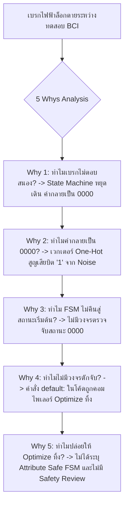

# Lesson 104: Finite State Machine (FSM) Optimization & Deadlock Prevention (有限状態機械の最適化とデッドロック防止)

---

## 1. ทฤษฎีวิศวกรรมเชิงลึก (高度なエンジニアリング理論)

### 1.1 การเปรียบเทียบสถาปัตยกรรม Moore vs Mealy Machine และปรากฏการณ์ Glitch
ในระบบดิจิทัลและการออกแบบฮาร์ดแวร์บน FPGA เครื่องจักรสถานะจำกัด (Finite State Machine: FSM) คือแกนกลางในการควบคุมลำดับขั้นตอนการทำงาน (Control Path) FSM พื้นฐานแบ่งออกเป็น 2 ประเภทตามแบบจำลองทางคณิตศาสตร์:

```
               Moore Machine vs Mealy Machine Architecture
  
  [ Moore Machine ]: Output ขึ้นกับ Current State เท่านั้น (Glitch-Free เมื่อนำสัญญาณออกจาก Register)
              +-------------------+      +-------------+
  Input ----->|                   |----->| Current     |--+--> Output = f(State)
              | Next State Logic  |      | State Regs  |  |
        +---->|  (Combinational)  |      +-------------+  |
        |     +-------------------+             |         |
        +---------------------------------------+---------+
  
  [ Mealy Machine ]: Output ขึ้นกับทั้ง Current State และ Input ปัจจุบัน (เสี่ยงต่อ Glitch สูงมาก)
              +-------------------+      +-------------+
        +---->| Next State Logic  |----->| Current Reg |----+
        |     +-------------------+      +-------------+    |
  Input --+                                                 +--> Output = f(State, Input)
          |   +---------------------------------------------+
          +-->| Output Logic (Combinational)
              +---------------------------------------------+
```

1. **Moore Machine:**
   $$\text{Output}(t) = \lambda(\text{State}(t))$$
   เอาต์พุตขึ้นอยู่กับสถานะปัจจุบันเท่านั้น เมื่อสถานะถูกบันทึกไว้ใน Flip-Flop เอาต์พุตจะเปลี่ยนค่าพร้อมขอบสัญญาณนาฬิกาอย่างเป็นระเบียบ ทำให้ปราศจากสัญญาณรบกวนชั่วขณะ (Glitch-Free) และตัดขาดการเชื่อมต่อลอจิกคอมบิเนชันข้ามโมดูล
2. **Mealy Machine:**
   $$\text{Output}(t) = \lambda(\text{State}(t), \text{Input}(t))$$
   เอาต์พุตขึ้นอยู่กับทั้งสถานะและอินพุตในขณะนั้น แม้ว่า Mealy จะสามารถตอบสนองต่ออินพุตได้ทันทีในไซเคิลเดียวกันและมักใช้จำนวนสถานะน้อยกว่า แต่มีจุดอ่อนร้ายแรง 2 ประการ:
   * **Glitch Propagation:** หากอินพุตมีสัญญาณรบกวนหรือขอบไม่คม สัญญาณเอาต์พุตจะเกิด Glitch ตามไปด้วยทันที
   * **Combinational Path Feedthrough:** เกิดเส้นทางลอจิกยาวต่อเนื่องทะลุข้ามโมดูล ($T_{input\_to\_output}$) ก่อให้เกิดปัญหา Setup Violation และเสี่ยงต่อการเกิด Combinational Feedback Loop

---

### 1.2 การเข้ารหัสสถานะ (State Encoding Techniques) และผลกระทบต่อฮาร์ดแวร์
การเลือกวิธีการเข้ารหัสบิตสถานะส่งผลต่อความเร็วสัญญาณนาฬิกาสูงสุด ($F_{max}$), ปริมาณการใช้ทรัพยากร (LUT/FF), และการกระจายความร้อนของชิป:

| วิธีการเข้ารหัส (Encoding) | จำนวน Flip-Flop สำหรับ $N$ สถานะ | ความซับซ้อนของ Next-State Logic | จุดเด่นทางวิศวกรรม | เหมาะสำหรับงานประเภทใด |
| :--- | :---: | :---: | :--- | :--- |
| **Binary (Sequential)** | $\lceil \log_2 N \rceil$ | สูง ($\text{Decoder } O(N)$) | ประหยัด Register สูงสุด | CPLD หรือชิปที่มีจำนวน Flip-Flop จำกัดมาก |
| **One-Hot Encoding** | $N$ | ต่ำมาก (เพียง 1-2 LUT inputs) | ความเร็ว $F_{max}$ สูงสุด, ถอดรหัสเร็ว | **FPGA ทั่วไป (มาตรฐานอุตสาหกรรม)** |
| **Gray Code** | $\lceil \log_2 N \rceil$ | ปานกลาง | สวิตช์ครั้งละ 1 บิตเสมอ, ลด $dI/dt$ Noise | ระบบประหยัดพลังงาน หรือสถานะที่เป็นวงรอบเรียงตามลำดับ |
| **Hamming-3 (SEC-DED)** | $\ge \lceil \log_2 N \rceil + 3$ | สูง | มี Hamming Distance $\ge 3$, ตรวจจับและแก้ SEU ได้ | **ยานยนต์ (ISO 26262), อวกาศ, การแพทย์** |

#### ทำไม One-Hot จึงเป็นตัวเลือกอันดับหนึ่งบนสถาปัตยกรรม FPGA?
ใน FPGA เซลล์ลอจิก (Logic Cell / CLB) ถูกออกแบบให้มีอัตราส่วน Flip-Flop ต่อ LUT เป็น 1:1 หรือ 2:1 (เช่น ชิป Xilinx มี 8 Flip-Flops และ 4 6-input LUTs ในหนึ่ง Slice) ทรัพยากร Flip-Flop จึงมีเหลือเฟือ
เมื่อใช้ One-Hot สถานะถัดไปของแต่ละบิตสามารถเขียนได้ด้วยสมการลอจิกอย่างง่าย:

$$\text{State}_{k\_next} = (\text{State}_a \cdot \text{cond}_1) + (\text{State}_b \cdot \text{cond}_2)$$

สมการนี้ใช้เพียง 1 ระดับของ LUT (Logic Depth = 1) ทำให้ Propagation Delay สั้นที่สุด สามารถทำความถี่ $F_{max}$ ได้เกิน $400\text{ MHz}$ บน FPGA ได้อย่างง่ายดาย

---

### 1.3 ปัญหา Single Event Upset (SEU) และ Safe State Machine
ในสภาวะการทำงานจริง โดยเฉพาะในอุตสาหกรรมยานยนต์และอากาศยาน ชิป FPGA อาจถูกรบกวนโดย:
* อนุภาคนิวตรอนจากรังสีคอสมิก (Atmospheric Neutrons)
* อนุภาคแอลฟาจากแพ็กเกจไอซี (Alpha Particles from Packaging)
* สัญญาณรบกวนแม่เหล็กไฟฟ้ากำลังสูง (EMI Transients)

ปรากฏการณ์เหล่านี้สามารถทำให้ประจุในตัวเก็บประจุภายใน Flip-Flop พลิกสถานะจาก $0 \to 1$ หรือ $1 \to 0$ ชั่วคราว ซึ่งเรียกว่า **Single Event Upset (SEU)**

```
                  อันตรายจากการตกค้างใน Illegal State ของ One-Hot FSM
   สถานะปกติ (8 สถานะ):
   STATE_A = 8'b0000_0001
   STATE_B = 8'b0000_0010
   ...
   
   เมื่อเกิด SEU บิตที่ 2 พลิกสถานะ:
   Current State กลายเป็น -> 8'b0000_0011 (มี '1' สองบิตพร้อมกัน! หรือกลายเป็น 8'b0000_0000)
```

#### กับดักการ Optimize ของคอมไพเลอร์ (The Optimization Trap)
วิศวกรมักเขียนคำสั่งป้องกันใน Verilog ดังนี้:

```verilog
always_comb begin
    case (current_state)
        STATE_A: next_state = ...;
        STATE_B: next_state = ...;
        default: next_state = STATE_IDLE; // เจตนาหวังให้กลับสู่ IDLE หากหลุดไปสถานะอื่น
    endcase
end
```

**สิ่งที่เกิดขึ้นจริงในการสังเคราะห์ (Synthesis Reality):**
เนื่องจากคอมไพเลอร์รู้ว่าระบบมีเพียง 8 สถานะ ลอจิก Synthesis จะมองว่าสถานะที่เหลือนอกเหนือจาก 8 สถานะนี้เป็น **"Unreachable States / Don't Care"** และจะ **"ตัดคำสั่ง `default:` ทิ้งไปโดยสิ้นเชิง"** เพื่อบีบลดขนาดวงจร!
เมื่อเกิด SEU ฮาร์ดแวร์จริงจะหลุดเข้าไปในสถานะ Undefined และค้างอยู่ในสถานะนั้นตลอดกาล กลายเป็น **FSM Deadlock**!

#### โซลูชันระดับมืออาชีพ: Safe State Machine Directives
ต้องสั่งการสังเคราะห์อย่างชัดเจนผ่าน Synthesis Attributes:

```verilog
// Professional Safe State Machine with Explicit Reset Recovery
(* fsm_encoding = "one_hot" *)
(* fsm_safe_state = "reset_state" *) // บังคับให้คอมไพเลอร์สร้างฮาร์ดแวร์ดักจับกลับสู่ IDLE เสมอ
module safe_motor_controller_fsm (
    input  logic clk,
    input  logic rst_n,
    input  logic fault_trigger,
    output logic motor_enable
);

    typedef enum logic [3:0] {
        ST_IDLE  = 4'b0001,
        ST_ARMED = 4'b0010,
        ST_RUN   = 4'b0100,
        ST_FAULT = 4'b1000
    } state_t;

    state_t current_state, next_state;

    // 1. State Register Process
    always_ff @(posedge clk or negedge rst_n) begin
        if (!rst_n) begin
            current_state <= ST_IDLE;
        end else begin
            current_state <= next_state;
        end
    end

    // 2. Next State Logic with Safe Trap
    always_comb begin
        next_state = ST_IDLE; // Default Assignment
        case (current_state)
            ST_IDLE: begin
                if (!fault_trigger) next_state = ST_ARMED;
                else                next_state = ST_FAULT;
            end
            ST_ARMED: begin
                if (fault_trigger)  next_state = ST_FAULT;
                else                next_state = ST_RUN;
            end
            ST_RUN: begin
                if (fault_trigger)  next_state = ST_FAULT;
                else                next_state = ST_RUN;
            end
            ST_FAULT: begin
                next_state = ST_FAULT;
            end
            default: begin
                // จะถูกคอมไพล์เป็นลอจิกจริงเนื่องจากมี attribute (* fsm_safe_state *)
                next_state = ST_IDLE;
            end
        endcase
    end

    // 3. Registered Output (Moore Style - Glitch Free)
    always_ff @(posedge clk or negedge rst_n) begin
        if (!rst_n) begin
            motor_enable <= 1'b0;
        end else begin
            motor_enable <= (next_state == ST_RUN);
        end
    end

endmodule
```

---

## 2. ทริคหน้างาน OJT แบบ Step-by-Step (現場の実践テクニック)

### 2.1 กรณีศึกษาความล้มเหลวหน้างาน (失敗事例: Shippai Jirei)
* **บริบท:** กล่องควบคุมระบบเบรกไฟฟ้า (Brake-by-Wire ECU) สำหรับรถยนต์ไฟฟ้า (EV) ใช้ชิป FPGA เกรดยานยนต์
* **อาการเสียหน้างาน:** ระหว่างการทดสอบทดสอบภูมิคุ้มกันสนามแม่เหล็กไฟฟ้าความเข้มสูง (Bulk Current Injection: BCI Test ที่ความแรง $200\text{ mA}$) ตามมาตรฐาน ISO 11452-4 มอเตอร์สร้างแรงดันเบรกหยุดการตอบสนองกะทันหัน วงจรไม่ส่งสัญญาณสั่งงาน และไม่ส่งรหัส Error ใดๆ กลับมายัง CAN Bus (ระบบตายสนิท)
* **การตรวจวิเคราะห์:** ตรวจสอบพบว่าสัญญาณนาฬิกา $CLK$ ยังคงทำงานปกติ แรงดันไฟเลี้ยงไม่ตก แต่ตัวตรวจจับสถานะภายใน (Status Register) รายงานค่า Vector เป็น `0x0000` (All Zeros) ซึ่งไม่มีอยู่ในรายชื่อ State ปกติ

```
             กระบวนการเกิด Deadlock จากสัญญาณรบกวน EMI (Shippai Analysis)
   +--------------------------------------------------------------------------+
   | สภาวะทดสอบ: การฉีดกระแสสัญญาณรบกวน BCI Test 200mA ที่สายไฟสัญญาณ           |
   +--------------------------------------------------------------------------+
                                       |
                                       v
   +--------------------------------------------------------------------------+
   | ผลกระทบทางกายภาพ: Noise เหนี่ยวนำเข้าขา Reset ชั่วครู่แบบเศษส่วนของนาโนวินาที |
   | สัญญาณรบกวนแคบมากจนทำให้ Flip-Flop บิตที่ 0 โดนรีเซ็ต แต่บิตอื่นไม่โดนรีเซ็ต |
   | หรือเกิด Metastability จน One-Hot เวกเตอร์หลุดกลายเป็น '0000' (All Zeros) |
   +--------------------------------------------------------------------------+
                                       |
                                       v
   +--------------------------------------------------------------------------+
   | จุดตายของซอฟต์แวร์: วิศวกรไม่ได้ใส่ Attribute Safe State Machine          |
   | คอมไพเลอร์มองว่า '0000' ไม่มีทางเกิดขึ้น จึงตัดวงจร Recovery ออกไป         |
   | ลอจิก Next State ส่งผลให้ค่าถัดไปของ '0000' เป็น '0000' วนลูปไม่สิ้นสุด  |
   +--------------------------------------------------------------------------+
```

---

### 2.2 การวิเคราะห์หาสาเหตุรากเหง้า (Root Cause Analysis: 5 Whys & Ishikawa)



#### Ishikawa Diagram (ผังก้างปลา)
* **Design/RTL:** ใช้ One-Hot Encoding โดยพึ่งพาเพียงคำสั่ง `default:` เปล่าๆ ปราศจาก Synthesis Directives
* **Environment/EMI:** สัญญาณรบกวน Transient ความถี่สูงเหนี่ยวนำข้ามสายไฟ ทำให้เกิด Race Condition บนลอจิกสเตต
* **Tool Configuration:** เปิดออปชัน Optimization สูงสุด (`-O3 / Area Optimize`) ทำให้เครื่องมือตัดวงจรดักจับที่เข้าใจว่าเป็น Redundant Logic ทิ้ง
* **Safety Standard (ISO 26262):** การออกแบบระดับ ASIL-D บังคับให้ต้องมีกลไก Safe State Transition ในระดับฮาร์ดแวร์ แต่ทีมงานละเลย

---

### 2.3 มาตรการป้องกันและแก้ไข (Actionable SOP Rules)
1. **เปิดใช้งาน Safe FSM เสมอสำหรับระบบ Mission-Critical:**
   * ใน Vivado/Xilinx: ใช้ `(* fsm_safe_state = "reset_state" *)` หรือเลือก Synthesis Setting `-fsm_extraction safe_impl`
   * ใน Intel Quartus: ใช้ `(* syn_encoding = "safe" *)`
2. **ใช้ Registered Output Style (Three-Process FSM):** ห้ามนำลอจิก Combinational ของ Mealy ไปต่อเข้า Output ภายนอกชิปหรือส่งข้ามโมดูลเด็ดขาด ต้องให้ผ่าน Flip-Flop เสมอเพื่อตัด Glitch
3. **ตรวจสอบ Synthesis Log ทุกครั้ง:** ค้นหาคำเตือน *"FSM extraction"* เพื่อยืนยันว่าไม่มีคำสั่งดักจับสถานะถูกลบทิ้ง

---

### 2.4 ตารางตรวจสอบหน้างาน SOP สำหรับการออกแบบ FSM (FSM SOP Checklist)

| ลำดับ | จุดตรวจสอบทางวิศวกรรม | เกณฑ์การยอมรับ (Acceptance Criteria) | เครื่องมือตรวจสอบ | ผลการตรวจ |
| :---: | :--- | :--- | :--- | :---: |
| 1 | การป้องกัน Deadlock | ต้องมี Attribute `safe_state` หรือวงจร Auto-Recovery ชัดเจน | RTL Code / Synthesis Log | ผ่าน / ไม่ผ่าน |
| 2 | รูปแบบของสัญญาณ Output | สัญญาณควบคุมหลักทั้งหมดต้องเป็น Registered Output (ไม่มี Glitch) | RTL Lint / Schematics Viewer | ผ่าน / ไม่ผ่าน |
| 3 | การป้องกันการสร้าง Latch | ตัวแปรทั้งหมดใน `always_comb` ต้องมี Default Assignment ครบทุกเส้นทาง | Synthesis Warnings (No Latches) | ผ่าน / ไม่ผ่าน |
| 4 | ความเหมาะสมของการเข้ารหัส | ใช้ One-Hot สำหรับความเร็วสูง และใช้ Gray/Hamming สำหรับพื้นที่เสี่ยง Noise | Design Justification Document | ผ่าน / ไม่ผ่าน |
| 5 | การจำลองสภาวะผิดปกติ | รัน Fault Injection Testbench สุ่มบังคับสถานะผิดปกติ แล้วระบบต้องฟื้นตัวได้ใน 1 ไซเคิล | UVM Fault Simulation Report | ผ่าน / ไม่ผ่าน |

---

## 3. คำศัพท์และประโยคภาษาญี่ปุ่นสำหรับตรวจแบบ (検図 - Kenzu)

### 3.1 ตารางคำศัพท์เทคนิคเฉพาะทาง (専門用語一覧)

| คำศัพท์คันจิ/คาตาคานะ | การอ่าน (Romaji) | คำแปลภาษาไทย / ภาษาอังกฤษ |
| :--- | :--- | :--- |
| **有限状態機械** | Yūgen jōtai kikai | เครื่องจักรสถานะจำกัด (Finite State Machine: FSM) |
| **状態遷移図** | Jōtai sen'izu | แผนภาพการเปลี่ยนสถานะ (State Transition Diagram) |
| **ワンホット符号化** | Wanホット fugōka | การเข้ารหัสแบบวันฮ็อต (One-Hot Encoding) |
| **未定義状態** | Miteigi jōtai | สถานะที่ไม่ได้นิยาม / สถานะผิดปกติ (Undefined / Illegal State) |
| **ハングアップ回避** | Hanguappu kaihi | การป้องกันอาการค้างล็อกตาย (Deadlock / Lockup Avoidance) |
| **安全ステートマシン** | Anzen sutēto mashin | สเตตแมชชีนแบบปลอดภัย (Safe State Machine) |
| **グリッチフリー** | Guricchifurī | ปราศจากสัญญาณรบกวนชั่วขณะ (Glitch-Free) |
| **単一事象反転** | Tan'itsu jishō hanten | การพลิกสถานะจากอนุภาคพลังงานสูง (Single Event Upset: SEU) |
| **ハミング距離** | Hamingu kyori | ระยะห่างแฮมมิง (Hamming Distance) |
| **ラッチ生成警告** | Racchi seisei keikoku | คำเตือนการเกิดแลตช์โดยไม่ตั้งใจ (Unintentional Latch Inference) |

---

### 3.2 บทสนทนาการตรวจแบบหน้างานจริง (検図での指摘事項)

#### การตรวจแบบจุดที่ 1: การเตือนความเสี่ยงของคำสั่ง Default ที่ถูก Optimize ทิ้ง
* **審査役 (Lead Chief Engineer):**
  「このシーケンス制御FSMですが、ワンホットで8状態を定義しているものの、`default` 文にリカバリー処理を書いただけになっていますね。合成ツールのデフォルト設定では、未定義状態への遷移ロジックは『ドントケア（Don't Care）』として論理削減（最適化）され、削除されてしまいます。放射線やノイズで未定義状態に飛んだ場合、デッドロックしますよ。`fsm_safe_state` 属性を付与してください。」
  *(ใน FSM ควบคุมลำดับงานตัวนี้ คุณนิยามไว้ 8 สถานะแบบ One-Hot แต่กลับเขียนคำสั่งกู้คืนไว้แค่ใน `default` เท่านั้นนะครับ ค่าดีฟอลต์ของเครื่องมือ Synthesis จะมองว่าลอจิกการเปลี่ยนสถานะไปยังสถานะที่ไม่ได้นิยามเป็น Don't Care และจะ Optimize ลบทิ้งไป หากถูกรังสีหรือสัญญาณรบกวนทำให้กระโดดไปสถานะผิดปกติ ระบบจะ Deadlock ทันที ช่วยใส่ Attribute `fsm_safe_state` ด้วยครับ)*
* **設計担当 (FPGA Design Engineer):**
  「ご指摘誠にありがとうございます。コンパイラによる論理削除の挙動を十分に把握できておりませんでした。直ちに属性 `(* fsm_safe_state = "reset_state" *)` を追加し、合成ログで安全回路が確実に生成されていることを確認いたします。」
  *(กราบขอบพระคุณสำหรับคำแนะนำครับ ผมยังตระหนักถึงพฤติกรรมการ Optimize ของคอมไพเลอร์ไม่ดีพอครับ ผมจะรีบเพิ่ม Attribute `(* fsm_safe_state = "reset_state" *)` ในทันที และจะตรวจสอบใน Synthesis Log เพื่อยืนยันว่าวงจรความปลอดภัยถูกสร้างขึ้นอย่างแน่นอนครับ)*

#### การตรวจแบบจุดที่ 2: ปัญหา Mealy Output สร้าง Glitch ให้กับชิปภายนอก
* **審査役 (Lead Chief Engineer):**
  「この外部パワーMOSFETのゲートドライバへの制御信号 `drv_en` ですが、ミーリ型（Mealy）の組み合わせ回路から直接出力されています。入力信号のチャタリングや内部LUTの遅延差によってナノ秒オーダーのヒゲ状ノイズ（グリッチ）が出力され、パワー素子が誤点接する危険があります。必ず出力レジスタ段（ムーア型出力）を設けてください。」
  *(สัญญาณควบคุม `drv_en` ที่ต่อตรงไปยัง Gate Driver ของ Power MOSFET ภายนอกเส้นนี้ ถูกปล่อยออกมาจากลอจิก Combinational แบบ Mealy ตรงๆ นะครับ การกระเพื่อมของอินพุตหรือความต่างของดีเลย์ใน LUT จะสร้างพัลส์หนามแหลม (Glitch) ขนาดนาโนวินาทีออกมา ทำให้ Power Transistor เปิดทำงานโดยไม่ตั้งใจได้ ถือเป็นอันตรายอย่างยิ่ง ต้องทำเป็น Output Register (สไตล์ Moore) เสมอครับ)*
* **設計担当 (FPGA Design Engineer):**
  「承知いたしました。安全規格に適合させるため、出力段を3プロセス構造のレジスタ同期出力（ムーア型）に改め、グリッチが物理的に発生しない回路へ修正いたします。」
  *(รับทราบครับ เพื่อให้เป็นไปตามมาตรฐานความปลอดภัย ผมจะแก้ไขเอาต์พุตให้เป็นแบบ 3-Process Registered Output ที่ซิงโครไนซ์ด้วยสัญญาณนาฬิกา (สไตล์ Moore) ซึ่งจะกำจัด Glitch ทางกายภาพได้อย่างสมบูรณ์ครับ)*

---

## 4. ควิซวิเคราะห์ปัญหาระดับวิศวกรอาวุโส (上級技術クイズ)

### ข้อที่ 1: การเปรียบเทียบระดับความลึกของลอจิก (Logic Depth) ระหว่าง One-Hot และ Binary FSM
พิจารณาสเตตแมชชีนที่มีจำนวนสถานะทั้งหมด $N = 16\text{ สถานะ}$ โดยในแต่ละสถานะมีเงื่อนไขการเปลี่ยนสถานะไปยังสถานะอื่นได้สูงสุด 2 ทางเลือก (2-way branching) โดยพิจารณาจากอินพุตควบคุม 4 บิต

บนสถาปัตยกรรม FPGA ที่ใช้ Look-Up Table แบบ 6 อินพุต (6-input LUT หรือ LUT6):
* ในการเข้ารหัสแบบ **One-Hot Encoding** สถานะถัดไปของแต่ละบิตขึ้นอยู่กับสถานะปัจจุบัน 2 บิต และอินพุตควบคุม
* ในการเข้ารหัสแบบ **Binary Encoding** มีจำนวนบิตสถานะเท่ากับ $\lceil \log_2 16 \rceil = 4\text{ บิต}$ ทำให้สมการของ Next-State แต่ละบิตขึ้นอยู่กับบิตสถานะปัจจุบันทั้ง 4 บิต รวมกับอินพุตควบคุมอีก 4 บิต (รวมเป็น 8 ตัวแปรอินพุต)

จงวิเคราะห์จำนวนระดับของ LUT (Logic Depth) และผลกระทบต่อความล่าช้า (Propagation Delay) ของทั้งสองรูปแบบ:

a) ทั้ง One-Hot และ Binary ใช้ 1 LUT Level เท่ากัน ไม่มีความแตกต่างด้านความเร็ว  
b) One-Hot ใช้ 1 LUT Level ในขณะที่ Binary ต้องใช้ลอจิกซ้อนกันอย่างน้อย 2 LUT Levels ส่งผลให้ Binary มีความล่าช้าของเกตสูงกว่าประมาณ 2 เท่า  
c) Binary เร็วกว่า One-Hot เสมอ เพราะมีจำนวน Flip-Flop น้อยกว่า ทำให้ Clock Skew ต่ำกว่า  
d) One-Hot ต้องใช้ LUT มากกว่า 4 ระดับเพื่อถอดรหัสบิตสถานะทั้ง 16 บิต  

---

#### เฉลยและบทวิเคราะห์เชิงลึกข้อที่ 1
**คำตอบที่ถูกต้องคือ: b) One-Hot ใช้ 1 LUT Level ในขณะที่ Binary ต้องใช้ลอจิกซ้อนกันอย่างน้อย 2 LUT Levels ส่งผลให้ Binary มีความล่าช้าของเกตสูงกว่าประมาณ 2 เท่า**

**ขั้นตอนการวิเคราะห์ทางทฤษฎีฮาร์ดแวร์:**
1. **กรณี One-Hot Encoding:**
   * สถานะถัดไป $S_{k\_next}$ เกิดจากผลรวมของพจน์การเปลี่ยนผ่าน เช่น:
     $$S_{k\_next} = (S_i \cdot \text{cond}_1) + (S_j \cdot \text{cond}_2)$$
   * สัญญาณอินพุตที่เกี่ยวข้องมีเพียง: บิตสถานะ $S_i$, บิตสถานะ $S_j$ และเงื่อนไขตรรกะ รวมแล้วไม่เกิน 4-5 สัญญาณ
   * เซลล์ตรรกะ LUT6 หนึ่งตัวสามารถรับอินพุตได้ถึง 6 สัญญาณอิสระ จึงสามารถบรรจุฟังก์ชันทั้งหมดลงใน **LUT6 เพียง 1 ตัว (Logic Depth = 1)** ได้ทันที
   * ความล่าช้าจึงเท่ากับค่าพื้นฐานของ $t_{LUT} \approx 0.05 - 0.12\text{ ns}$ (บนเทคโนโลยี UltraScale+)
2. **กรณี Binary Encoding:**
   * สถานะถูกเข้ารหัสด้วย 4 บิต ($Q[3:0]$)
   * สมการของบิตสถานะถัดไป $D_m$ เป็นฟังก์ชันของตัวแปร $Q[3:0]$ และอินพุตภายนอก $IN[3:0]$:
     $$D_m = f(Q_3, Q_2, Q_1, Q_0, IN_3, IN_2, IN_1, IN_0)$$
   * มีตัวแปรบูลีนทั้งหมด $4 + 4 = 8\text{ ตัวแปร}$ ซึ่งเกินขีดความสามารถของ LUT6 เดี่ยว
   * เครื่องมือ Synthesis จำเป็นต้องแยกฟังก์ชันออกเป็น 2 ชั้น (Cascade LUTs หรือใช้ MUXF7/MUXF8) ส่งผลให้ **Logic Depth เพิ่มเป็น 2 ระดับ**
   * ความล่าช้าจะประกอบด้วย $t_{LUT1} + t_{net\_inter\_lut} + t_{LUT2}$ ซึ่งยาวกว่า One-Hot ประมาณ 2 ถึง 2.5 เท่า ส่งผลให้ค่า $F_{max}$ ลดลงอย่างมีนัยสำคัญ

---

### ข้อที่ 2: ทฤษฎีรหัสแก้ไขข้อผิดพลาด (Hamming Distance & SEC-DED) ใน FSM เกรดยานยนต์
ตามมาตรฐานความปลอดภัยการทำงานในยานยนต์ (ISO 26262 ASIL-D) วงจรควบคุมความปลอดภัยสูงต้องทนทานต่อปรากฏการณ์ Single Event Upset (SEU) ได้

ทฤษฎีการเข้ารหัสระบุว่า:
* เพื่อให้สามารถ **ตรวจจับข้อผิดพลาด (Error Detection)** ได้ $d$ บิต รหัสต้องมีระยะห่างแฮมมิงต่ำสุด $d_{min} \ge d + 1$
* เพื่อให้สามารถ **แก้ไขข้อผิดพลาดกลับคืนสู่สถานะที่ถูกต้องได้โดยอัตโนมัติ (Single Error Correction: SEC)** ได้ $t$ บิต รหัสต้องมีระยะห่างแฮมมิงต่ำสุดเป็นไปตามสมการใด?

a) $d_{min} \ge t + 1$  
b) $d_{min} \ge 2t + 1$ (หากต้องการแก้ 1 บิต ต้องมี $d_{min} \ge 3$)  
c) $d_{min} \ge 2^t$  
d) $d_{min} \ge t^2 + 1$  

---

#### เฉลยและบทวิเคราะห์เชิงลึกข้อที่ 2
**คำตอบที่ถูกต้องคือ: b) $d_{min} \ge 2t + 1$ (หากต้องการแก้ 1 บิต ต้องมี $d_{min} \ge 3$)**

**บทวิเคราะห์เชิงลึกระดับ Lead Architect:**
* **นิยามของ Hamming Distance ($d_{min}$):** คือจำนวนบิตที่แตกต่างกันน้อยที่สุดระหว่างคู่คำรหัส (Valid Code Words) สองคำใดๆ ในระบบ
* หากต้องการแก้ไขข้อผิดพลาดจำนวน $t$ บิต (เช่น เมื่อรังสีชน Flip-Flop ทำให้บิตพลิกไป $t = 1$ บิต):
  * คำรหัสที่ผิดเพี้ยนไปจะอยู่ห่างจากคำรหัสเดิมที่ถูกต้องเป็นระยะ $t$ บิต
  * เพื่อให้วงจรตัดสินใจได้โดยไม่คลุมเครือว่าสถานะที่ผิดเพี้ยนนี้มาจากคำรหัสเดิมคำใด คำรหัสเดิมนั้นจะต้องเป็นคำรหัสที่ "ใกล้ที่สุดเพียงหนึ่งเดียว" (Unique Nearest Neighbor)
  * ดังนั้น คำรหัสที่ถูกต้องคำอื่นๆ จะต้องอยู่ห่างออกไปมากกว่า $2t$ บิต เพื่อไม่ให้ทรงกลมรัศมี $t$ ของคำรหัสสองคำเกิดการทับซ้อนกัน:
    $$d_{min} \ge 2t + 1$$
* สำหรับการแก้ไขข้อผิดพลาด 1 บิต ($t = 1$):
  $$d_{min} \ge 2(1) + 1 = 3$$
* จึงเป็นที่มาของการใช้ **Hamming-3 Code** (หรือ Hamming Distance $\ge 3$) ในสถาปัตยกรรม Safe FSM หากมีบิตพลิกไป 1 บิต วงจรจะคำนวณ Syndromes และดึงสถานะกลับคืนสู่สถานะเดิมได้ในไซเคิลถัดไปโดยที่ระบบไม่หยุดชะงัก (Fault Tolerant)

---

### ข้อที่ 3: ความแตกต่างเชิงพฤติกรรมระหว่าง 2-Process FSM และ 3-Process FSM
ในมาตรฐานการเขียน RTL ระดับมืออาชีพ เหตุใดองค์กรด้านความปลอดภัย (เช่น DO-254 สำหรับการบิน หรือ ISO 26262 สำหรับยานยนต์) จึงกำหนดให้ใช้โครงสร้าง **3-Process FSM (Registered Output Style)** แทนการใช้ 2-Process FSM ดั้งเดิม?

a) เพื่อลดจำนวนบรรทัดของโค้ด Verilog ให้น้อยที่สุด  
b) เพราะ 3-Process FSM บังคับให้สัญญาณ Output ทั้งหมดถูกสร้างผ่าน Flip-Flop โดยตรง ช่วยขจัด Glitch จาก Combinational Logic ได้อย่างสมบูรณ์ และทำให้เวลา Clock-to-Out ($T_{co}$) มีค่าคงที่แน่นอน ช่วยให้การวิเคราะห์ STA ที่ระดับบอร์ดทำได้อย่างแม่นยำ  
c) เพราะโปรแกรมจำลอง ModelSim ไม่รองรับการเขียนแบบ 2-Process  
d) เพื่อให้สเตตแมชชีนสามารถทำงานได้โดยไม่ต้องใช้สัญญาณรีเซ็ต  

---

#### เฉลยและบทวิเคราะห์เชิงลึกข้อที่ 3
**คำตอบที่ถูกต้องคือ: b) เพราะ 3-Process FSM บังคับให้สัญญาณ Output ทั้งหมดถูกสร้างผ่าน Flip-Flop โดยตรง ช่วยขจัด Glitch จาก Combinational Logic ได้อย่างสมบูรณ์ และทำให้เวลา Clock-to-Out ($T_{co}$) มีค่าคงที่แน่นอน ช่วยให้การวิเคราะห์ STA ที่ระดับบอร์ดทำได้อย่างแม่นยำ**

**บทวิเคราะห์เชิงลึกระดับสถาปัตยกรรม:**
* ในโครงสร้าง **2-Process FSM**:
  * Process ที่ 1: เป็น Sequential ทำหน้าที่จำลอง State Register (`always_ff @(posedge clk)`)
  * Process ที่ 2: เป็น Combinational รวม Next-State Logic และ Output Logic เข้าด้วยกัน (`always_comb`)
  * **จุดอ่อน:** สัญญาณเอาต์พุตที่ออกมาจาก Process 2 เป็นสัญญาณที่ผ่านลอจิกเกต เมื่ออินพุตหรือสเตตเปลี่ยน จะเกิดความไม่เท่ากันของ Propagation Delay ทำให้เกิด **Glitch/Hazard** ในระดับเศษส่วนของนาโนวินาที หากสัญญาณนี้ไปควบคุมขารีเซ็ตหรือทริกเกอร์ภายนอก อาจทำให้เกิดข้อผิดพลาดร้ายแรง
* ในโครงสร้าง **3-Process FSM**:
  * Process ที่ 1: State Register (`always_ff`)
  * Process ที่ 2: Next-State Combinational Logic (`always_comb`)
  * Process ที่ 3: **Registered Output Logic (`always_ff @(posedge clk)`)**
  * **ข้อได้เปรียบระดับวิศวกรรมชั้นสูง:** เอาต์พุตถูกปล่อยออกมาจากเอาต์พุต Q ของ Flip-Flop โดยตรง ส่งผลให้:
    1. **Glitch-Free 100%:** ไม่มีสัญญาณรบกวนหนามแหลมเล็ดลอดออกมา
    2. **Deterministic $T_{co}$:** เวลาหน่วงของเอาต์พุตหลังขอบสัญญาณนาฬิกาขึ้นอยู่กับคุณสมบัติของ Flip-Flop เท่านั้น ไม่ขึ้นกับความซับซ้อนของลอจิกภายใน ทำให้การทำ Timing Budget ที่ระดับอินเทอร์เฟซของบอร์ดมีความแม่นยำและเสถียรภาพสูงสุด
