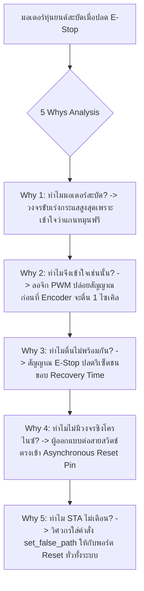

# Lesson 106: Advanced Clock Domain Crossing (CDC) & Reset Domain Crossing (RDC) (高度なクロックドメイン交差とリセット同期化設計)

---

## 1. ทฤษฎีวิศวกรรมเชิงลึก (高度なエンジニアリング理論)

### 1.1 ความแตกต่างระหว่าง CDC และ Reset Domain Crossing (RDC)
ในระบบดิจิทัลขนาดใหญ่ ความผิดพลาดที่ตรวจจับได้ยากที่สุดและมักถูกมองข้ามไม่ได้เกิดจากการส่งข้อมูลตามปกติเท่านั้น แต่เกิดจากสัญญาณ **รีเซ็ต (Reset)** เมื่อสัญญาณรีเซ็ตถูกสั่งทำงานหรือปลดการทำงานข้ามหลายโดเมนของสัญญาณนาฬิกา ปรากฏการณ์นี้เรียกว่า **Reset Domain Crossing (RDC - リセットドメイン交差)**

สัญญาณรีเซ็ตในระบบแบ่งออกเป็น 2 ประเภทหลัก:
1. **Synchronous Reset:** ขารีเซ็ตต่อเข้ากับลอจิกอินพุต $D$ ของ Flip-Flop และจะทำงานก็ต่อเมื่อมีขอบสัญญาณนาฬิกามาถึง
   * *ข้อดี:* เป็นวงจร Synchronous $100\%$ การทำ Static Timing Analysis (STA) เป็นไปตามกลไก Setup/Hold ปกติ
   * *ข้อเสีย:* หากไม่มี Clock (เช่น Clock Oscillator ยังไม่สตาร์ต หรืออยู่ใน Sleep Mode) วงจรจะไม่สามารถรีเซ็ตได้
2. **Asynchronous Reset:** ขารีเซ็ตต่อเข้ากับขาเคลียร์พิเศษระดับซิลิคอน (Direct Clear/Preset Pin: $CLR$) ของ Flip-Flop
   * *ข้อดี:* รีเซ็ตระบบได้ทันทีแม้ไม่มี Clock ปลอดภัยอย่างยิ่งในการป้องกัน Inrush Current ตอนเริ่มจ่ายไฟ
   * *ข้อเสียร้ายแรง:* ในจังหวะที่ "ปลดรีเซ็ต" (De-assertion / Reset Release) หากขอบของรีเซ็ตตกลงมาใกล้กับขอบสัญญาณนาฬิกา จะทำให้ Flip-Flop เกิดสภาวะ **Metastability**

```
              Asynchronous Reset Timing Window (Recovery & Removal)
                      _   _   _   _   _   _   _   _   _   _
      CLK           _| |_| |_| |_| |_| |_| |_| |_| |_| |_| |_
                                 ^ Active Clock Edge
                               +---+---+
      Critical Window          |rec|rem|  (Forbidden Zone)
                               +---+---+
                                   |
      RST_N (Illegal)  ~~~~~~~~~~\___________ (Falls inside window -> METASTABILITY!)
                                   |
      RST_N (Safe)     ~~~~~~\_______________ (Falls before Recovery Window)
```

---

### 1.2 ฟิสิกส์ของ Recovery Time ($t_{rec}$) และ Removal Time ($t_{rem}$)
ในระดับเกตซิลิคอน ขารีเซ็ตอซิงโครนัสมีหน้าต่างเวลาวิกฤตคล้ายกับ Setup และ Hold Time:

* **Recovery Time ($t_{rec}$ - リカバリ時間):** ช่วงเวลาขั้นต่ำสุดที่สัญญาณรีเซ็ตต้อง **"ปลดการทำงานล่วงหน้า"** (De-asserted) ก่อนที่ขอบสัญญาณนาฬิกาถัดไปจะมาถึง เพื่อให้ทรานซิสเตอร์ภายใน Flip-Flop มีเวลาฟื้นตัวกลับสู่สภาวะพร้อมรับสัญญาณข้อมูล $D$ (เทียบเท่า Setup Time ของรีเซ็ต)
* **Removal Time ($t_{rem}$ - リムーバル時間):** ช่วงเวลาขั้นต่ำสุดที่สัญญาณรีเซ็ตต้อง **"คงสถานะทำงานต่อเนื่อง"** (Asserted) หลังจากที่ขอบสัญญาณนาฬิกาผ่านไปแล้ว เพื่อป้องกันไม่ให้ Flip-Flop ตีความว่าเป็นสถานะไม่รีเซ็ตในไซเคิลนั้น (เทียบเท่า Hold Time ของรีเซ็ต)

สมการ Slack สำหรับการวิเคราะห์รีเซ็ตใน STA:

$$\text{Recovery Slack} = T_{clk\_period} - (T_{clk\_skew} + t_{co\_rst} + t_{net\_rst} + t_{rec}) - T_{uncertainty}$$

$$\text{Removal Slack} = (t_{co\_rst\_min} + t_{net\_rst\_min}) - T_{clk\_skew} - t_{rem} - T_{uncertainty}$$

#### หายนะของการเกิด Reset Skew ในระบบขนาดใหญ่
หากโครงข่ายกระจายสัญญาณรีเซ็ต (Reset Distribution Tree) มีความล่าช้าในการเดินสายไม่เท่ากัน (Reset Skew):
* Flip-Flop ชุดที่ 1 (ใกล้ตัวขับ) อาจมองเห็นการปลดรีเซ็ตก่อนขอบ Clock ที่ไซเคิล $N$
* Flip-Flop ชุดที่ 2 (ไกลตัวขับ) มองเห็นการปลดรีเซ็ตหลังขอบ Clock ทำให้หลุดจากรีเซ็ตที่ไซเคิล $N+1$
* **ผลลัพธ์:** วงจรส่วนหนึ่งเริ่มทำงานในไซเคิล $N$ แต่อีกส่วนหนึ่งยังค้างอยู่ในรีเซ็ต ทำให้ระบบควบคุม (เช่น FSM หรือ Bus Arbiter) แตกกระจายออกจากกัน นำไปสู่สภาวะ Deadlock ถาวรตั้งแต่เริ่มเปิดเครื่อง!

---

### 1.3 สถาปัตยกรรม Asynchronous Assert, Synchronous De-assert (AASD)
เพื่อขจัดปัญหานี้ มาตรฐานการออกแบบดิจิทัลเกรดยานยนต์และอวกาศกำหนดให้ใช้เทคนิค **AASD (Asynchronous Assert, Synchronous De-assert Reset Synchronizer - 非同期アサート・同期デ・アサート)**:

```
        Asynchronous Assert, Synchronous De-assert (AASD) Circuit
                          VCC (1'b1)
                             |
                   +---------+---------+
                   | D               D |
  Async_RST_N -----+--CLR         +--CLR
                   |        Q     |    Q --+--> Synchronized_RST_N
                   |      +-------+        |    (Glitch-Free De-assert)
                   |      |                |
             CLK --+--CLK +----------CLK   +-- (Connect to local domain FFs)
```

#### หลักการทำงาน:
1. **เมื่อกดรีเซ็ต (Assert: `Async_RST_N = 0`):**
   ขารีเซ็ตต่อตรงเข้าขา $CLR$ ของ Flip-Flop ทั้งสองตัว ทำให้เอาต์พุต `Synchronized_RST_N` ถูกดึงลงเป็น '0' ทันทีในระดับเศษส่วนของนาโนวินาที โดยไม่ต้องรอสัญญาณนาฬิกา (Pure Asynchronous Assert)
2. **เมื่อปล่อยรีเซ็ต (De-assert: `Async_RST_N = 1`):**
   ขั้ว $CLR$ ถูกปลด แต่ข้อมูลลอจิก '1' ที่ขา $D$ จะถูกส่งผ่าน Flip-Flop ตัวแรกและตัวที่สองตามจังหวะขอบขาขึ้นของ $CLK$ ทำให้ขอบการปลดรีเซ็ตถูกซิงโครไนซ์เข้ากับโดเมนสัญญาณนาฬิกาอย่างสมบูรณ์ ขจัดปัญหา Recovery/Removal Time Violation และกำจัด Reset Skew ทั่วทั้งโดเมน

```verilog
// Professional AASD Reset Bridge Module with Asynchronous Attributes
(* dont_touch = "yes" *)
module rst_bridge_aasd #(
    parameter int SYNC_STAGES = 3 // 3 Stages for High Reliability
)(
    input  logic clk,
    input  logic async_rst_n,
    output logic sync_rst_n
);

    (* ASYNC_REG = "TRUE" *) logic [SYNC_STAGES-1:0] sync_reg;

    always_ff @(posedge clk or negedge async_rst_n) begin
        if (!async_rst_n) begin
            sync_reg <= '0; // Assert asynchronous immediately
        end else begin
            // Shift '1' through stages (Synchronous De-assert)
            sync_reg <= {sync_reg[SYNC_STAGES-2:0], 1'b1};
        end
    end

    assign sync_rst_n = sync_reg[SYNC_STAGES-1];

endmodule
```

---

## 2. ทริคหน้างาน OJT แบบ Step-by-Step (現場の実践テクニック)

### 2.1 กรณีศึกษาความล้มเหลวหน้างาน (失敗事例: Shippai Jirei)
* **บริบท:** กล่องควบคุมเซอร์โวมอเตอร์ 6 แกนสำหรับหุ่นยนต์อุตสาหกรรมความเร็วสูง (Robotic Arm Controller) ใช้ชิป Intel Cyclone V SoC FPGA
* **อาการเสียหน้างาน:** บอร์ดผ่านการทดสอบทำงานต่อเนื่องได้ดี แต่เมื่อมีการกดปุ่มหยุดฉุกเฉิน (Emergency Stop: E-Stop) แล้วหมุนปลดล็อกสวิตช์เพื่อเริ่มทำงานใหม่ พบว่าระบบมีโอกาสสุ่มประมาณ $1$ ใน $500$ ครั้ง ที่แกนที่ 3 จะหมุนสะบัดกระชากอย่างรุนแรง (Motor Jolt) เกิด Error รหัส *"Joint Position Tracking Failure"* และบอร์ดตัดเข้าสู่ Safe State ทันที
* **การตรวจวิเคราะห์:** ทีมงานต่อสัญญาณบัสภายในออกไปยังพอร์ต Logic Analyzer พบว่าตัวสร้างสัญญาณก้าว (PWM Step Generator) และตัวตรวจจับตำแหน่งเอนโค้เดอร์ (Quadrature Decoder) เริ่มนับข้อมูลเหลื่อมกัน 1 ไซเคิลสัญญาณนาฬิกา

```
             กระบวนการวิเคราะห์หาสาเหตุ E-Stop Re-arm Jolt (Shippai Analysis)
   +--------------------------------------------------------------------------+
   | อาการ: ปลดสวิตช์ E-Stop แล้วหุ่นยนต์สะบัดสุ่ม 1 ใน 500 ครั้ง             |
   +--------------------------------------------------------------------------+
                                       |
                                       v
   +--------------------------------------------------------------------------+
   | ตรวจสอบ RTL: พบว่าสัญญาณ E-Stop ต่อเข้าขา Reset อซิงโครนัสของชิปตรงๆ      |
   | โดยกระจายไปยังโมดูล PWM (100MHz) และ Encoder (100MHz) โดยไม่มี AASD Bridge |
   +--------------------------------------------------------------------------+
                                       |
                                       v
   +--------------------------------------------------------------------------+
   | วิเคราะห์ฟิสิกส์: เมื่อคนหมุนปลด E-Stop สวิตช์คลายหน้าสัมผัส ณ เวลาสุ่ม  |
   | ขอบสัญญาณปลดรีเซ็ตไปตกกระทบในช่วง Recovery Window ของ PWM Generator     |
   | โมดูล PWM เริ่มสร้างพัลส์ที่ไซเคิล N แต่โมดูล Encoder หลุดรีเซ็ตที่ N+1  |
   | ตัวควบคุมมองว่ามอเตอร์หมุนไปแล้วแต่ไม่มีฟีดแบ็ก จึงเร่งกระแสสูงสุดเกิด Jolt |
   +--------------------------------------------------------------------------+
```

---

### 2.2 การวิเคราะห์หาสาเหตุรากเหง้า (Root Cause Analysis: 5 Whys & Ishikawa)



#### Ishikawa Diagram (ผังก้างปลา)
* **Hardware/RTL:** ขาดวงจร AASD Reset Bridge ประจำแต่ละโดเมนสัญญาณนาฬิกา
* **Timing Constraints:** ใส่คำสั่ง `set_false_path -from [get_ports rst_n]` ครอบจักรวาล ทำให้ STA ข้ามการตรวจ Recovery/Removal Checks
* **Physical Layout:** เครือข่าย Reset กระจายผ่าน General Routing Interconnect มี Routing Skew สูงถึง $3.8\text{ ns}$
* **Standard Operating Procedure:** ขาดกฎระเบียบการตรวจแบบ (Kenzu Checklist) เรื่องการห้ามต่อ Asynchronous External Pin เข้า Register ตรงๆ

---

### 2.3 มาตรการแก้ไขถาวร (Permanent Corrective Action)
1. **ติดตั้ง AASD Reset Bridge ประจำโดเมนสัญญาณนาฬิกา:**
   * สัญญาณรีเซ็ตจากภายนอกจะต้องผ่านโมดูล `rst_bridge_aasd` ประจำแต่ละ Clock Domain ก่อนกระจายให้ลอจิกภายใน
2. **ใช้ Dedicated Global Clock Buffer สำหรับกระจายรีเซ็ต (BUFG / Global Tree):**
   * หากรีเซ็ตต้องจ่ายให้ Register จำนวนมากกว่า 5,000 ตัว ให้บังคับใช้ Global Buffer (`BUFGCE`) เพื่อลด Reset Skew เหลือต่ำกว่า $0.15\text{ ns}$
3. **ปรับแก้ Timing Constraints:**
   * ตัดคำสั่ง `set_false_path` ที่ขารีเซ็ตภายในทิ้ง และเปิดการตรวจสอบ Recovery/Removal Analysis ใน STA Tool

---

### 2.4 ตารางตรวจสอบหน้างาน SOP สำหรับการออกแบบรีเซ็ต (RDC SOP Checklist)

| ลำดับ | รายการตรวจสอบทางวิศวกรรม | เกณฑ์การยอมรับ (Acceptance Criteria) | เครื่องมือตรวจสอบ | ผลการตรวจ |
| :---: | :--- | :--- | :--- | :---: |
| 1 | การใช้ AASD Reset Bridge | ทุก Clock Domain ต้องมีวงจร AASD ประจำโดเมนของตนเอง | RTL Architecture Review | ผ่าน / ไม่ผ่าน |
| 2 | Recovery Time Slack | $\text{Recovery Slack} \ge 0.000\text{ ns}$ ที่ Worst Slow Corner | Vivado Timing Summary | ผ่าน / ไม่ผ่าน |
| 3 | Removal Time Slack | $\text{Removal Slack} \ge 0.000\text{ ns}$ ที่ Best Fast Corner | Fast Corner Timing Report | ผ่าน / ไม่ผ่าน |
| 4 | การกระจายเครือข่าย Reset | หาก Fan-out $> 2,000$ ต้องขับผ่าน Global Clock Buffer (BUFG) | Resource & Clock Report | ผ่าน / ไม่ผ่าน |
| 5 | การกรองสัญญาณรบกวนอินพุต | สัญญาณปุ่มกดภายนอกต้องผ่านวงจร Glitch Filter/Debounce ก่อนเข้า AASD | Simulation / Waveform | ผ่าน / ไม่ผ่าน |

---

## 3. คำศัพท์และประโยคภาษาญี่ปุ่นสำหรับตรวจแบบ (検図 - Kenzu)

### 3.1 ตารางคำศัพท์เทคนิคเฉพาะทาง (専門用語一覧)

| คำศัพท์คันจิ/คาตาคานะ | การอ่าน (Romaji) | คำแปลภาษาไทย / ภาษาอังกฤษ |
| :--- | :--- | :--- |
| **非同期リセット同期化** | Hidōki risetto dōkika | การซิงโครไนซ์รีเซ็ตอซิงโครนัส (Asynchronous Reset Synchronization) |
| **リカバリ時間** | Rikabari jikan | เวลากู้คืนก่อนขอบสัญญาณนาฬิกา (Recovery Time) |
| **リムーバル時間** | Rimūbaru jikan | เวลาคงสถานะหลังขอบสัญญาณนาฬิกา (Removal Time) |
| **リセットツリー** | Risetto tsurī | โครงข่ายการกระจายสัญญาณรีเซ็ต (Reset Distribution Tree) |
| **解除タイミング** | Kaijo taimingu | จังหวะเวลาในการปลดรีเซ็ต (De-assertion Timing) |
| **一斉解除** | Issei kaijo | การปลดรีเซ็ตพร้อมเพรียงกันในไซเคิลเดียว (Simultaneous Release) |
| **不完全初期化** | Fukanzen shokika | การเริ่มต้นการทำงานไม่สมบูรณ์ (Partial / Incomplete Initialization) |
| **誤解除** | Gokaijo | การหลุดจากรีเซ็ตโดยผิดพลาดจากสัญญาณรบกวน (False De-assertion) |
| **チャタリング除去** | Chataringu jokyo | การกำจัดสัญญาณกระเพื่อมของหน้าสัมผัส (Debouncing / Glitch Filtering) |
| **クロックバッファ割当** | Kurokku baffa wariate | การจัดสรรโกลบอลคล็อกบัฟเฟอร์ให้รีเซ็ต (Global Buffer Allocation) |

---

### 3.2 บทสนทนาการตรวจแบบหน้างานจริง (検図での指摘事項)

#### การตรวจแบบจุดที่ 1: การตรวจพบการใช้ Asynchronous Reset แบบไม่มีวงจร AASD
* **審査役 (Lead Chief Engineer):**
  「外部の電源監視ICからのリセット信号 `por_rst_n` を、そのまま内部の200MHzロジックの非同期クリア端子（`CLR`）に直結していますね。これでは電源立ち上がり時の解除フェーズでリカバリ違反が発生し、一部のレジスタが1サイクル遅れて初期化解除される『不完全初期化』の恐れがあります。AASD回路（同期解除ブリッジ）を介してください。」
  *(สัญญาณรีเซ็ต `por_rst_n` จากไอซีตรวจจับไฟเลี้ยงภายนอก ถูกต่อตรงเข้ากับขา Clear อซิงโครนัส (`CLR`) ของลอจิก 200MHz ภายในเลยนะครับ แบบนี้ในช่วงการปลดรีเซ็ตตอนเปิดเครื่องจะเกิด Recovery Violation ทำให้รีจิสเตอร์บางตัวหลุดรีเซ็ตช้าไป 1 ไซเคิล เกิดภาวะเริ่มต้นการทำงานไม่สมบูรณ์ได้ ช่วยต่อผ่านวงจร AASD (สะพานปลดรีเซ็ตแบบซิงโครนัส) ด้วยครับ)*
* **設計担当 (FPGA Design Engineer):**
  「ご指摘ありがとうございます。外部信号が非同期である認識が甘く、直結してしまっておりました。各クロックドメインの最前段に3段FF構成のAASDリセットブリッジを配置し、安全に同期解除されるよう改修いたします。」
  *(ขอบพระคุณสำหรับข้อสังเกตครับ ผมตระหนักเรื่องสัญญาณภายนอกเป็นอซิงโครนัสน้อยเกินไปจึงต่อตรงไปครับ ผมจะติดตั้ง AASD Reset Bridge แบบ 3-Stage FF ไว้ที่หน้าด่านของทุกโดเมนสัญญาณนาฬิกา เพื่อให้การปลดรีเซ็ตเกิดขึ้นอย่างปลอดภัยครับ)*

#### การตรวจแบบจุดที่ 2: ปัญหา Reset Skew ในระบบที่มี Fan-out สูง
* **審査役 (Lead Chief Engineer):**
  「この内部リセット信号 `core_rst_n` ですが、ファンアウトが15,000端子もあるのに、一般配線（Fabric Routing）で配線されています。スキューが最大で $4.2\text{ ns}$ に達しており、250MHz（4ns周期）では同一サイクルでの一斉解除が物理的に不可能です。グローバルバッファ（BUFG）に割り当ててください。」
  *(สัญญาณรีเซ็ตภายใน `core_rst_n` เส้นนี้ มี Fan-out สูงถึง 15,000 โหลด แต่กลับเดินสายผ่าน Fabric ทั่วไปนะครับ ค่า Skew สูงสุดพุ่งไปถึง $4.2\text{ ns}$ ซึ่งที่ความถี่ 250MHz (คาบ 4ns) เป็นไปไม่ได้เลยในทางกายภาพที่จะปลดรีเซ็ตพร้อมกันในไซเคิลเดียว ช่วยจัดสรรสัญญาณนี้เข้าโกลบอลบัฟเฟอร์ (BUFG) ด้วยครับ)*
* **設計担当 (FPGA Design Engineer):**
  「承知いたしました。該当のリセット配線に `(* clock_buffer_type = "BUFG" *)` 属性を付与し、低スキューなグローバルクロックツリーを用いて全レジスタへ同一サイクルで到達するように修正いたします。」
  *(รับทราบครับ ผมจะใส่ Attribute `(* clock_buffer_type = "BUFG" *)` ให้กับสายรีเซ็ตดังกล่าว เพื่อใช้ Global Clock Tree ที่มี Skew ต่ำมากในการกระจายสัญญาณไปยังทุก Register ให้อยู่ในไซเคิลเดียวกันครับ)*

---

## 4. ควิซวิเคราะห์ปัญหาระดับวิศวกรอาวุโส (上級技術クイズ)

### ข้อที่ 1: การคำนวณ Recovery Time Slack ของเครือข่ายรีเซ็ต
ในระบบประมวลผลเครือข่ายความเร็วสูง สัญญาณนาฬิกา $CLK$ ทำงานที่ความถี่ $f_{clk} = 250\text{ MHz}$ ($T_{clk\_period} = 4.000\text{ ns}$) สัญญาณรีเซ็ตถูกสร้างผ่าน AASD Bridge 

กำหนดพารามิเตอร์เวลาที่ Worst-case Slow Corner ($+125^\circ\text{C}$):
* Clock Latency ไปยัง AASD Bridge: $T_{clk\_launch} = 1.200\text{ ns}$
* Clock Latency ไปยัง Register ปลายทาง: $T_{clk\_capture} = 1.350\text{ ns}$
* Clock-to-Out ของ AASD Register: $t_{co\_rst} = 0.350\text{ ns}$
* ความล่าช้าในการเดินสายรีเซ็ต (Reset Net Delay): $t_{net\_rst} = 2.450\text{ ns}$
* Recovery Time ข้อกำหนดของปลายทาง: $t_{rec} = 0.200\text{ ns}$
* Clock Uncertainty: $T_{uncertainty} = 0.250\text{ ns}$

จงคำนวณหาค่า **Recovery Slack** ของเส้นทางรีเซ็ตนี้ และวิเคราะห์ว่าระบบผ่านเกณฑ์ไทม์มิ่งหรือไม่?

a) $\text{Recovery Slack} = -0.500\text{ ns}$ (เกิด Violation อย่างรุนแรง)  
b) $\text{Recovery Slack} = +0.900\text{ ns}$ (ผ่านเกณฑ์)  
c) $\text{Recovery Slack} = -0.050\text{ ns}$ (เกิด Violation เล็กน้อย)  
d) $\text{Recovery Slack} = +0.100\text{ ns}$ (ผ่านเกณฑ์แบบฉิวเฉียด)  

---

#### เฉลยและบทวิเคราะห์เชิงลึกข้อที่ 1
**คำตอบที่ถูกต้องคือ: b) $\text{Recovery Slack} = +0.900\text{ ns}$ (ผ่านเกณฑ์)**

**ขั้นตอนการคำนวณทางคณิตศาสตร์:**
1. คำนวณเวลาที่สัญญาณรีเซ็ตเดินทางมาถึงปลายทาง (Reset Arrival Time):
   $$T_{arrival} = T_{clk\_launch} + t_{co\_rst} + t_{net\_rst} = 1.200\text{ ns} + 0.350\text{ ns} + 2.450\text{ ns} = 4.000\text{ ns}$$
2. คำนวณเวลาที่กำหนดให้สัญญาณต้องมาถึงล่วงหน้า (Recovery Required Time):
   $$T_{required} = T_{clk\_period} + T_{clk\_capture} - t_{rec} - T_{uncertainty}$$
   $$T_{required} = 4.000\text{ ns} + 1.350\text{ ns} - 0.200\text{ ns} - 0.250\text{ ns} = 4.900\text{ ns}$$
3. คำนวณ Recovery Slack:
   $$\text{Recovery Slack} = T_{required} - T_{arrival} = 4.900\text{ ns} - 4.000\text{ ns} = +0.900\text{ ns}$$
4. **การประเมินผล:**
   เนื่องจากค่า Slack เป็นบวก ($+0.900\text{ ns} > 0$) แสดงว่าสัญญาณรีเซ็ตถูกปลดล่วงหน้าก่อนหน้าต่าง Recovery Time ถึง $0.9\text{ ns}$ ระบบจึงมีความปลอดภัยสมบูรณ์และไม่มีความเสี่ยงต่อการเกิด Metastability

---

### ข้อที่ 2: การวิเคราะห์ Removal Time Violation เมื่อมี Reset Buffer สั้นเกินไป
พิจารณาเส้นทางรีเซ็ตเส้นเดิมที่ **Best-case Fast Corner ($-40^\circ\text{C}$, $V_{DD\_max}$)**:
* Clock Latency ฝั่งส่ง: $T_{clk\_launch} = 0.500\text{ ns}$
* Clock Latency ฝั่งรับ: $T_{clk\_capture} = 0.650\text{ ns}$ (Clock Skew $= +0.150\text{ ns}$)
* Clock-to-Out ต่ำสุด: $t_{co\_rst\_min} = 0.100\text{ ns}$
* ความล่าช้าต่ำสุดของสายรีเซ็ต: $t_{net\_rst\_min} = 0.120\text{ ns}$
* Removal Time ข้อกำหนดของปลายทาง: $t_{rem} = 0.110\text{ ns}$
* Clock Uncertainty สำหรับ Removal: $T_{uncertainty} = 0.050\text{ ns}$

จงคำนวณหาค่า **Removal Slack** และวิเคราะห์ผลลัพธ์:

a) $\text{Removal Slack} = +0.060\text{ ns}$ (ปลอดภัย)  
b) $\text{Removal Slack} = -0.090\text{ ns}$ (เกิด Removal Violation ข้อมูลรีเซ็ตหลุดเร็วเกินไป)  
c) $\text{Removal Slack} = -0.040\text{ ns}$ (เกิด Removal Violation)  
d) $\text{Removal Slack} = +0.120\text{ ns}$ (ปลอดภัย)  

---

#### เฉลยและบทวิเคราะห์เชิงลึกข้อที่ 2
**คำตอบที่ถูกต้องคือ: b) $\text{Removal Slack} = -0.090\text{ ns}$ (เกิด Removal Violation ข้อมูลรีเซ็ตหลุดเร็วเกินไป)**

**ขั้นตอนการคำนวณทางคณิตศาสตร์:**
1. คำนวณเวลาที่สัญญาณรีเซ็ตเปลี่ยนสถานะเร็วที่สุด (Earliest Reset Arrival Time):
   $$T_{arrival\_rem} = T_{clk\_launch} + t_{co\_rst\_min} + t_{net\_rst\_min} = 0.500\text{ ns} + 0.100\text{ ns} + 0.120\text{ ns} = 0.720\text{ ns}$$
2. คำนวณเวลาขั้นต่ำที่ต้องการให้คงสถานะไว้ (Removal Required Time):
   $$T_{required\_rem} = T_{clk\_capture} + t_{rem} + T_{uncertainty} = 0.650\text{ ns} + 0.110\text{ ns} + 0.050\text{ ns} = 0.810\text{ ns}$$
3. คำนวณ Removal Slack:
   $$\text{Removal Slack} = T_{arrival\_rem} - T_{required\_rem} = 0.720\text{ ns} - 0.810\text{ ns} = -0.090\text{ ns}$$
4. **บทวิเคราะห์เชิงลึก:**
   * สัญญาณรีเซ็ตปลดสถานะเร็วเกินไปจนล่วงล้ำเข้ามาในหน้าต่าง Removal Time ($t_{rem}$) ก่อนที่ Clock ขอบปัจจุบันจะจับค่าเสร็จสิ้น
   * ส่งผลให้ Flip-Flop บางตัวที่อยู่ใกล้สะพานรีเซ็ตหลุดจากสภาวะรีเซ็ต "ก่อนเวลาอันควร" ในขณะที่ตัวอื่นยังถูกรีเซ็ตอยู่ นำไปสู่การทำงานผิดพลาดในไซเคิลแรกของการสตาร์ต

---

### ข้อที่ 3: สถาปัตยกรรมรีเซ็ตแบบ Synchronous vs Asynchronous Assert ในมาตรฐาน DO-254
เหตุใดในมาตรฐานความปลอดภัยอากาศยาน (RTCA DO-254 DAL-A) จึงแนะนำให้ใช้ **Asynchronous Assert ร่วมกับ Synchronous De-assert (AASD)** แทนการใช้ Synchronous Reset ล้วนๆ ในวงจรความปลอดภัยสูง?

a) เพราะ Synchronous Reset ใช้พื้นที่ซิลิคอนมากกว่า AASD ถึง 10 เท่า  
b) เพราะหากเกิดกรณีสัญญาณนาฬิกาหลักล้มเหลว (Clock Failure / PLL Unlock) วงจร Synchronous Reset จะไม่สามารถบังคับระบบให้เข้าสู่สถานะปลอดภัย (Safe Fail-Stop State) ได้ ในขณะที่ Asynchronous Assert สามารถดึงวงจรเข้าสู่ Safe State ได้ทันทีทางฮาร์ดแวร์โดยไม่ต้องพึ่งพาสัญญาณนาฬิกา  
c) เพราะโปรแกรม Quartus และ Vivado ไม่รองรับคำสั่ง `if (rst)` ใน Verilog  
d) เพื่อให้ระบบสามารถลดระดับแรงดันไฟเลี้ยงลงเหลือ 0V ได้  

---

#### เฉลยและบทวิเคราะห์เชิงลึกข้อที่ 3
**คำตอบที่ถูกต้องคือ: b) เพราะหากเกิดกรณีสัญญาณนาฬิกาหลักล้มเหลว (Clock Failure / PLL Unlock) วงจร Synchronous Reset จะไม่สามารถบังคับระบบให้เข้าสู่สถานะปลอดภัย (Safe Fail-Stop State) ได้ ในขณะที่ Asynchronous Assert สามารถดึงวงจรเข้าสู่ Safe State ได้ทันทีทางฮาร์ดแวร์โดยไม่ต้องพึ่งพาสัญญาณนาฬิกา**

**บทวิเคราะห์เชิงวิศวกรรมการบินและยานยนต์:**
* ในวงจร Synchronous Reset ล้วน สัญญาณรีเซ็ตจะถูกส่งเข้าขาข้อมูล $D$ ดังนั้นการเปลี่ยนสถานะของ Register จะต้องมี "ขอบขาขึ้นของ Clock" มากระตุ้นเสมอ
* หากเกิดเหตุการณ์วิกฤต เช่น คริสตัลออสซิลเลเตอร์แตกหัก, สัญญาณรบกวนทำให้ PLL สูญเสียการล็อก (Loss of Lock), หรือความถี่สัญญาณนาฬิกาหยุดเดิน สัญญาณ Watchdog หรือ E-Stop จะ **"ไม่มีผลใดๆ ต่อระบบ"** มอเตอร์หรือตัวกระตุ้นปีกอาจค้างอยู่ในตำแหน่งอันตรายโดยที่ไม่มีใครสั่งหยุดได้
* การใช้ **Asynchronous Assert** รับประกันว่าเมื่อมีคำสั่งฉุกเฉิน ทรานซิสเตอร์จะดึงประจุออกจากเกตของ Flip-Flop โดยตรงทางกายภาพ (Direct Asynchronous Clear) ดับระบบลงสู่สภาวะ Safe State ได้ทันที $100\%$ โดยไม่ต้องง้อสัญญาณนาฬิกา และการใช้ **Synchronous De-assert** จะช่วยให้ตอนระบบพร้อมกลับมาทำงานใหม่ ทุกวงจรจะตื่นขึ้นพร้อมกันอย่างเรียบร้อยปราศจาก Metastability
