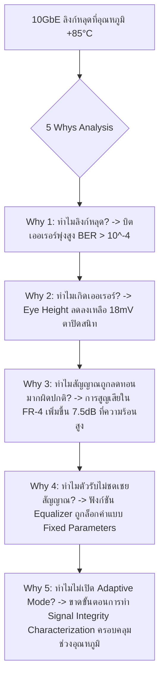

# Lesson 107: High-Speed Serial Interfaces (SerDes) & Multi-Gigabit Transceivers (高速シリアルインターフェースとSerDes物理層)

---

## 1. ทฤษฎีวิศวกรรมเชิงลึก (高度なエンジニアリング理論)

### 1.1 สถาปัตยกรรมกายภาพของ SerDes (PMA vs PCS)
เมื่ออัตราการส่งข้อมูลบนแผงวงจรพิมพ์ (PCB) ก้าวข้ามระดับกิกะบิตต่อวินาที ($> 1\text{ Gbps}$ จนถึง $32.75\text{ Gbps}$ ใน Xilinx GTH/GTY หรือ Intel Stratix 10 E-Tile) การส่งข้อมูลแบบขนาน (Parallel Bus) จะล้มเหลวโดยสิ้นเชิงเนื่องจากปัญหา **Bus Skew, Crosstalk, และข้อจำกัดของจำนวนขาไอซี (Pin Count Bottleneck)**

โซลูชันระดับสากลคือการใช้ **SerDes (Serializer/Deserializer - シリアライザ・デシリアライザ)** ซึ่งแปลงบัสข้อมูลขนานกว้างให้กลายเป็นสตรีมข้อมูลอนุกรมแบบ Differential Pair ความเร็วสูงยิ่งยวดเพียงคู่เดียว โครงสร้างภายในของ Multi-Gigabit Transceiver (MGT) แบ่งออกเป็น 2 ชั้นหลัก:

```
               Multi-Gigabit Transceiver (MGT) Dual-Layer Architecture
  
      +-----------------------------------------+-----------------------------------------+
      |  PCS (Physical Coding Sublayer)         |  PMA (Physical Medium Attachment)       |
      |  [ Digital Domain: FPGA Fabric Clock ]  |  [ Mixed-Signal Analog: Line Rate Clock]|
      |-----------------------------------------+-----------------------------------------|
  TX: | FPGA Data -> 8b/10b or 64b/66b Encoder  |-> Serializer (PISO)                     |
      |           -> Gearbox & Scrambler        |-> TX Equalizer (Pre/Post-Cursor Driver) |--> TX_P/N
      |           -> Phase Compensating FIFO    |                                         |
      |-----------------------------------------+-----------------------------------------|
  RX: | FPGA Data <- 8b/10b Decoder / Descrambler|<- RX Deserializer (SIPO)                |<-- RX_P/N
      |           <- Elastic Buffer (Clock Cor.)|<- CDR (Clock & Data Recovery)           |
      |           <- Comma / Pattern Alignment  |<- Equalizer (CTLE + Adaptive DFE)       |
      +-----------------------------------------+-----------------------------------------+
```

1. **PMA (Physical Medium Attachment - ส่วนแอนะล็อกความเร็วสูง):**
   * **Serializer / Deserializer:** แปลงข้อมูล Parallel $\leftrightarrow$ Serial ด้วยวงจร Shift Register ความเร็วสูง
   * **CDR (Clock and Data Recovery):** สกัดสัญญาณนาฬิกาและกู้คืนข้อมูลออกจากสตรีมสัญญาณที่รับเข้ามา โดยไม่มีการส่งสายสัญญาณ Clock แยกต่างหาก
   * **TX Equalizer:** วงจรเน้นสัญญาณขอบสูง (Pre-Emphasis / De-Emphasis) เพื่อชดเชยการสูญเสียในสายทองแดง
   * **RX Equalizer (CTLE + DFE):** ขยายความถี่สูง (CTLE) และหักล้างสัญญาณรบกวนข้ามสัญลักษณ์ (DFE)
2. **PCS (Physical Coding Sublayer - ส่วนดิจิทัลประมวลผลคำ):**
   * **Line Coding (8b/10b, 64b/66b):** การเข้ารหัสเพื่อรักษาสมดุลกระแสตรง (DC Balance) และสร้างขอบสัญญาณให้ CDR ล็อกเฟสได้
   * **Word Alignment:** ตรวจจับรหัสควบคุมพิเศษ (เช่น `K28.5` ใน 8b/10b) เพื่อจัดตำแหน่งไบต์ให้ถูกต้อง
   * **Elastic Buffer / Clock Correction:** ชดเชยความแตกต่างของความถี่สัญญาณนาฬิการะหว่างบอร์ดส่งและบอร์ดรับ (PPM Frequency Drift) ด้วยการแทรกหรือลบ Skip Characters

---

### 1.2 การเข้ารหัสช่องสัญญาณ (Line Coding): 8b/10b เทียบกับ 64b/66b
การส่งสัญญาณอนุกรมจำเป็นต้องผ่านตัวเก็บประจุ AC-Coupling Capacitor ($0.1\text{ }\mu\text{F}$) เพื่อตัดระดับแรงดันไฟตรงระหว่างสองระบบ หากข้อมูลมี '0' หรือ '1' แช่ยาวติดต่อกัน แรงดันเฉลี่ยจะเลื่อน (Baseline Wander) ทำให้ตัวรับอ่านค่าผิดพลาด

#### 1.2.1 การเข้ารหัส 8b/10b (IBM Standard)
* แปลงข้อมูลขนาด 8 บิต ให้กลายเป็น 10 บิต โดยใช้ตาราง 5b/6b และ 3b/4b
* **Running Disparity (RD):** มีการติดตามสถานะประจุไฟฟ้าสุทธิ หากส่งบิตที่มี '1' มากกว่า ($RD = +1$) ข้อมูลถัดไปจะถูกบังคับให้เลือกโค้ดที่มี '0' มากกว่าเพื่อดึงสมดุลกลับมาเป็นศูนย์ ($RD = -1$)
* จำกัดจำนวนบิตที่ซ้ำกันต่อเนื่องสูงสุดไม่เกิน 5 บิต (Max Run Length = 5) ทำให้มีขอบ $0 \to 1$ และ $1 \to 0$ สม่ำเสมอให้ CDR ล็อกเฟสได้ง่าย
* **ต้นทุนแบนด์วิดท์ (Overhead):**
  $$\text{Overhead}_{8b/10b} = \frac{10 - 8}{10} = 20\% \implies \text{ประสิทธิภาพเพย์โหลด } 80\%$$

#### 1.2.2 การเข้ารหัส 64b/66b (IEEE 802.3ae Standard)
* ใช้ในโปรโตคอลความเร็วสูงพิเศษ (10GbE, PCIe Gen3/4/5, Interlaken)
* ใช้ **Sync Header 2 บิต** (`2'b01` สำหรับ Data, `2'b10` สำหรับ Control Frame) ตามด้วยเพย์โหลด 64 บิตที่ผ่านการกวนสัญญาณด้วยตัวสร้างสุ่มทางคณิตศาสตร์ (Self-Synchronizing Scrambler):
  $$G(x) = 1 + x^{39} + x^{58}$$
* **ต้นทุนแบนด์วิดท์ (Overhead):**
  $$\text{Overhead}_{64b/66b} = \frac{66 - 64}{66} = 3.03\% \implies \text{ประสิทธิภาพเพย์โหลดสูงถึง } 96.97\%$$

---

### 1.3 ทฤษฎี Jitter และสมการ Dual-Dirac Model
คุณภาพของสัญญาณ SerDes ถูกวัดด้วย **Eye Diagram (アイパターン)** และค่าความแปรปรวนเชิงเวลาของขอบสัญญาณที่เรียกว่า **Total Jitter ($TJ$)**

ตามแบบจำลองทางสถิติ Dual-Dirac Model:

$$TJ(BER) = DJ + 2 \cdot Q(BER) \cdot RJ_{rms}$$

```
                     Total Jitter (TJ) Dual-Dirac Decomposition
                                 Probability Density
                                         ^
                                        / \     / \
                                       /   \   /   \
                                      /     \_/     \
                                     /  RJ   |   RJ  \
                                   --+-------+-------+--> Time (ps)
                                     |<--DJ->|
                                     |<--------- TJ(BER) --------->|
```

* **Deterministic Jitter ($DJ$):** สัญญาณกระเพื่อมที่มีรูปแบบแน่นอน เกิดจาก Inter-Symbol Interference (ISI), Duty Cycle Distortion (DCD), และ Periodic Jitter จาก Switching Power Supply มีขอบเขตสูงสุดแน่นอน (Peak-to-Peak)
* **Random Jitter ($RJ_{rms}$):** สัญญาณกระเพื่อมแบบสุ่มจากการสั่นไหวของความร้อนในอะตอมและสัญญาณรบกวนของเซมิคอนดักเตอร์ (Thermal/Shot Noise) มีการกระจายตัวแบบเกาส์เซียน (Gaussian Distribution) ไม่มีขอบเขตจำกัด
* **$Q(BER)$:** สัมประสิทธิ์การแจกแจงแบบปกติมาตรฐานตามอัตราความผิดพลาดของบิตเป้าหมาย:
  * สำหรับ $BER = 10^{-12}$: $Q(10^{-12}) \approx 7.0345 \implies TJ = DJ + 14.069 \cdot RJ_{rms}$
  * สำหรับ $BER = 10^{-15}$: $Q(10^{-15}) \approx 7.9416 \implies TJ = DJ + 15.883 \cdot RJ_{rms}$

---

### 1.4 การชดเชยการสูญเสียในช่องสัญญาณ (Channel Equalization: CTLE & DFE)
เมื่อสัญญาณความถี่สูงเดินทางผ่านลายทองแดง PCB (FR-4 / Megtron-6) สัญญาณจะถูกลดทอนอย่างรุนแรงจาก 2 กลไกหลัก:
1. **Skin Effect:** กระแสไหลเฉพาะที่ผิวทองแดง ($Loss \propto \sqrt{f}$)
2. **Dielectric Loss:** การสูญเสียในเนื้อฉนวนเรซิน ($Loss \propto f \cdot \tan\delta$)

การลดทอนที่เพิ่มขึ้นตามความถี่ทำให้พัลส์ความถี่สูงบานออกและเลื่อนไปทับพัลส์ถัดไป เกิดเป็น **Inter-Symbol Interference (ISI)** ส่งผลให้ตาของสัญญาณปิดสนิท (Eye Closure)

```
                     Equalization Techniques in SerDes Link
  
  [ TX De-Emphasis ]                  [ RX CTLE ]                 [ RX DFE ]
  ลดแอมพลิจูดบิตความถี่ต่ำ           วงจร Analog High-Pass        หักล้างรอยหางของบิตก่อนหน้า
  เพื่อให้เท่ากับบิตความถี่สูง       ชดเชย Gain ที่ความถี่สูง      โดยไม่ขยาย Noise ความถี่สูง
        +----+                             ^ Gain (dB)                  +----+
  +-----+    +-----+                 +-----+                           |    |
  |                |                 |      \                          | DFE|-- Decision
  +----------------+                 +-------\----> f (GHz)            +----+
```

* **TX De-Emphasis (FIR Driver):** ตัวส่งจะลดทอนพลังงานของบิตที่แช่ค่านิ่ง เพื่อรักษาระดับพลังงานของบิตที่กำลังสลับขอบให้คมชัด
* **RX Continuous Time Linear Equalization (CTLE):** ตัวกรองแอนะล็อกแบบ High-Pass Peaking ที่ตัวรับ เพื่อชดเชยเกนในย่านความถี่ Nyquist
* **RX Decision Feedback Equalization (DFE):** ตัวกรองแบบไม่เชิงเส้น (Non-linear Equalizer) ที่นำผลการตัดสินใจของบิตในอดีต ($b_{n-1}, b_{n-2}, ...$) มาคูณกับค่าน้ำหนัก ($h_1, h_2, ...$) แล้วนำไปลบออกจากสัญญาณปัจจุบัน เพื่อตัดรอยหางของ ISI ทิ้งโดย **"ไม่ขยายสัญญาณรบกวนความถี่สูง (No Noise Amplification)"**

---

## 2. ทริคหน้างาน OJT แบบ Step-by-Step (現場の実践テクニック)

### 2.1 กรณีศึกษาความล้มเหลวหน้างาน (失敗事例: Shippai Jirei)
* **บริบท:** ระบบสวิตช์เราเตอร์เครือข่ายความเร็วสูง ใช้โมดูล 10GbE SFP+ เชื่อมต่อกับ FPGA Xilinx Kintex UltraScale+ ผ่านลายวงจร Backplane FR-4 ความยาว $45\text{ cm}$
* **อาการเสียหน้างาน:** บอร์ดทำงานผ่านการทดสอบ Bit Error Rate ในห้องแล็บที่อุณหภูมิห้อง ($+25^\circ\text{C}$) ได้ผลดีเยี่ยม ($BER < 10^{-14}$) แต่เมื่อนำบอร์ดเข้าทดสอบในตู้ควบคุมอุณหภูมิ (Thermal Chamber) ที่ความร้อน $+85^\circ\text{C}$ พบว่าค่า **$BER$ พุ่งสูงขึ้นเป็น $10^{-4}$** ลิงก์หลุดการเชื่อมต่อ (Link Flapping) และเกิด Packet Drop ต่อเนื่อง
* **การตรวจวัดทางกายภาพ:** ทีมงานใช้เครื่องมือสโคปความเร็วสูง (70GHz Real-Time Oscilloscope) และเครื่องมือ Eye Scan ภายใน FPGA (Vivado ChipScope IBERT) ส่องดูลักษณะของ Eye Diagram

```
            ภาพสแกน Eye Diagram จากเครื่องมือ IBERT ภายในตัวชิป
   
   ที่อุณหภูมิห้อง (+25°C):                     ที่อุณหภูมิสูง (+85°C):
      +-----------------------+                   +-----------------------+
      |       /\     /\       |                   |       /\XXXXX/\       |
      |      /  \___/  \      |                   |      /  XXXXX  \      |
      |     |   OPEN   |     |                   |     |  CLOSED |     |
      |      \  /~~~\  /      |                   |      \  XXXXX  /      |
      |       \/     \/       |                   |       \/XXXXX\/       |
      +-----------------------+                   +-----------------------+
      Eye Height = 220 mV (ผ่าน)                  Eye Height = 18 mV (ตาปิดสนิท ลิงก์หลุด)
```

* **ผลการวิเคราะห์ทางฟิสิกส์:**
  1. วัสดุ FR-4 ทั่วไปมีค่าสัมประสิทธิ์การสูญเสียของฉนวน ($\tan\delta$) ที่แปรผันตามอุณหภูมิ เมื่ออุณหภูมิสูงขึ้นจาก $+25^\circ\text{C} \to +85^\circ\text{C}$ ค่า Channel Insertion Loss ที่ความถี่ $5\text{ GHz}$ เพิ่มขึ้นจาก $-14\text{ dB}$ กลายเป็น **$-21.5\text{ dB}$**
  2. วิศวกรตั้งค่าตัวกรอง CTLE และ DFE ของ SerDes ไว้เป็นแบบ **"Manual Fixed Mode"** โดยปรับแต่งค่าเฉพาะที่อุณหภูมิห้อง
  3. เมื่อลายวงจรสูญเสียพลังงานเพิ่มขึ้นอีก $7.5\text{ dB}$ ที่ความร้อนสูง วงจรขยายแอนะล็อกไม่สามารถกู้คืนสัญญาณได้ ส่งผลให้ดวงตาของสัญญาณปิดสนิท

---

### 2.2 การวิเคราะห์หาสาเหตุรากเหง้า (Root Cause Analysis: 5 Whys & Ishikawa)



#### Ishikawa Diagram (ผังก้างปลา)
* **Material/PCB:** ใช้แผ่นวงจร FR-4 มาตรฐานที่มีค่า Loss Tangent ผันผวนตามอุณหภูมิสูง แทนที่จะใช้ Megtron-6 สำหรับความยาว 45 cm
* **Configuration:** ไม่ได้เปิดโหมด **Adaptive Auto-Tuning (DFE Adaptation)** ในคอนฟิกูเรชันของ Transceiver
* **Testing:** ทำการจูนค่า Signal Integrity เฉพาะที่อุณหภูมิ $25^\circ\text{C}$ โดยไม่ทำการทดสอบ 4-Corner Temperature Validation
* **Margin Budget:** ไม่ได้คำนวณเผื่อ Aging และ Temperature Degradation ในการวิเคราะห์ Insertion Loss

---

### 2.3 มาตรการแก้ไขและกฎการปรับแต่งช่องสัญญาณ SerDes
1. **เปิดใช้งาน RX Adaptation Mode แบบต่อเนื่อง (Continuous DFE Adaptation):**
   * แก้ไขพารามิเตอร์ของ Xilinx GTH Transceiver: กำหนด `RX_DFE_CONTINUOUS = 1` และ `RX_CTLE_AUTO = 1` เพื่อให้อัลกอริทึมภายในชิปปรับค่าน้ำหนัก Tap และ Peaking Gain ตามการสูญเสียของสายสัญญาณที่เปลี่ยนแปลงตามอุณหภูมิตลอดเวลา
2. **ปรับแต่ง TX Pre-Emphasis:** เพิ่มค่า Post-Cursor ให้อยู่ในระดับ $-4.5\text{ dB}$ เพื่อช่วยผลักดันความคมชัดของขอบสัญญาณล่วงหน้า
3. **ผลลัพธ์หลังแก้ไข:** Eye Height ที่ $+85^\circ\text{C}$ ขยายตัวกลับคืนมาเป็น **$145\text{ mV}$** และ Eye Width กว้าง $0.48\text{ UI}$ ค่า Bit Error Rate ลดลงสู่ระดับ **$BER < 10^{-15}$** ไม่มี Packet Drop แม้รันต่อเนื่อง 7 วันในห้องอบความร้อน

---

### 2.4 ตารางตรวจสอบหน้างาน SOP สำหรับ SerDes (SerDes SOP Checklist)

| ลำดับ | จุดตรวจสอบทางวิศวกรรม | เกณฑ์การยอมรับ (Acceptance Criteria) | เครื่องมือตรวจสอบ | ผลการตรวจ |
| :---: | :--- | :--- | :--- | :---: |
| 1 | Reference Clock Phase Jitter | $RJ_{rms} \le 0.300\text{ ps}$ (ตามข้อกำหนดของชิป MGT) | Phase Noise Analyzer | ผ่าน / ไม่ผ่าน |
| 2 | Insertion Loss ของลายวงจร | รวมคอนเนกเตอร์และสายส่งต้อง $\le -22\text{ dB}$ ที่ Nyquist Freq | VNA S-Parameter ($S_{21}$) | ผ่าน / ไม่ผ่าน |
| 3 | AC-Coupling Capacitor Placement | ขนาด $0.1\text{ }\mu\text{F}$ วางชิดคอนเนกเตอร์รับ พร้อม Cutout GND ใต้ Pad | Layout Review / TDR | ผ่าน / ไม่ผ่าน |
| 4 | Eye Diagram Opening Margin | $\text{Eye Height} \ge 100\text{ mV}$, $\text{Eye Width} \ge 0.40\text{ UI}$ ตลอดช่วงอุณหภูมิ | IBERT Eye Scan / Scope | ผ่าน / ไม่ผ่าน |
| 5 | Bit Error Rate Qualification | ต้องผ่านการทดสอบแบบปราศจากความผิดพลาด $\text{BER} < 10^{-12}$ ต่อเนื่อง 24 ชม. | PRBS-31 Tester | ผ่าน / ไม่ผ่าน |

---

## 3. คำศัพท์และประโยคภาษาญี่ปุ่นสำหรับตรวจแบบ (検図 - Kenzu)

### 3.1 ตารางคำศัพท์เทคนิคเฉพาะทาง (専門用語一覧)

| คำศัพท์คันジ/คาตาคานะ | การอ่าน (Romaji) | คำแปลภาษาไทย / ภาษาอังกฤษ |
| :--- | :--- | :--- |
| **シリアライザ・デシリアライザ** | Shiriaraiza deshiriaiza | วงจรแปลงขนาน-อนุกรม (SerDes) |
| **符号間干渉** | Fugōkan kanshō | สัญญาณรบกวนข้ามสัญลักษณ์ (Inter-Symbol Interference: ISI) |
| **アイ開口率** | Ai kaikō-ritsu | อัตราการเปิดของดวงตาสัญญาณ (Eye Opening / Eye Margin) |
| **伝送路損失** | Densōro sonshitsu | การสูญเสียในช่องสัญญาณส่ง (Channel Insertion Loss: $S_{21}$) |
| **デエンファシス** | Dīenfashisu | การลดทอนย่านความถี่ต่ำเพื่อเน้นขอบ (De-Emphasis) |
| **判定帰還型イコライザ** | Hantei kikan-gata ikoraiza | ตัวปรับแต่งสัญญาณป้อนกลับการตัดสินใจ (Decision Feedback Equalizer: DFE) |
| **クロックデータリカバリ** | Kurokku dēta rikabari | การกู้คืนสัญญาณนาฬิกาและข้อมูล (Clock and Data Recovery: CDR) |
| **ビット誤り率** | Bitto ayamari-ritsu | อัตราความผิดพลาดของบิต (Bit Error Rate: BER) |
| **弾性バッファ** | Dansei baffa | บัฟเฟอร์ยืดหยุ่นชดเชยเฟส (Elastic Buffer / Phase FIFO) |
| **同相雑音除去比** | Dōsō zatsuon jokyohi | อัตราส่วนการขจัดสัญญาณรบกวนร่วม (Common-Mode Rejection Ratio: CMRR) |

---

### 3.2 บทสนทนาการตรวจแบบหน้างานจริง (検図での指摘事項)

#### การตรวจแบบจุดที่ 1: การตรวจพบลายวงจร Differential Pair ขาดการทำ Ground Voiding ใต้ AC Capacitor
* **審査役 (Lead Chief Engineer):**
  「この25GbpsのSerDesラインに挿入されたAC結合コンデンサ（0201サイズ）のパッド下ですが、内層グラウンドプレーンのクリアランス穴（GNDアンチパッド）が抜かれていませんね。パッドの銅箔面積が広いため、特性インピーダンスが局所的に $78\Omega$ まで急落し、反射ノイズ（$S_{11}$ 悪化）の原因になります。直ちに直下の層をくり抜いて（ボイド化）インピーダンスを $100\Omega$ 差動に整合させてください。」
  *(ใต้แพดของตัวเก็บประจุ AC-Coupling (ขนาด 0201) บนลายส่ง SerDes 25Gbps จุดนี้ ไม่ได้เจาะช่องเว้นระยะบนเพลนกราวด์ชั้นใน (GND Anti-pad Voiding) ไว้นะครับ เนื่องจากพื้นที่ทองแดงของแพดมีขนาดใหญ่ อิมพีแดนซ์ลักษณะเฉพาะตรงจุดนี้จะดิ่งวูบลงเหลือ $78\Omega$ ส่งผลให้เกิดคลื่นสะท้อน ($S_{11}$ เสื่อมถอย) ได้ ช่วยตัดเพลนกราวด์ชั้นใต้แพดออกเพื่อรักษาอิมพีแดนซ์ส่วนต่างให้ได้ $100\Omega$ ทันทีครับ)*
* **設計担当 (FPGA Design Engineer):**
  「ご指摘誠にありがとうございます。高周波の寄生容量を見落としておりました。直下レイヤーのグラウンドをくり抜くボイド処理（GND Voiding）を実施し、3D電磁界シミュレーションにて $100\Omega \pm 5\%$ 以内に収まっていることを確認いたします。」
  *(ขอบพระคุณสำหรับข้อสังเกตครับ ผมมองข้ามค่าประจุแฝงที่ความถี่สูงไปครับ ผมจะดำเนินการเจาะช่องว่างเพลนกราวด์ (GND Voiding) ใต้แพดในทันที และจะรัน 3D EM Simulation เพื่อยืนยันว่าอิมพีแดนซ์อยู่ในกรอบ $100\Omega \pm 5\%$ ครับ)*

#### การตรวจแบบจุดที่ 2: ปัญหา Reference Clock Jitter เกินสเปกของชิป Transceiver
* **審査役 (Lead Chief Engineer):**
  「Transceiver用のリファレンスクロック（156.25MHz）ですが、汎用発振器からクロックバッファを3段も経由して入力されていますね。位相ジッタ（Phase Jitter）を測定したところ、RMS値で $0.85\text{ ps}$ に達しています。UltraScale+ GTHの推奨値である $0.30\text{ ps}$ を大幅にオーバーしており、高速伝送時にCDRがロック外れを起こす懸念があります。超低ジッタ発振器からダイレクト配線に変更してください。」
  *(สัญญาณ Reference Clock (156.25MHz) สำหรับ Transceiver ต่อมาจากออสซิลเลเตอร์ทั่วไปผ่านบัฟเฟอร์ถึง 3 สเตจนะครับ เมื่อวัด Phase Jitter ออกมาพบว่าค่า RMS พุ่งไปถึง $0.85\text{ ps}$ ซึ่งเกินค่าแนะนำของ UltraScale+ GTH ที่ $0.30\text{ ps}$ ไปมาก เสี่ยงต่อการที่ CDR จะหลุดล็อกระหว่างส่งข้อมูลความเร็วสูง ช่วยเปลี่ยนมาใช้ออสซิลเลเตอร์สัญญาณรบกวนต่ำพิเศษและเดินสายตรงเข้าชิปด้วยครับ)*
* **設計担当 (FPGA Design Engineer):**
  「承知いたしました。ジッタ仕様 $0.15\text{ ps RMS}$ 以下の車載・産業用超低位相雑音クリスタル発振器を選定し、余計なバッファ回路を排除して差動ラインを最短配線でMGT専用クロックピンへ接続する設計へ改修いたします。」
  *(รับทราบครับ ผมจะเลือกใช้ออสซิลเลเตอร์สัญญาณรบกวนต่ำพิเศษเกรดยานยนต์ที่มี Jitter ต่ำกว่า $0.15\text{ ps RMS}$ ตัดวงจรบัฟเฟอร์ส่วนเกินออกทั้งหมด และเดินสายคู่ส่วนต่างระยะสั้นที่สุดตรงเข้าขา Dedicated Clock ของ MGT ครับ)*

---

## 4. ควิซวิเคราะห์ปัญหาระดับวิศวกรอาวุโส (上級技術クイズ)

### ข้อที่ 1: การคำนวณ Total Jitter ($TJ$) และ Eye Width Margin ที่ระดับความเชื่อมั่น $BER = 10^{-12}$
ในอินเทอร์เฟซการส่งข้อมูลความเร็วสูง 10.3125 Gbps (10GBASE-R) มีขนาดคาบเวลาต่อ 1 บิต (Unit Interval: UI) เท่ากับ:

$$UI = \frac{1}{10.3125 \times 10^9\text{ bps}} \approx 96.97\text{ ps}$$

จากการวัดคุณลักษณะเชิงเวลาของสัญญาณที่ปลายทางเครื่องรับด้วยเครื่องมือ Real-Time Scope พบพารามิเตอร์ดังนี้:
* Deterministic Jitter: $DJ = 24.50\text{ ps}$ (Peak-to-Peak)
* Random Jitter: $RJ_{rms} = 2.10\text{ ps}$ (Gaussian Standard Deviation)

ตามแบบจำลอง Dual-Dirac Model กำหนดค่าสัมประสิทธิ์ $Q(10^{-12}) \approx 7.0345$ 

จงคำนวณหาค่า **Total Jitter ($TJ$)** ที่ระดับ $BER = 10^{-12}$ และคำนวณ **ขนาดความกว้างของดวงตาสัญญาณที่เหลืออยู่จริง (Eye Width Margin)** ในหน่วยพิโกวินาที (ps) และสัดส่วนของ Unit Interval (UI)?

a) $TJ = 39.20\text{ ps}$, $\text{Eye Width} = 57.77\text{ ps}$ ($0.60\text{ UI}$)  
b) $TJ = 54.04\text{ ps}$, $\text{Eye Width} = 42.93\text{ ps}$ ($0.44\text{ UI}$)  
c) $TJ = 68.45\text{ ps}$, $\text{Eye Width} = 28.52\text{ ps}$ ($0.29\text{ UI}$)  
d) $TJ = 45.60\text{ ps}$, $\text{Eye Width} = 51.37\text{ ps}$ ($0.53\text{ UI}$)  

---

#### เฉลยและบทวิเคราะห์เชิงลึกข้อที่ 1
**คำตอบที่ถูกต้องคือ: b) $TJ = 54.04\text{ ps}$, $\text{Eye Width} = 42.93\text{ ps}$ ($0.44\text{ UI}$)**

**ขั้นตอนการคำนวณทางคณิตศาสตร์:**
1. คำนวณเทอม Random Jitter ที่ระดับความเชื่อมั่น $BER = 10^{-12}$:
   $$TJ_{RJ} = 2 \times Q(10^{-12}) \times RJ_{rms} = 2 \times 7.0345 \times 2.10\text{ ps} = 14.069 \times 2.10\text{ ps} \approx 29.545\text{ ps}$$
2. คำนวณ Total Jitter ($TJ$):
   $$TJ = DJ + TJ_{RJ} = 24.50\text{ ps} + 29.545\text{ ps} = 54.045\text{ ps} \approx 54.04\text{ ps}$$
3. คำนวณขนาดความกว้างของดวงตาสัญญาณ (Eye Width Margin):
   $$\text{Eye Width} = UI - TJ = 96.97\text{ ps} - 54.045\text{ ps} = 42.925\text{ ps} \approx 42.93\text{ ps}$$
4. แปลงเป็นสัดส่วนของ Unit Interval:
   $$\text{Eye Width (UI)} = \frac{42.925\text{ ps}}{96.97\text{ ps}} \approx 0.4427\text{ UI} \approx 0.44\text{ UI}$$
5. **บทวิเคราะห์เชิงวิศวกรรม:**
   * สเปก 10GBASE-R กำหนดให้ตัวรับต้องมี Eye Width ไม่น้อยกว่า $0.35\text{ UI}$ ดังนั้นระบบที่มีความกว้าง $0.44\text{ UI}$ ($42.93\text{ ps}$) จึงผ่านเกณฑ์และมี Timing Margin เผื่อไว้ได้ตามมาตรฐาน

---

### ข้อที่ 2: การเปรียบเทียบแบนด์วิดท์สุทธิระหว่าง 8b/10b และ 64b/66b
ระบบสื่อสารข้อมูลผ่านดาวเทียมมีขีดความสามารถในการส่งสัญญาณผ่านช่องทาง SerDes ทางกายภาพที่อัตรา Line Rate เท่ากับ **$10.00\text{ Gbps}$** 

หากเปรียบเทียบระหว่าง:
* **โปรโตคอลระบบเก่า (Protocol A):** ใช้การเข้ารหัสแบบ **8b/10b**
* **โปรโตคอลระบบใหม่ (Protocol B):** ใช้การเข้ารหัสแบบ **64b/66b**

จงคำนวณว่าใน 1 วินาที โปรโตคอลระบบใหม่ (Protocol B) จะสามารถส่งข้อมูลเพย์โหลดสุทธิ (Net Payload Throughput) ได้มากกว่าโปรโตคอลระบบเก่า (Protocol A) เป็นปริมาณกี่กิกะบิต (Gbps)?

a) มากกว่ากัน $0.50\text{ Gbps}$  
b) มากกว่ากัน $1.70\text{ Gbps}$  
c) มากกว่ากัน $2.00\text{ Gbps}$  
d) มากกว่ากัน $3.33\text{ Gbps}$  

---

#### เฉลยและบทวิเคราะห์เชิงลึกข้อที่ 2
**คำตอบที่ถูกต้องคือ: b) มากกว่ากัน $1.70\text{ Gbps}$**

**ขั้นตอนการคำนวณทางคณิตศาสตร์:**
1. คำนวณ Net Payload ของ Protocol A (8b/10b):
   $$\text{Efficiency}_A = \frac{8}{10} = 0.80\text{ (หรือ } 80\%)$$
   $$\text{Throughput}_A = 10.00\text{ Gbps} \times 0.80 = 8.00\text{ Gbps}$$
2. คำนวณ Net Payload ของ Protocol B (64b/66b):
   $$\text{Efficiency}_B = \frac{64}{66} \approx 0.969697\text{ (หรือ } 96.97\%)$$
   $$\text{Throughput}_B = 10.00\text{ Gbps} \times \left(\frac{64}{66}\right) \approx 9.697\text{ Gbps}$$
3. คำนวณผลต่างของปริมาณข้อมูลที่ส่งได้เพิ่มเติม:
   $$\Delta \text{Throughput} = \text{Throughput}_B - \text{Throughput}_A = 9.697\text{ Gbps} - 8.000\text{ Gbps} = 1.697\text{ Gbps} \approx 1.70\text{ Gbps}$$
4. **ความสำคัญเชิงเศรษฐศาสตร์และวิศวกรรม:**
   * การเปลี่ยนสถาปัตยกรรม Line Coding จาก 8b/10b เป็น 64b/66b บนฮาร์ดแวร์ช่องสัญญาณเดิมความเร็วเท่าเดิม ช่วยเพิ่มปริมาณข้อมูลที่ส่งได้จริงถึง **$1.70\text{ Gbps}$ (เพิ่มขึ้น $+21.2\%$ ของความจุเดิม)** โดยไม่ต้องอัปเกรดความถี่สัญญาณนาฬิกาหรือเปลี่ยนสายส่งทองแดงบนบอร์ดเลย

---

### ข้อที่ 3: บทบาทและความแตกต่างเชิงฟิสิกส์ระหว่าง CTLE และ DFE
ในการชดเชยการสูญเสียของสายส่งความเร็วสูง เหตุใดวิศวกรจึงไม่สามารถพึ่งพาเฉพาะวงจร **CTLE (Linear Equalizer)** เพียงอย่างเดียว และจำเป็นต้องใช้วงจร **DFE (Decision Feedback Equalizer)** ร่วมด้วยเสมอในลิงก์ที่มีการสูญเสียสูงกว่า $-20\text{ dB}$?

a) เพราะ CTLE ใช้วงจรเหนี่ยวนำขดลวด (Inductor) ซึ่งมีขนาดใหญ่เกินกว่าจะบรรจุลงใน FPGA  
b) เพราะ CTLE เป็นวงจรกรองเชิงเส้นความถี่สูง (High-Pass Linear Filter) ยิ่งเร่งเกน (Peaking Gain) เพื่อชดเชยการสูญเสียมากเท่าใด วงจรก็จะขยายสัญญาณรบกวนความถี่สูง (High-Frequency Crosstalk และ Thermal Noise) ขึ้นมาตามสัดส่วนด้วย ทำให้ Signal-to-Noise Ratio (SNR) เสื่อมถอย ในขณะที่ DFE ใช้ผลการตัดสินใจทางตรรกะจึงไม่ขยายสัญญาณรบกวน  
c) เพราะ CTLE ทำงานได้เฉพาะกับข้อมูลที่เข้ารหัสแบบ Manchester เท่านั้น  
d) เพราะมาตรฐาน PCI Express ไม่อนุญาตให้ใช้ CTLE  

---

#### เฉลยและบทวิเคราะห์เชิงลึกข้อที่ 3
**คำตอบที่ถูกต้องคือ: b) เพราะ CTLE เป็นวงจรกรองเชิงเส้นความถี่สูง (High-Pass Linear Filter) ยิ่งเร่งเกน (Peaking Gain) เพื่อชดเชยการสูญเสียมากเท่าใด วงจรก็จะขยายสัญญาณรบกวนความถี่สูง (High-Frequency Crosstalk และ Thermal Noise) ขึ้นมาตามสัดส่วนด้วย ทำให้ Signal-to-Noise Ratio (SNR) เสื่อมถอย ในขณะที่ DFE ใช้ผลการตัดสินใจทางตรรกะจึงไม่ขยายสัญญาณรบกวน**

**บทวิเคราะห์เชิงลึกระดับ Lead Transceiver Architect:**
* **ธรรมชาติของ CTLE (Continuous Time Linear Equalizer):**
  * CTLE ทำงานเป็น Active Filter แอนะล็อกแบบเส้นตรง ($RC$-peaking filter) ที่ขยายความถี่สูงย่าน Nyquist ให้สูงขึ้นมาชดเชยการตกของกราฟ $S_{21}$
  * **จุดอ่อนขั้นวิกฤต:** สัญญาณรบกวนภายนอก เช่น Power Supply Noise, Thermal Noise, และ Crosstalk จากลายข้างเคียงที่ความถี่สูง ก็จะถูกขยายตามไปด้วยเป็นเงาตามตัว
  * หากช่องสัญญาณมีการสูญเสียรุนแรง (เช่น $-25\text{ dB}$) แล้วเร่งเกน CTLE สูงสุด $+15\text{ dB}$ สัญญาณรบกวนจะถูกขยายจนกลืนสัญญาณจริง ส่งผลให้ SNR ต่ำจนตัวรับตัดสินใจบิตไม่ได้
* **จุดเด่นของ DFE (Decision Feedback Equalizer):**
  * DFE เป็นวงจรแบบไม่เชิงเส้น (Non-linear Processing)
  * DFE นำสัญญาณที่ผ่านการตัดสินใจแล้ว (Slicer Output: เป็นค่าลอจิกดิจิทัลบริสุทธิ์ $+1$ หรือ $-1$) มาคำนวณค่าน้ำหนักเพื่อหักล้างหางของสัญลักษณ์ก่อนหน้า (Post-cursor ISI) ออกจากสัญญาณอินพุต
  * เนื่องจากสัญญาณที่ป้อนกลับเป็นข้อมูลดิจิทัลที่ผ่านการ Slice แล้ว **"มันจึงไม่มีสัญญาณรบกวนแอนะล็อกหลงเหลืออยู่เลย"** DFE จึงสามารถเปิดตาของสัญญาณในแนวตั้ง (Eye Height) ได้โดย **ไม่เพิ่ม Noise Floor ของระบบ** ลิงก์ความเร็วสูงพิเศษจึงต้องใช้ CTLE กวาดคร่าวๆ ก่อน แล้วใช้ DFE ตัด ISI ขั้นสุดท้ายเสมอ
