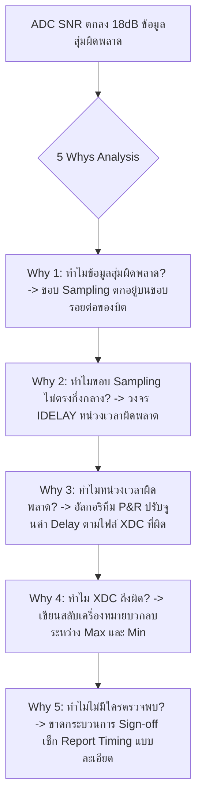

# Lesson 109: Advanced Timing Constraints & SDC/XDC Synthesis Sign-off (高度なSDC/XDC制約設計とサインオフ)

---

## 1. ทฤษฎีวิศวกรรมเชิงลึก (高度なエンジニアリング理論)

### 1.1 วิวัฒนาการของ Timing Constraints (SDC สู่ XDC)
ในการพัฒนาฮาร์ดแวร์ FPGA สมัยใหม่ ไฟล์ข้อกำหนดเวลา (Timing Constraints) ไม่ใช่เพียงเอกสารประกอบ แต่เป็น **"พิมพ์เขียวทางคณิตศาสตร์"** ที่ชี้นำอัลกอริทึมการสังเคราะห์ (Synthesis), การวางตำแหน่ง (Placement), และการเดินสายสัญญาณ (Routing) ให้สอดคล้องกับพฤติกรรมทางกายภาพของแผงวงจรจริง

มาตรฐานสากลอิงตามข้อกำหนดของ Synopsys Design Constraints (SDC) ซึ่งถูกนำมาต่อยอดเป็น Xilinx Design Constraints (XDC) บนพื้นฐานของภาษา Tcl (Tool Command Language) การควบคุมเวลาแบ่งออกเป็น 3 หมวดหมู่หลัก:

```
               Timing Constraints Structural Hierarchy (SDC/XDC)
  
   1. Clock Definitions (สัญญาณนาฬิกา)
      +-- create_clock (Primary / External Clocks)
      +-- create_generated_clock (PLL / Clock Dividers / Inverted Clocks)
      +-- create_clock -name vclk (Virtual Clocks for I/O Interfaces)
      +-- set_clock_uncertainty (Jitter & Margin Budget)
  
   2. I/O Timing Specifications (อินเทอร์เฟซขาเข้าและขาออก)
      +-- set_input_delay (-max for Setup, -min for Hold)
      +-- set_output_delay (-max for Setup, -min for Hold)
  
   3. Timing Exceptions (ข้อยกเว้นทางเวลาเฉพาะกิจ)
      +-- set_clock_groups (-asynchronous / -physically_exclusive)
      +-- set_multicycle_path (Multi-cycle Operations)
      +-- set_false_path (Non-functional Paths)
      +-- set_max_delay -datapath_only (Bounded CDC Paths)
```

---

### 1.2 สถาปัตยกรรมอินเทอร์เฟซ: System-Synchronous เทียบกับ Source-Synchronous
การเชื่อมต่อสัญญาณความเร็วสูงระหว่างชิปภายนอก (เช่น ADC, DAC, Image Sensor) กับ FPGA แบ่งตามรูปแบบการจ่ายสัญญาณนาฬิกาได้ 2 แบบ:

#### 1.2.1 System-Synchronous Interface (ระบบเดิม)
ทั้งชิปส่งและชิป FPGA รับสัญญาณนาฬิกาจากออสซิลเลเตอร์ร่วมกันตัวเดียวบนเมนบอร์ด (Common Board Clock):
* **ข้อจำกัดวิกฤต:** ความต่างของเวลาในการเดินสาย Clock ไปยังสองชิป (Board Clock Skew: $\Delta T_{clk\_board}$) และความล่าช้าของสายสัญญาณข้อมูล จะถูกนำมารวมเข้าในสมการ Timing ทันที
* ข้อจำกัดความเร็วสูงสุด: มักทำความเร็วได้ไม่เกิน **$100\text{ MHz}$** เพราะค่า Skew บนบอร์ดจะกลืนกินคาบเวลาของสัญญาณนาฬิกาไปเกือบหมด

#### 1.2.2 Source-Synchronous Interface (มาตรฐานความเร็วสูงในปัจจุบัน)
ชิปตัวส่งจะสร้างสัญญาณนาฬิกาและส่งออกมา **"ขนานคู่ขนานไปพร้อมกับสัญญาณข้อมูล"** (Clock travels with Data) ผ่านลายวงจรคู่ความยาวเท่ากัน (Length Matched Differential Traces)
* **ข้อได้เปรียบระดับสูง:** ลบปัญหา Board Clock Skew ทิ้งไปได้โดยสิ้นเชิง เพราะสัญญาณนาฬิกาและข้อมูลเดินทางผ่านสิ่งแวดล้อมเดียวกัน (อุณหภูมิ, ชั้นเลเยอร์, ความล่าช้าเหมือนกัน) ทำให้รองรับความเร็วได้เกิน **$1\text{ Gbps}$ ต่อคู่สาย (LVDS / DDR)**

```
               Source-Synchronous Interface Architecture (e.g., DDR ADC)
        External High-Speed ADC                     FPGA Subsystem
      +-------------------------+             +-------------------------+
      |  +-------------------+  |   Data_DDR  |  +-------------------+  |
      |  | Launch Regs (DDR) |--+============+->| Capture Regs (IDDR) |  |
      |  +-------------------+  |  (Trace L1) |  +-------------------+  |
      |            ^            |             |            ^            |
      |            | CLK_ADC    |   CLK_DDR   |            | CLK_CAP    |
      |  +-------------------+  |             |  +-------------------+  |
      |  | Clock Generator   |--+-------------+->| IDELAY / PLL Core |  |
      |  +-------------------+  |  (Trace L2) |  +-------------------+  |
      +-------------------------+ (Matched L) +-------------------------+
```

---

### 1.3 ทฤษฎีการคำนวณ `set_input_delay` และ `set_output_delay` สำหรับ DDR
ในการเขียน Constraint ให้กับอินเทอร์เฟซ Double Data Rate (DDR) ซึ่งมีการรับส่งข้อมูลทั้งที่ขอบขาขึ้น (`posedge`) และขอบขาลง (`negedge`) ของสัญญาณนาฬิกา การคำนวณค่า Max และ Min Delay ต้องสะท้อนความสัมพันธ์เชิงกายภาพที่แท้จริง:

```
                      Input Delay Constraints Timing Budget
            Launch Clock (Ext Device)            Capture Clock (FPGA)
                    +-------------+                      +-------------+
             CLK1 --+-> Launch FF |        Data Trace    |  Capture FF +-- CLK2
                    |             +-----[ Board Delay ]--+->           |
                    +-------------+                      +-------------+
```

#### 1.3.1 สมการ Input Delay (สำหรับสัญญาณเข้า FPGA):
* **`set_input_delay -max` (ใช้สำหรับ Setup Check):**
  เวลาที่ข้อมูลใช้เดินทางมาช้าที่สุดเมื่อเทียบกับขอบ Clock ของตัวส่ง:
  $$\text{Input Delay (Max)} = t_{co\_max} + t_{data\_trace\_max} - t_{clk\_trace\_min}$$
* **`set_input_delay -min` (ใช้สำหรับ Hold Check):**
  เวลาที่ข้อมูลใช้เดินทางมาเร็วที่สุดเมื่อเทียบกับขอบ Clock ของตัวส่ง:
  $$\text{Input Delay (Min)} = t_{co\_min} + t_{data\_trace\_min} - t_{clk\_trace\_max}$$

#### 1.3.2 ไวยากรณ์ XDC สำหรับ Source-Synchronous Edge-Aligned DDR Input:
```tcl
# 1. กำหนดสัญญาณนาฬิกาขาเข้าจากภายนอก
create_clock -name rx_clk -period 4.000 [get_ports rx_clk_in]

# 2. กำหนด Virtual Clock สำหรับอ้างอิงอุปกรณ์ส่งภายนอก
create_clock -name v_rx_clk -period 4.000

# 3. กำหนด Input Delay สำหรับขอบขาขึ้น (Rising Edge)
set_input_delay -clock [get_clocks v_rx_clk] -max  0.450 [get_ports rx_data_in*]
set_input_delay -clock [get_clocks v_rx_clk] -min -0.450 [get_ports rx_data_in*]

# 4. กำหนด Input Delay สำหรับขอบขาลง (Falling Edge) พร้อมแฟล็ก -add_delay
set_input_delay -clock [get_clocks v_rx_clk] -max  0.450 [get_ports rx_data_in*] -clock_fall -add_delay
set_input_delay -clock [get_clocks v_rx_clk] -min -0.450 [get_ports rx_data_in*] -clock_fall -add_delay
```

> **ข้อควรระวังเรื่องเครื่องหมายลบ:** ในอินเทอร์เฟซแบบ Edge-Aligned ข้อมูลจะเปลี่ยนสถานะ "พร้อมกับขอบสัญญาณนาฬิกาพอดี" ค่า $t_{co\_min}$ อาจเริ่มเปลี่ยนก่อนขอบ Clock เล็กน้อย ทำให้ค่า Min Delay กลายเป็น **ค่าติดลบ (Negative Delay)** ซึ่งสะท้อนว่าข้อมูลถูกส่งออกมาล่วงหน้า

---

### 1.4 การจัดการความสัมพันธ์ของโดเมนสัญญาณนาฬิกา (Clock Groups)
ในการออกแบบระบบขนาดใหญ่ที่มี PLL หลายตัวหรือมีสัญญาณนาฬิกาอซิงโครนัส การสั่งตัดการวิเคราะห์ไทม์มิ่งที่ไม่เกี่ยวข้องกันจะต้องทำอย่างมีระเบียบ:

* **คำสั่งที่ห้ามใช้โดยเด็ดขาด (Strict Prohibition):**
  `set_false_path -from [get_clocks clk_a] -to [get_clocks clk_b]`
  *เหตุผล:* คำสั่งนี้ตัดเฉพาะทิศทาง $A \to B$ แต่ลืมทิศทาง $B \to A$ และเสี่ยงต่อการที่วิศวกรใช้ Wildcard จนเผลอไปตัดเส้นทางที่ต้องวิเคราะห์จริง
* **แนวทางปฏิบัติที่เป็นมาตรฐานอุตสาหกรรม (Industry Standard):**
  ```tcl
  # ตัดความสัมพันธ์สองทิศทางพร้อมกันอย่างปลอดภัยด้วย set_clock_groups
  set_clock_groups -asynchronous \
      -group [get_clocks -include_generated_clocks sys_clk_100] \
      -group [get_clocks -include_generated_clocks pcie_clk_250] \
      -group [get_clocks -include_generated_clocks mipi_clk_150]
  ```

---

## 2. ทริคหน้างาน OJT แบบ Step-by-Step (現場の実践テクニック)

### 2.1 กรณีศึกษาความล้มเหลวหน้างาน (失敗事例: Shippai Jirei)
* **บริบท:** บอร์ดจับสัญญาณเรดาร์ความถี่สูง เชื่อมต่อไอซี High-Speed ADC ขนาด 14-bit 250 MSPS (DDR Interface) เข้ากับ FPGA Kintex-7
* **อาการเสียหน้างาน:** การประมวลผลข้อมูลในห้องแล็บดูเหมือนทำงานได้ แต่เมื่อป้อนสัญญาณแอนะล็อกความถี่สูงเพื่อวัดค่า Signal-to-Noise Ratio (SNR) พบว่าค่า **SNR ตกฮวบลงถึง $18\text{ dB}$** (จากที่ควรได้ $72\text{ dB}$ เหลือเพียง $54\text{ dB}$) และเมื่อส่องดูข้อมูลดิบ พบว่าบางบิตมีค่ากระโดดผิดเพี้ยนแบบสุ่ม (Random Bit Corruption)
* **การตรวจสอบคอนสเตรนต์ (XDC Review):** เมื่อเปิดไฟล์ `constraints.xdc` มาตรวจทาน พบว่าวิศวกรเขียนคำสั่ง Input Delay สำหรับบัสข้อมูล ADC ไว้ดังนี้:

```tcl
# โค้ดที่ก่อให้เกิดความผิดพลาดหน้างาน (Shippai Constraint)
set_input_delay -clock adc_clk -max -0.350 [get_ports {adc_data[*]}]
set_input_delay -clock adc_clk -min  0.350 [get_ports {adc_data[*]}]
```

```
               ผลกระทบของการใส่เครื่องหมาย Max/Min สลับกันใน XDC
   +--------------------------------------------------------------------------+
   | ผู้ออกแบบใส่ค่า Max = -0.350 ns และ Min = +0.350 ns (สลับเครื่องหมายกัน!)  |
   +--------------------------------------------------------------------------+
                                       |
                                       v
   +--------------------------------------------------------------------------+
   | เครื่องมือวิเคราะห์เวลา (STA Engine) สับสน:                                |
   | มองว่าค่า Min มีค่ามากกว่าค่า Max ซึ่งผิดหลักคณิตศาสตร์อย่างรุนแรง         |
   | ผลลัพธ์: Vivado คำนวณค่า Delay สำหรับบล็อก IDELAYE2 ผิดทิศทาง              |
   +--------------------------------------------------------------------------+
                                       |
                                       v
   +--------------------------------------------------------------------------+
   | ขอบสัญญาณนาฬิกาถูกเลื่อนเฟสไปตกอยู่ตรง "จุดขอบรอยต่อของข้อมูล (Transition Edge)"|
   | แทนที่จะตกอยู่ "กึ่งกลางของดวงตาสัญญาณ (Center of Data Eye)"             |
   | ส่งผลให้เกิด Jitter Violation และข้อมูลบิตสุ่มผิดพลาดจน SNR พังทลาย        |
   +--------------------------------------------------------------------------+
```

---

### 2.2 การวิเคราะห์หาสาเหตุรากเหง้า (Root Cause Analysis: 5 Whys & Ishikawa)



#### Ishikawa Diagram (ผังก้างปลา)
* **Constraint Syntax:** ใส่ค่า Max Delay ต่ำกว่า Min Delay โดยขาดความเข้าใจเรื่องนิยามเชิงเวลา
* **Verification Process:** ไม่ได้รันคำสั่ง `check_timing` เพื่อดูการแจ้งเตือนพารามิเตอร์ผิดปกติ
* **Tool Reporting:** เครื่องมือ Synthesis ส่งคำเตือนระดับ Warning ใน Log File แต่ไม่มีใครเปิดอ่าน
* **Interface Specification:** ไม่ได้นำค่า Skew จากตาราง Timing Diagram ของ Datasheet มาแปลงเป็นสมการก่อนเขียน XDC

---

### 2.3 มาตรการแก้ไขและแนวทางการเขียน SDC Sign-off ที่ถูกต้อง
1. **แก้ไขเครื่องหมายและคำนวณ Timing Window จาก Datasheet:**
   * สเปก ADC ระบุค่า Data Output Skew: $t_{skew} = \pm 0.350\text{ ns}$
   * การเขียนที่ถูกต้อง:
     ```tcl
     # ถูกต้อง: Max ต้องเป็นบวกเสมอ และ Min ต้องเป็นลบสำหรับ Edge-Aligned
     set_input_delay -clock [get_clocks v_adc_clk] -max  0.350 [get_ports {adc_data[*]}]
     set_input_delay -clock [get_clocks v_adc_clk] -min -0.350 [get_ports {adc_data[*]}]
     ```
2. **ใช้เทคนิค Calibration อัตโนมัติ (Dynamic Phase Alignment):**
   * สำหรับอินเทอร์เฟซที่เร็วกว่า 200 MSPS ให้ใช้ FSM ตรวจจับ Training Pattern เพื่อปรับแต่ง Tap ของ `IDELAYE2` แบบเรียลไทม์ (Auto-Centering)
3. **ผลลัพธ์หลังแก้ไข:** ขอบแซมเปิลเลื่อนกลับมาอยู่ตรงกึ่งกลาง Eye Diagram พอดี ($+1.65\text{ ns}$ จากขอบ) ข้อมูลบิตนิ่งสนิท ค่า **SNR ดีดกลับมาที่ $71.8\text{ dB}$** ผ่านมาตรฐานการผลิต

---

### 2.4 ตารางตรวจสอบหน้างาน SOP สำหรับ Timing Constraints (SDC Sign-off SOP Checklist)

| ลำดับ | จุดตรวจสอบทางวิศวกรรม | เกณฑ์การยอมรับ (Acceptance Criteria) | เครื่องมือตรวจสอบ | ผลการตรวจ |
| :---: | :--- | :--- | :--- | :---: |
| 1 | การตรวจสอบความสมบูรณ์ของ Constraint | รันคำสั่ง `check_timing` ต้องไม่มีข้อผิดพลาด (Zero Errors) | Tcl: `check_timing` | ผ่าน / ไม่ผ่าน |
| 2 | จำนวน Unconstrained Endpoints | ต้องไม่มีจุดปลายทางที่หลุดการตรวจ ($\text{Unconstrained} = 0$) | Report Timing Summary | ผ่าน / ไม่ผ่าน |
| 3 | ตรรกะของค่า Max เทียบกับ Min | ค่า `-max` ต้องมากกว่าค่า `-min` เสมอในทุกคำสั่ง I/O Delay | Constraint Audit Script | ผ่าน / ไม่ผ่าน |
| 4 | การใช้ Virtual Clocks สำหรับ I/O | ห้ามผูกพอร์ต I/O เข้ากับ Clock ภายในโดยตรง ให้สร้าง Virtual Clock | XDC / SDC Code Review | ผ่าน / ไม่ผ่าน |
| 5 | การใช้งานคำสั่ง False Path | ห้ามใช้ `set_false_path` กับบัสข้อมูลหลายบิต ให้ใช้ `set_max_delay` | Design Rule Check (DRC) | ผ่าน / ไม่ผ่าน |

---

## 3. คำศัพท์และประโยคภาษาญี่ปุ่นสำหรับตรวจแบบ (検図 - Kenzu)

### 3.1 ตารางคำศัพท์เทคนิคเฉพาะทาง (専門用語一覧)

| คำศัพท์คันจิ/คาตาคานะ | การอ่าน (Romaji) | คำแปลภาษาไทย / ภาษาอังกฤษ |
| :--- | :--- | :--- |
| **仮想クロック** | Kasō kurokku | สัญญาณนาฬิกาเสมือน (Virtual Clock) |
| **ソース同期** | Sōsu dōki | การส่งสัญญาณนาฬิกาคู่ขนานข้อมูล (Source-Synchronous Interface) |
| **入力遅延制約** | Nyūryoku chien seiyaku | ข้อกำหนดความล่าช้าขาเข้า (Input Delay Constraint) |
| **出力遅延制約** | Shutsuryoku chien seiyaku | ข้อกำหนดความล่าช้าขาออก (Output Delay Constraint) |
| **例外制約** | Reigai seiyaku | ข้อยกเว้นทางเวลา (Timing Exceptions) |
| **競合解析** | Kyōgō kaiseki | การวิเคราะห์การแข่งขันของสัญญาณ (Race Condition Analysis) |
| **制約抜け** | Seiyaku nuke | การขาดหายไปของข้อกำหนดเวลา (Missing Constraint) |
| **過剰制約** | Kajō seiyaku | การกำหนดข้อจำกัดที่ตึงเกินจริง (Over-Constraining) |
| **立ち上がりエッジ** | Tachiagari ejji | ขอบขาขึ้นของสัญญาณ (Rising Edge) |
| **立ち下がりエッジ** | Tachisagari ejji | ขอบขาลงของสัญญาณ (Falling Edge) |

---

### 3.2 บทสนทนาการตรวจแบบหน้างานจริง (検図での指摘事項)

#### การตรวจแบบจุดที่ 1: การตรวจพบการขาด Virtual Clock ในการกำหนด I/O Constraints
* **審査役 (Lead Chief Engineer):**
  「この外部SRAMインターフェースの制約ですが、FPGA内部のPLL生成クロック `clk_core` を直接使って `set_output_delay` を定義していますね。これでは内部クロックツリーの挿入遅延（Clock Latency）が外部デバイスへの遅延計算に混入し、誤ったマージンで配置配線されてしまいます。必ず基板上の基準クロックを模擬した仮想クロック（Virtual Clock）を定義して制約を書き直してください。」
  *(ข้อกำหนดเวลาของ SRAM ภายนอกตัวนี้ คุณใช้ Clock ที่สร้างจาก PLL ภายใน `clk_core` มาต่อเข้า `set_output_delay` ตรงๆ เลยนะครับ แบบนี้ความล่าช้าของ Clock Tree ภายในชิป (Clock Latency) จะเข้าไปปนกับการคำนวณดีเลย์ของอุปกรณ์ภายนอก ทำให้การทำ P&R ได้มาร์จินที่ผิดเพี้ยนไป ช่วยสร้าง Virtual Clock จำลองสัญญาณนาฬิกาอ้างอิงบนบอร์ดแล้วเขียนข้อกำหนดใหม่ด้วยครับ)*
* **設計担当 (FPGA Design Engineer):**
  「ご指摘ありがとうございます。内部クロックを直接指定するリスクを理解いたしました。直ちに `create_clock -name v_sram_clk` で仮想クロックを新設し、ボード上の配線遅延のみを純粋に反映した出力遅延制約へ修正いたします。」
  *(ขอบพระคุณสำหรับข้อสังเกตครับ ผมเข้าใจความเสี่ยงของการใช้ Clock ภายในโดยตรงแล้วครับ ผมจะสร้าง Virtual Clock ขึ้นมาใหม่ด้วยคำสั่ง `create_clock -name v_sram_clk` และแก้ไข Output Delay ให้สะท้อนเฉพาะความล่าช้าบนบอร์ดอย่างแท้จริงครับ)*

#### การตรวจแบบจุดที่ 2: การเตือนความเสี่ยงของการใช้ False Path ข้าม Clock แบบอันตราย
* **審査役 (Lead Chief Engineer):**
  「SDCファイル内で `set_false_path -from [get_clocks clk_100] -to [get_clocks clk_200]` と記述されていますが、このドメイン間を跨ぐデータバスに非同期FIFOではなく単なるレジスタ渡しが存在しています。フォルスパスを指定したことでSTAの監視から完全に外れており、実機でデータ破壊が起きています。安易に `false_path` を使わず、`set_max_delay -datapath_only` で遅延上限を縛るか、回路を修正してください。」
  *(ในไฟล์ SDC คุณเขียนคำสั่ง `set_false_path -from clk_100 -to clk_200` ไว้ แต่ระหว่างสองโดเมนนี้มีบัสข้อมูลที่ส่งผ่าน Register ธรรมดาโดยไม่ได้ใช้ Async FIFO อยู่นะครับ การสั่ง False Path ทำให้มันหลุดจากการตรวจสอบของ STA ไปโดยสิ้นเชิง ตอนนี้ฮาร์ดแวร์จริงข้อมูลพังแล้ว อย่าใช้ `false_path` มักง่ายเช่นนี้ ช่วยจำกัด Delay ด้วย `set_max_delay -datapath_only` หรือแก้โครงสร้างวงจรทันทีครับ)*
* **設計担当 (FPGA Design Engineer):**
  「申し訳ございません。非同期乗せ換え回路の設計不備を検図でカバーしきれておりませんでした。未同期のバス配線を直ちに非同期FIFOへ置き換え、クロックグループ制約を正しく適用いたします。」
  *(ต้องขออภัยด้วยครับ เกิดจากความบกพร่องในการออกแบบวงจรข้ามโดเมนของผมเอง ผมจะรีบเปลี่ยนบัสข้อมูลที่ยังไม่ได้ซิงโครไนซ์ไปใช้ Asynchronous FIFO และจัดทำ Clock Group Constraints ให้ถูกต้องครับ)*

---

## 4. ควิซวิเคราะห์ปัญหาระดับวิศวกรอาวุโส (上級技術クイズ)

### ข้อที่ 1: การคำนวณ `set_input_delay` สำหรับ Source-Synchronous DDR Interface
ระบบประมวลผลวิดีโอรับสัญญาณจากเซนเซอร์รับภาพความเร็วสูงผ่านอินเทอร์เฟซแบบ Source-Synchronous DDR ทำงานที่ความถี่สัญญาณนาฬิกา $f = 150\text{ MHz}$ (คาบเวลา $T_{clk} = 6.666\text{ ns}$, ความกว้างของครึ่งคาบ $\frac{T_{clk}}{2} = 3.333\text{ ns}$)

จากเอกสาร Datasheet ของเซนเซอร์ระบุพารามิเตอร์ดังนี้:
* สัญญาณเป็นแบบ Center-Aligned DDR (ขอบ Clock วางอยู่ตรงกึ่งกลางของหน้าต่างข้อมูลพอดี)
* สัญญาณข้อมูลคงที่อย่างปลอดภัย (Data Valid Window) รอบๆ ขอบ Clock:
  * ข้อมูลคงที่ก่อนหน้าขอบ Clock อย่างน้อย: $t_{data\_valid\_before} = 1.100\text{ ns}$ (เทียบเท่ากับค่า Setup Margin ภายนอก)
  * ข้อมูลคงที่ต่อเนื่องหลังขอบ Clock อย่างน้อย: $t_{data\_valid\_after} = 1.200\text{ ns}$ (เทียบเท่ากับค่า Hold Margin ภายนอก)
* ความต่างของความยาวสายทองแดงบน PCB ระหว่างสาย Data และสาย Clock: $\Delta t_{trace\_skew} = \pm 0.050\text{ ns}$

จงคำนวณหาค่า **`set_input_delay -max`** และ **`set_input_delay -min`** ที่ถูกต้องสำหรับนำไปเขียนลงในไฟล์ XDC ของ FPGA?

a) $\text{Input Delay (Max)} = +2.283\text{ ns}$, $\text{Input Delay (Min)} = +1.150\text{ ns}$  
b) $\text{Input Delay (Max)} = +1.100\text{ ns}$, $\text{Input Delay (Min)} = -1.200\text{ ns}$  
c) $\text{Input Delay (Max)} = +2.283\text{ ns}$, $\text{Input Delay (Min)} = -1.150\text{ ns}$  
d) $\text{Input Delay (Max)} = +0.050\text{ ns}$, $\text{Input Delay (Min)} = -0.050\text{ ns}$  

---

#### เฉลยและบทวิเคราะห์เชิงลึกข้อที่ 1
**คำตอบที่ถูกต้องคือ: a) $\text{Input Delay (Max)} = +2.283\text{ ns}$, $\text{Input Delay (Min)} = +1.150\text{ ns}$**

**ขั้นตอนการคำนวณทางคณิตศาสตร์:**
1. ทำความเข้าใจความสัมพันธ์ของ Center-Aligned DDR:
   * ใน Center-Aligned ขอบ Clock ของตัวส่งจะเกิดขึ้นที่เวลา $0\text{ ns}$ (หรือกึ่งกลาง)
   * ข้อมูลรอบใหม่จะเริ่มเปลี่ยนสถานะล่วงหน้าก่อนขอบ Clock ถัดไป
   * ระยะเวลาจากจุดเปลี่ยนข้อมูลจนถึงขอบ Clock คือ $\frac{T_{clk}}{2} = 3.333\text{ ns}$
2. คำนวณเวลาที่ข้อมูลมาช้าที่สุดสำหรับ Setup Check (`-max`):
   * ข้อมูลต้องพร้อมใช้งานก่อนขอบ Clock อย่างน้อย $1.100\text{ ns}$ บวกกับ Skew ของบอร์ด $+0.050\text{ ns}$
   $$\text{Latest Data Arrival} = \frac{T_{clk}}{2} - t_{data\_valid\_before} + \Delta t_{skew}$$
   $$\text{Input Delay (Max)} = 3.333\text{ ns} - 1.100\text{ ns} + 0.050\text{ ns} = 2.283\text{ ns}$$
3. คำนวณเวลาที่ข้อมูลรอบใหม่จะมาถึงเร็วที่สุดสำหรับ Hold Check (`-min`):
   * ข้อมูลรอบเดิมต้องคงอยู่อย่างน้อย $1.200\text{ ns}$ ลบด้วย Skew ของบอร์ด $-0.050\text{ ns}$
   $$\text{Earliest Data Arrival} = t_{data\_valid\_after} - \Delta t_{skew}$$
   $$\text{Input Delay (Min)} = 1.200\text{ ns} - 0.050\text{ ns} = 1.150\text{ ns}$$
4. **ความหมายเชิงวิศวกรรม:**
   * สัญญาณข้อมูลเข้าสู่วงจรในหน้าต่างเวลา $1.150\text{ ns}$ ถึง $2.283\text{ ns}$ หลังการอ้างอิงขอบก่อนหน้า FPGA Capture Register จะต้องวางตำแหน่ง Sampling Window ไว้ภายในกรอบนี้อย่างแม่นยำ

---

### ข้อที่ 2: ความแตกต่างทางพฤติกรรมระหว่าง `-asynchronous` และ `-physically_exclusive`
ในคำสั่ง `set_clock_groups` ของ XDC เหตุใดจึงมีความสำคัญอย่างยิ่งที่ต้องแยกแยะระหว่างออปชัน **`-asynchronous`** และ **`-physically_exclusive`**?

a) ไม่มีความแตกต่างกัน ทั้งสองคำสั่งทำงานเหมือนกันทุกประการในขั้นตอน Routing  
b) `-asynchronous` ใช้กับสัญญาณนาฬิกาที่มีต้นกำเนิดต่างกันและทำงานพร้อมกันตลอดเวลา ในขณะที่ `-physically_exclusive` ใช้กับสัญญาณนาฬิกาที่ต่อผ่าน Multiplexer (BUFGMUX) ซึ่ง **"ไม่มีทางทำงานพร้อมกันในเวลาจริงได้เลยทางกายภาพ"** ช่วยให้เครื่องมือตัดการวิเคราะห์ Cross-talk และลดภาระของ Power Analyzer  
c) `-physically_exclusive` ใช้ได้เฉพาะกับชิปของ Intel เท่านั้น  
d) `-asynchronous` จะทำให้ระบบปิดการทำงานของ PLL  

---

#### เฉลยและบทวิเคราะห์เชิงลึกข้อที่ 2
**คำตอบที่ถูกต้องคือ: b) `-asynchronous` ใช้กับสัญญาณนาฬิกาที่มีต้นกำเนิดต่างกันและทำงานพร้อมกันตลอดเวลา ในขณะที่ `-physically_exclusive` ใช้กับสัญญาณนาฬิกาที่ต่อผ่าน Multiplexer (BUFGMUX) ซึ่ง "ไม่มีทางทำงานพร้อมกันในเวลาจริงได้เลยทางกายภาพ" ช่วยให้เครื่องมือตัดการวิเคราะห์ Cross-talk และลดภาระของ Power Analyzer**

**บทวิเคราะห์เชิงลึกระดับ Lead STA Architect:**
* **กรณี `-asynchronous` (อซิงโครนัส):**
  * สัญญาณนาฬิกาทั้งสอง (เช่น PCIe 250MHz และ DDR 400MHz) **"ทำงานสั่นไหวพร้อมกันบนซิลิคอนจริง"**
  * แม้ว่าจะไม่มีความสัมพันธ์ทางเวลา (No Phase Relationship) แต่เส้นทองแดงของ Clock ทั้งสองยังคงมีกระแสสลับไหลผ่านพร้อมกัน ซึ่งสามารถเหนี่ยวนำสัญญาณรบกวนข้ามสาย (Signal Integrity / Crosstalk Noise) เข้าหากันได้ เครื่องมือจะต้องนำผลกระทบนี้ไปคิดในการคำนวณ Jitter
* **กรณี `-physically_exclusive` (เลือกทำงานอย่างใดอย่างหนึ่งทางกายภาพ):**
  * เช่น กรณีที่มีสวิตช์มัลติเพล็กเซอร์ `BUFGMUX` สลับระหว่างโหมดการทำงานปกติ 200MHz และโหมดประหยัดพลังงาน 25MHz
  * ณ เวลาใดเวลาหนึ่ง จะมีสัญญาณนาฬิกาเพียง "ชุดเดียวเท่านั้น" ที่เดินสายในชิป สัญญาณอีกชุดหนึ่งจะดับสนิท
  * การใช้ `-physically_exclusive` สั่งให้เครื่องมือรู้ว่า **"ไม่มีทางเกิด Crosstalk ระหว่างกันได้อย่างเด็ดขาด"** และการวิเคราะห์กำลังไฟฟ้าจะไม่นำสองสัญญาณมารวมกัน ช่วยให้การจำลอง Dynamic Power และการทำ Timing Closure มีความแม่นยำตามความเป็นจริงสูงสุด

---

### ข้อที่ 3: วัตถุประสงค์หลักของการใช้คำสั่ง `set_max_delay -datapath_only`
เหตุใดวิศวกรอาวุโสจึงแนะนำให้ใช้คำสั่ง:
`set_max_delay 4.000 -datapath_only -from [get_cells Reg_A] -to [get_cells Reg_B]`
บนเส้นทางข้าม Clock Domain (CDC) ที่มีวงจร Synchronizer รองรับอยู่แล้ว แทนการใช้คำสั่ง `set_false_path`?

a) เพื่อเร่งความเร็วในการคอมไพล์โค้ดให้เร็วขึ้น 10 เท่า  
b) เพราะคำสั่ง `set_false_path` จะปลดปล่อยให้เครื่องมือ P&R เดินสายเส้นทองแดงยาวแค่ไหนก็ได้ ซึ่งอาจยาวจนเกิดดีเลย์มหาศาล (เช่น 15 ns) ส่งผลให้เกิด Data Coherency Issue ในขณะที่ `-datapath_only` จะจำกัดเพดานความยาวของสายทองแดงไว้ โดยไม่ต้องนำ Clock Skew มาร่วมคำนวณ  
c) เพื่อแปลงสัญญาณดิจิทัลให้กลายเป็นสัญญาณแอนะล็อก  
d) เพราะมาตรฐาน SDC ไม่อนุญาตให้ใช้คำสั่ง `set_false_path` เกิน 5 บรรทัด  

---

#### เฉลยและบทวิเคราะห์เชิงลึกข้อที่ 3
**คำตอบที่ถูกต้องคือ: b) เพราะคำสั่ง `set_false_path` จะปลดปล่อยให้เครื่องมือ P&R เดินสายเส้นทองแดงยาวแค่ไหนก็ได้ ซึ่งอาจยาวจนเกิดดีเลย์มหาศาล (เช่น 15 ns) ส่งผลให้เกิด Data Coherency Issue ในขณะที่ `-datapath_only` จะจำกัดเพดานความยาวของสายทองแดงไว้ โดยไม่ต้องนำ Clock Skew มาร่วมคำนวณ**

**บทวิเคราะห์เชิงลึกระดับสถาปัตยกรรม:**
* หากวิศวกรใส่ `set_false_path` เครื่องมือ P&R จะมองว่าเส้นทางนี้ "ไม่มีความสำคัญเลย":
  * เครื่องมืออาจเลือกวาง Register ตัวรับไว้ที่มุมชิปด้านซ้าย และตัวส่งไว้ที่มุมชิปด้านขวา
  * ส่งผลให้ Net Delay ยาวเกินควบคุม (เช่น $10 - 20\text{ ns}$)
  * หากเป็นบัสข้อมูลแบบ Mux-Data Handshake ความล่าช้าที่ยาวเกินไปของสายข้อมูลอาจทำให้สัญญาณควบคุม (Control Pulse) เดินทางไปถึงก่อนข้อมูล ส่งผลให้ฝั่งรับอ่านได้ข้อมูลขยะ (Race Condition Failure)
* การใช้ **`set_max_delay <delay> -datapath_only`**:
  * คำสั่งนี้จะสั่งตัดการวิเคราะห์ Clock Path (ตัดการคิด Setup/Hold check ตามความสัมพันธ์ของขอบ Clock ทิ้งไป) ซึ่งสอดคล้องกับธรรมชาติของ Asynchronous Domain
  * แต่ยังคง **"ขึงเพดานความล่าช้าของสายทองแดงไว้ (Bounded Routing Delay)"** บังคับให้อัลกอริทึม P&R วางเซลล์ทั้งสองให้อยู่ใกล้กัน เพื่อรับประกันว่าข้อมูลจะเดินทางถึงปลายทางภายในเวลาที่กำหนดอย่างแน่นอน
