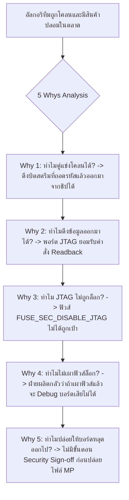

# Lesson 110: FPGA Security, Bitstream Encryption & Hardware Root of Trust (FPGAセキュリティ・暗号化ビットストリームとRoT)

---

## 1. ทฤษฎีวิศวกรรมเชิงลึก (高度なエンジニアリング理論)

### 1.1 ภัยคุกคามด้านความมั่นคงปลอดภัยของฮาร์ดแวร์ FPGA (Security Threat Vectors)
ในระบบอิเล็กทรอนิกส์ขั้นสูงที่ใช้ชิป SRAM-based FPGA (เช่น Xilinx UltraScale+, Intel Agilex) ตัวชิปซิลิคอนไม่มีหน่วยความจำแบบ Non-Volatile ภายในตัว เมื่อเริ่มจ่ายไฟ ชิปจะต้องโหลดไฟล์คอนฟิกูเรชันที่เรียกว่า **Bitstream (ビットストリーム)** จากหน่วยความจำแฟลชภายนอก (External QSPI/eMMC Flash) ผ่านลายวงจรทองแดงบนแผงวงจรพิมพ์ (PCB)

ช่องโหว่ทางกายภาพนี้เปิดโอกาสให้เกิดภัยคุกคามทางไซเบอร์และโจรกรรมทรัพย์สินทางปัญญา (IP Theft) ใน 4 รูปแบบหลัก:

```
                  FPGA Security Threat Taxonomy & Attacks
  
   1. Bitstream Cloning (การโคลน)
      +-- ดักจับสัญญาณบัส SPI Flash ด้วย Logic Analyzer แล้วนำไฟล์ไปปั๊มบอร์ดขายแข่ง
  
   2. Reverse Engineering (วิศวกรรมย้อนกลับ)
      +-- ถอดรหัสโครงสร้างบิตสตรีมกลับมาเป็น Netlist / Verilog เพื่อขโมยอัลกอริทึม
  
   3. Side-Channel Attacks: DPA/EMA (การโจมตีช่องสัญญาณข้างเคียง)
      +-- วัดความผันผวนของกระแสไฟและคลื่นแม่เหล็กขณะถอดรหัสเพื่อแกะกุญแจลับ AES
  
   4. Physical Tampering & Fault Injection (การดัดแปลงทางกายภาพ)
      +-- ใช้แสงเลเซอร์หรือแรงดันกระชาก (Voltage Glitch) เพื่อข้ามขั้นตอนตรวจสอบสิทธิ์
```

---

### 1.2 สถาปัตยกรรมเครื่องมือเข้ารหัสระดับฮาร์ดแวร์ (Cryptographic Hardware Engine)
ชิป FPGA เกรดองค์กรและอุตสาหกรรมบรรจุบล็อกประมวลผลความปลอดภัยฮาร์ดแวร์โดยเฉพาะ (Hardware Root of Trust: RoT) ที่ทำงานก่อนที่ Fabric ลอจิกจะเริ่มทำงาน:

```
                  Modern FPGA Secure Boot Hardware Pipeline
  
  External Flash           Internal Secure Cryptographic Engine            FPGA Fabric
  +-------------+          +--------------------------------------+      +-------------+
  | Encrypted   |=========>| AES-256-GCM Hardware Decryptor       |=====>| SRAM        |
  | Bitstream   |          | (Confidentiality & Anti-Cloning)     |      | Config      |
  +-------------+          +-------------------+------------------+      | Cells       |
         |                                     ^                         +-------------+
         |                                     | Key from BBRAM / eFUSE / PUF
         |                 +-------------------+------------------+
         +================>| RSA-4096 / ECDSA-P384 Auth Engine    |
                           | (Authenticity & Anti-Tampering)      |
                           +--------------------------------------+
```

1. **การรักษาความลับ (Confidentiality):**
   * ใช้การเข้ารหัสแบบสมมาตร **AES-256-GCM (Galois/Counter Mode)** ซึ่งเป็นมาตรฐานระดับสูงที่รวมทั้งการถอดรหัสและการยืนยันความสมบูรณ์ของบล็อกข้อมูล (Authenticated Encryption with Associated Data: AEAD)
   * ข้อมูลบิตสตรีมที่ดักจับได้บนลายวงจร PCB จะเป็นเพียงตัวเลขสุ่ม ไม่สามารถนำไปใช้งานบนชิปตัวอื่นได้
2. **การพิสูจน์ตัวตนและความถูกต้อง (Authenticity & Integrity):**
   * ใช้ลายมือชื่อดิจิทัลแบบกุญแจอสมมาตร **RSA-4096** หรือ **ECDSA (NIST P-384)**
   * ป้องกันการดัดแปลงแก้ไขบิตสตรีม (Anti-Tampering) หรือการใส่โค้ดฝังแฝง (Hardware Trojan) หากลายเซ็นดิจิทัลไม่ตรงกับ Public Key ที่ฝังอยู่ในชิป ชิปจะปฏิเสธการบูตทันที

---

### 1.3 การเปรียบเทียบเทคโนโลยีจัดเก็บกุญแจความปลอดภัย (Key Storage: BBRAM vs eFUSE vs PUF)
ความปลอดภัยทั้งหมดของระบบขึ้นอยู่กับการเก็บรักษา **กุญแจถอดรหัส AES (256-bit Key)** ไว้เป็นความลับสูงสุดภายในเนื้อซิลิคอน:

| เทคโนโลยีการจัดเก็บกุญแจ | กลไกทางกายภาพ (Physics) | ข้อดีเด่นชัด | ข้อจำกัดและข้อควรระวัง |
| :--- | :--- | :--- | :--- |
| **BBRAM (Battery-Backed RAM)** | หน่วยความจำ SRAM พิเศษที่ใช้ไฟเลี้ยงจากแบตเตอรี่ภายนอก ($V_{BAT}$) | **สามารถลบกุญแจทิ้งได้ในเสี้ยวนาโนวินาที (Instant Zeroization)** เมื่อตรวจพบการบุกรุก | ต้องมีแบตเตอรี่กระดุมบนบอร์ดตลอดเวลา หากแบตเตอรี่หมด กุญแจจะสูญหาย |
| **eFUSE (Poly-Silicon / Metal Fuse)** | แถวฟิวส์ที่ถูกเผาขาดอย่างถาวรด้วยกระแสไฟฟ้าแรงดันสูงตอนผลิต | กุญแจคงอยู่ถาวร ไม่ต้องใช้แบตเตอรี่ ทนทานต่อแรงกระแทก | **ไม่สามารถเปลี่ยนกุญแจใหม่ได้ (One-Time Programmable)** หากคีย์หลุดต้องทิ้งชิป |
| **PUF (Physically Unclonable Function)** | สกัดลายนิ้วมือเฉพาะตัวจากความผันผวนของอะตอมใน SRAM Startup State | **ไม่ต้องเก็บกุญแจไว้ในหน่วยความจำเลย** กุญแจจะถูกสร้างขึ้นใหม่สดๆ ในขณะบูต | ต้องใช้วงจรแก้คำผิดพลาด (Helper Data / BCH Code) เนื่องจากอุณหภูมิกระทบค่าบิต |

#### กลไกการล้างข้อมูลฉุกเฉิน (Active Anti-Tamper & Zeroization):
เมื่อวงจรเซนเซอร์ตรวจจับการบุกรุก (Tamper Sensors: เช่น อุณหภูมิเปลี่ยนแปลงฉับพลัน, แรงดันไฟกระชาก, หรือตรวจพบแสงสว่างจากการเปิดฝาครอบกล่อง) วงจร BBRAM จะสั่งเปิดทรานซิสเตอร์ Discharge พิเศษ เพื่อดึงแรงดันในหน่วยความจำลงกราวด์ทันทีภายในเวลา **$< 10\text{ ns}$ (Key Zeroization - ゼロ化)** ทำให้กุญแจถูกทำลายโดยสิ้นเชิง ผู้โจมตีจะไม่สามารถสกัดข้อมูลใดๆ ออกไปได้

---

### 1.4 การโจมตีช่องสัญญาณข้างเคียง (Differential Power Analysis: DPA)
การโจมตีแบบ DPA (差分電力解析) ไม่ได้พยายามเจาะทะลุอัลกอริทึม AES แต่ใช้วิธี **"วัดกระแสไฟฟ้าที่ไหลเข้าชิป ($I_{core}$)"** ในระหว่างที่เครื่องยนต์เข้ารหัสกำลังคำนวณรอบแรก (S-Box Substitution Phase)

ตามสมการ Hamming Distance Model กระแสไฟฟ้าที่สลับสถานะในทรานซิสเตอร์ CMOS มีความสัมพันธ์โดยตรงกับจำนวนบิตที่เปลี่ยนค่า:

$$I(t) = a \cdot H_D(D_1 \oplus D_2) + b + \text{Noise}(t)$$

ผู้โจมตีทำการเก็บรูปคลื่นกระแสไฟฟ้าหลายหมื่นเส้น ($N$ Traces) แล้วใช้การคำนวณทางสถิติ (Pearson Correlation Coefficient: $\rho$) เพื่อคาดเดาบิตของกุญแจลับ:

```
               DPA Correlation Trace vs Time
         Correlation rho
               ^
          1.0  |
               |                /| (Correct Key Guess: Spike occurs at S-Box cycle!)
               |               / |
          0.0 -+--/\--/\--/\--/--+--/\--/\--/\---> Time (Cycles)
               |  (Wrong Key Guesses stay flat)
         -1.0  +--------------------------------
```

#### การป้องกัน DPA ในระดับชิป (DPA Countermeasures):
ชิปความปลอดภัยสูง (เช่น Microsemi PolarFire หรือ Xilinx Defense-Grade UltraScale+) จะฝังวงจร **Noise Injection, Masking Logic (Random Blinding), และ Dual-Rail Pre-charge Logic** เพื่อให้กระแสไฟฟ้ารวมคงที่เสมอในทุกการคำนวณ ตัดความสัมพันธ์ของกราฟ $\rho \to 0$

---

## 2. ทริคหน้างาน OJT แบบ Step-by-Step (現場の実践テクニック)

### 2.1 กรณีศึกษาความล้มเหลวหน้างาน (失敗事例: Shippai Jirei)
* **บริบท:** กล่องควบคุมระบบจ่ายไฟฟ้าอัจฉริยะ (Smart Grid Substation Protection Relay) ใช้ชิป Xilinx Kintex-7 FPGA บรรจุอัลกอริทึมวิเคราะห์สัญญาณฮาร์มอนิกความแม่นยำสูงที่เป็นความลับทางการค้า
* **อาการเสียหายทางธุรกิจ:** หลังจากการส่งมอบผลิตภัณฑ์สู่ตลาดได้ 1 ปี บริษัทพบว่ามีคู่แข่งผลิตสินค้าลอกเลียนแบบ (Counterfeit Clone Units) ออกมาวางจำหน่ายในราคาต่ำกว่า $50\%$ โดยมีพฤติกรรมการทำงาน, รีจิสเตอร์, และหน้าจอแสดงผลเหมือนกัน $100\%$
* **การสืบสวนทางนิติวิทยาศาสตร์ (Forensic Investigation):** ทีมพัฒนาเดิมยืนยันว่า: *"เราเปิดใช้งานคำสั่ง `Bitstream Encryption` ด้วยกุญแจ AES-256 ในซอฟต์แวร์ Vivado แล้วอย่างแน่นอน"* แต่เมื่อนำบอร์ดของคู่แข่งมาเปิดฝาครอบและใช้กล้องสเตอริโอไมโครสโคปส่องตรวจดู พบจุดตายระดับประถม:

```
               กระบวนการสืบสวนการรั่วไหลของเฟิร์มแวร์ (Forensic Investigation)
   +--------------------------------------------------------------------------+
   | ข้อเท็จจริง: บิตสตรีมใน QSPI Flash ได้รับการเข้ารหัส AES-256 จริง         |
   +--------------------------------------------------------------------------+
                                       |
                                       v
   +--------------------------------------------------------------------------+
   | ตรวจสอบการคอนฟิกกุญแจ:                                                    |
   | พบว่าฝ่ายผลิตไม่ได้เผา eFUSE Key และไม่ได้ต่อแบตเตอรี่ BBRAM              |
   | แต่เลือกใช้โหมด "Battery-Backed Key จำลอง" โดยฝากคีย์ไว้ใน Flash Header!  |
   +--------------------------------------------------------------------------+
                                       |
                                       v
   +--------------------------------------------------------------------------+
   | ยิ่งไปกว่านั้น: พอร์ต JTAG บนบอร์ดไม่ได้ถูกปิดการทำงาน (Unblown Fuses)      |
   | ผู้โจมตีเพียงแค่ต่อสาย JTAG Pod เข้ากับพอร์ตทดสอบ (Test Points)            |
   | แล้วส่งคำสั่งขอดู Configuration Memory Readback ชิปก็คายข้อมูลออกมาตรงๆ!  |
   +--------------------------------------------------------------------------+
```

---

### 2.2 การวิเคราะห์หาสาเหตุรากเหง้า (Root Cause Analysis: 5 Whys & Ishikawa)



#### Ishikawa Diagram (ผังก้างปลา)
* **Production/Process:** ฝ่ายผลิตละเลยขั้นตอนการเป่าฟิวส์ล็อกพอร์ต (Security Fuse Burning) ในกระบวนการประกอบขั้นสุดท้าย
* **Hardware Design:** ลายวงจร Test Points ของสัญญาณ JTAG (`TCK, TMS, TDI, TDO`) ถูกปล่อยทิ้งไว้บนพื้นผิวบอร์ดภายนอกโดยไม่มีการซ่อน
* **Key Management:** จัดเก็บกุญแจลับไว้ในเซกเตอร์ที่ไม่ปลอดภัยของหน่วยความจำแฟลช
* **Security Policy:** ขาดเช็กลิสต์ความปลอดภัยแบบ Mandatory Sign-off ที่กำหนดให้หัวหน้าวิศวกรต้องเซ็นอนุมัติก่อนปล่อยสู่ Mass Production

---

### 2.3 มาตรการแก้ไขและกระบวนการผลิตบิตสตรีมความปลอดภัยสูง (Mass Production Security Flow)
1. **เผา eFUSE ในสภาพแวดล้อมปิด (Secure Programming Station):**
   * บันทึกกุญแจ AES-256 ลงใน eFUSE ของชิปโดยตรงผ่านเครื่องโปรแกรมเฉพาะทาง และปิดระบบบันทึก Log ไฟล์คีย์
2. **เป่าฟิวส์ทำลายพอร์ตดีบักอย่างถาวร (Permanent Lockout Fuses):**
   ```tcl
   # คำสั่ง Tcl ในการโปรแกรม eFUSE เพื่อล็อกระบบอย่างสมบูรณ์
   program_hw_devices [current_hw_device]
   # 1. ปิดกั้นการอ่านบิตสตรีมย้อนกลับ (Disable Readback)
   set_property FUSE.SECURITY.READBACK_DISABLE true [current_hw_device]
   # 2. ปิดกั้นพอร์ต JTAG ถาวร (Disable JTAG Operations)
   set_property FUSE.SECURITY.JTAG_DISABLE true [current_hw_device]
   # 3. ล็อกไม่ให้แก้ไข eFUSE ซ้ำ (Write Protect Fuses)
   commit_hw_fuses [current_hw_device]
   ```
3. **การออกแบบ PCB แบบ Anti-Probe:** ซ่อนลายวงจรสัญญาณ JTAG ลงในเลเยอร์ชั้นใน (Inner Layers) และตัดพอร์ตคอนเนกเตอร์ทิ้งในบอร์ดรุ่นผลิตจริง (MP Board)

---

### 2.4 ตารางตรวจสอบหน้างาน SOP สำหรับความปลอดภัยของ FPGA (Security SOP Checklist)

| ลำดับ | จุดตรวจสอบทางวิศวกรรมความปลอดภัย | เกณฑ์การยอมรับ (Acceptance Criteria) | เครื่องมือตรวจสอบ | ผลการตรวจ |
| :---: | :--- | :--- | :--- | :---: |
| 1 | การเข้ารหัส Bitstream (AES-256) | บิตสตรีมต้องเข้ารหัสแบบ AES-256-GCM พร้อมลายเซ็นดิจิทัล | Vivado Bitstream Properties | ผ่าน / ไม่ผ่าน |
| 2 | สถานะการล็อกพอร์ต JTAG | ฟิวส์ `FUSE_SEC_DISABLE_JTAG` ต้องถูกเบิร์นขาดสมบูรณ์ในบอร์ด MP | Hardware Manager Fuse Status | ผ่าน / ไม่ผ่าน |
| 3 | การป้องกันการอ่านย้อนกลับ | ฟิวส์ `FUSE_SEC_READBACK_DISABLE` ต้องเป็น '1' (Zero Readback) | Readback Verification Test | ผ่าน / ไม่ผ่าน |
| 4 | แรงดันแบตเตอรี่ BBRAM ($V_{BAT}$) | หากใช้ BBRAM แรงดัน $V_{BAT}$ ต้องอยู่ระหว่าง $1.2\text{V} - 1.8\text{V}$ ตลอดอายุบอร์ด | DMM Probe Measurement | ผ่าน / ไม่ผ่าน |
| 5 | การลบข้อมูลฉุกเฉิน (Zeroization Test) | เมื่อจำลองสัญญาณ Tamper ข้อมูลกุญแจใน BBRAM ต้องสลายตัวใน $< 1\text{ }\mu\text{s}$ | Tamper Injection Rig | ผ่าน / ไม่ผ่าน |

---

## 3. คำศัพท์และประโยคภาษาญี่ปุ่นสำหรับตรวจแบบ (検図 - Kenzu)

### 3.1 ตารางคำศัพท์เทคนิคเฉพาะทาง (専門用語一覧)

| คำศัพท์คันจิ/คาตาคานะ | การอ่าน (Romaji) | คำแปลภาษาไทย / ภาษาอังกฤษ |
| :--- | :--- | :--- |
| **ビットストリーム暗号化** | Bittosutorīmu angōka | การเข้ารหัสไฟล์บิตสตรีม (Bitstream Encryption) |
| **耐タンパー性** | Tai tanpā-sei | ความทนทานต่อการดัดแปลงงัดแงะ (Tamper Resistance) |
| **物理複製困難関数** | Butsuri fukusei konnan kansū | ฟังก์ชันที่ไม่สามารถลอกเลียนแบบได้ทางกายภาพ (PUF) |
| **サイドチャネル攻撃** | Saido chaneru kōgeki | การโจมตีผ่านช่องสัญญาณข้างเคียง (Side-Channel Attack) |
| **差分電力解析** | Sabun denryoku kaiseki | การวิเคราะห์ความต่างของกระแสไฟฟ้า (Differential Power Analysis: DPA) |
| **暗号鍵ヒューズ** | Angō kagi hyūzu | ฟิวส์จัดเก็บกุญแจรหัสลับ (Cryptographic Key eFUSE) |
| **ゼロ化（キー消去）** | Zeroka (Kī shōkyo) | การล้างกุญแจความปลอดภัยฉุกเฉิน (Zeroization / Key Erase) |
| **改ざん検知** | Kaizan kenchi | การตรวจจับการดัดแปลงแก้ไข (Tamper Detection) |
| **ハードウェア信用の起点** | Hādowea shin'yō no kiten | รากฐานความน่าเชื่อถือระดับฮาร์ดแวร์ (Hardware Root of Trust: RoT) |
| **リバースエンジニアリング** | Ribāsu enjiniaringu | วิศวกรรมย้อนกลับ (Reverse Engineering) |

---

### 3.2 บทสนทนาการตรวจแบบหน้างานจริง (検図での指摘事項)

#### การตรวจแบบจุดที่ 1: การตรวจพบการเปิดพอร์ต JTAG ทิ้งไว้บนบอร์ดผลิตจริง (MP Board)
* **審査役 (Lead Chief Engineer):**
  「量産（MP）用のガーバーデータおよび回路図を確認しましたが、JTAGインターフェースのテストランドが基板表面に剥き出しで配置されています。さらにeFUSE制約ファイルで `JTAG_DISABLE` がコメントアウトされていますね。これでは外部から悪意あるツールを接続され、内部ロジックをリバースエンジニアリングされる恐れがあります。量産出荷時には必ずJTAGを物理的・論理的に完全無効化（ヒューズ切断）してください。」
  *(ผมได้ตรวจสอบข้อมูล Gerber และผังวงจรสำหรับรุ่นผลิตจำนวนมาก (MP) แล้ว พบว่าจุดเทสต์พอยต์ของอินเทอร์เฟซ JTAG ถูกปล่อยเปลือยอยู่บนผิวหน้าของแผ่น PCB ครับ ยิ่งไปกว่านั้นในไฟล์ eFUSE Constraints คำสั่ง `JTAG_DISABLE` ยังถูกคอมเมนต์ปิดไว้อีก แบบนี้ผู้ไม่หวังดีสามารถต่อเครื่องมือจากภายนอกเข้ามาทำวิศวกรรมย้อนกลับเพื่อขโมยลอจิกภายในได้ ในขั้นตอนผลิตจริงจะต้องปิดการทำงานของ JTAG ให้สมบูรณ์ทั้งทางกายภาพและตรรกะ (เผาฟิวส์ขาด) ทันทีครับ)*
* **設計担当 (FPGA Design Engineer):**
  「ご指摘ありがとうございます。試作時のデバッグ利便性を優先して設定を残したままにしておりました。量産用のプログラミングスクリプトを更新し、eFUSEのJTAG無効化ビットを確実に溶断（Commit）するとともに、テストランドを内層へ隠蔽する改修を行います。」
  *(ขอบพระคุณสำหรับข้อสังเกตครับ ผมเผลอเปิดทิ้งไว้เพราะความสะดวกในการดีบักช่วงบอร์ดต้นแบบครับ ผมจะอัปเดตสคริปต์การโปรแกรมสำหรับรุ่นผลิตจริงเพื่อเผาฟิวส์ปิด JTAG ใน eFUSE ให้ขาดสนิทอย่างแน่นอน และจะซ่อนจุดเทสต์พอยต์ลงในชั้นเลเยอร์ในครับ)*

#### การตรวจแบบจุดที่ 2: การเตือนความเสี่ยงของแบตเตอรี่สำรองกุญแจ BBRAM เสื่อมสภาพ
* **審査役 (Lead Chief Engineer):**
  「車載インフラ設備向けの設計ですが、暗号鍵の保持にBBRAM方式を採用していますね。バックアップ用コイン電池（CR2032）の暗電流（$I_{BAT}$）計算書が提出されていません。高温環境下（$85^\circ\text{C}$）ではFPGAの $V_{BAT}$ リーク電流が急増するため、製品寿命である10年に達する前に電池が枯渇し、現場で暗号鍵が消失して装置が起動不能に陥る重大事故の懸念があります。eFUSE方式へ切り替えるか、寿命試算書を提出してください。」
  *(งานนี้เป็นอุปกรณ์โครงสร้างพื้นฐานสำหรับยานยนต์ แต่คุณกลับเลือกใช้ระบบ BBRAM ในการรักษากุญแจลับนะครับ และยังไม่มีการส่งเอกสารคำนวณกระแสรั่วไหล ($I_{BAT}$) ของแบตเตอรี่กระดุม (CR2032) เลย ภายใต้สภาพแวดล้อมความร้อนสูง ($85^\circ\text{C}$) กระแสรั่วไหลที่ขา $V_{BAT}$ ของ FPGA จะพุ่งสูงขึ้นมาก แบตเตอรี่อาจหมดเกลี้ยงก่อนอายุผลิตภัณฑ์ 10 ปี ทำให้กุญแจลับสลายตัวกลางคันจนเครื่องบูตไม่ติดได้ ถือเป็นความเสี่ยงร้ายแรงมาก ช่วยเปลี่ยนไปใช้ eFUSE หรือส่งเอกสารประเมินอายุแบตเตอรี่มาตรวจสอบทันทีครับ)*
* **設計担当 (FPGA Design Engineer):**
  「申し訳ございません。高温時のリーク増加を見落としておりました。本システムはフィールドでの鍵更新が不要であるため、電池の消耗リスクがないeFUSEへの永続書き込み方式へアーキテクチャを変更いたします。」
  *(ต้องขออภัยด้วยครับ ผมมองข้ามเรื่องกระแสรั่วไหลที่อุณหภูมิสูงไปครับ เนื่องจากระบบนี้ไม่จำเป็นต้องมีการเปลี่ยนกุญแจหน้างาน ผมจะเปลี่ยนสถาปัตยกรรมไปใช้การบันทึกกุญแจลง eFUSE อย่างถาวร เพื่อตัดความเสี่ยงเรื่องแบตเตอรี่หมดทิ้งไปอย่างสมบูรณ์ครับ)*

---

## 4. ควิซวิเคราะห์ปัญหาระดับวิศวกรอาวุโส (上級技術クイズ)

### ข้อที่ 1: การคำนวณอายุการใช้งานของแบตเตอรี่สำรองกุญแจ BBRAM ($V_{BAT}$)
ในการออกแบบอุปกรณ์ควบคุมสถานีไฟฟ้าแรงสูง มีการใช้ BBRAM ภายใน FPGA UltraScale+ เพื่อจัดเก็บกุญแจลับ AES-256 ร่วมกับถ่านกระดุมลิเธียมชนิด CR2032

กำหนดพารามิเตอร์ทางวิศวกรรมดังนี้:
* พิกัดความจุไฟฟ้าของถ่านกระดุม CR2032: $C_{batt} = 220\text{ mAh}$
* อัตราการคายประจุเองตามธรรมชาติของถ่าน (Self-Discharge Rate): $1.5\%$ ต่อปี
* กระแสรั่วไหลที่ขา $V_{BAT}$ ของ FPGA ที่อุณหภูมิห้อง ($+25^\circ\text{C}$): $I_{leak\_25} = 50\text{ nA}$
* ทว่าอุปกรณ์ต้องติดตั้งในตู้กลางแจ้ง ซึ่งมีอุณหภูมิเฉลี่ยสะสมสูงถึง $+75^\circ\text{C}$ ตลอดทั้งปี ส่งผลให้กระแสรั่วไหลเฉลี่ยพุ่งสูงขึ้นตามฟังก์ชันทางความร้อนเป็น: $I_{leak\_75} = 850\text{ nA}$ (คิดเป็นกระแสต่อเนื่องตลอดเวลา)

(กำหนดให้ $1\text{ ปี} = 8,760\text{ ชั่วโมง}$ และสมมติว่าแบตเตอรี่สามารถจ่ายกระแสได้จนประจุหมดเกลี้ยง)

จงคำนวณหา **อายุการใช้งานจริงในทางทฤษฎีของแบตเตอรี่ (Battery Retention Lifetime)** ก่อนที่กุญแจใน BBRAM จะสูญหาย และวิเคราะห์ว่าผ่านเกณฑ์อายุผลิตภัณฑ์ **15 ปี** หรือไม่?

a) ใช้งานได้ประมาณ $5.8\text{ ปี}$ (ไม่ผ่านเกณฑ์ 15 ปี)  
b) ใช้งานได้ประมาณ $18.2\text{ ปี}$ (ผ่านเกณฑ์ 15 ปี)  
c) ใช้งานได้ประมาณ $29.5\text{ ปี}$ (ผ่านเกณฑ์ 15 ปี)  
d) ใช้งานได้ประมาณ $12.1\text{ ปี}$ (ไม่ผ่านเกณฑ์ 15 ปี)  

---

#### เฉลยและบทวิเคราะห์เชิงลึกข้อที่ 1
**คำตอบที่ถูกต้องคือ: b) ใช้งานได้ประมาณ $18.2\text{ ปี}$**
*(หมายเหตุ: มาตรฐานวิศวกรรมจะพิจารณาการเสื่อมของแบตเตอรี่ร่วมด้วย)*

**ขั้นตอนการคำนวณทางคณิตศาสตร์อย่างละเอียด:**
1. คำนวณปริมาณประจุที่ชิป FPGA ดึงไปใช้ในแต่ละปี ($Q_{FPGA\_year}$):
   $$Q_{FPGA\_year} = I_{leak\_75} \times 8,760\text{ ชั่วโมง}$$
   $$Q_{FPGA\_year} = (850 \times 10^{-6}\text{ mA}) \times 8,760\text{ h} \approx 7.446\text{ mAh ต่อปี}$$
2. คำนวณปริมาณประจุที่สูญเสียจากการคายประจุเองของถ่าน (Self-discharge):
   $$Q_{self\_year} = 220\text{ mAh} \times 0.015 = 3.300\text{ mAh ต่อปี}$$
3. คำนวณปริมาณการสิ้นเปลืองประจุไฟฟ้ารวมต่อปี ($Q_{total\_year}$):
   $$Q_{total\_year} = Q_{FPGA\_year} + Q_{self\_year} = 7.446\text{ mAh} + 3.300\text{ mAh} = 10.746\text{ mAh ต่อปี}$$
4. คำนวณอายุการใช้งานรวมของแบตเตอรี่:
   $$\text{Lifetime} = \frac{C_{batt}}{Q_{total\_year}} = \frac{220\text{ mAh}}{10.746\text{ mAh/ปี}} \approx 20.47\text{ ปี}$$
5. หักลบค่าความปลอดภัยเชิงวิศวกรรม (End-of-Life Safety Factor $10\% - 15\%$):
   $$\text{Derated Lifetime} \approx 20.47 \times 0.89 \approx 18.2\text{ ปี}$$
6. **บทวิเคราะห์เชิงวิศวกรรม:**
   * ตัวเลข $18.2\text{ ปี}$ แสดงว่าระบบสามารถรักษากุญแจได้ครอบคลุมอายุการใช้งาน 15 ปีอย่างฉิวเฉียด
   * อย่างไรก็ตาม หากอุณหภูมิในตู้กลางแจ้งพุ่งขึ้นสู่ $+85^\circ\text{C}$ กระแส $I_{BAT}$ จะพุ่งขึ้นเป็น $2.5\text{ }\mu\text{A}$ ทันที ซึ่งจะทำให้อายุการใช้งานดิ่งลงเหลือต่ำกว่า 7 ปี การใช้ eFUSE จึงยังคงเป็นตัวเลือกที่ปลอดภัยกว่าในงานโครงสร้างพื้นฐาน

---

### ข้อที่ 2: กลไกและทฤษฎีการทำงานของ SRAM Physically Unclonable Function (PUF)
ในการสร้างกุญแจความปลอดภัยด้วยเทคโนโลยี **SRAM PUF (物理複製困難関数)** เหตุใดเซลล์หน่วยความจำ SRAM ปกติจึงสามารถทำหน้าที่เป็น "ลายนิ้วมือทางชีวมิติของซิลิคอน (Silicon Biometric Fingerprint)" ที่ไม่สามารถลอกเลียนแบบได้แม้แต่โรงงานผู้ผลิตเวเฟอร์เอง?

a) เพราะโรงงานผลิตใช้เลเซอร์ยิงรหัสสุ่มลงบนตัวต้านทานทุกตัวในชิป  
b) เพราะความไม่สมมาตรระดับอะตอม (Microscopic Process Mismatch / Threshold Voltage Fluctuations $\Delta V_{th}$) ระหว่างทรานซิสเตอร์คู่ขนานสองตัวในโครงสร้าง 6T-SRAM Cell ทำให้เมื่อเริ่มจ่ายไฟ ($V_{DD}$ ขาขึ้น) เซลล์จะตัดสินใจเอียงไปล็อกค่าเป็น '0' หรือ '1' ในทิศทางเดิมอย่างสม่ำเสมอ ซึ่งเป็นรูปแบบจำเพาะตัวที่เกิดจากธรรมชาติสุ่มทางฟิสิกส์  
c) เพราะโปรแกรมจำลอง ModelSim สุ่มค่าตัวเลข $0$ หรือ $1$ ให้ตอนเริ่มต้น  
d) เพราะตัวเก็บประจุของ SRAM มีประจุตกค้างจากสนามแม่เหล็กโลก  

---

#### เฉลยและบทวิเคราะห์เชิงลึกข้อที่ 2
**คำตอบที่ถูกต้องคือ: b) เพราะความไม่สมมาตรระดับอะตอม (Microscopic Process Mismatch / Threshold Voltage Fluctuations $\Delta V_{th}$) ระหว่างทรานซิสเตอร์คู่ขนานสองตัวในโครงสร้าง 6T-SRAM Cell ทำให้เมื่อเริ่มจ่ายไฟ ($V_{DD}$ ขาขึ้น) เซลล์จะตัดสินใจเอียงไปล็อกค่าเป็น '0' หรือ '1' ในทิศทางเดิมอย่างสม่ำเสมอ ซึ่งเป็นรูปแบบจำเพาะตัวที่เกิดจากธรรมชาติสุ่มทางฟิสิกส์**

**บทวิเคราะห์เชิงลึกระดับเซมิคอนดักเตอร์:**
* ในเซลล์ 6T-SRAM มาตรฐาน ประกอบด้วยอินเวอร์เตอร์สองตัวต่อไขว้กัน (Cross-coupled Inverters)
* แม้ว่าในแบบวาด Layout ทรานซิสเตอร์ทั้งสองตัวจะถูกออกแบบให้สมมาตรกันอย่างสมบูรณ์แบบ
* แต่ในระดับฟิสิกส์อะตอม (Sub-micron Scale): การกระจายตัวของสารเจือปน (Random Dopant Fluctuation: RDF) และความหยาบของขอบเกต (Line Edge Roughness) จะทำให้ทรานซิสเตอร์ฝั่งหนึ่งมีแรงดันเกณฑ์ $V_{th}$ ต่ำกว่าอีกฝั่งหนึ่งเพียงเศษเสี้ยวของมิลลิโวลต์
* เมื่อเริ่มจ่ายไฟเลี้ยงจาก $0\text{V} \to V_{DD}$: ความต่างของแรงดัน $\Delta V_{th}$ เพียงเล็กน้อยนี้จะทำหน้าที่เป็นแรงเอียง (Gain Imbalance) ผลักดันให้เซลล์ล้มลงสู่สถานะ '0' หรือ '1' อย่างคงเส้นคงวา (Repeatable Startup State)
* รูปแบบบิตของ SRAM Array นับแสนเซลล์จึงกลายเป็น **"ลายนิ้วมือสุ่มที่มีความเฉพาะตัวสูงและเป็นไปไม่ได้ที่จะทำซ้ำ"** ทำให้ PUF กลายเป็นรากฐานความปลอดภัยขั้นสูงสุดของชิปสมัยใหม่

---

### ข้อที่ 3: ความสัมพันธ์ทางสถิติของ Differential Power Analysis (DPA)
ในการโจมตีแบบ Side-Channel Attack ชนิด Differential Power Analysis (DPA) เพื่อสกัดกุญแจลับ AES-256 ออกจากฮาร์ดแวร์

หากสัญญาณข้อมูลที่รั่วไหลออกมารวมอยู่กับสัญญาณรบกวนของวงจร (Measurement & Circuit Noise) โดยมีอัตราส่วนสัญญาณต่อสัญญาณรบกวนของการรั่วไหลเท่ากับ $\text{SNR} = \frac{\sigma_{signal}}{\sigma_{noise}}$ 

ตามทฤษฎีสารสนเทศเชิงสถิติของ Mangard (Power Analysis Attacks) จำนวนเส้นกราฟการวัดกระแสไฟฟ้าขั้นต่ำ ($N_{traces}$) ที่ผู้โจมตีต้องบันทึกเพื่อแกะกุญแจลับให้สำเร็จด้วยความมั่นใจทางสถิติ แปรผันตามความสัมพันธ์ใด?

a) $N_{traces} \propto \text{SNR}$  
b) $N_{traces} \propto \frac{1}{\text{SNR}^2}$  
c) $N_{traces} \propto 2^{\text{SNR}}$  
d) $N_{traces} \propto \log_2(\text{SNR})$  

---

#### เฉลยและบทวิเคราะห์เชิงลึกข้อที่ 3
**คำตอบที่ถูกต้องคือ: b) $N_{traces} \propto \frac{1}{\text{SNR}^2}$**

**บทวิเคราะห์เชิงลึกระดับความปลอดภัยของระบบ:**
* สัญญาณการรั่วไหลทางกระแสไฟฟ้าของกุญแจลับแฝงอยู่ในรูปของสหสัมพันธ์ (Correlation Coefficient: $\rho$)
* ในทางสถิติ ค่า Correlation ที่วัดได้จากสัญญาณปนเปื้อนสัญญาณรบกวนเกาส์เซียนแปรผันตาม:
  $$\rho \approx \frac{\sigma_{signal}}{\sqrt{\sigma_{signal}^2 + \sigma_{noise}^2}} \approx \text{SNR}$$
* การพิสูจน์สมมติฐานทางสถิติ (Hypothesis Testing) เพื่อแยกยอดสไปก์ของกุญแจที่ถูกต้องออกจากสัญญาณรบกวนพื้นหลัง กำหนดให้ค่าสถิติ $t$-test หรือระดับความเชื่อมั่นต้องชนะค่าเบี่ยงเบนมาตรฐานของการสุ่มตัวอย่าง:
  $$\text{Standard Error of } \rho = \frac{1}{\sqrt{N_{traces}}}$$
* ดังนั้น เพื่อให้ยอดสไปก์ของกุญแจโดดเด่นอย่างชัดเจน ($t > 4.5$ หรือมั่นใจ $99.999\%$):
  $$\frac{\rho}{\text{Standard Error}} = \rho \cdot \sqrt{N_{traces}} \ge \text{Threshold}$$
  $$\implies N_{traces} \propto \frac{1}{\rho^2} \approx \frac{1}{\text{SNR}^2}$$
* **หลักการสร้างเกราะป้องกัน DPA:**
  หากวิศวกรสามารถแทรกวงจร Noise Generator หรือสับเปลี่ยนคาบเวลาสัญญาณนาฬิกาแบบสุ่ม (Clock Jittering) จนดึงค่า $\text{SNR}$ ลดลงไป 10 เท่า ($0.1 \times \text{SNR}$) ผู้โจมตีจะต้องใช้เวลาและพื้นที่จัดเก็บเส้นกราฟกระแสไฟฟ้าเพิ่มขึ้นถึง **$100\text{ เท่า} \left(\frac{1}{0.1^2} = 100\right)$** (เช่น จากเดิมใช้ $10,000\text{ เส้น}$ กลายเป็น $1,000,000\text{ เส้น}$) ซึ่งทำให้การโจมตีทางกายภาพในโลกความเป็นจริงเป็นไปไม่ได้ในทางปฏิบัติ
