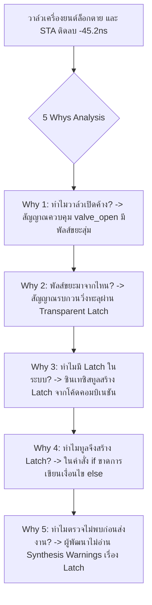

# Lesson 111: FPGA Architecture & VHDL Fundamentals (Senior Level) (FPGAシリコンアーキテクチャとVHDL論理合成推論)

---

## 1. ทฤษฎีวิศวกรรมเชิงลึก (高度なエンジニアリング理論)

### 1.1 สถาปัตยกรรมระดับซิลิคอนของ FPGA (Silicon Microarchitecture)
ในการก้าวขึ้นสู่ระดับ Lead Hardware Architect วิศวกรต้องตระหนักว่าภาษา VHDL (VHSIC Hardware Description Language) ไม่ใช่ภาษาโปรแกรมเชิงคำสั่ง (Procedural Software) แต่เป็น **"ภาษาพรรณนาโครงสร้างทางกายภาพของวงจรฮาร์ดแวร์"** ทุกประโยคที่เขียนลงใน RTL จะต้องถูกคอมไพเลอร์แปลงไปเป็นกลุ่มทรานซิสเตอร์จริงบนเวเฟอร์ซิลิคอน

โครงสร้างแกนหลักของ FPGA สมัยใหม่ (เช่น Xilinx 7-Series/UltraScale+ หรือ Intel Cyclone/Stratix) ประกอบด้วยหน่วยตรรกะพื้นฐานที่เรียกว่า **Configurable Logic Block (CLB)** หรือ **Logic Array Block (LAB)** ซึ่งประกอบด้วยองค์ประกอบย่อยดังนี้:

```
               Silicon Microarchitecture of an FPGA CLB / Slice
  
      +-----------------------------------------------------------------------+
      |  CLB / Slice (ประกอบด้วย 4 หรือ 8 Logic Cells)                          |
      |                                                                       |
      |   Inputs [A1..A6]                                                     |
      |         |                                                             |
      |         v                                                             |
      |   +-----------+          +---------------+                            |
      |   | 6-Input   |-- O6 --->| Fast Carry    |                            |
      |   |    LUT    |-- O5 -+  | Chain Logic   |                            |
      |   +-----------+       |  | (CARRY4/8)    |                            |
      |                       |  +-------+-------+                            |
      |                       |          |                                    |
      |                       v          v                                    |
      |                   +---+----------+---+                                |
      |                   | Wide Multiplexer | (MUXF7 / MUXF8)                |
      |                   +---------+--------+                                |
      |                             |                                         |
      |                             v                                         |
      |                   +------------------+                                |
      |                   | Slice Register   |-----> Q (Registered Output)    |
      |                   | (D-FF or Latch)  |                                |
      |                   +------------------+                                |
      +-----------------------------------------------------------------------+
```

1. **6-Input Look-Up Table (LUT6):**
   * หัวใจของลอจิกคอมบิเนชัน คือหน่วยความจำ SRAM ขนาด $2^6 = 64\text{ บิต}$ ทำหน้าที่จำลองตารางค่าความจริง (Truth Table) ใดๆ ที่มีอินพุตไม่เกิน 6 ตัวแปร
   * สามารถแยกทำงานเป็น **Dual 5-Input LUTs (LUT5)** จำนวน 2 ชุดที่มีอินพุต $A_1..A_5$ ร่วมกัน แต่ให้เอาต์พุตอิสระ 2 ช่อง ($O_5$ และ $O_6$)
2. **Dedicated Fast Carry Chain (CARRY4 / CARRY8):**
   * วงจรโซ่ตัวทดความเร็วสูงระดับฮาร์ดแวร์ฮาร์ดไวร์ (Hardwired Lookahead Carry) สำหรับการคำนวณคณิตศาสตร์ (Adder, Subtractor, Counter) มีเวลาหน่วงในระดับพิโกวินาที ($t_{carry} \approx 15 - 25\text{ ps}$ ต่อบิต) ซึ่งเร็วกว่าการสร้าง Adder ด้วย LUT ธรรมดาถึง 10 เท่า
3. **Wide Multiplexers (MUXF7, MUXF8):**
   * มัลติเพล็กเซอร์เฉพาะทางที่รวมเอาต์พุตของ LUT6 หลายตัวเข้าด้วยกัน ทำให้สามารถสร้างมัลติเพล็กเซอร์ขนาด $8:1$ หรือฟังก์ชันตรรกะ 7 อินพุต และ 8 อินพุต ได้โดยไม่ต้องวิ่งผ่านโครงข่ายสายทองแดงทั่วไป
4. **Slice Registers:**
   * ฟลิปฟลอปแบบขอบสัญญาณนาฬิกา (Edge-Triggered D-FF) ซึ่งสามารถคอนฟิกให้ทำงานเป็น Transparent Latch ได้ แต่ในมาตรฐานการออกแบบเชิงตัวเลขจะหลีกเลี่ยงการใช้เป็น Latch

---

### 1.2 ระบบชนิดข้อมูลที่เข้มงวดของ VHDL (Strong Typing System)
VHDL โดดเด่นเหนือภาษาอื่นด้วยระบบตรวจสอบชนิดข้อมูลที่เข้มงวดที่สุดในวงการฮาร์ดแวร์ เพื่อป้องกันข้อผิดพลาดในการเชื่อมต่อบัส:

```
                  VHDL Standard Library Hierarchy & Packages
  
   [ library IEEE; ]
   +-- use IEEE.std_logic_1164.all;   --> นิยามสัญญาณสายไฟ 9-Value: std_logic, std_logic_vector
   +-- use IEEE.numeric_std.all;      --> มาตรฐานสากลสำหรับคำนวณคณิตศาสตร์: signed, unsigned
   
   [ ข้อควรระวัง: ห้ามใช้ไลบรารีเก่าที่ล้าสมัย (Deprecated / Non-standard) ]
   X-- use IEEE.std_logic_arith.all;  --> ซินอปซิสแพ็กเกจเก่า ขัดแย้งกับ numeric_std
   X-- use IEEE.std_logic_unsigned.all;
```

#### การแปลงชนิดข้อมูลที่ถูกต้องตามมาตรฐาน IEEE 1076.3 (`numeric_std`):
เมื่อต้องการนำบัสสัญญาณ `std_logic_vector` มาบวกเลขคณิต จะต้องทำการ Cast ชนิดข้อมูลอย่างเป็นทางการ:

```vhdl
-- การเขียนที่ถูกต้องระดับมืออาชีพ (Senior Standard)
signal raw_bus   : std_logic_vector(15 downto 0);
signal u_counter : unsigned(15 downto 0);
signal s_offset  : signed(15 downto 0);

-- แปลงจาก Vector ไปเป็น Unsigned ก่อนนำไปบวก
u_counter <= unsigned(raw_bus) + 1;

-- แปลงผลลัพธ์กลับเป็น std_logic_vector
raw_bus <= std_logic_vector(u_counter);
```

---

### 1.3 กลไกการเกิด Unintentional Latch และหายนะต่อระบบ
ในกระบวนการแบบคอมบิเนชัน (`process(all)` หรือ `process(sensitivity_list)`) หากวิศวกรระบุเงื่อนไขในคำสั่ง `if-else` หรือ `case` ไม่ครบถ้วน คอมไพเลอร์สังเคราะห์ลอจิกจะอนุมานว่า **"ผู้ออกแบบต้องการให้คงค่าเดิมไว้เมื่อเงื่อนไขไม่ตรง"** ซึ่งในทางฮาร์ดแวร์ไม่มีฟลิปฟลอปมารับคำสั่ง เครื่องมือจึงต้องสร้าง **Transparent Latch (意図しないラッチ)** ขึ้นมาทันที

```
               Flip-Flop (ดี) เทียบกับ Inferred Latch (อันตราย)
  
  [ Edge-Triggered D-FF ]:                      [ Level-Sensitive Transparent Latch ]:
  เปลี่ยนค่าเฉพาะที่ขอบ Clock                   เมื่อ Enable = '1' สัญญาณอินพุตจะวิ่งทะลุ
  ตัดขาดความล่าช้า ไม่เสี่ยง Glitch             ทำให้เกิด Combinational Loop และ Glitch ทันที
        +---------+                                   +---------+
  D --->| D     Q |---> Q                       D --->| D     Q |---> Q
        |         |                                   |         |
  CLK ->|>        |                             EN -->| G       |
        +---------+                                   +---------+
```

#### ทำไม Inferred Latch จึงเป็นสิ่งต้องห้ามเด็ดขาดใน FPGA?
1. **Timing Analysis ล้มเหลว (Timing Closure Nightmare):** Latch มีคุณสมบัติยืมเวลา (Time Borrowing) ทำให้เครื่องมือวิเคราะห์เวลา (STA) ไม่สามารถคำนวณ Setup/Hold Time ที่แม่นยำได้ และมักสร้าง False Timing Violations นับร้อยเส้นทาง
2. **ความไวต่อ Glitch:** ในช่วงที่ขาเกต $G$ เป็น '1' สัญญาณรบกวนหนามแหลม (Glitch) ใดๆ จากวงจรคอมบิเนชันก่อนหน้าจะวิ่งทะลุผ่าน Latch ไปยังวงจรถัดไปโดยตรง
3. **การทดสอบการผลิตพังทลาย (DFT/ATPG Failure):** โครงสร้าง Latch ไม่รองรับการทำ Scan Chain สำหรับการทดสอบความบกพร่องของชิป (Automated Test Pattern Generation)

---

### 1.4 การเปรียบเทียบเชิงสถาปัตยกรรม: Cascaded `if-else` vs Balanced `case`
วิธีที่วิศวกรเขียนคำสั่งเลือกเงื่อนไขส่งผลโดยตรงต่อโครงสร้างวงจรจริงในซิลิคอน:

```vhdl
-- แบบที่ 1: Cascaded if-else (สร้าง Priority Encoder โดยธรรมชาติ)
process(all)
begin
    if (req(3) = '1') then     grant <= "1000";
    elsif (req(2) = '1') then  grant <= "0100";
    elsif (req(1) = '1') then  grant <= "0010";
    else                       grant <= "0001";
    end if;
end process;

-- แบบที่ 2: Balanced Parallel Case Statement
process(all)
begin
    case req is
        when "1000" => grant <= "1000";
        when "0100" => grant <= "0100";
        when "0010" => grant <= "0010";
        when others => grant <= "0001";
    end case;
end process;
```

```
                 ฮาร์ดแวร์ที่ถูกสร้างจริงในซิลิคอน (Hardware Inference)
  
  [ Cascaded if-else ]: มัลติเพล็กเซอร์ต่อเรียงเป็นชั้นๆ (High Logic Depth)
         req(3)          req(2)          req(1)
           |               |               |
           v               v               v
  "1000"->[MUX]----+      |               |
          |        +---->[MUX]----+       |
          +------------->|        +----->[MUX]---> grant (Propagation Delay ยาวนาน)
                         +-------------->|
  
  [ Balanced Case ]: มัลติเพล็กเซอร์แบบขนานระดับเดียว (Single-Level LUT)
  req[3:0] ---->[ 6-Input LUT (Single Level) ]---> grant (Delay ต่ำสุดสม่ำเสมอ)
```

---

## 2. ทริคหน้างาน OJT แบบ Step-by-Step (現場の実践テクニック)

### 2.1 กรณีศึกษาความล้มเหลวหน้างาน (失敗事例: Shippai Jirei)
* **บริบท:** กล่องควบคุมระบบจ่ายเชื้อเพลิงอากาศยาน (Full Authority Digital Engine Control: FADEC) พัฒนาด้วยภาษา VHDL บนชิป Microchip PolarFire FPGA
* **อาการเสียหน้างาน:** การจำลองพฤติกรรม (Behavioral Simulation) ผ่านการทดสอบ $100\%$ แต่เมื่อรันการวิเคราะห์เวลา (Static Timing Analysis) ระบบฟ้องค่า Total Negative Slack ติดลบอย่างรุนแรง **$\text{TNS} = -45.2\text{ ns}$** มีเส้นทางล้มเหลวมากกว่า 300 เส้นทาง และเมื่อนำบอร์ดต้นแบบไปเปิดสวิตช์ทำงานจริง วงจรควบคุมวาล์วจะเกิดอาการล็อกตาย (Freeze) สุ่มเฉลี่ยทุกๆ 20 นาที
* **การสืบสวนโค้ด RTL:** เมื่อทีมตรวจแบบเปิดตรวจสอบซอร์สโค้ดไฟล์ `valve_arbiter.vhd` พบการเขียนคำสั่งควบคุมสัญญาณเปิดปิดวาล์วดังนี้:

```vhdl
-- โค้ดต้นเหตุความล้มเหลวหน้างาน (Shippai Code)
process(sensor_state, valve_mode)
begin
    if (valve_mode = "01") then
        valve_open <= '1';
    elsif (valve_mode = "10" and sensor_state = '1') then
        valve_open <= '0';
    end if;
    -- ผู้ออกแบบลืมระบุสาขา else! เมื่อ valve_mode = "00" หรือ "11" 
    -- สัญญาณ valve_open ไม่มีการกำหนดค่า!
end process;
```

```
               ผลกระทบของการเกิด Inferred Latch ในระบบจริง (Shippai Analysis)
   +--------------------------------------------------------------------------+
   | ซอร์สโค้ด VHDL ขาดสาขา else ในกระบวนการ Combinational                    |
   +--------------------------------------------------------------------------+
                                       |
                                       v
   +--------------------------------------------------------------------------+
   | ผลการสังเคราะห์: คอมไพเลอร์มองว่าต้องจำค่าเดิม จึงสร้าง Transparent Latch |
   | บรรจุ Latch จำนวน 16 บิตลงใน Slice โดยที่ขา Gate ถูกขับด้วยลอจิกโหมด      |
   +--------------------------------------------------------------------------+
                                       |
                                       v
   +--------------------------------------------------------------------------+
   | หายนะทางกายภาพ: ขา Gate มี Glitch ขนาด 2.2 ns จากวงจรเซนเซอร์            |
   | สัญญาณรบกวนทำให้ Latch เปิดค้างในจังหวะสุ่ม ทำให้วาล์วเปิดค้าง              |
   | เครื่องมือ STA พังทลายเพราะ Latch สร้างวงวนป้อนกลับ (Feedback Loop)      |
   +--------------------------------------------------------------------------+
```

---

### 2.2 การวิเคราะห์หาสาเหตุรากเหง้า (Root Cause Analysis: 5 Whys & Ishikawa)



#### Ishikawa Diagram (ผังก้างปลา)
* **Coding Practice:** ละเลยการกำหนดค่าตั้งต้น (Default Value Assignment) ที่หัวของโพรเซสคอมบิเนชัน
* **Tool Configuration:** ไม่ได้ตั้งค่าให้ Synthesis Tool ถือว่าคำเตือนเรื่อง Latch เป็นข้อผิดพลาดร้ายแรง (Treat Latch Warnings as Errors)
* **Simulation Limitations:** การทดสอบ RTL Simulation ข้ามสภาวะเงื่อนไขมุมอับ (`valve_mode = "00"`)
* **Review Process:** ขาดเช็กลิสต์การตรวจนับจำนวน Latch ในรายงาน Synthesis Utilization Report

---

### 2.3 มาตรการแก้ไขและกฎทองการเขียน VHDL ที่ปราศจาก Latch
1. **กฎข้อที่ 1: กำหนดค่าดีฟอลต์ที่บรรทัดแรกของโพรเซสคอมบิเนชันเสมอ (Default Assignment Rule):**
   ```vhdl
   -- วิธีแก้ไขที่ถูกต้อง 100% ปลอดภัยจากการเกิด Latch
   process(all)
   begin
       -- 1. กำหนดค่าเริ่มต้นเสมอ (Default Assignment)
       valve_open <= '0'; 
       
       -- 2. ประเมินเงื่อนไข
       if (valve_mode = "01") then
           valve_open <= '1';
       elsif (valve_mode = "10" and sensor_state = '1') then
           valve_open <= '0';
       end if;
       -- แม้เงื่อนไขไม่ตรง ก็จะดึงค่าดีฟอลต์ '0' มาใช้ ไม่มีวันเกิด Latch!
   end process;
   ```
2. **กฎข้อที่ 2: ใช้คำสั่ง `when others` ในทุกคำสั่ง `case`:**
   แม้ว่าจะแจกแจงเงื่อนไขครบทุกสถานะแล้วก็ตาม ต้องปิดท้ายด้วย `when others => null;` หรือกำหนดค่าที่ปลอดภัยเสมอ
3. **ผลลัพธ์หลังแก้ไข:** จำนวน Inferred Latch ลดลงเหลือ **$0$ ตัว** ค่า Slack พลิกกลับมาเป็นบวก **$\text{TNS} = 0.000\text{ ns}$** ความถี่บรรลุเป้าหมายที่ $250\text{ MHz}$

---

### 2.4 ตารางตรวจสอบหน้างาน SOP สำหรับการเขียน VHDL (VHDL RTL SOP Checklist)

| ลำดับ | จุดตรวจสอบทางวิศวกรรม | เกณฑ์การยอมรับ (Acceptance Criteria) | เครื่องมือตรวจสอบ | ผลการตรวจ |
| :---: | :--- | :--- | :--- | :---: |
| 1 | การตรวจสอบ Inferred Latch | ต้องไม่มี Latch เกิดขึ้นเด็ดขาด ($\text{Inferred Latches} = 0$) | Synthesis Log / DRC | ผ่าน / ไม่ผ่าน |
| 2 | การใช้ไลบรารีมาตรฐาน | ต้องใช้เฉพาะ `IEEE.numeric_std` (ห้ามใช้ `std_logic_arith`) | RTL Code Inspection | ผ่าน / ไม่ผ่าน |
| 3 | Sensitivity List Completeness | ใน VHDL-2008 ต้องใช้ `process(all)` เพื่อกันสัญญาณตกหล่น | RTL Linter (SpyGlass) | ผ่าน / ไม่ผ่าน |
| 4 | การลงทะเบียนสัญญาณเอาต์พุต | เอาต์พุตของโมดูลทั้งหมดต้องผ่าน Flip-Flop (Registered Outputs) | Schematics Viewer | ผ่าน / ไม่ผ่าน |
| 5 | การแปลงชนิดข้อมูล (Type Casting) | ห้ามบวกเลขบน `std_logic_vector` ต้องแปลงเป็น `unsigned/signed` | VHDL Compiler Check | ผ่าน / ไม่ผ่าน |

---

## 3. คำศัพท์และประโยคภาษาญี่ปุ่นสำหรับตรวจแบบ (検図 - Kenzu)

### 3.1 ตารางคำศัพท์เทคนิคเฉพาะทาง (専門用語一覧)

| คำศัพท์คันจิ/คาตาคานะ | การอ่าน (Romaji) | คำแปลภาษาไทย / ภาษาอังกฤษ |
| :--- | :--- | :--- |
| **論理合成推論** | Ronri gōsei suiron | การอนุมานวงจรในการสังเคราะห์ลอจิก (Logic Synthesis Inferencing) |
| **意図しないラッチ** | Ito shinai racchi | แลตช์ที่เกิดขึ้นโดยไม่ได้ตั้งใจ (Unintentional Inferred Latch) |
| **組み合わせ回路** | Kumiawase kairo | วงจรตรรกะเชิงผสม (Combinational Logic) |
| **順序回路** | Junjo kairo | วงจรตรรกะลำดับ (Sequential Logic) |
| **感応リスト** | Kannō risuto | รายชื่อสัญญาณตอบสนองของโพรเซส (Sensitivity List) |
| **優先度エンコーダ** | Yū प्राथमिक-do enkōda | วงจรถอดรหัสลำดับความสำคัญ (Priority Encoder) |
| **厳格な型付け** | Genkaku na katazuke | ระบบชนิดข้อมูลที่เข้มงวด (Strong Typing System) |
| **論理段数** | Ronri dansū | จำนวนระดับชั้นของเกตตรรกะ (Logic Depth / Levels) |
| **桁上げ連鎖** | Ketaage rensa | โซ่ตัวทดความเร็วสูง (Carry Chain) |
| **初期値代入** | Shokichi dainyū | การกำหนดค่าเริ่มต้นล่วงหน้า (Default Value Assignment) |

---

### 3.2 บทสนทนาการตรวจแบบหน้างานจริง (検図での指摘事項)

#### การตรวจแบบจุดที่ 1: การตรวจพบ Unintentional Latch ในกระบวนการ Combinational
* **審査役 (Lead Chief Engineer):**
  「合成レポートを確認したところ、`motor_pwm_ctrl.vhd` 内で12個のラッチ（LDCE）が推論されています。コンビネーショナル・プロセスの `case` 文で条件分岐が網羅されていないか、`if` 文の `else` が欠落しているのが原因です。静的タイミング解析（STA）が破綻するだけでなく、グリッチによる誤動作を引き起こします。直ちにプロセスの先頭で初期値代入を行い、ラッチを全滅させてください。」
  *(ผมได้ตรวจสอบรายงานการสังเคราะห์แล้ว พบว่ามี Latch (LDCE) ถูกสร้างขึ้นถึง 12 ตัวในไฟล์ `motor_pwm_ctrl.vhd` ครับ สาเหตุเกิดจากการที่คำสั่ง `case` ใน Combinational Process แตกเงื่อนไขไม่ครบถ้วน หรือขาดสาขา `else` ในคำสั่ง `if` การทำเช่นนี้นอกจากจะทำให้การวิเคราะห์เวลา (STA) พังทลายแล้ว ยังทำให้เกิดการทำงานผิดพลาดจาก Glitch อีกด้วย ช่วยกำหนดค่าเริ่มต้นที่หัวโพรเซสในทันทีเพื่อกำจัด Latch ให้หมดไปครับ)*
* **設計担当 (FPGA Design Engineer):**
  「ご指摘誠に申し訳ございません。シミュレーションでエラーが出なかったため見逃しておりました。すべてのコンビネーショナル・プロセスの冒頭にデフォルト値代入を追加し、合成ログでラッチの推論数が完全にゼロになっていることを確認いたします。」
  *(ต้องกราบขออภัยด้วยครับ เนื่องจากในการจำลองไม่ฟ้อง Error ผมจึงมองข้ามไปครับ ผมจะเพิ่มการกำหนดค่าดีฟอลต์ไว้ที่ต้นโพรเซสคอมบิเนชันทุกตัว และจะตรวจสอบใน Synthesis Log เพื่อยืนยันว่าจำนวน Latch ลดลงเหลือศูนย์อย่างแท้จริงครับ)*

#### การตรวจแบบจุดที่ 2: การใช้ Cascaded if-else จนเกิด Logic Depth สูงเกินไป
* **審査役 (Lead Chief Engineer):**
  「この32ビットのステータス割り込み判定回路ですが、`elsif` を16段も連ねた多段優先度エンコーダ（Cascaded if-else）になっていますね。LUTが直列に5段も接続され、伝搬遅延が $3.8\text{ ns}$ に達してセットアップ違反を招いています。優先順位が不要な論理であれば、`case` 文による並列デコード構造に書き換えて論理段数を1〜2段に抑えてください。」
  *(วงจรตรวจสอบอินเทอร์รัปต์สถานะ 32 บิตจุดนี้ คุณเขียนคำสั่ง `elsif` ซ้อนกันถึง 16 ชั้น กลายเป็น Priority Encoder หลายระดับนะครับ ทำให้ LUT ถูกต่ออนุกรมกันถึง 5 ระดับชั้น เกิด Propagation Delay สูงถึง $3.8\text{ ns}$ จนเกิด Setup Violation หากตรรกะนี้ไม่ต้องการลำดับความสำคัญ ช่วยเขียนใหม่เป็นโครงสร้าง Parallel Decode โดยใช้คำสั่ง `case` เพื่อบีบลดระดับเกตให้เหลือเพียง 1 ถึง 2 ชั้นด้วยครับ)*
* **設計担当 (FPGA Design Engineer):**
  「承知いたしました。割り込み要因の優先判定を見直し、ツリー構造の並列マルチプレクサ（並列case記述）へ修正することで論理段数を2段以内に圧縮し、タイミングマージンを確保いたします。」
  *(รับทราบครับ ผมจะทบทวนการจัดลำดับความสำคัญของอินเทอร์รัปต์ใหม่ และแก้ไขไปใช้โครงสร้าง Parallel Multiplexer แบบต้นไม้ (เขียนแบบ Parallel Case) เพื่อบีบระดับเกตให้ไม่เกิน 2 ชั้น และรักษามาร์จินของไทม์มิ่งครับ)*

---

## 4. ควิซวิเคราะห์ปัญหาระดับวิศวกรอาวุโส (上級技術クイズ)

### ข้อที่ 1: การคำนวณจำนวน LUT6 และความล่าช้าของ Cascaded `if-else` เทียบกับ Parallel Tree
พิจารณาวงจรเลือกสัญญาณขนาด 16 ช่อง (16-to-1 Multiplexer) ที่รับบัสข้อมูลขนาด 1 บิต:
* สถาปัตยกรรม FPGA ใช้เซลล์ **6-Input Look-Up Table (LUT6)** ซึ่ง 1 LUT6 สามารถทำหน้าที่เป็น 4-to-1 Multiplexer (ใช้ Data Inputs 4 เส้น และ Select Inputs 2 เส้น รวมเป็น 6 อินพุต พอดี)
* **การออกแบบ A:** เขียนด้วยคำสั่ง `if-elsif` เรียงซ้อนกัน 16 ลำดับ (Cascaded Priority Multiplexer)
* **การออกแบบ B:** เขียนด้วยโครงสร้างต้นไม้สมดุล (Balanced Tree Multiplexer) แบ่งเป็น 2 ระดับชั้น (Stage 1: สี่ตัวเลือก 4-to-1 Mux $\to$ Stage 2: หนึ่งตัวเลือก 4-to-1 Mux)

กำหนดให้เวลาหน่วงภายในของ LUT6 แต่ละตัวคือ $t_{LUT} = 0.150\text{ ns}$ และเวลาหน่วงในการเดินสายระหว่าง LUT คือ $t_{net} = 0.250\text{ ns}$

จงคำนวณหา **Logic Depth (จำนวนระดับชั้นของ LUT)** และ **ความล่าช้ารวม (Total Propagation Delay)** ของการออกแบบ A เทียบกับการออกแบบ B:

a) แบบ A: 4 ระดับ ($1.350\text{ ns}$), แบบ B: 2 ระดับ ($0.550\text{ ns}$)  
b) แบบ A: 5 ระดับ ($1.750\text{ ns}$), แบบ B: 2 ระดับ ($0.550\text{ ns}$)  
c) แบบ A: 8 ระดับ ($2.950\text{ ns}$), แบบ B: 4 ระดับ ($1.350\text{ ns}$)  
d) ทั้งสองแบบมีความล่าช้าเท่ากันคือ 2 ระดับ ($0.550\text{ ns}$) เพราะคอมไพเลอร์จะ Optimize ให้เท่ากันเสมอ  

---

#### เฉลยและบทวิเคราะห์เชิงลึกข้อที่ 1
**คำตอบที่ถูกต้องคือ: b) แบบ A: 5 ระดับ ($1.750\text{ ns}$), แบบ B: 2 ระดับ ($0.550\text{ ns}$)**

**ขั้นตอนการคำนวณทางคณิตศาสตร์:**
1. **วิเคราะห์การออกแบบ B (Balanced Tree Architecture):**
   * ชั้นที่ 1 (First Stage): ใช้ 4-to-1 Mux จำนวน 4 ตัว (ใช้ 4 LUT6) รับอินพุต 16 เส้น ยุบเหลือ 4 เส้น
   * ชั้นที่ 2 (Second Stage): ใช้ 4-to-1 Mux จำนวน 1 ตัว (ใช้ 1 LUT6) รับผลลัพธ์ 4 เส้น ยุบเหลือ 1 เส้น
   * จำนวนระดับชั้น (Logic Depth): $N_{levels\_B} = 2\text{ ระดับ}$
   * ความล่าช้ารวม:
     $$T_{delay\_B} = 2 \times t_{LUT} + 1 \times t_{net} = (2 \times 0.150\text{ ns}) + (1 \times 0.250\text{ ns}) = 0.300 + 0.250 = 0.550\text{ ns}$$
2. **วิเคราะห์การออกแบบ A (Cascaded Priority Architecture):**
   * การเขียน `if-elsif` ซ้อนกัน 16 ชั้น จะบังคับให้เกิดโครงสร้างลำดับความสำคัญ (Strict Priority Chain)
   * LUT6 ตัวแรกรับเงื่อนไขได้ 4 ตัวเลือก ถัดไปต้องนำผลลัพธ์มารวมกับเงื่อนไขถัดไปทีละขั้น
   * เพื่อรวม 16 เงื่อนไขแบบลูกโซ่ จะต้องใช้ LUT6 ต่ออนุกรมกันอย่างน้อย:
     $$N_{levels\_A} = \lceil \frac{16 - 1}{3} \rceil = 5\text{ ระดับชั้น}$$
   * ความล่าช้ารวม:
     $$T_{delay\_A} = 5 \times t_{LUT} + 4 \times t_{net} = (5 \times 0.150\text{ ns}) + (4 \times 0.250\text{ ns}) = 0.750 + 1.000 = 1.750\text{ ns}$$
3. **ข้อสรุปเชิงวิศวกรรม:**
   * การออกแบบแบบ Balanced Tree (แบบ B) ทำงานเร็วกว่าแบบลูกโซ่ (แบบ A) ถึง **3.18 เท่า ($0.550\text{ ns}$ vs $1.750\text{ ns}$)** ซึ่งเป็นผลต่างที่ชี้ขาดการผ่านหรือไม่ผ่าน Timing Closure ที่ความถี่สูง

---

### ข้อที่ 2: การคำนวณผลกระทบของ Inferred Latch ต่อ Setup Time Slack
ในเส้นทางเวลาหนึ่ง สัญญาณข้อมูลเดินทางจาก Flip-Flop $A$ ผ่านวงจรคอมบิเนชันที่มี Inferred Latch แทรกอยู่ตรงกลาง ก่อนเข้าสู่ Flip-Flop $B$ บนระบบสัญญาณนาฬิกาความถี่ $f_{clk} = 200\text{ MHz}$ ($T_{clk} = 5.000\text{ ns}$)

กำหนดพารามิเตอร์เวลาดังนี้:
* Clock Latency ของ Flip-Flop A และ B เท่ากัน ($T_{skew} = 0.000\text{ ns}$)
* Clock-to-Out ของ Flip-Flop A: $t_{co} = 0.400\text{ ns}$
* ความล่าช้าของลอจิกก่อนถึง Latch: $t_{comb1} = 2.100\text{ ns}$
* สัญญาณเปิดเกตของ Latch (Gate Enable) มาจากวงจรควบคุม ซึ่งมาช้ากว่าขอบ Clock เป็นเวลา: $T_{enable\_arrival} = 3.200\text{ ns}$
* ความล่าช้าในการส่งผ่านของ Latch จากขา $D \to Q$: $t_{latch\_dq} = 0.350\text{ ns}$
* ความล่าช้าของลอจิกหลัง Latch ไปยัง Flip-Flop B: $t_{comb2} = 1.800\text{ ns}$
* Setup Time ของ Flip-Flop B: $t_{su} = 0.200\text{ ns}$
* Clock Uncertainty: $T_{uncertainty} = 0.250\text{ ns}$

จงคำนวณหาค่า **Data Arrival Time** ที่ปลายทาง Flip-Flop B และค่า **Setup Slack ($S_{setup}$)**?

a) $T_{arrival} = 4.650\text{ ns}$, $S_{setup} = +0.100\text{ ns}$ (ผ่านเกณฑ์)  
b) $T_{arrival} = 5.350\text{ ns}$, $S_{setup} = -0.800\text{ ns}$ (เกิด Setup Violation อย่างรุนแรง)  
c) $T_{arrival} = 4.850\text{ ns}$, $S_{setup} = -0.100\text{ ns}$ (เกิด Setup Violation)  
d) $T_{arrival} = 5.750\text{ ns}$, $S_{setup} = -1.200\text{ ns}$ (เกิด Setup Violation)  

---

#### เฉลยและบทวิเคราะห์เชิงลึกข้อที่ 2
**คำตอบที่ถูกต้องคือ: b) $T_{arrival} = 5.350\text{ ns}$, $S_{setup} = -0.800\text{ ns}$ (เกิด Setup Violation อย่างรุนแรง)**

**ขั้นตอนการคำนวณทางคณิตศาสตร์:**
1. คำนวณเวลาที่ข้อมูลเดินทางมาถึงขา $D$ ของ Latch ($T_{data\_at\_latch}$):
   $$T_{data\_at\_latch} = t_{co} + t_{comb1} = 0.400\text{ ns} + 2.100\text{ ns} = 2.500\text{ ns}$$
2. พิจารณาพฤติกรรมของ Latch:
   * ข้อมูลมาถึงขา $D$ ที่เวลา $2.500\text{ ns}$
   * แต่ขา Gate Enable ของ Latch เพิ่งจะเปิดที่เวลา $T_{enable\_arrival} = 3.200\text{ ns}$!
   * ดังนั้น Latch จะยังไม่ยอมให้ข้อมูลผ่านจนกว่าขา Gate จะเปิดออก
   * ข้อมูลจึงเริ่มหลุดออกจาก Latch ที่เวลา:
     $$T_{latch\_launch} = T_{enable\_arrival} + t_{latch\_dq} = 3.200\text{ ns} + 0.350\text{ ns} = 3.550\text{ ns}$$
3. คำนวณเวลาที่ข้อมูลเดินทางไปถึง Flip-Flop B (Data Arrival Time):
   $$T_{arrival} = T_{latch\_launch} + t_{comb2} = 3.550\text{ ns} + 1.800\text{ ns} = 5.350\text{ ns}$$
4. คำนวณ Data Required Time ของ Flip-Flop B:
   $$T_{required} = T_{clk} - t_{su} - T_{uncertainty} = 5.000\text{ ns} - 0.200\text{ ns} - 0.250\text{ ns} = 4.550\text{ ns}$$
5. คำนวณ Setup Slack ($S_{setup}$):
   $$S_{setup} = T_{required} - T_{arrival} = 4.550\text{ ns} - 5.350\text{ ns} = -0.800\text{ ns}$$
   *(ผลลัพธ์ติดลบถึง $-0.800\text{ ns}$ ชี้ชัดว่า Latch ที่เปิดช้าทำให้ระบบเกิดความล้มเหลวเชิงเวลาอย่างสิ้นเชิง)*

---

### ข้อที่ 3: บทบาทของ Dedicated Carry Chain (CARRY8) ในการสร้างตัวบวกขนาด 64 บิต
ในสถาปัตยกรรม Xilinx UltraScale+ แต่ละ Slice มีบล็อกวงจรตัวทดความเร็วสูง **CARRY8** ซึ่งรองรับการคำนวณขนาด 8 บิตต่อ 1 บล็อก

หากวิศวกรออกแบบตัวบวกขนาด 64 บิต ($A[63:0] + B[63:0]$) โดยใช้ภาษา VHDL:
* CARRY8 มีอัตราความล่าช้าในการส่งผ่านตัวทด (Carry Propagation Delay) เพียง $t_{carry\_step} = 15\text{ ps}$ ต่อบิต
* ความล่าช้าเริ่มต้นในการสร้างตัวทดบิตแรก (Generate/Propagate Setup): $t_{init} = 80\text{ ps}$

จงคำนวณหาความล่าช้ารวมในทางทฤษฎีเฉพาะในส่วนของสายโซ่ตัวทด (Total Carry Chain Delay) สำหรับการบวก 64 บิตนี้:

a) $0.450\text{ ns}$  
b) $1.040\text{ ns}$  
c) $1.850\text{ ns}$  
d) $2.400\text{ ns}$  

---

#### เฉลยและบทวิเคราะห์เชิงลึกข้อที่ 3
**คำตอบที่ถูกต้องคือ: b) $1.040\text{ ns}$**

**ขั้นตอนการคำนวณทางคณิตศาสตร์:**
1. วิเคราะห์จำนวนบล็อก CARRY8 ที่ต้องใช้:
   $$\text{Number of CARRY8 blocks} = \frac{64\text{ บิต}}{8\text{ บิต/บล็อก}} = 8\text{ บล็อก}$$
2. คำนวณความล่าช้าในการวิ่งทะลุตัวทด 64 บิต:
   * ความล่าช้าพื้นฐานในการสร้างสัญญาณเริ่มต้น: $t_{init} = 80\text{ ps} = 0.080\text{ ns}$
   * ความล่าช้าในการส่งตัวทดผ่านทั้ง 64 ขั้น:
     $$T_{prop} = 64 \times t_{carry\_step} = 64 \times 15\text{ ps} = 960\text{ ps} = 0.960\text{ ns}$$
3. คำนวณความล่าช้ารวมของ Carry Chain:
   $$T_{carry\_total} = t_{init} + T_{prop} = 0.080\text{ ns} + 0.960\text{ ns} = 1.040\text{ ns}$$
4. **ความสำคัญเชิงวิศวกรรมระดับ Senior:**
   * การบวกเลข 64 บิตเสร็จสิ้นในเวลาเพียง $1.040\text{ ns}$ ทำให้ FPGA สามารถรันการคำนวณคณิตศาสตร์ความกว้าง 64 บิตได้ที่ความถี่สูงกว่า $500\text{ MHz}$ ($T_{clk} = 2.0\text{ ns}$) ได้อย่างสบาย ซึ่งเป็นไปไม่ได้เลยหากสร้างด้วยลอจิก LUT ธรรมดาที่ไม่มี Dedicated Carry Chain
