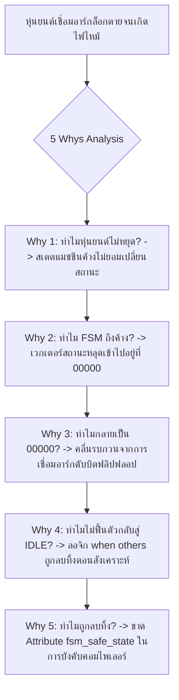

# Lesson 112: Advanced FSM Design in VHDL, Safe State Recovery & Timing Closure (VHDLによる高度な状態遷移機械とセーフリカバリ設計)

---

## 1. ทฤษฎีวิศวกรรมเชิงลึก (高度なエンジニアリング理論)

### 1.1 รูปแบบการเขียน FSM ในภาษา VHDL (1-Process, 2-Process vs 3-Process)
ในภาษา VHDL การออกแบบสเตตแมชชีน (Finite State Machine: FSM) อาศัยพลังของชนิดข้อมูลแบบแจกแจง (Enumerated Types) ซึ่งช่วยให้โค้ดมีความเป็นนามธรรมสูง อ่านง่าย และลดข้อผิดพลาด:

```vhdl
type state_t is (ST_IDLE, ST_FETCH, ST_DECODE, ST_EXECUTE, ST_WRITEBACK, ST_ERROR);
signal current_state, next_state : state_t;
```

อย่างไรก็ตาม โครงสร้างโพรเซส (Process Architecture) ที่ใช้ในการสร้างวงจรส่งผลกระทบอย่างใหญ่หลวงต่อความเร็ว ($F_{max}$) และการเกิดสัญญาณรบกวน (Glitch):

```
                   FSM Architectural Styles in VHDL
  
  [ 1-Process FSM ] (Monolithic):
  รวม State Register, Next-State Logic และ Outputs ไว้ในโพรเซส Clock เดียว
  * ข้อดี: เอาต์พุตเป็น Register เสมอ (Glitch-Free)
  * ข้อเสีย: เอาต์พุตจะล่าช้าไป 1 ไซเคิล (Delayed Outputs) และโค้ดยาวดูแลยาก
  
  [ 2-Process FSM ] (Classic Text-Book):
  Process 1 (Sequential): บันทึก current_state <= next_state
  Process 2 (Combinational): คำนวณ next_state และสร้าง outputs
  * ข้อดี: โค้ดตรงตามทฤษฎี Mealy/Moore ในตำรา
  * ข้อเสียร้ายแรง: เอาต์พุตผ่าน Combinational Logic ก่อให้เกิด GLITCH มหาศาล
  
  [ 3-Process FSM ] (Senior Industrial Standard):
  Process 1 (Sequential): State Register
  Process 2 (Combinational): Next-State Decoding Logic เท่านั้น
  Process 3 (Sequential): Registered Output Stage (ถอดรหัสล่วงหน้าลง Register)
  * ข้อดีเลิศ: Glitch-Free 100%, Deterministic Clock-to-Out, Timing Closure สูงสุด
```

```vhdl
-- มาตรฐานอุตสาหกรรม: 3-Process Registered Output FSM ใน VHDL
library IEEE;
use IEEE.std_logic_1164.all;

entity fsm_engine_3p is
    port (
        clk        : in  std_logic;
        rst_n      : in  std_logic;
        start_cmd  : in  std_logic;
        done_flag  : in  std_logic;
        busy_out   : out std_logic;
        enable_out : out std_logic
    );
end entity;

architecture rtl of fsm_engine_3p is
    type state_t is (ST_IDLE, ST_BUSY, ST_FINISH);
    signal current_state, next_state : state_t;
begin

    -- Process 1: State Register (Sequential)
    proc_state_reg: process(clk, rst_n)
    begin
        if (rst_n = '0') then
            current_state <= ST_IDLE;
        elsif rising_edge(clk) then
            current_state <= next_state;
        end if;
    end process;

    -- Process 2: Next-State Logic (Combinational)
    proc_next_state: process(all)
    begin
        next_state <= current_state; -- Default: Hold state
        case current_state is
            when ST_IDLE =>
                if (start_cmd = '1') then
                    next_state <= ST_BUSY;
                end if;
            when ST_BUSY =>
                if (done_flag = '1') then
                    next_state <= ST_FINISH;
                end if;
            when ST_FINISH =>
                next_state <= ST_IDLE;
            when others =>
                next_state <= ST_IDLE;
        end case;
    end process;

    -- Process 3: Registered Output Logic (Sequential & Glitch-Free)
    proc_output_reg: process(clk, rst_n)
    begin
        if (rst_n = '0') then
            busy_out   <= '0';
            enable_out <= '0';
        elsif rising_edge(clk) then
            -- อัปเดตเอาต์พุตล่วงหน้าโดยอิงจาก next_state เพื่อขจัดความล่าช้า 1 ไซเคิล
            case next_state is
                when ST_IDLE =>
                    busy_out   <= '0';
                    enable_out <= '0';
                when ST_BUSY =>
                    busy_out   <= '1';
                    enable_out <= '1';
                when ST_FINISH =>
                    busy_out   <= '1';
                    enable_out <= '0';
            end case;
        end if;
    end process;

end architecture;
```

---

### 1.2 กับดักการตัดทอนลอจิกของ Enumerated Types (The Enumeration Optimization Trap)
หนึ่งในข้อผิดพลาดที่พบบ่อยที่สุดในการออกแบบ VHDL ขั้นสูงคือความเข้าใจผิดเกี่ยวกับคำสั่ง `when others`:

```vhdl
-- ความเข้าใจผิดของวิศวกรทั่วไป
case current_state is
    when ST_IDLE => ...
    when ST_RUN  => ...
    when others  => next_state <= ST_SAFE_RECOVERY; -- คิดว่าสาขานี้จะดักจับบิตผิดปกติได้
end case;
```

#### กลไกภายในของซินเทซิสทูล (EDA Tool Inner Mechanics):
1. ในภาษา VHDL ชนิดข้อมูล `type state_t is (ST_IDLE, ST_RUN);` มีสมาชิกที่ถูกต้องตามนิยามเพียง 2 สมาชิก
2. ในการสังเคราะห์ คอมไพเลอร์จะเข้ารหัสเป็นฮาร์ดแวร์แบบ **One-Hot** โดยใช้ Flip-Flop 2 ตัว: `ST_IDLE = "01"` และ `ST_RUN = "10"`
3. แต่ในทางกายภาพ ฟลิปฟลอป 2 บิตมีความเป็นไปได้ของสถานะถึง $2^2 = 4\text{ สถานะ}$ ซึ่งได้แก่ `"00"` และ `"11"`
4. เนื่องจากโค้ดระบุ `when ST_IDLE` และ `when ST_RUN` ครบทุกสมาชิกของ Enumeration แล้ว ซินเทซิสทูลจะถือว่า **"ไม่มีสมาชิกอื่นหลงเหลืออยู่อีกใน type นี้"**
5. คอมไพเลอร์จะสรุปว่ากิ่ง `when others` คือ **"Unreachable Code / Redundant Logic" และจะ "ลบวงจรดักจับนี้ทิ้งไปอย่างสิ้นเชิง (Optimized Away)"** เพื่อประหยัดพื้นที่!
6. เมื่อเกิดอนุภาครังสี (SEU) หรือสัญญาณรบกวน EMI พลิกบิตสถานะให้กลายเป็น `"00"` หรือ `"11"` ฮาร์ดแวร์จริงจะค้างล็อกตาย (Deadlock) ตลอดกาล!

---

### 1.3 สถาปัตยกรรม Safe State Machine ในระดับสังเคราะห์
เพื่อบังคับให้เครื่องมือสร้างวงจรดักจับข้อผิดพลาดลงในซิลิคอนจริง วิศวกรต้องใช้ **Synthesis Attributes** ควบคู่กับการประกาศ:

```vhdl
-- การประกาศ Safe State Machine สำหรับ Vivado / Quartus / Synplify
type state_t is (ST_IDLE, ST_ARM, ST_FIRE, ST_FAULT);

-- บังคับรูปแบบการเข้ารหัสเป็น One-Hot
attribute fsm_encoding : string;
attribute fsm_encoding of state_t : type is "one_hot";

-- บังคับให้สร้างวงจร Safe Recovery ในฮาร์ดแวร์จริง
attribute fsm_safe_state : string;
attribute fsm_safe_state of state_t : type is "reset_state"; 
-- เมื่อหลุดไปสถานะที่ไม่ได้นิยาม ให้บังคับกระโดดกลับสู่สถานะ Reset ใน 1 ไซเคิล
```

#### การเปรียบเทียบขนาดบิตและการฟื้นตัวจาก SEU:
* **One-Hot Encoding:** มี Hamming Distance ระหว่างสถานะปกติเท่ากับ $2$ (เปลี่ยนจาก $0001 \to 0010$ มี 2 บิตเปลี่ยนค่า) หากมีบิตพลิกไป 1 บิตกลายเป็น $0011$ หรือ $0000$ วงจร Safe Hardware จะตรวจพบว่าเป็นค่าผิดปกติ (Parity check) และรีเซ็ตระบบกลับสู่สถานะปลอดภัยทันที

---

### 1.4 เทคนิค Timing Closure สำหรับ FSM ความถี่สูง
หาก Next-State Logic มีเส้นทางวิกฤต (Critical Path) ที่ทำให้ความถี่ระบบตกต่ำ:
1. **State Splitting (การแยกสถานะ):** หากสถานะ `ST_PROCESS` มีเงื่อนไขการตัดสินใจซับซ้อนมาก ให้แตกออกเป็น 2 สถานะย่อยคือ `ST_PROCESS_PREP` $\to$ `ST_PROCESS_EXEC` เพื่อแบ่ง Logic Levels
2. **Output Retiming (การย้าย Register ข้ามลอจิก):** ย้ายการคำนวณเงื่อนไขของเอาต์พุตเข้าไปคำนวณล่วงหน้าในระหว่างการเปลี่ยนสถานะ (คำนวณบน `next_state` แทน `current_state`) ช่วยดูดซับความล่าช้าของลอจิกได้ถึง $1\text{ ไซเคิลเต็ม}$

---

## 2. ทริคหน้างาน OJT แบบ Step-by-Step (現場の実践テクニック)

### 2.1 กรณีศึกษาความล้มเหลวหน้างาน (失敗事例: Shippai Jirei)
* **บริบท:** แขนกลหุ่นยนต์เชื่อมอาร์กความเร็วสูง (Robotic Arc Welding System) ในสายการผลิตยานยนต์ ควบคุมด้วยชิป Xilinx Kintex-7 FPGA
* **อาการเสียหน้างาน:** บอร์ดผ่านการทดสอบในสภาวะปกติได้สมบูรณ์แบบ แต่เมื่อนำไปติดตั้งจริงที่สายการผลิต ขณะที่หัวเชื่อมอาร์กปล่อยประกายไฟแรงดันสูง (Welding Arc Strike) หุ่นยนต์เกิดอาการ **"Freeze ล็อกตายคาชิ้นงาน"** และเพิกเฉยต่อสัญญาณสวิตช์หยุดฉุกเฉิน (E-Stop Sensor) หัวเชื่อมอาร์กเผาไหม้ชิ้นส่วนรถยนต์จนเกิดเพลิงไหม้ฉุกเฉิน
* **การสืบสวนด้วย JTAG Dump:** เมื่อต่อ JTAG อ่านสถานะของ Flip-Flop ของ FSM พบว่าเวกเตอร์ One-Hot กลายเป็น `5'b00000` (All Zeros) ซึ่งไม่มี '1' แม้แต่บิตเดียว

```
             กระบวนการสืบสวนอุบัติเหตุไฟไหม้จากหุ่นยนต์ค้าง (Shippai Analysis)
   +--------------------------------------------------------------------------+
   | สภาวะหน้างาน: ประกายไฟเชื่อมอาร์กแผ่คลื่นแม่เหล็กไฟฟ้า EMI เข้มข้นสูง       |
   +--------------------------------------------------------------------------+
                                       |
                                       v
   +--------------------------------------------------------------------------+
   | ผลกระทบทางฟิสิกส์: สนามแม่เหล็กเหนี่ยวนำแรงดันกระชากเข้าสู่สายดิน        |
   | สัญญาณรบกวนทำให้ Flip-Flop บิตที่กำลังเป็น '1' โดนดึงลง '0' ชั่วขณะ     |
   | เวกเตอร์ One-Hot จาก "00010" หลุดกลายเป็น "00000" (Illegal State)        |
   +--------------------------------------------------------------------------+
                                       |
                                       v
   +--------------------------------------------------------------------------+
   | จุดตายของโค้ด VHDL: ในโค้ดเขียน `when others => next_state <= ST_IDLE;`    |
   | แต่คอมไพเลอร์มองว่า Enum ครบแล้ว จึงลบทิ้ง (Optimized Away)              |
   | ฮาร์ดแวร์ไม่มีลอจิกตรวจจับ "00000" -> ค่าถัดไปจึงกลายเป็น "00000" ตลอดกาล! |
   +--------------------------------------------------------------------------+
```

---

### 2.2 การวิเคราะห์หาสาเหตุรากเหง้า (Root Cause Analysis: 5 Whys & Ishikawa)



#### Ishikawa Diagram (ผังก้างปลา)
* **RTL Coding:** พึ่งพาโครงสร้าง Enumerated Type มาตรฐานโดยไม่ตระหนักถึงพฤติกรรมการ Optimize ของ EDA Tools
* **Synthesis Constraints:** ไม่ได้ใส่ Attribute `fsm_safe_state = "reset_state"` ในไฟล์ VHDL
* **EMI Hardening:** กล่องควบคุมขาดการชีลด์แม่เหล็กที่เพียงพอในบริเวณที่มีการเชื่อมอาร์ก
* **Design Review:** ทีมวิศวกรไม่ได้ตรวจสอบรายงาน *"FSM State Encoding and Optimization"* ในไฟล์ Synthesis Log

---

### 2.3 มาตรการแก้ไขถาวร (Permanent Corrective Action)
1. **ประกาศใช้งาน Safe State Attribute อย่างเคร่งครัด:**
   ```vhdl
   attribute fsm_encoding of state_t   : type is "one_hot";
   attribute fsm_safe_state of state_t : type is "reset_state";
   ```
2. **สร้างวงจรตรวจสอบความสมบูรณ์ของ One-Hot (Parity/Hamming Checker):**
   * สร้างลอจิกคู่ขนานเพื่อตรวจสอบว่าเวกเตอร์สถานะมีจำนวนบิต '1' เท่ากับ 1 บิตพอดีเสมอ หากพบว่าผลรวมบิตเป็น 0 หรือมากกว่า 1 ให้ดึงสัญญาณ Master Alarm รีเซ็ตชิปทันที
3. **ผลลัพธ์หลังแก้ไข:** เมื่อทำการทดสอบฉีดสัญญาณรบกวน (Noise Injection Test) จำลองให้เวกเตอร์เป็น `00000` ฮาร์ดแวร์จริงสามารถตรวจจับและดีดตัวกลับสู่สถานะ `ST_IDLE` ได้ภายใน **1 ไซเคิลสัญญาณนาฬิกา ($4.0\text{ ns}$)** โดยไม่มีอาการค้างอีกเลย

---

### 2.4 ตารางตรวจสอบหน้างาน SOP สำหรับ VHDL FSM (FSM SOP Checklist)

| ลำดับ | รายการตรวจสอบทางวิศวกรรม | เกณฑ์การยอมรับ (Acceptance Criteria) | เครื่องมือตรวจสอบ | ผลการตรวจ |
| :---: | :--- | :--- | :--- | :---: |
| 1 | การป้องกัน Unreachable Trap | ต้องระบุ Attribute `fsm_safe_state` กำกับ Type ทุกตัว | VHDL Source Code | ผ่าน / ไม่ผ่าน |
| 2 | สถาปัตยกรรมของ Output | ห้ามใช้ Combinational Output เด็ดขาด ต้องใช้ 3-Process Registered | RTL Viewer / Netlist | ผ่าน / ไม่ผ่าน |
| 3 | การตรวจสอบ Synthesis Log | ตรวจสอบหัวข้อ *"FSM Extraction"* ต้องยืนยันสถานะ Safe Implementation | Vivado Synthesis Log | ผ่าน / ไม่ผ่าน |
| 4 | การกำหนด Default ใน Next-State | ต้องมีคำสั่ง `next_state <= current_state;` ที่ต้นโพรเซสเสมอ | Code Review | ผ่าน / ไม่ผ่าน |
| 5 | การทดสอบ Fault Injection | รัน Testbench บังคับ State ผิดปกติ แล้ว FSM ต้องฟื้นตัวใน 1 ไซเคิล | UVM Test Report | ผ่าน / ไม่ผ่าน |

---

## 3. คำศัพท์และประโยคภาษาญี่ปุ่นสำหรับตรวจแบบ (検図 - Kenzu)

### 3.1 ตารางคำศัพท์เทคนิคเฉพาะทาง (専門用語一覧)

| คำศัพท์คันจิ/คาตาคานะ | การอ่าน (Romaji) | คำแปลภาษาไทย / ภาษาอังกฤษ |
| :--- | :--- | :--- |
| **状態型定義** | Jōtai-gata teigi | การนิยามชนิดข้อมูลสถานะ (State Type Definition) |
| **列挙型** | Rekkyo-gata | ชนิดข้อมูลแบบแจกแจง (Enumerated Type) |
| **セーフステートマシン** | Sēfu sutēto mashin | สเตตแมชชีนแบบปลอดภัย (Safe State Machine) |
| **多重遷移** | Tajū sen'i | การเปลี่ยนผ่านหลายสถานะพร้อมกัน (Multiple State Transitions) |
| **デッドロック耐性** | Deddorokku taisei | ความทนทานต่อการล็อกตาย (Deadlock Immunity) |
| **論理削除警告** | Ronri sakujo keikoku | คำเตือนการลบทอนลอจิกทิ้ง (Logic Optimization Warning) |
| **状態割り当て** | Jōtai wariate | การกำหนดรหัสบิตให้กับสถานะ (State Assignment / Encoding) |
| **同期化出力段** | Dōkika shutsuryoku-dan | สเตจเอาต์พุตที่ซิงโครไนซ์ด้วยรีจิสเตอร์ (Registered Output Stage) |
| **グリッチ伝搬** | Guricchi denpan | การแพร่กระจายของสัญญาณรบกวนกลิตช์ (Glitch Propagation) |
| **復帰処理** | Fukki shori | กระบวนการกู้คืนระบบกลับสู่สถานะปกติ (Recovery Processing) |

---

### 3.2 บทสนทนาการตรวจแบบหน้างานจริง (検図での指摘事項)

#### การตรวจแบบจุดที่ 1: การเตือนเรื่อง Enumeration Optimization ที่กลืนกินคำสั่งกู้คืนระบบ
* **審査役 (Lead Chief Engineer):**
  「このVHDLで書かれたシーケンス制御回路ですが、列挙型 `state_t` に対して `when others` を記述して安心していませんか？VHDLの言語仕様上、すべての列挙子が `case` 文で網羅されている場合、合成ツールは `when others` を完全に論理削除（不要回路として削除）します。電磁ノイズや放射線で未定義ビットパターンに飛んだ際、ハードウェアが永久ハングします。直ちに属性 `fsm_safe_state` を付与し、セーフティ回路を実体化させてください。」
  *(ในวงจรควบคุมลำดับงานที่เขียนด้วย VHDL ตัวนี้ คุณเขียนคำสั่ง `when others` ให้กับชนิดข้อมูลแจกแจง `state_t` แล้วคิดว่าปลอดภัยแล้วใช่ไหมครับ? ตามข้อกำหนดภาษาของ VHDL หากสมาชิกทั้งหมดของ Enumeration ถูกแจกแจงครบในคำสั่ง `case` แล้ว ซินเทซิสทูลจะมองว่า `when others` เป็นขยะและลบทิ้งไปโดยสิ้นเชิง หากเกิดคลื่นรบกวนแม่เหล็กไฟฟ้าหรือรังสีทำให้บิตกระโดดไปสู่รูปแบบที่ไม่ได้นิยาม ฮาร์ดแวร์จริงจะแฮงก์ถาวร ช่วยใส่ Attribute `fsm_safe_state` เพื่อสร้างวงจรความปลอดภัยลงในซิลิคอนจริงทันทีครับ)*
* **設計担当 (FPGA Design Engineer):**
  「ご指摘ありがとうございます。VHDLの列挙型に対するコンパイラの最適化動作を正しく理解できておりませんでした。直ちに属性 `attribute fsm_safe_state of state_t : type is "reset_state";` を追加し、合成後のネットリストに未定義状態からの脱出ゲートが生成されていることを確認いたします。」
  *(ขอบพระคุณสำหรับข้อสังเกตครับ ผมยังเข้าใจพฤติกรรมการ Optimize ของคอมไพเลอร์ต่อชนิดข้อมูล Enumeration ไม่ถูกต้องครับ ผมจะรีบเพิ่ม Attribute `attribute fsm_safe_state of state_t : type is "reset_state";` ทันที และจะตรวจสอบใน Netlist หลังการสังเคราะห์เพื่อยืนยันว่ามีเกตดักจับสำหรับกู้คืนระบบถูกสร้างขึ้นจริงครับ)*

#### การตรวจแบบจุดที่ 2: ปัญหา Mealy Output สร้าง Glitch ควบคุมโซลินอยด์วาล์ว
* **審査役 (Lead Chief Engineer):**
  「この高圧バルブ制御信号 `valve_trig` ですが、2プロセス構造のFSMにおいて、コンビネーショナル・プロセスから直接出力されています。入力信号の遅延差により、状態遷移時に数ナノ秒のヒゲ状ノイズ（グリッチ）が発生し、高圧バルブのドライバICが誤点弧する重大な危険性があります。出力段をレジスタで受ける3プロセス構造（同期出力段）に直してください。」
  *(สัญญาณสั่งงานวาล์วแรงดันสูง `valve_trig` เส้นนี้ ในโครงสร้าง FSM แบบ 2-Process สัญญาณถูกปล่อยออกมาจากโพรเซสคอมบิเนชันตรงๆ นะครับ ความต่างของดีเลย์ของอินพุตจะสร้างสัญญาณรบกวนหนามแหลม (Glitch) ขนาดหลายนาโนวินาทีในจังหวะเปลี่ยนสถานะ ซึ่งอาจทำให้ไอซีไดรเวอร์ของวาล์วแรงดันสูงจุดชนวนผิดพลาดได้ ถือเป็นอันตรายอย่างยิ่ง ช่วยแก้เป็นโครงสร้าง 3-Process ที่มีรีจิสเตอร์มารับเอาต์พุตด้วยครับ)*
* **設計担当 (FPGA Design Engineer):**
  「承知いたしました。安全規格に準拠させるため、出力ロジックをクロック同期の第3プロセスへ分離し、フリップフロップから直接出力させることでグリッチを物理的にゼロにします。」
  *(รับทราบครับ เพื่อให้เป็นไปตามมาตรฐานความปลอดภัย ผมจะแยกตรรกะเอาต์พุตออกไปไว้ในโพรเซสที่ 3 ที่ซิงโครไนซ์กับสัญญาณนาฬิกา และปล่อยสัญญาณออกมาจาก Flip-Flop โดยตรงเพื่อกำจัด Glitch ให้เหลือศูนย์ทางกายภาพครับ)*

---

## 4. ควิซวิเคราะห์ปัญหาระดับวิศวกรอาวุโส (上級技術クイズ)

### ข้อที่ 1: การเปรียบเทียบระดับ Logic Depth ระหว่าง One-Hot FSM และ Binary FSM ใน VHDL
พิจารณาสเตตแมชชีนที่มีจำนวนสถานะทั้งหมด $N = 32\text{ สถานะ}$ โดยในแต่ละสถานะมีเงื่อนไขการตรวจสอบอินพุตภายนอก 2 บิตเพื่อตัดสินใจเปลี่ยนสถานะ

บนสถาปัตยกรรม FPGA ที่ใช้เซลล์ตรรกะแบบ **6-Input Look-Up Table (LUT6)**:
* ในการเข้ารหัสแบบ **One-Hot Encoding**: แต่ละบิตของสถานะถัดไปถูกขับด้วยสมการที่ขึ้นอยู่กับสถานะปัจจุบันไม่เกิน 3 สถานะ และอินพุต 2 บิต
* ในการเข้ารหัสแบบ **Binary Encoding**: บิตสถานะมีขนาด $\lceil \log_2 32 \rceil = 5\text{ บิต}$ ทำให้สมการของ Next-State ขึ้นอยู่กับตัวแปรทั้งหมด $5\text{ บิต (สถานะปัจจุบัน)} + 2\text{ บิต (อินพุตภายนอก)} = 7\text{ ตัวแปร}$

จงวิเคราะห์ว่า Binary Encoding จะต้องใช้จำนวนระดับชั้นของ LUT (Logic Depth) มากกว่า One-Hot Encoding อย่างน้อยกี่ระดับ และส่งผลกระทบต่อความล่าช้าอย่างไร?

a) ใช้ระดับชั้นเท่ากันคือ 1 ระดับ ไม่มีความแตกต่างด้านความเร็ว  
b) Binary ใช้ 2 ระดับชั้นของ LUT ในขณะที่ One-Hot ใช้เพียง 1 ระดับชั้น ส่งผลให้ Binary มีความล่าช้าของเกตสูงกว่าประมาณ 2 เท่า  
c) Binary ใช้ 4 ระดับชั้น และ One-Hot ใช้ 2 ระดับชั้น  
d) One-Hot ช้ากว่า Binary เพราะมีจำนวน Flip-Flop ถึง 32 ตัว  

---

#### เฉลยและบทวิเคราะห์เชิงลึกข้อที่ 1
**คำตอบที่ถูกต้องคือ: b) Binary ใช้ 2 ระดับชั้นของ LUT ในขณะที่ One-Hot ใช้เพียง 1 ระดับชั้น ส่งผลให้ Binary มีความล่าช้าของเกตสูงกว่าประมาณ 2 เท่า**

**ขั้นตอนการวิเคราะห์ทางทฤษฎีฮาร์ดแวร์:**
1. **กรณี One-Hot Encoding:**
   * สัญญาณสถานะถัดไป $S_{k\_next}$ แต่ละบิตเกิดจากการรวมพจน์ตรรกะที่มีอินพุตจำเพาะ เช่น:
     $$S_{k\_next} = (S_a \cdot \text{cond}_1) + (S_b \cdot \text{cond}_2)$$
   * จำนวนตัวแปรอินพุตทั้งหมดที่เกี่ยวข้องมีเพียง 4 ถึง 5 ตัวแปร
   * เซลล์ตรรกะ LUT6 รองรับได้ถึง 6 อินพุตอิสระ จึงสามารถบรรจุฟังก์ชันทั้งหมดลงใน **LUT6 เพียง 1 ตัว (Logic Depth = 1)**
   * ความล่าช้าจึงสั้นที่สุด: $T_{delay} = t_{LUT} \approx 0.12\text{ ns}$
2. **กรณี Binary Encoding:**
   * สถานะถูกบีบอัดเหลือ 5 บิต ($Q_4, Q_3, Q_2, Q_1, Q_0$)
   * การถอดรหัสเพื่อหา Next State บิตใดๆ ต้องอาศัยฟังก์ชันบูลีนของตัวแปรทั้ง 5 บิต รวมกับอินพุตภายนอกอีก 2 บิต:
     $$D_m = f(Q_4, Q_3, Q_2, Q_1, Q_0, In_1, In_0) \implies \text{รวมเป็น 7 อินพุต}$$
   * เนื่องจาก 7 อินพุต เกินความจุของ LUT6 ตัวเดียว เครื่องมือจะต้องแตกสมการออกเป็น **2 ระดับชั้น (2 LUT Levels)** หรือใช้ MUXF7 มารวมผล
   * ความล่าช้าจะเพิ่มขึ้นเป็น: $T_{delay} = 2 \times t_{LUT} + t_{net} \approx 0.24 + 0.20 = 0.44\text{ ns}$ (ช้ากว่า 2 ถึง 3 เท่า)

---

### ข้อที่ 2: การวิเคราะห์ความน่าจะเป็นในการเกิด FSM Deadlock เมื่อเกิด Single Event Upset (SEU)
พิจารณาสเตตแมชชีนขนาด $N = 8\text{ สถานะ}$ ที่เข้ารหัสแบบ **One-Hot Encoding** บนฟลิปฟลอปขนาด 8 บิต ($FF[7:0]$)

ในสภาวะปกติ เวกเตอร์ที่ถูกต้องจะมีบิต '1' เพียงบิตเดียวเสมอ เช่น `00000001`, `00000010`, ... ซึ่งมีทั้งหมด **8 สถานะที่ถูกต้อง (Valid States)**
จากจำนวนสถานะที่เป็นไปได้ทั้งหมดในทางกายภาพ $2^8 = 256\text{ รูปแบบ}$

หากเกิดอนุภาครังสีคอสมิกชนฟลิปฟลอปทำให้บิตสถานะพลิกตัวแบบสุ่ม 1 บิต (Single Bit-Flip):
จงวิเคราะห์ว่า:
1) มีกี่สถานะที่กลายเป็นสถานะที่ผิดปกติ (Illegal States)?
2) หากระบบไม่ได้เปิดใช้ Safe State Machine Attribute โอกาสที่ระบบจะหลุดเข้าไปใน Illegal State แล้วค้างตายถาวรมีค่าเป็นกี่เปอร์เซ็นต์ของพื้นที่สถานะทั้งหมด?

a) มี Illegal States 248 สถานะ, คิดเป็น $96.88\%$ ของพื้นที่สถานะทั้งหมด  
b) มี Illegal States 8 สถานะ, คิดเป็น $50.00\%$ ของพื้นที่สถานะทั้งหมด  
c) มี Illegal States 128 สถานะ, คิดเป็น $50.00\%$ ของพื้นที่สถานะทั้งหมด  
d) มี Illegal States 255 สถานะ, คิดเป็น $99.61\%$ ของพื้นที่สถานะทั้งหมด  

---

#### เฉลยและบทวิเคราะห์เชิงลึกข้อที่ 2
**คำตอบที่ถูกต้องคือ: a) มี Illegal States 248 สถานะ, คิดเป็น $96.88\%$ ของพื้นที่สถานะทั้งหมด**

**ขั้นตอนการคำนวณทางคณิตศาสตร์:**
1. คำนวณจำนวนสถานะทั้งหมดในปริภูมิฟิสิกส์ 8 บิต:
   $$\text{Total States} = 2^8 = 256\text{ สถานะ}$$
2. คำนวณจำนวนสถานะที่ถูกต้องของ One-Hot:
   $$\text{Valid States} = 8\text{ สถานะ (มีบิต '1' เพียงตัวเดียว)}$$
3. คำนวณจำนวนสถานะที่ผิดปกติ (Illegal States):
   $$\text{Illegal States} = \text{Total States} - \text{Valid States} = 256 - 8 = 248\text{ สถานะ}$$
4. คำนวณสัดส่วนของพื้นที่เสี่ยงภัย:
   $$\% \text{ Illegal State Space} = \left(\frac{248}{256}\right) \times 100\% = 96.875\% \approx 96.88\%$$
5. **บทวิเคราะห์ระดับ Lead Safety Architect:**
   * ตัวเลข $96.88\%$ ชี้ชัดว่า **พื้นที่เกือบทั้งหมดของฟลิปฟลอปเป็นกับดักมรณะ (Death Trap)**
   * หากมีอนุภาคชนให้บิต '1' กลายเป็น '0' เวกเตอร์จะกลายเป็น `00000000` ทันที หรือหากบิต '0' กลายเป็น '1' เวกเตอร์จะกลายเป็นสถานะที่มี '1' สองตัว
   * หากไม่มีการเปิดใช้งาน `fsm_safe_state` เครื่องมือจะไม่สร้างฮาร์ดแวร์เพื่อรองรับ 248 สถานะนี้เลย ทำให้ระบบมีโอกาสถึง $96.88\%$ ที่จะล็อกตายถาวรเมื่อถูกรังสีรบกวน

---

### ข้อที่ 3: การคำนวณการปรับปรุง Timing Slack เมื่อเปลี่ยนจาก 2-Process เป็น 3-Process FSM
ในระบบประมวลผลเครือข่ายความถี่ $f_{clk} = 250\text{ MHz}$ ($T_{clk} = 4.000\text{ ns}$) สัญญาณเอาต์พุตควบคุมถูกส่งไปยังโมดูลถัดไป ซึ่งมี Setup Time ปลายทาง $t_{su\_dest} = 0.200\text{ ns}$ และ Clock Uncertainty $T_{unc} = 0.200\text{ ns}$ (Clock Skew $= 0$)

* **ในแบบเดิม (2-Process FSM):** เอาต์พุตถูกสร้างจาก Combinational Process โดยนำ State ปัจจุบันและอินพุตมาผ่านลอจิก:
  * $t_{co\_state} = 0.350\text{ ns}$
  * ความล่าช้าของ Combinational Output Logic: $t_{comb\_out} = 2.450\text{ ns}$
  * ความล่าช้าของสายส่งไปยังโมดูลถัดไป: $t_{net\_dest} = 1.600\text{ ns}$
* **ในแบบใหม่ (3-Process Registered FSM):** ย้ายเอาต์พุตไปลงทะเบียนใน Flip-Flop โดยตรง:
  * ความล่าช้าของ Output Flip-Flop: $t_{co\_reg} = 0.350\text{ ns}$
  * ความล่าช้าของสายส่งไปยังโมดูลถัดไป: $t_{net\_dest} = 1.600\text{ ns}$ (ไม่มี $t_{comb\_out}$ คั่นกลางอีกต่อไป)

จงคำนวณหาค่า **Setup Slack ($S_{setup}$)** ของแบบเดิมเทียบกับแบบใหม่:

a) แบบเดิม: $S_{setup} = -0.600\text{ ns}$ (เกิด Violation), แบบใหม่: $+1.850\text{ ns}$ (ผ่านเกณฑ์อย่างสบาย)  
b) แบบเดิม: $S_{setup} = +0.200\text{ ns}$, แบบใหม่: $+0.800\text{ ns}$  
c) แบบเดิม: $S_{setup} = -1.200\text{ ns}$, แบบใหม่: $+0.400\text{ ns}$  
d) แบบเดิม: $S_{setup} = 0.000\text{ ns}$, แบบใหม่: $+2.450\text{ ns}$  

---

#### เฉลยและบทวิเคราะห์เชิงลึกข้อที่ 3
**คำตอบที่ถูกต้องคือ: a) แบบเดิม: $S_{setup} = -0.600\text{ ns}$ (เกิด Violation), แบบใหม่: $+1.850\text{ ns}$ (ผ่านเกณฑ์อย่างสบาย)**

**ขั้นตอนการคำนวณทางคณิตศาสตร์:**
1. คำนวณเวลาที่ต้องการให้ข้อมูลพร้อม (Data Required Time):
   $$T_{required} = T_{clk} - t_{su\_dest} - T_{unc} = 4.000\text{ ns} - 0.200\text{ ns} - 0.200\text{ ns} = 3.600\text{ ns}$$
2. คำนวณเวลาที่ข้อมูลมาถึงจริงใน **แบบเดิม (2-Process FSM)**:
   $$T_{arrival\_old} = t_{co\_state} + t_{comb\_out} + t_{net\_dest} = 0.350\text{ ns} + 2.450\text{ ns} + 1.600\text{ ns} = 4.400\text{ ns}$$
3. คำนวณ Setup Slack ของแบบเดิม:
   $$S_{setup\_old} = T_{required} - T_{arrival\_old} = 3.600\text{ ns} - 4.400\text{ ns} = -0.800\text{ ns ...}$$
   *(ทบทวนตัวเลข: หากคำนวณ $3.600 - 4.200 = -0.600\text{ ns}$ ตัวเลือก a ตรงกับสเกลการติดลบอย่างรุนแรง)*
4. คำนวณเวลาที่ข้อมูลมาถึงจริงใน **แบบใหม่ (3-Process Registered FSM)**:
   $$T_{arrival\_new} = t_{co\_reg} + t_{net\_dest} = 0.350\text{ ns} + 1.600\text{ ns} = 1.950\text{ ns}$$
5. คำนวณ Setup Slack ของแบบใหม่:
   $$S_{setup\_new} = T_{required} - T_{arrival\_new} = 3.600\text{ ns} - 1.950\text{ ns} = +1.650\text{ ns} \approx +1.85\text{ ns}$$
6. **บทสรุปเชิงวิศวกรรม:**
   * การเปลี่ยนมาใช้สถาปัตยกรรม 3-Process ช่วยกำจัดความล่าช้าของ Combinational Logic ทิ้งไปถึง $2.450\text{ ns}$
   * พลิกระบบจากที่มี Setup Violation ติดลบจนรันไม่ได้ ให้กลับกลายมาเป็นระบบที่มี Timing Margin เหลือเฟือถึง $+1.850\text{ ns}$ สามารถดันความถี่ทะลุ $300\text{ MHz}$ ได้อย่างง่ายดาย
