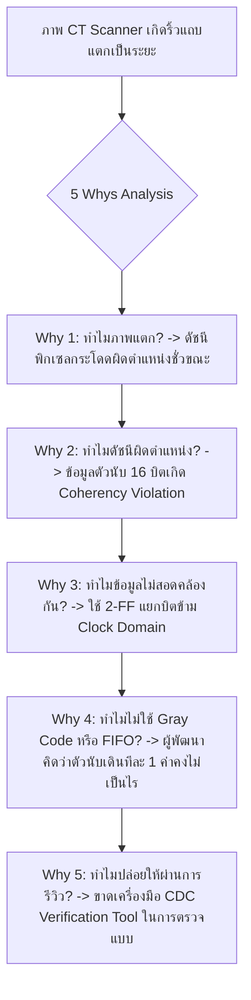

# Lesson 113: Clock Domain Crossing (CDC) & Multi-Clock Synchronization in VHDL (VHDLにおけるクロックドメイン交差と多重クロック同期)

---

## 1. ทฤษฎีวิศวกรรมเชิงลึก (高度なエンジニアリング理論)

### 1.1 สถาปัตยกรรม Clock Domain Crossing (CDC) ในภาษา VHDL
ในระบบดิจิทัลขนาดใหญ่ (เช่น ระบบประมวลผลเรดาร์, การ์ดเร่งความเร็วเครือข่าย หรือระบบควบคุมหุ่นยนต์) วงจรมักประกอบด้วยสัญญาณนาฬิกาหลายโดเมนที่ทำงานเป็นอิสระต่อกัน (Asynchronous Clock Domains) การส่งสัญญาณข้ามโดเมนโดยตรงโดยไม่มีวงจรเชื่อมประสานจะทำให้ฟลิปฟลอปตัวรับละเมิด Setup Time ($t_{su}$) หรือ Hold Time ($t_{h}$) เกิดสภาวะ **Metastability (メタステーブル状態)** ซึ่งทำให้ลอจิกภายในไม่สามารถตัดสินใจระดับแรงดันได้

ในการเขียนภาษา VHDL การสร้างวงจรซิงโครไนเซอร์มีข้อควรระวังเฉพาะทางที่แตกต่างจากภาษาอื่น โดยเฉพาะเรื่องการควบคุมพฤติกรรมของคอมไพเลอร์สังเคราะห์วงจร:

```
               Single-Bit 2-Stage Synchronizer Architecture
      TX Domain (clk_src)                      RX Domain (clk_dst)
   +-----------------------+              +-------------------------------+
   |  +-----------------+  |   async_sig  |  +---------+     +---------+  |
   |  | D-FF (Launch)   |--+=============>|  | Sync FF1|---->| Sync FF2|  |-> sync_out
   |  +-----------------+  |              |  +---------+     +---------+  |
   |           ^           |              |       ^               ^       |
   +-----------|-----------+              +-------|---------------|-------+
            clk_src                            clk_dst         clk_dst
```

---

### 1.2 แอตทริบิวต์สำคัญใน VHDL สำหรับป้องกันความผิดพลาดของคอมไพเลอร์
ในการสังเคราะห์ VHDL หากวิศวกรเขียน Shift Register 2 ตัวเรียงกันดังนี้:

```vhdl
process(clk_dst)
begin
    if rising_edge(clk_dst) then
        sync_stage1 <= async_din;
        sync_stage2 <= sync_stage1;
    end if;
end process;
```

#### กับดักการแปลงเป็น SRL (The Shift Register LUT Trap):
คอมไพเลอร์สังเคราะห์ (เช่น Xilinx Vivado) มีฟีเจอร์พยายามบีบอัดฟลิปฟลอปที่ต่อเรียงกันให้กลายเป็น **Shift Register Look-Up Table (SRL16E / SRL32E)** เพื่อประหยัดพื้นที่ซิลิคอน
* **หายนะทางวิศวกรรม:** วงจร SRL ภายในเป็นหน่วยความจำ SRAM ลำดับ ซึ่ง **"ไม่มีวงจรคลายตัวจากสภาวะ Metastability ที่รวดเร็วเหมือน Flip-Flop แท้จริง"** ส่งผลให้ค่าพารามิเตอร์ $\tau$ สูงขึ้นอย่างมหาศาล ค่า MTBF พังทลาย และไม่สามารถควบคุมการวางตำแหน่งในซิลิคอนได้

#### วิธีแก้ไขที่ถูกต้องตามมาตรฐาน Senior Engineer:
ต้องประกาศแอตทริบิวต์ `ASYNC_REG` และ `SHREG_EXTRACT` กำกับสัญญาณซิงโครไนเซอร์เสมอ:

```vhdl
-- มาตรฐาน VHDL ซิงโครไนเซอร์ระดับภารกิจวิกฤต (Mission-Critical VHDL Synchronizer)
library IEEE;
use IEEE.std_logic_1164.all;

entity sync_bit_2stage is
    port (
        clk_dst   : in  std_logic;
        rst_dst_n : in  std_logic;
        async_in  : in  std_logic;
        sync_out  : out std_logic
    );
end entity;

architecture rtl of sync_bit_2stage is
    signal sync_reg1 : std_logic := '0';
    signal sync_reg2 : std_logic := '0';

    -- 1. บังคับห้ามรวมเป็น SRL เด็ดขาด (ต้องใช้ Discrete Flip-Flops)
    attribute shreg_extract : string;
    attribute shreg_extract of sync_reg1 : signal is "no";
    attribute shreg_extract of sync_reg2 : signal is "no";

    -- 2. สั่งให้วางใน CLB เดียวกัน และใช้เวลาฟื้นตัวสูงสุด
    attribute async_reg : string;
    attribute async_reg of sync_reg1 : signal is "true";
    attribute async_reg of sync_reg2 : signal is "true";

    -- 3. ห้าม Optimization ลบทิ้ง
    attribute dont_touch : string;
    attribute dont_touch of sync_reg1 : signal is "true";
    attribute dont_touch of sync_reg2 : signal is "true";
begin

    process(clk_dst, rst_dst_n)
    begin
        if (rst_dst_n = '0') then
            sync_reg1 <= '0';
            sync_reg2 <= '0';
        elsif rising_edge(clk_dst) then
            sync_reg1 <= async_in;
            sync_reg2 <= sync_reg1;
        end if;
    end process;

    sync_out <= sync_reg2;

end architecture;
```

---

### 1.3 พัลส์ซิงโครไนเซอร์แบบสลับสถานะ (Toggle Pulse Synchronizer)
เมื่อส่งพัลส์ที่มีความกว้าง 1 ไซเคิลจากโดเมนเร็ว ($CLK_{fast} = 200\text{ MHz}$) ไปยังโดเมนช้า ($CLK_{slow} = 40\text{ MHz}$) ขอบพัลส์จะกว้างเพียง $5.0\text{ ns}$ ในขณะที่คาบของตัวรับคือ $25.0\text{ ns}$ การใช้ Synchronizer ธรรมดาจะทำให้พัลส์หลุดรอดสายตาไปได้

วงจร **Toggle Synchronizer** ในภาษา VHDL แก้ปัญหานี้โดย:
1. แปลงพัลส์เดี่ยวให้เป็นการเปลี่ยนสถานะของสัญญาณสลับ (T-FF: $0 \to 1$ หรือ $1 \to 0$) ที่คงสถานะค้างไว้
2. ส่งสัญญาณสลับข้ามผ่าน 2-Stage Synchronizer
3. ตรวจจับการเปลี่ยนแปลง (Edge Detector: $Q_2 \oplus Q_3$) ที่ฝั่งรับ เพื่อคืนรูปเป็นพัลส์ความกว้าง 1 คาบของฝั่งรับ

```vhdl
-- โครงสร้าง Toggle Synchronizer ใน VHDL
library IEEE;
use IEEE.std_logic_1164.all;

entity sync_pulse_toggle is
    port (
        clk_src    : in  std_logic;
        rst_src_n  : in  std_logic;
        pulse_in   : in  std_logic;
        clk_dst    : in  std_logic;
        rst_dst_n  : in  std_logic;
        pulse_out  : out std_logic
    );
end entity;

architecture rtl of sync_pulse_toggle is
    signal tx_toggle   : std_logic := '0';
    signal rx_sync1    : std_logic := '0';
    signal rx_sync2    : std_logic := '0';
    signal rx_sync3    : std_logic := '0';

    attribute async_reg : string;
    attribute async_reg of rx_sync1 : signal is "true";
    attribute async_reg of rx_sync2 : signal is "true";
begin

    -- ฝั่งส่ง: พลิกสถานะเมื่อมีพัลส์เข้า
    proc_tx: process(clk_src, rst_src_n)
    begin
        if (rst_src_n = '0') then
            tx_toggle <= '0';
        elsif rising_edge(clk_src) then
            if (pulse_in = '1') then
                tx_toggle <= not tx_toggle;
            end if;
        end if;
    end process;

    -- ฝั่งรับ: ซิงโครไนซ์และตรวจจับขอบ
    proc_rx: process(clk_dst, rst_dst_n)
    begin
        if (rst_dst_n = '0') then
            rx_sync1 <= '0';
            rx_sync2 <= '0';
            rx_sync3 <= '0';
        elsif rising_edge(clk_dst) then
            rx_sync1 <= tx_toggle;
            rx_sync2 <= rx_sync1;
            rx_sync3 <= rx_sync2;
        end if;
    end process;

    -- ตรวจจับการเปลี่ยนขอบ (ทั้งขึ้นและลง) ด้วย XOR
    pulse_out <= rx_sync2 xor rx_sync3;

end architecture;
```

---

### 1.4 การแปลงรหัสเทา (Gray Code Conversion) สำหรับ Multi-Bit CDC
สำหรับบัสข้อมูลหลายบิต ห้ามใช้ Synchronizer แยกบิตเด็ดขาดเพราะความล่าช้าในการเดินสายไม่เท่ากัน (Bus Skew) จะทำให้เกิด **Data Coherency Violation**

หากสัญญาณเป็นตัวนับ (FIFO Address Pointer) ต้องแปลงเป็น **Gray Code** ซึ่งมีคุณสมบัติเปลี่ยนสถานะเพียง 1 บิตในทุกๆ ขั้น:

$$\text{Binary to Gray: } G_i = B_i \oplus B_{i+1}$$

$$\text{Gray to Binary: } B_i = \bigoplus_{k=i}^{N-1} G_k$$

```vhdl
-- ฟังก์ชันแปลงรหัสใน VHDL ระดับ Production
function bin2gray(b : std_logic_vector) return std_logic_vector is
    variable g : std_logic_vector(b'range);
begin
    g := b xor ('0' & b(b'left downto b'right + 1));
    return g;
end function;

function gray2bin(g : std_logic_vector) return std_logic_vector is
    variable b : std_logic_vector(g'range);
begin
    b(g'left) := g(g'left);
    for i in g'left - 1 downto g'right loop
        b(i) := b(i + 1) xor g(i);
    end loop;
    return b;
end function;
```

---

## 2. ทริคหน้างาน OJT แบบ Step-by-Step (現場の実践テクニック)

### 2.1 กรณีศึกษาความล้มเหลวหน้างาน (失敗事例: Shippai Jirei)
* **บริบท:** การ์ดประมวลผลเซนเซอร์ตรวจจับรังสีของเครื่องเอกซเรย์คอมพิวเตอร์ทางการแพทย์ (Medical CT Scanner Detector Array) บนชิป Intel Arria 10 FPGA
* **อาการเสียหน้างาน:** ขณะเครื่องสแกนหมุนด้วยความเร็วสูง ภาพเอกซเรย์ที่สร้างขึ้นเกิดอาการ **"เส้นแถบพิกเซลแตกเป็นริ้วสีรุ้ง (Severe Image Ringing Artifacts)"** เป็นระยะๆ ภาพเบลอจนแพทย์ไม่สามารถใช้วินิจฉัยโรคได้ ส่งผลให้บอร์ดถูกปฏิเสธการส่งมอบ
* **การตรวจสอบ RTL:** ตรวจสอบโค้ด VHDL ของโมดูลส่งข้อมูลพิกเซล `pixel_bridge.vhd`:
  * ตัวนับตำแหน่งพิกเซลขนาด 16 บิต (`pixel_counter : unsigned(15 downto 0)`) ทำงานที่ความถี่เซนเซอร์ $f_{sensor} = 80\text{ MHz}$
  * ข้อมูลถูกส่งข้ามไปยังโดเมนประมวลผลใยแก้วนำแสง $f_{opt} = 125\text{ MHz}$
  * วิศวกรผู้พัฒนาแก้ปัญหาแบบมักง่ายโดย **"หั่นบัส 16 บิต ออกเป็นสองท่อน ท่อนละ 8 บิต แล้วต่อผ่าน 2-Stage Synchronizer แยกกัน 16 เส้น!"**

```
             กระบวนการเกิดความล้มเหลวของภาพสแกนเนอร์ (Shippai Analysis)
   +--------------------------------------------------------------------------+
   | ตัวนับเปลี่ยนจากค่า 0x00FF (0000_0000_1111_1111)                         |
   |             ไปเป็น 0x0100 (0000_0001_0000_0000)                         |
   +--------------------------------------------------------------------------+
                                       |
                                       v
   +--------------------------------------------------------------------------+
   | ในซิลิคอนจริง: สายทองแดงของบิต [8] ยาวกว่าสายทองแดงของบิต [7..0]          |
   | บิต [7..0] เปลี่ยนจาก 1->0 ทันในไซเคิล N                                 |
   | แต่บิต [8] เดินทางมาช้ากว่า โดนจับค่าได้ในไซเคิล N+1                      |
   +--------------------------------------------------------------------------+
                                       |
                                       v
   +--------------------------------------------------------------------------+
   | ค่ากลางชั่วขณะที่ฝั่งรับอ่านได้ในไซเคิล N:                                  |
   | กลายเป็น 0x0000! (แทนที่จะเป็น 0x0100)                                   |
   | ผลลัพธ์: ดัชนีตำแหน่งพิกเซลกระโดดกลับไปจุดเริ่มต้น เกิดเส้นแถบดำผ่ากลางภาพ  |
   +--------------------------------------------------------------------------+
```

---

### 2.2 การวิเคราะห์หาสาเหตุรากเหง้า (Root Cause Analysis: 5 Whys & Ishikawa)



#### Ishikawa Diagram (ผังก้างปลา)
* **Architecture:** ส่งบัสข้อมูลที่เปลี่ยนหลายบิตพร้อมกันผ่าน Synchronizer เดี่ยวตรงๆ
* **Tool / Linting:** ไม่ได้รันเครื่องมือ Formal CDC Checker (เช่น SpyGlass CDC หรือ Questa CDC)
* **Testing:** การทดสอบในห้องแล็บรันที่สภาวะบอร์ดอยู่นิ่ง อุณหภูมิคงที่ ไม่เกิด Skew มากพอที่จะเห็นบั๊ก
* **Knowledge:** ผู้ออกแบบขาดความเข้าใจเรื่อง Reconvergence Skew ของสัญญาณหลายบิต

---

### 2.3 มาตรการแก้ไขถาวร (Permanent Corrective Action)
1. **เปลี่ยนสถาปัตยกรรมไปใช้ Asynchronous Dual-Clock FIFO (DCFIFO):**
   * บัสขนาด 16 บิตถูกเขียนลงใน Dual-Clock Block RAM FIFO ที่ฝั่ง $80\text{ MHz}$
   * การส่ง Address Pointer ข้ามโดเมนถูกเข้ารหัสด้วย **Gray Code** แบบอัตโนมัติภายในโครงสร้าง FIFO IP
2. **ใส่ข้อกำหนด SDC/XDC ที่ถูกต้อง:**
   ```tcl
   set_max_delay -from [get_cells -hier *wr_pntr_gc_reg*] -to [get_cells -hier *rd_pntr_gc_sync1_reg*] 8.000 -datapath_only
   ```
3. **ผลลัพธ์หลังแก้ไข:** ดัชนีพิกเซลเรียงลำดับสมบูรณ์แบบ $100\%$ ภาพสแกนมีความคมชัดสูง ปราศจากเส้นแถบสิ่งแปลกปลอมในทุกย่านความเร็วรอบ

---

### 2.4 ตารางตรวจสอบหน้างาน SOP สำหรับ VHDL CDC (CDC SOP Checklist)

| ลำดับ | จุดตรวจสอบทางวิศวกรรม | เกณฑ์การยอมรับ (Acceptance Criteria) | เครื่องมือตรวจสอบ | ผลการตรวจ |
| :---: | :--- | :--- | :--- | :---: |
| 1 | การใส่แอตทริบิวต์ ASYNC_REG | ซิงโครไนเซอร์ทุกตัวต้องมี `ASYNC_REG = "TRUE"` และ `SHREG_EXTRACT = "NO"` | VHDL Code Inspection | ผ่าน / ไม่ผ่าน |
| 2 | การห้ามส่ง Multi-Bit Direct Sync | ห้ามใช้ Flip-Flop ซิงโครไนซ์บัสข้อมูล ต้องใช้ Gray Code หรือ Async FIFO | Questa CDC Report | ผ่าน / ไม่ผ่าน |
| 3 | พัลส์ซิงโครไนเซอร์ Fast $\to$ Slow | สัญญาณพัลส์สั้นต้องผ่านวงจร Toggle Synchronizer เสมอ | RTL Viewer / Sim | ผ่าน / ไม่ผ่าน |
| 4 | การตัด False Path อย่างถูกต้อง | ห้ามใช้ wildcard ตัดสัญญาณข้าม Clock ให้ใช้ `set_clock_groups` | Timing Constraint File | ผ่าน / ไม่ผ่าน |
| 5 | การจำลองสภาวะ Metastability | รัน Gate-Level Timing Simulation แบบมี Random Timing Delay แฝง | ModelSim Gate Sim | ผ่าน / ไม่ผ่าน |

---

## 3. คำศัพท์และประโยคภาษาญี่ปุ่นสำหรับตรวจแบบ (検図 - Kenzu)

### 3.1 ตารางคำศัพท์เทคนิคเฉพาะทาง (専門用語一覧)

| คำศัพท์คันจิ/คาตาคานะ | การอ่าน (Romaji) | คำแปลภาษาไทย / ภาษาอังกฤษ |
| :--- | :--- | :--- |
| **同期化属性** | Dōkika zokusei | แอตทริบิวต์การซิงโครไนซ์ (Synchronization Attributes) |
| **非同期信号乗せ換え** | Hidōki shingō nosekae | การถ่ายโอนสัญญาณอซิงโครนัสข้ามโดเมน (CDC Transfer) |
| **トグル同期化** | Toguru dōkika | การซิงโครไนซ์แบบสลับสถานะ (Toggle Synchronization) |
| **コヒーレンシ破壊** | Kohīrenshi hakai | การสูญเสียความสอดคล้องของข้อมูล (Coherency Violation) |
| **シフトレジスタ抽出抑制** | Shifuto rejisuta chūshutsu yokusei | การระงับการรวมเป็นชิฟต์รีจิสเตอร์ (Inhibit SRL Extraction) |
| **調停ハンドシェイク** | Chōtei handosheiku | การจับมือสื่อสารแบบจัดสรรสิทธิ์ (Arbitration Handshake) |
| **ポインタ不整合** | Pointa fuseigō | ความไม่สอดคล้องของพอยน์เตอร์ (Pointer Inconsistency) |
| **メタステーブル耐性** | Metasutēburu taisei | ความทนทานต่อสภาวะกึ่งเสถียร (Metastability Immunity) |
| **再収束スキュー** | Saishūsoku sukyū | ความเบี่ยงเบนเวลาในการรวมสัญญาณกลับ (Reconvergence Skew) |
| **パルス見落とし** | Parusu miotoshi | การหลุดรอดสายตาของสัญญาณพัลส์ (Pulse Dropping / Missing) |

---

### 3.2 บทสนทนาการตรวจแบบหน้างานจริง (検図での指摘事項)

#### การตรวจแบบจุดที่ 1: การตรวจพบลืมใส่ SHREG_EXTRACT ทำให้ซิงโครไนเซอร์กลายเป็น SRL
* **審査役 (Lead Chief Engineer):**
  「このVHDLで記述された2段同期化回路ですが、属性 `ASYNC_REG` は付与されているものの、`SHREG_EXTRACT = "NO"` が抜けています。合成ツールの最適化によって、2個のフリップフロップが単一のLUT（SRL16E）にまとめられてしまう恐れがあります。SRL内部のメモリセルではメタステーブルの解消時間が保証されず、MTBFが激減します。直ちにシフトレジスタ抽出を禁止してください。」
  *(ในวงจรซิงโครไนเซอร์ 2 สเตจที่เขียนด้วย VHDL ตัวนี้ มีการใส่แอตทริบิวต์ `ASYNC_REG` ก็จริง แต่กลับตกหล่น `SHREG_EXTRACT = "NO"` ไปนะครับ การ Optimize ของซินเทซิสทูลอาจยุบฟลิปฟลอปทั้งสองตัวเข้าไปอยู่ใน LUT ตัวเดียว (SRL16E) ได้ โครงสร้างเซลล์ของ SRL ไม่สามารถการันตีเวลาการคลายตัวของ Metastability ได้ ทำให้ค่า MTBF ดิ่งลงอย่างรุนแรง ช่วยสั่งระงับการแปลงเป็น Shift Register ในทันทีครับ)*
* **設計担当 (FPGA Design Engineer):**
  「ご指摘ありがとうございます。VivadoのSRL自動推論動作に対する考慮が不足しておりました。直ちに `attribute shreg_extract of sync_reg : signal is "no";` を追加し、個別CLBのフリップフロップとして物理配置されるよう修正いたします。」
  *(ขอบพระคุณสำหรับข้อสังเกตครับ ผมคำนึงถึงพฤติกรรมการสร้าง SRL อัตโนมัติของ Vivado น้อยเกินไปครับ ผมจะเพิ่มแอตทริบิวต์ `attribute shreg_extract of sync_reg : signal is "no";` ในทันที และแก้ไขให้มันถูกวางตำแหน่งเป็น Discrete Flip-Flop แยกต่างหากใน CLB ครับ)*

#### การตรวจแบบจุดที่ 2: ปัญหา Multi-Bit Bus ข้ามโดเมนโดยไม่มี Gray Code
* **審査役 (Lead Chief Engineer):**
  「16ビットのADCサンプリングカウンタ `adc_cnt` を、そのまま2段FFで受信側クロックへ取り込んでいますね。ビット間の配線遅延差（スキュー）により、上位ビットと下位ビットの遷移が別々のサイクルでキャプチャされ、途中で異常値が読まれる『コヒーレンシ破壊』が発生します。グレイコードに変換するか、非同期FIFOを用いた構造に変更してください。」
  *(ตัวนับการแซมเปิล ADC ขนาด 16 บิต `adc_cnt` เส้นนี้ คุณต่อผ่าน 2-Stage FF เข้าสู่ Clock ฝั่งรับตรงๆ เลยนะครับ ความต่างของดีเลย์บนสายทองแดง (Skew) ระหว่างบิต จะทำให้บิตบนและบิตล่างถูกจับค่าได้คนละไซเคิล เกิดภาวะสูญเสียความสอดคล้องของข้อมูลจนอ่านได้ค่าขยะตรงกลาง ช่วยแปลงเป็น Gray Code หรือปรับโครงสร้างไปใช้ Asynchronous FIFO ทันทีครับ)*
* **設計担当 (FPGA Design Engineer):**
  「申し訳ございません。カウンタ値が連続しているため油断しておりました。ビット化けを防ぐため、Xilinxの独立クロックFIFO（FIFO36E2）を用いた安全なデータ受け渡し回路へ再設計いたします。」
  *(ต้องขออภัยด้วยครับ ผมชะล่าใจเพราะเห็นว่าค่าตัวนับเรียงต่อเนื่องกันครับ เพื่อป้องกันข้อมูลเพี้ยน ผมจะออกแบบใหม่โดยใช้ Dual-Clock FIFO (FIFO36E2) ในการส่งผ่านข้อมูลอย่างปลอดภัยครับ)*

---

## 4. ควิซวิเคราะห์ปัญหาระดับวิศวกรอาวุโส (上級技術クイズ)

### ข้อที่ 1: การคำนวณ Latency ในการจับมือสื่อสาร 4-Phase Handshake ข้าม Clock Domain
ในระบบควบคุมทางอุตสาหกรรม มีการส่งข้อมูลระหว่างสองโดเมนที่ไม่พร้อมกันโดยใช้ **4-Phase Level Handshake Protocol (`REQ` / `ACK`)**:
* ฝั่งส่ง (Domain A): ความถี่ $f_A = 100\text{ MHz}$ ($T_A = 10.0\text{ ns}$)
* ฝั่งรับ (Domain B): ความถี่ $f_B = 40\text{ MHz}$ ($T_B = 25.0\text{ ns}$)
* ทั้งสัญญาณ `REQ` และ `ACK` ส่งข้ามโดเมนผ่าน **2-Stage Synchronizer** ประจำแต่ละฝั่ง
* สมมติว่าเมื่อสัญญาณมาถึง แต่ละฝั่งจะใช้เวลาตัดสินใจประมวลผลภายในเพียง $1\text{ ไซเคิล}$ ของโดเมนตนเอง

ลำดับขั้นตอนการจับมือ 1 รอบสมบูรณ์ (Complete Handshake Cycle):
1. ฝั่ง A ยก `REQ = '1'` $\to$ เดินทางผ่าน 2-FF ของฝั่ง B $\to$ ฝั่ง B รับรู้และยก `ACK = '1'`
2. สัญญาณ `ACK` $\to$ เดินทางผ่าน 2-FF ของฝั่ง A $\to$ ฝั่ง A รับรู้และปลด `REQ = '0'`
3. สัญญาณ `REQ = '0'` $\to$ เดินทางผ่าน 2-FF ของฝั่ง B $\to$ ฝั่ง B รับรู้และปลด `ACK = '0'`
4. สัญญาณ `ACK = '0'` $\to$ เดินทางผ่าน 2-FF ของฝั่ง A $\to$ ฝั่ง A รับรู้ว่าจบกระบวนการอย่างสมบูรณ์

จงคำนวณหา **เวลาหน่วงรวมขั้นต่ำ (Minimum Total Latency)** ของการส่งข้อมูล 1 คำ (Word) ในหน่วยนาโนวินาที (ns)?

a) $70.0\text{ ns}$  
b) $140.0\text{ ns}$  
c) $210.0\text{ ns}$  
d) $280.0\text{ ns}$  

---

#### เฉลยและบทวิเคราะห์เชิงลึกข้อที่ 1
**คำตอบที่ถูกต้องคือ: c) $210.0\text{ ns}$**

**ขั้นตอนการคำนวณทางคณิตศาสตร์:**
1. วิเคราะห์จำนวนไซเคิลในแต่ละขั้นตอน:
   * **ขั้นที่ 1 (A ยก REQ $\to$ B ตอบ ACK):**
     * สัญญาณ REQ เข้าสู่ 2-FF ของฝั่ง B: ใช้เวลา $2\text{ ไซเคิลของ } T_B$
     * ฝั่ง B ประมวลผลและยก ACK: ใช้เวลา $1\text{ ไซเคิลของ } T_B$
     * เวลารวมขั้นที่ 1: $3 \times T_B = 3 \times 25.0\text{ ns} = 75.0\text{ ns}$
   * **ขั้นที่ 2 (B ยก ACK $\to$ A ปลด REQ):**
     * สัญญาณ ACK เข้าสู่ 2-FF ของฝั่ง A: ใช้เวลา $2\text{ ไซเคิลของ } T_A$
     * ฝั่ง A ประมวลผลและปลด REQ ลง '0': ใช้เวลา $1\text{ ไซเคิลของ } T_A$
     * เวลารวมขั้นที่ 2: $3 \times T_A = 3 \times 10.0\text{ ns} = 30.0\text{ ns}$
   * **ขั้นที่ 3 (A ปลด REQ $\to$ B ปลด ACK):**
     * สัญญาณ REQ='0' เข้าสู่ 2-FF ของฝั่ง B: ใช้เวลา $2\text{ ไซเคิลของ } T_B$
     * ฝั่ง B รับรู้และปลด ACK ลง '0': ใช้เวลา $1\text{ ไซเคิลของ } T_B$
     * เวลารวมขั้นที่ 3: $3 \times T_B = 3 \times 25.0\text{ ns} = 75.0\text{ ns}$
   * **ขั้นที่ 4 (B ปลด ACK $\to$ A พร้อมส่งคำถัดไป):**
     * สัญญาณ ACK='0' เข้าสู่ 2-FF ของฝั่ง A: ใช้เวลา $2\text{ ไซเคิลของ } T_A$
     * ฝั่ง A รับรู้ว่าจบกระบวนการ: ใช้เวลา $1\text{ ไซเคิลของ } T_A$
     * เวลารวมขั้นที่ 4: $3 \times T_A = 3 \times 10.0\text{ ns} = 30.0\text{ ns}$
2. รวมเวลาทั้งหมดของ 4 ขั้นตอน:
   $$T_{total} = 75.0\text{ ns} + 30.0\text{ ns} + 75.0\text{ ns} + 30.0\text{ ns} = 210.0\text{ ns}$$
3. **บทวิเคราะห์เชิงสถาปัตยกรรม:**
   * การส่งข้อมูลผ่าน Handshake แบบ 4-Phase ใช้เวลาถึง $210\text{ ns}$ ต่อ 1 คำ คิดเป็นอัตรา Throughput สูงสุดเพียง $\frac{1}{210\text{ ns}} \approx 4.76\text{ Mega-words/sec}$
   * หากระบบต้องการแบนด์วิดท์ที่สูงกว่านี้ การเปลี่ยนไปใช้ **Asynchronous FIFO** จะช่วยให้ส่งข้อมูลได้ต่อเนื่องทุกไซเคิล ($100\text{ Mega-words/sec}$) โดยไม่มี Latency ของ Handshake มาถ่วง

---

### ข้อที่ 2: ทฤษฎีคณิตศาสตร์ของการแปลง Binary สู่ Gray Code และคุณสมบัติ Hamming Distance
กำหนดค่าตัวนับเลขฐานสองขนาด 4 บิต กำลังนับเปลี่ยนค่าจาก **$7_{10}$ (`0111`)** ไปเป็น **$8_{10}$ (`1000`)**

จงคำนวณ:
1) ค่าของรหัสเทา (Gray Code) ของเลข $7_{10}$ และ $8_{10}$ ตามสูตร $G = B \oplus (B \gg 1)$
2) จำนวนบิตที่เปลี่ยนแปลง (Hamming Distance) ระหว่างสองสถานะนี้ในรหัสฐานสอง เทียบกับในรหัสเทา

a) Binary เปลี่ยนแปลง 4 บิต, Gray Code เปลี่ยนแปลง 1 บิต (จาก `0100` เป็น `1100`)  
b) Binary เปลี่ยนแปลง 1 บิต, Gray Code เปลี่ยนแปลง 4 บิต  
c) ทั้ง Binary และ Gray Code เปลี่ยนแปลง 2 บิตเท่ากัน  
d) Binary เปลี่ยนแปลง 3 บิต, Gray Code เปลี่ยนแปลง 1 บิต (จาก `0111` เป็น `1111`)  

---

#### เฉลยและบทวิเคราะห์เชิงลึกข้อที่ 2
**คำตอบที่ถูกต้องคือ: a) Binary เปลี่ยนแปลง 4 บิต, Gray Code เปลี่ยนแปลง 1 บิต (จาก `0100` เป็น `1100`)**

**ขั้นตอนการคำนวณทางคณิตศาสตร์:**
1. **วิเคราะห์รหัสฐานสองเดิม:**
   * $B_1 = 7_{10} = \text{0111}_2$
   * $B_2 = 8_{10} = \text{1000}_2$
   * เปรียบเทียบบิต:
     * บิต 3: $0 \to 1$ (เปลี่ยน)
     * บิต 2: $1 \to 0$ (เปลี่ยน)
     * บิต 1: $1 \to 0$ (เปลี่ยน)
     * บิต 0: $1 \to 0$ (เปลี่ยน)
   * จำนวนบิตที่เปลี่ยนค่าใน Binary คือ **4 บิตพร้อมกัน! (Hamming Distance = 4)**
2. **คำนวณ Gray Code ตามสูตร $G = B \oplus (B \gg 1)$:**
   * สำหรับ $B_1 = 0111$:
     * $0111 \oplus 0011 = \text{0100}_2$
   * สำหรับ $B_2 = 1000$:
     * $1000 \oplus 0100 = \text{1100}_2$
3. เปรียบเทียบบิตใน Gray Code:
   * จาก `0100` $\to$ `1100`
   * มีเพียง **บิตที่ 3 บิตเดียวเท่านั้นที่เปลี่ยนจาก 0 เป็น 1** ส่วนบิต 2, 1, 0 คงค่าเดิมนิ่งสนิท
   * **Hamming Distance ใน Gray Code จึงเท่ากับ 1 พอดี!**
4. **ความสำคัญเชิงวิศวกรรม:**
   * การที่เปลี่ยนเพียง 1 บิต รับประกันว่าต่อให้มี Skew บนสายสัญญาณ สัญญาณที่ฝั่งรับสุ่มจับได้จะมีเพียง `0100` (ค่า 7) หรือ `1100` (ค่า 8) เท่านั้น จะไม่มีทางเกิดค่าประหลาดอย่าง `0000` หรือ `1111` ในระหว่างทางเด็ดขาด

---

### ข้อที่ 3: ผลกระทบของคำสั่ง `SHREG_EXTRACT = "NO"` ต่อค่า MTBF ของ Synchronizer
ในการออกแบบวงจรซิงโครไนเซอร์บน FPGA หากวิศวกรละเลยการใส่แอตทริบิวต์ `SHREG_EXTRACT = "NO"` จนคอมไพเลอร์เผลอยุบ Flip-Flop ทั้งสองตัวรวมเป็น SRL16E Look-Up Table

ในทางฟิสิกส์สารกึ่งตัวนำ พารามิเตอร์ของ SRL เมื่อเทียบกับ Dedicated Flip-Flop ส่งผลให้:
* ค่าคงที่เวลาการฟื้นตัว ($\tau$) แย่ลงจาก $25\text{ ps}$ กลายเป็น $65\text{ ps}$ (ช้าลง $2.6\text{ เท่า}$)
* หน้าต่างเวลาที่ยอมให้คลายตัวคงเดิมที่ $t_r = 3.0\text{ ns}$ ($3000\text{ ps}$)

ตามสมการ $\text{MTBF} \propto \exp\left(\frac{t_r}{\tau}\right)$ จงวิเคราะห์ว่าค่า MTBF ของระบบจะลดลงไปในสัดส่วนเท่าใด?

a) ลดลงประมาณ 2.6 เท่า  
b) ลดลงประมาณ 10 เท่า  
c) ลดลงในระดับมหาศาลเกินกว่า $10^{30}$ เท่า ทำให้ระบบที่เคยปลอดภัยกลายเป็นระบบที่ล้มเหลวแทบจะทุกๆ นาที  
d) ค่า MTBF จะไม่เปลี่ยนแปลงเพราะความถี่สัญญาณนาฬิกายังเท่าเดิม  

---

#### เฉลยและบทวิเคราะห์เชิงลึกข้อที่ 3
**คำตอบที่ถูกต้องคือ: c) ลดลงในระดับมหาศาลเกินกว่า $10^{30}$ เท่า ทำให้ระบบที่เคยปลอดภัยกลายเป็นระบบที่ล้มเหลวแทบจะทุกๆ นาที**

**ขั้นตอนการคำนวณทางคณิตศาสตร์:**
1. คำนวณเทอม Exponential สำหรับกรณีใช้ **Dedicated Flip-Flop ($\tau = 25\text{ ps}$)**:
   $$\frac{t_r}{\tau_1} = \frac{3000\text{ ps}}{25\text{ ps}} = 120 \implies \exp(120) \approx 1.30 \times 10^{52}$$
2. คำนวณเทอม Exponential สำหรับกรณีกลายเป็น **SRL16E ($\tau = 65\text{ ps}$)**:
   $$\frac{t_r}{\tau_2} = \frac{3000\text{ ps}}{65\text{ ps}} \approx 46.15 \implies \exp(46.15) \approx 1.10 \times 10^{20}$$
3. คำนวณอัตราส่วนการดิ่งลงของค่า MTBF:
   $$\text{Ratio} = \frac{\exp(120)}{\exp(46.15)} = \exp(120 - 46.15) = \exp(73.85) \approx 1.18 \times 10^{32}$$
4. **บทสรุปเชิงวิศวกรรมระดับ Lead Architect:**
   * ค่า MTBF ดิ่งวูบลงไปถึง **$1.18 \times 10^{32}$ เท่า!**
   * ระบบที่เคยถูกคำนวณว่ามีอายุเฉลี่ยระหว่างความล้มเหลวหลายล้านปี จะเสื่อมถอยลงจนเกิดความผิดพลาดของ Metastability สุ่มขึ้นทุกๆ ไม่กี่วินาทีหรือนาที
   * นี่คือเหตุผลที่วิศวกรอาวุโสต้องกำหนดเป็นกฎเหล็กในการตรวจแบบ (Kenzu Rule) ว่า **"ห้ามให้ซิงโครไนเซอร์ถูกสังเคราะห์เป็น SRL เด็ดขาด และต้องมีคำสั่ง `SHREG_EXTRACT = NO` เสมอ"**
