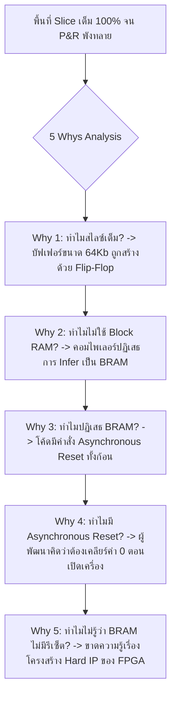

# Lesson 114: Hardware Inferencing of Block RAM & DSP Slices in VHDL (VHDLによるブロックRAMおよびDSPスライスのハードウェア推論)

---

## 1. ทฤษฎีวิศวกรรมเชิงลึก (高度なエンジニアリング理論)

### 1.1 ลำดับชั้นของหน่วยความจำใน FPGA (Distributed RAM vs Dedicated Block RAM)
ในการออกแบบสถาปัตยกรรมดิจิทัลบน FPGA การจัดเก็บข้อมูลความเร็วสูงมีให้เลือกใช้ 2 โครงสร้างหลักในระดับเนื้อซิลิคอน:

```
               Memory Hierarchy in Modern FPGA Silicon
  
      +-----------------------------------------------------------------------+
      |  Distributed RAM (LUT RAM)                                            |
      |  * สร้างจาก SRAM เซลล์ภายใน LUT6 ทั่วไป                                 |
      |  * ขนาดเล็ก (32 ถึง 64 บิตต่อ LUT)                                      |
      |  * อ่านข้อมูลได้ทันทีแบบ Asynchronous (Zero-Cycle Read Latency)          |
      |  * เหมาะสำหรับ: Small FIFO, Scratchpad, Register File ขนาด < 512 บิต    |
      +-----------------------------------------------------------------------+
                                         |
                                         v
      +-----------------------------------------------------------------------+
      |  Dedicated Block RAM (BRAM - เช่น RAMB36E2 / M20K)                      |
      |  * ฮาร์ดแวร์แมโครเฉพาะทาง (Dedicated Hard Silicon Blocks)               |
      |  * ความจุ 36 Kilobits หรือ 20 Kilobits ต่อบล็อก                         |
      |  * ต้องอ่านข้อมูลแบบ Synchronous เสมอ (ต้องการอย่างน้อย 1 ขอบ Clock)   |
      |  * ประหยัดลอจิก LUT บน Fabric ได้มหาศาล                                |
      |  * เหมาะสำหรับ: Packet Buffer, Video Frame Line Buffer, Large FIFO      |
      +-----------------------------------------------------------------------+
```

---

### 1.2 กฎเหล็ก: ทำไม Asynchronous Reset จึงทำลายการสังเคราะห์ Block RAM?
ข้อผิดพลาดร้ายแรงที่สุดที่พบบ่อยในการเขียน VHDL คือการใส่ **Asynchronous Reset** เข้าไปในกระบวนการเขียนอ่านหน่วยความจำ:

```vhdl
-- โค้ดหายนะที่ทำลายการสร้าง Block RAM (Disaster Code)
process(clk, rst)
begin
    if (rst = '1') then
        -- สั่งล้างข้อมูลทั้งหมดใน RAM เมื่อมีสัญญาณรีเซ็ตอซิงโครนัส
        ram <= (others => (others => '0'));
    elsif rising_edge(clk) then
        if (we = '1') then
            ram(to_integer(unsigned(addr))) <= din;
        end if;
    end if;
end process;
```

#### ฟิสิกส์ภายในของชิป (Silicon Reality):
บล็อกฮาร์ดแวร์ **Dedicated Block RAM ภายในชิป FPGA ทางกายภาพ "ไม่มีขารีเซ็ตอซิงโครนัส (No Asynchronous Clear Pin)"** ในระดับทรานซิสเตอร์! มีเพียงพอร์ตสัญญาณนาฬิกา $CLK$, ขาเปิดใช้งาน $EN$, และขาสั่งเขียน $WE$
* เมื่อวิศวกรเขียนคำสั่งสั่งล้างข้อมูลทั้งก้อนด้วย `rst = '1'` คอมไพเลอร์สังเคราะห์ (Vivado/Quartus) จะ **"ไม่สามารถแปลงโค้ดนี้ลง Block RAM ได้เด็ดขาด"**
* ผลลัพธ์: คอมไพเลอร์จะถูกบีบให้สร้างหน่วยความจำนั้นขึ้นมาจาก **Flip-Flops และ Look-Up Tables นับหมื่นตัวบน Logic Fabric ทั่วไป!** ส่งผลให้ทรัพยากรลอจิกของชิปถูกกลืนกินจนหมดเกลี้ยง (Resource Exhaustion) และเกิด Routing Congestion มหาศาล

---

### 1.3 แม่แบบ VHDL มาตรฐานสำหรับการอนุมาน Block RAM (BRAM Inferencing Template)
การเขียน VHDL ที่ถูกต้องเพื่อให้คอมไพเลอร์สร้าง True Dual-Port Block RAM โดยอัตโนมัติ:

```vhdl
-- Professional Single-Port Block RAM Inferencing in VHDL
library IEEE;
use IEEE.std_logic_1164.all;
use IEEE.numeric_std.all;

entity bram_infer_sp is
    generic (
        ADDR_WIDTH : integer := 10; -- 1024 Words
        DATA_WIDTH : integer := 32  -- 32-bit Width
    );
    port (
        clk  : in  std_logic;
        we   : in  std_logic;
        en   : in  std_logic;
        addr : in  std_logic_vector(ADDR_WIDTH-1 downto 0);
        din  : in  std_logic_vector(DATA_WIDTH-1 downto 0);
        dout : out std_logic_vector(DATA_WIDTH-1 downto 0)
    );
end entity;

architecture rtl of bram_infer_sp is
    type ram_type is array (0 to (2**ADDR_WIDTH)-1) of std_logic_vector(DATA_WIDTH-1 downto 0);
    signal RAM : ram_type;

    -- กำหนดคำสั่งบังคับเลือกชนิด RAM Style อย่างเป็นทางการ
    attribute ram_style : string;
    attribute ram_style of RAM : signal is "block";
begin

    -- กระบวนการทำงานแบบ Synchronous แท้จริง ปราศจาก Asynchronous Reset
    process(clk)
    begin
        if rising_edge(clk) then
            if (en = '1') then
                if (we = '1') then
                    RAM(to_integer(unsigned(addr))) <= din;
                end if;
                -- Read Operation (Synchronous Output Register)
                dout <= RAM(to_integer(unsigned(addr)));
            end if;
        end if;
    end process;

end architecture;
```

#### โหมดพฤติกรรมการเขียนอ่าน (Write Modes):
1. **`WRITE_FIRST` (Transparent Mode):** เอาต์พุตอ่านได้ข้อมูลใหม่ที่เพิ่งเขียนลงไปในไซเคิลนั้นทันที
2. **`READ_FIRST` (Read-Before-Write):** เอาต์พุตอ่านได้ข้อมูลเก่าที่เคยอยู่ในแอดเดรสนั้น ก่อนที่ข้อมูลใหม่จะถูกเขียนทับลงไป
3. **`NO_CHANGE` Mode:** เมื่อมีคำสั่งเขียน (`we = '1'`) เอาต์พุตจะคงค่าข้อมูลเดิมจากการอ่านรอบก่อนหน้าไว้ ไม่เปลี่ยนตาม **โหมดนี้กินไฟต่ำสุด (Lowest Power Consumption)**

---

### 1.4 การอนุมานบล็อกคำนวณ DSP Slice ใน VHDL (DSP Inferencing)
ในการคำนวณคณิตศาสตร์ Multiply-Accumulate (MAC: $P = P + (A \times B)$) การเขียนโค้ดที่ถูกต้องจะดึงบล็อกฮาร์ดแวร์ **DSP48E2** มาใช้งานพร้อมเปิด Pipeline Register ทุกระดับ:

```vhdl
-- Professional Fully-Pipelined DSP MAC Inferencing in VHDL
library IEEE;
use IEEE.std_logic_1164.all;
use IEEE.numeric_std.all;

entity dsp_mac_vhdl is
    port (
        clk       : in  std_logic;
        rst_n     : in  std_logic;
        clr_accum : in  std_logic;
        din_a     : in  signed(15 downto 0);
        din_b     : in  signed(15 downto 0);
        p_out     : out signed(47 downto 0)
    );
end entity;

architecture rtl of dsp_mac_vhdl is
    signal a_reg     : signed(15 downto 0) := (others => '0');
    signal b_reg     : signed(15 downto 0) := (others => '0');
    signal m_reg     : signed(31 downto 0) := (others => '0');
    signal accum_reg : signed(47 downto 0) := (others => '0');

    attribute use_dsp : string;
    attribute use_dsp of accum_reg : signal is "yes";
begin

    process(clk, rst_n)
    begin
        if (rst_n = '0') then
            a_reg     <= (others => '0');
            b_reg     <= (others => '0');
            m_reg     <= (others => '0');
            accum_reg <= (others => '0');
        elsif rising_edge(clk) then
            -- Pipeline Stage 1: Data Input Registers (Infers AREG, BREG)
            a_reg <= din_a;
            b_reg <= din_b;

            -- Pipeline Stage 2: Multiplier Output Register (Infers MREG)
            m_reg <= a_reg * b_reg;

            -- Pipeline Stage 3: Accumulator ALU Register (Infers PREG)
            if (clr_accum = '1') then
                accum_reg <= resize(m_reg, 48);
            else
                accum_reg <= accum_reg + resize(m_reg, 48);
            end if;
        end if;
    end process;

    p_out <= accum_reg;

end architecture;
```

---

## 2. ทริคหน้างาน OJT แบบ Step-by-Step (現場の実践テクニック)

### 2.1 กรณีศึกษาความล้มเหลวหน้างาน (失敗事例: Shippai Jirei)
* **บริบท:** กล่องประมวลผลเซนเซอร์โซนาร์ยานยนต์ (Automotive Ultrasonic Radar ECU) ทำงานบนชิป Xilinx Artix-7 100T FPGA
* **อาการเสียหน้างาน:** เมื่อทำการคอมไพล์โปรเจกต์ ขั้นตอนการสังเคราะห์ลอจิก (Synthesis) ใช้เวลานานผิดปกติถึง 3 ชั่วโมง (จากเดิม 10 นาที) และขั้นตอนการจัดวางและเดินสาย (Place & Route) **ล้มเหลวอย่างสิ้นเชิง โดยมีข้อความแจ้งเตือน:**
  `ERROR: [Place 30-484] The slice logic utilization exceeds 100%. Slices used: 15,820 / 15,850 (99.8%). Cannot place design!`
* **ความผิดปกติเชิงสถาปัตยกรรม:** ชิป Artix-7 100T มีบล็อก **36Kb Block RAM ว่างเหลืออยู่ถึง 135 บล็อก ($100\%$ ไม่ได้ถูกใช้งานเลย)** แต่เนื้อที่ลอจิก LUT กลับเต็มเอี๊ยดจนบอร์ดระเบิดความจุ

```
            การสืบสวนสาเหตุการระเบิดความจุของสไลซ์ (Resource Explosion Analysis)
   +--------------------------------------------------------------------------+
   | ตรวจสอบ Utilization Report:                                             |
   | พบว่าโมดูล `echo_buffer.vhd` ขนาด 2048 x 32 บิต กลืน Flip-Flop ไปถึง     |
   | 65,536 ตัว และใช้ LUT6 ไปมากกว่า 14,000 ตัว!                             |
   +--------------------------------------------------------------------------+
                                       |
                                       v
   +--------------------------------------------------------------------------+
   | เปิดดูซอร์สโค้ด: พบว่าวิศวกรใส่คำสั่ง Asynchronous Reset                 |
   | if (async_rst = '1') then                                                |
   |     ram_data <= (others => (others => '0'));                             |
   | เพื่อหวังจะเคลียร์เมมโมรีให้สะอาดก่อนเริ่มทำงาน                           |
   +--------------------------------------------------------------------------+
                                       |
                                       v
   +--------------------------------------------------------------------------+
   | การตัดสินใจของคอมไพเลอร์:                                                 |
   | เนื่องจาก BRAM ฮาร์ดแวร์จริงไม่มีขารีเซ็ตอซิงโครนัส                     |
   | Vivado จึงต้องสร้าง RAM ก้อนนี้ขึ้นมาจาก Flip-Flop เดี่ยวๆ 65,536 ตัว!    |
   | ส่งผลให้กินพื้นที่ Slice เกือบทั้งชิปจน Place & Route พังทลาย            |
   +--------------------------------------------------------------------------+
```

---

### 2.2 การวิเคราะห์หาสาเหตุรากเหง้า (Root Cause Analysis: 5 Whys & Ishikawa)



#### Ishikawa Diagram (ผังก้างปลา)
* **RTL Coding:** ใส่ Asynchronous Reset ครอบอาร์เรย์หน่วยความจำขนาดใหญ่
* **Hardware Knowledge:** ไม่เข้าใจข้อจำกัดทางกายภาพว่า Block RAM รองรับเฉพาะ Synchronous Read/Write
* **Synthesis Log Ignored:** ข้ามการอ่านข้อความคำเตือน *"RAM inferred as distributed registers due to asynchronous reset"*
* **Coding Standards:** ไม่มีเทมเพลตมาตรฐานประจำบริษัทสำหรับการประกาศหน่วยความจำ BRAM

---

### 2.3 มาตรการแก้ไขถาวร (Permanent Corrective Action)
1. **ตัด Asynchronous Reset ออกจากกระบวนการของ RAM โดยสมบูรณ์:**
   * ให้ระบบเริ่มทำงานโดยถือว่าค่าใน RAM เป็น Don't Care หรือใช้คุณสมบัติการโหลดค่าเริ่มต้นจากไฟล์บิตสตรีม (`signal RAM : ram_type := (others => (others => '0'));`)
2. **ใส่ Attribute กำกับอย่างเป็นทางการ:**
   ```vhdl
   attribute ram_style of ram_data : signal is "block";
   ```
3. **ผลลัพธ์หลังแก้ไข:**
   * การใช้งานลอจิก Slice ลดฮวบลงจาก $99.8\%$ เหลือเพียง **$12.4\%$!**
   * บล็อก **Block RAM ถูกใช้งานไป 2 บล็อก (36Kb $\times$ 2)**
   * เวลาในการ Compile ลดลงจาก 3 ชั่วโมงเหลือเพียง **6 นาที** และระบบผ่าน Timing Closure ฉลุยที่ความถี่ $200\text{ MHz}$

---

### 2.4 ตารางตรวจสอบหน้างาน SOP สำหรับ BRAM และ DSP (Memory/DSP SOP Checklist)

| ลำดับ | จุดตรวจสอบทางวิศวกรรม | เกณฑ์การยอมรับ (Acceptance Criteria) | เครื่องมือตรวจสอบ | ผลการตรวจ |
| :---: | :--- | :--- | :--- | :---: |
| 1 | การตรวจสอบการไม่มี Asynchronous Reset | ใน Process ของ RAM ต้องไม่มีสัญญาณรีเซ็ตแบบ Asynchronous เด็ดขาด | VHDL Code Review | ผ่าน / ไม่ผ่าน |
| 2 | การตรวจสอบ BRAM Utilization | เมมโมรีขนาด $> 1024\text{ บิต}$ ต้องถูก Infer ลง Block RAM ($100\%$) | Utilization Report | ผ่าน / ไม่ผ่าน |
| 3 | การเลือกโหมด Write Mode | หากไม่มีความจำเป็นต้องอ่านข้อมูลทันที ให้เลือกใช้โหมด `NO_CHANGE` | Power Optimization Check | ผ่าน / ไม่ผ่าน |
| 4 | การเปิด Pipeline ใน DSP48 | วงจรคูณความถี่ $\ge 250\text{ MHz}$ ต้องเปิดใช้ $AREG, BREG, MREG, PREG$ ครบ | Synthesis DSP Report | ผ่าน / ไม่ผ่าน |
| 5 | การป้องกัน RAM Address Overflow | สัญญาณแอดเดรสต้องจำกัดขอบเขตไม่เกินขนาดอาร์เรย์ (`to_integer(unsigned)`) | RTL Lint / SVA Check | ผ่าน / ไม่ผ่าน |

---

## 3. คำศัพท์และประโยคภาษาญี่ปุ่นสำหรับตรวจแบบ (検図 - Kenzu)

### 3.1 ตารางคำศัพท์เทคนิคเฉพาะทาง (専門用語一覧)

| คำศัพท์คันจิ/คาตาคานะ | การอ่าน (Romaji) | คำแปลภาษาไทย / ภาษาอังกฤษ |
| :--- | :--- | :--- |
| **ブロックRAM推論** | Burokku ramu suiron | การอนุมานบล็อกแรมลงฮาร์ดแวร์ (Block RAM Inferencing) |
| **分散RAM** | Bunsan ramu | ดิสทริบิวต์แรม / แรมจากลอจิก LUT (Distributed RAM) |
| **非同期リセット制約** | Hidōki risetto seiyaku | ข้อห้ามรีเซ็ตอซิงโครนัสบนแรม (Asynchronous Reset Restriction) |
| **書き込み優先モード** | Kakikomi yūsen mōdo | โหมดให้ความสำคัญกับการเขียน (Write-First Mode) |
| **読み出し優先モード** | Yomidashi yūsen mōdo | โหมดให้ความสำคัญกับการอ่าน (Read-First Mode) |
| **資源枯渇** | Shigen kokatsu | ภาวะทรัพยากรชิปหมดเกลี้ยง (Resource Exhaustion) |
| **積和演算ブロック** | Sekiwa enzan burokku | บล็อกการคูณสะสม (DSP Multiply-Accumulate Block) |
| **初期値ファイル** | Shokichi fairu | ไฟล์ค่าเริ่มต้นของหน่วยความจำ (Memory Initialization File: .coe / .mif) |
| **パイプライン段数確保** | Paipurain dansū kakuho | การรักษาระดับชั้นของไปป์ไลน์ใน DSP (Pipeline Stages Securing) |
| **メモリ衝突** | Memori shōtotsu | การชนกันของการเข้าถึงหน่วยความจำ (Memory Access Collision) |

---

### 3.2 บทสนทนาการตรวจแบบหน้างานจริง (検図での指摘事項)

#### การตรวจแบบจุดที่ 1: การตรวจพบการใส่ Asynchronous Reset จน BRAM กลายเป็น Flip-Flop
* **審査役 (Lead Chief Engineer):**
  「リソースレポートを確認しましたが、スライスLUTの使用率が $96\%$ に達して配置配線がスタックしています。原因を調査したところ、`fft_fifo_buffer.vhd` のRAM記述において、プロセス内で非同期リセット `rst_n` を使って全配列をクリアしていますね。ハードウェアBRAMには非同期全消去機能が存在しないため、合成ツールが数千個のフリップフロップとして展開してしまっています。RAMプロセスから非同期リセットを直ちに除去し、BRAMとして正しく推論させてください。」
  *(ผมได้ตรวจสอบรายงานทรัพยากรแล้ว พบว่าอัตราการใช้งาน Slice LUT สูงถึง $96\%$ จนการทำ Place & Route หยุดชะงักครับ เมื่อตรวจสอบหาสาเหตุพบว่าในโค้ด RAM ของไฟล์ `fft_fifo_buffer.vhd` มีการใช้ Asynchronous Reset `rst_n` สั่งล้างข้อมูลทั้งอาร์เรย์ในโพรเซสครับ เนื่องจากฮาร์ดแวร์ BRAM จริงไม่มีฟังก์ชันเคลียร์ข้อมูลอซิงโครนัส ซินเทซิสทูลจึงต้องคลี่วงจรออกมาเป็นฟลิปฟลอปหลายพันตัวแทน ช่วยตัด Asynchronous Reset ออกจากโพรเซสของ RAM ทันทีเพื่อให้มันถูกสร้างเป็น BRAM อย่างถูกต้องครับ)*
* **設計担当 (FPGA Design Engineer):**
  「ご指摘ありがとうございます。BRAMのシリコン物理構造に対する理解が不足しておりました。直ちにリセット条件を削除し、同期イネーブルのみを用いた標準テンプレートへ修正いたします。これによりスライス使用率を大幅に引き下げます。」
  *(ขอบพระคุณสำหรับข้อสังเกตครับ ผมยังเข้าใจโครงสร้างกายภาพซิลิคอนของ BRAM ไม่ดีพอครับ ผมจะรีบตัดเงื่อนไขรีเซ็ตทิ้ง และแก้ไขไปใช้แม่แบบมาตรฐานที่มีเพียง Synchronous Enable ซึ่งจะช่วยดึงอัตราการใช้ Slice ให้ลดลงอย่างมหาศาลครับ)*

#### การตรวจแบบจุดที่ 2: ปัญหาการใช้ DSP Slice โดยไม่มี Multiplier Pipeline Register
* **審査役 (Lead Chief Engineer):**
  「デジタルフィルタ回路の乗算累算部ですが、DSP48が推論されているものの、乗算器出力段の `MREG` がバイパス（0段）設定になっています。そのため、乗算結果からアキュムレータまでの遅延が $2.8\text{ ns}$ に達し、300MHz動作のタイミングが破綻しています。VHDL記述に中間信号レジスタを1段挿入し、DSP内部の `MREG` を有効化してタイミング収束を図ってください。」
  *(ในส่วนคูณสะสมของตัวกรองดิจิทัล แม้ว่าจะถูกสร้างเป็น DSP48 แต่ `MREG` ที่เอาต์พุตของตัวคูณกลับถูกบายพาส (0 สเตจ) ไว้นะครับ ทำให้ความล่าช้าจากตัวคูณไปยังแอกคิวมูเลเตอร์สูงถึง $2.8\text{ ns}$ จนไทม์มิ่งที่ 300MHz พังทลาย ช่วยแทรกสัญญาณรีจิสเตอร์ขั้นกลางเข้าไปในโค้ด VHDL อีก 1 สเตจ เพื่อเปิดใช้งาน `MREG` ภายใน DSP และทำให้ไทม์มิ่งบรรลุเป้าหมายครับ)*
* **設計担当 (FPGA Design Engineer):**
  「承知いたしました。乗算結果を一度クロック同期レジスタ `m_reg` で受ける記述に改め、レイテンシを1サイクル追加することで `MREG` を確実に推論させ、300MHzでの安定動作を実現いたします。」
  *(รับทราบครับ ผมจะแก้ไขให้มีรีจิสเตอร์ `m_reg` มารับผลคูณอีก 1 จังหวะสัญญาณนาฬิกา ซึ่งการเพิ่ม Latency 1 ไซเคิลนี้จะช่วยเปิดใช้งาน `MREG` อย่างแน่นอน และทำให้ระบบทำงานได้อย่างมีเสถียรภาพที่ 300MHz ครับ)*

---

## 4. ควิซวิเคราะห์ปัญหาระดับวิศวกรอาวุโส (上級技術クイズ)

### ข้อที่ 1: การเปรียบเทียบปริมาณทรัพยากร Slice ระหว่าง Distributed RAM และ Block RAM
วิศวกรออกแบบหน่วยความจำ FIFO บัฟเฟอร์ขนาด **$2048\text{ Words} \times 32\text{ บิต}$** (ความจุรวม $65,536\text{ บิต}$)

หากวิศวกรเผลอใส่ Asynchronous Reset จนระบบไม่สามารถใช้ Dedicated Block RAM (RAMB36E2) ได้ และถูกคอมไพเลอร์บีบให้สร้างด้วย **Distributed RAM บน Look-Up Table (LUT6)**:
* ในสถาปัตยกรรม Xilinx UltraScale+ เซลล์ LUT6 หนึ่งตัวใน SliceM สามารถคอนฟิกให้เป็น Distributed RAM ขนาดสูงสุด $64\text{ บิต} \times 1\text{ บิต}$
* หนึ่ง Slice ประกอบด้วย 4 LUTs (ดังนั้น 1 Slice จุได้สูงสุด $256\text{ บิต}$)
* นอกเหนือจากตัวเก็บข้อมูลแล้ว ยังต้องใช้ลอจิกมัลติเพล็กเซอร์ในการเลือกแอดเดรสอีกประมาณ $25\%$ ของจำนวน LUT เก็บข้อมูล

จงคำนวณหาจำนวน **LUT6** ขั้นต่ำ และจำนวน **บล็อก RAMB36E2** ที่ต้องใช้หากออกแบบอย่างถูกต้อง:

a) หากใช้ Distributed RAM ต้องใช้ $\approx 1,280\text{ LUTs}$, หากใช้ BRAM ต้องใช้เพียง **2 บล็อก (RAMB36E2)**  
b) หากใช้ Distributed RAM ต้องใช้ $\approx 320\text{ LUTs}$, หากใช้ BRAM ต้องใช้ 8 บล็อก  
c) หากใช้ Distributed RAM ต้องใช้ $\approx 4,096\text{ LUTs}$, หากใช้ BRAM ต้องใช้ 1 บล็อก  
d) ทั้งสองแบบใช้ทรัพยากรเท่ากัน เพราะคอมไพเลอร์จะแปลงสลับไปมาได้อิสระ  

---

#### เฉลยและบทวิเคราะห์เชิงลึกข้อที่ 1
**คำตอบที่ถูกต้องคือ: a) หากใช้ Distributed RAM ต้องใช้ $\approx 1,280\text{ LUTs}$, หากใช้ BRAM ต้องใช้เพียง 2 บล็อก (RAMB36E2)**

**ขั้นตอนการคำนวณทางคณิตศาสตร์:**
1. **กรณีใช้ Dedicated Block RAM (RAMB36E2):**
   * บล็อก RAMB36E2 แต่ละบล็อกมีความจุ $36\text{ Kb} = 36,864\text{ บิต}$ (หรือใช้งานมาตรฐาน $32,768\text{ บิต}$ ในโหมดไม่คิด Parity)
   * ความจุข้อมูลที่ต้องการ: $2048 \times 32 = 65,536\text{ บิต}$
   * จำนวนบล็อก BRAM ที่ต้องใช้:
     $$\text{Number of BRAMs} = \frac{65,536\text{ บิต}}{32,768\text{ บิต/บล็อก}} = 2\text{ บล็อกพอดี!}$$
   * ปริมาณการใช้ลอจิกบน Fabric: **$0\text{ LUTs}$ (ใช้ Hard IP ล้วนๆ)**
2. **กรณีหลุดไปเป็น Distributed RAM (เนื่องจากมี Async Reset):**
   * ความจุต่อ 1 LUT6 = $64\text{ บิต}$
   * จำนวน LUT6 สำหรับจัดเก็บข้อมูลเพียวๆ:
     $$\text{LUT}_{data} = \frac{65,536\text{ บิต}}{64\text{ บิต/LUT}} = 1,024\text{ LUTs}$$
   * การเลือกแอดเดรส $2048$ คำ ต้องใช้แอดเดรสขนาด $\lceil \log_2 2048 \rceil = 11\text{ บิต}$ ในขณะที่ LUT แต่ละตัวรับได้ 6 บิต จึงต้องใช้ Multiplexer Tree (MUXF7/MUXF8 และ LUT เพิ่มเติม) อีกอย่างน้อย $25\%$:
     $$\text{LUT}_{mux} \approx 1,024 \times 0.25 = 256\text{ LUTs}$$
   * จำนวน LUT รวมทั้งหมด:
     $$\text{Total LUTs} = 1,024 + 256 = 1,280\text{ LUTs}$$
3. **ข้อสรุปเชิงวิศวกรรม:**
   * การลืมตัด Asynchronous Reset เพียงบรรทัดเดียว สิ้นเปลืองทรัพยากร Look-Up Table ไปถึง **$1,280\text{ ตัว}$** ซึ่งในบอร์ดขนาดเล็กอาจคิดเป็น $20\% - 50\%$ ของพื้นที่ชิปทั้งหมด!

---

### ข้อที่ 2: พฤติกรรมการชนกันของข้อมูล (Write Collision) ใน True Dual-Port Block RAM
พิจารณาหน่วยความจำแบบ True Dual-Port Block RAM (พอร์ต $A$ และพอร์ต $B$ ทำงานด้วย Clock เดียวกัน):
* ณ ไซเคิลที่ $N$: พอร์ต $A$ สั่งเขียนข้อมูลค่า `0xDEAD_BEEF` ลงในแอดเดรส `0x100` (`we_a = '1'`)
* ในไซเคิลเดียวกันที่ $N$: พอร์ต $B$ สั่งอ่านข้อมูลจากแอดเดรสเดียวกัน `0x100` (`we_b = '0'`)

หากพอร์ต $A$ ถูกตั้งค่าพฤติกรรมเป็นโหมด **`READ_FIRST`**:
ข้อมูลที่พอร์ต $B$ จะอ่านได้ออกมาในไซเคิลถัดไป ($N+1$) จะมีค่าเป็นอย่างไรตามข้อกำหนดฮาร์ดแวร์ของ FPGA?

a) อ่านได้ค่าใหม่ `0xDEAD_BEEF` แน่นอน $100\%$  
b) อ่านได้ค่าเดิมที่เคยค้างอยู่ในแอดเดรส `0x100` ก่อนหน้านี้  
c) เกิดสภาวะข้อห้าม (Hardware Write Collision) ข้อมูลที่พอร์ต B อ่านได้จะไม่สามารถระบุค่าได้ (Invalid / Corrupted Data หรือสถานะ X ใน Simulation)  
d) ชิป FPGA จะตัดการจ่ายไฟเข้า BRAM ตัวนั้นทันที  

---

#### เฉลยและบทวิเคราะห์เชิงลึกข้อที่ 2
**คำตอบที่ถูกต้องคือ: c) เกิดสภาวะข้อห้าม (Hardware Write Collision) ข้อมูลที่พอร์ต B อ่านได้จะไม่สามารถระบุค่าได้ (Invalid / Corrupted Data หรือสถานะ X ใน Simulation)**

**บทวิเคราะห์เชิงลึกระดับ Lead Architect:**
* ในสเปกของทั้ง Xilinx (UG573) และ Intel FPGA:
  * บล็อก Dual-Port BRAM ประกอบด้วยเซลล์ SRAM ร่วมกันภายใน 1 คอลัมน์
  * หากพอร์ตหนึ่งกำลัง "เขียน" และอีกพอร์ตหนึ่งกำลัง "อ่าน" ที่ **"แอดเดรสเดียวกันในไซเคิลเดียวกัน (Same Address, Simultaneous Read/Write)"**
  * เส้น Bitline ภายในจะเกิดการแข่งขันของประจุไฟฟ้า (Charge Contention)
  * แม้ว่าพอร์ต A จะถูกตั้งเป็น `READ_FIRST` สำหรับตัวมันเอง แต่ความสัมพันธ์ข้ามพอร์ต ($A \leftrightarrow B$) จะเกิด **Write Collision Violation**
  * ข้อมูลที่พอร์ต B อ่านได้จะไม่ได้รับการรับประกันทางสเปก (Undefined Data Corruption)
* **วิธีแก้ทางวิศวกรรม:** ในระดับสถาปัตยกรรม ต้องสร้างวงจร Arbiter หรือ Address Collision Detector ภายนอก เพื่อไม่ให้พอร์ต A และ B เข้าถึงแอดเดรสเดียวกันพร้อมกันในไซเคิลเดียวกันเด็ดขาด

---

### ข้อที่ 3: การประเมินแบนด์วิดท์สูงสุดของ Dual-Port UltraRAM (URAM) ในงานวิดีโอ 4K
ในชิป UltraScale+ มีบล็อกหน่วยความจำความจุสูงพิเศษ **UltraRAM (URAM288)** ซึ่งมีขนาด $4096\text{ Words} \times 72\text{ บิต}$ ต่อบล็อก และสามารถทำงานได้ที่ความถี่สูงสุด $f_{clk} = 500\text{ MHz}$ ในโหมด Dual-Port

หากนำ URAM มาสร้างเป็นเฟรมบัฟเฟอร์สำหรับสตรีมวิดีโอ โดยพอร์ต $A$ ทำหน้าที่เขียนข้อมูลพิกเซลเข้า และพอร์ต $B$ ทำหน้าที่อ่านข้อมูลพิกเซลออกพร้อมกันอย่างต่อเนื่องในทุกรอบสัญญาณนาฬิกา (Dual-Port Simultaneous Access):

จงคำนวณหา **แบนด์วิดท์รวมสุทธิ (Total Aggregate Memory Bandwidth)** ของบล็อก URAM เพียงบล็อกเดียวนี้ ในหน่วย **กิกะบิตต่อวินาที (Gbps)**:

a) $36.0\text{ Gbps}$  
b) $72.0\text{ Gbps}$  
c) $144.0\text{ Gbps}$  
d) $288.0\text{ Gbps}$  

---

#### เฉลยและบทวิเคราะห์เชิงลึกข้อที่ 3
**คำตอบที่ถูกต้องคือ: b) $72.0\text{ Gbps}$**

**ขั้นตอนการคำนวณทางคณิตศาสตร์:**
1. คำนวณความกว้างของบัสข้อมูลในแต่ละพอร์ต:
   $$W_{data} = 72\text{ บิต}$$
2. คำนวณแบนด์วิดท์ของพอร์ตขาเขียน (Port A):
   $$\text{BW}_A = 72\text{ บิต} \times 500 \times 10^6\text{ Hz} = 36.0 \times 10^9\text{ บิต/วินาที} = 36.0\text{ Gbps}$$
3. คำนวณแบนด์วิดท์ของพอร์ตขาอ่าน (Port B):
   $$\text{BW}_B = 72\text{ บิต} \times 500 \times 10^6\text{ Hz} = 36.0 \times 10^9\text{ บิต/วินาที} = 36.0\text{ Gbps}$$
4. คำนวณแบนด์วิดท์รวมสองทิศทาง (Total Aggregate Bandwidth):
   $$\text{BW}_{total} = \text{BW}_A + \text{BW}_B = 36.0\text{ Gbps} + 36.0\text{ Gbps} = 72.0\text{ Gbps}$$
5. **ข้อสรุปเชิงวิศวกรรม:**
   * บล็อก UltraRAM เพียงบล็อกเดียวให้แบนด์วิดท์รวมสูงถึง **$72.0\text{ Gbps}$ (หรือ $9.0\text{ GB/s}$)** ซึ่งเพียงพอต่อการรองรับสตรีมวิดีโอ 4K UHD 60fps Uncompressed ได้อย่างสบายโดยไม่มีปัญหาคอขวด
