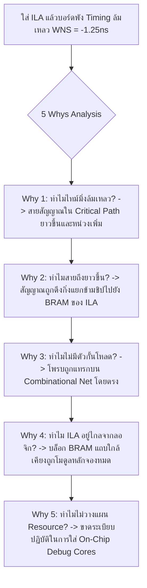

# Lesson 115: Verification, Assertions & Board-Level Bringup in VHDL (VHDL検証手法・アサーションと実機立ち上げデバッグ)

---

## 1. ทฤษฎีวิศวกรรมเชิงลึก (高度なエンジニアリング理論)

### 1.1 วิวัฒนาการของการตรวจสอบความถูกต้องใน VHDL (VHDL-2008 & Assertions)
ในวงจรดิจิทัลขนาดใหญ่ ต้นทุนของการค้นพบบั๊กหลังจากการผลิตแผ่นวงจรพิมพ์จริง (Post-Silicon Bug) มีมูลค่าสูงกว่าการพบบั๊กในขั้นตอนการจำลอง (RTL Simulation) ถึง 100 ถึง 1,000 เท่า การตรวจสอบความถูกต้อง (Verification) จึงเป็นกระบวนการที่กินเวลามากกว่า $60\%$ ของวงจรการพัฒนาฮาร์ดแวร์ทั้งหมด

ภาษา VHDL-2008 ได้ยกระดับการตรวจสอบความถูกต้องด้วยการผสานรวม **Assertion-Based Verification (ABV)** และการรองรับภาษา **Property Specification Language (PSL - IEEE 1850)**:

```
               Assertion-Based Verification Hierarchy in VHDL
  
      +-----------------------------------------------------------------------+
      |  Formal Verification / PSL Properties (IEEE 1850)                      |
      |  * พิสูจน์ความถูกต้องทางคณิตศาสตร์ในทุกสถานะที่เป็นไปได้                  |
      |  * ตรวจสอบโปรโตคอลบัสที่ซับซ้อน (AXI, PCIe, Wishbone)                  |
      +-----------------------------------------------------------------------+
                                         |
                                         v
      +-----------------------------------------------------------------------+
      |  Concurrent VHDL Assertions (แบบขนานตามเวลาจริง)                         |
      |  * ตรวจสอบเงื่อนไขฮาร์ดแวร์ตลอดเวลาในทุกขอบสัญญาณนาฬิกา                 |
      |  * แจ้งเตือนทันทีที่เกิด Protocol Violation หรือ Illegal State          |
      +-----------------------------------------------------------------------+
                                         |
                                         v
      +-----------------------------------------------------------------------+
      |  Self-Checking Automated Testbench with Text I/O                       |
      |  * อ่านเวกเตอร์ทดสอบจากไฟล์ภายนอก และเปรียบเทียบกับ Golden Model      |
      +-----------------------------------------------------------------------+
```

#### รูปแบบการเขียน Concurrent Assertion ใน VHDL:
คำสั่ง `assert` สามารถเขียนเป็นแบบ Concurrent Statement นอกกระบวนการ Process เพื่อตรวจสอบเงื่อนไขตลอดเวลา:

```vhdl
-- การดักจับความผิดพลาดของโปรโตคอล Handshake: "ห้าม VALID ลดลงก่อน READY มา"
p_handshake_stable: assert not (rising_edge(clk) and (valid_reg = '1' and ready_in = '0' and valid_next = '0'))
    report "CRITICAL PROTOCOL VIOLATION: VALID was de-asserted before READY was high!"
    severity failure;
```

ระดับความรุนแรง (Severity Levels) ใน VHDL:
* `note`: ข้อความแจ้งเตือนสถานะทั่วไป
* `warning`: การแจ้งเตือนข้อสงสัย แต่ให้การจำลองดำเนินต่อไป
* `error`: ข้อผิดพลาดทางตรรกะ บ่งชี้ว่าผลลัพธ์ไม่ตรงกับ Golden Model
* `failure`: ข้อผิดพลาดร้ายแรง **สั่งหยุดโปรแกรมจำลองทันที (Simulation Abort)** เหมาะสำหรับ Protocol Violation

---

### 1.2 สถาปัตยกรรมตัววิเคราะห์ลอจิกบนชิป (Integrated Logic Analyzer: ILA / SignalTap)
เมื่อนำบอร์ดฮาร์ดแวร์จริงมาเปิดเครื่องทดสอบ (Board Bring-Up) สัญญาณหลายพันเส้นภายใน FPGA จะถูกปิดผนึกอยู่ภายในแพ็กเกจ BGA เครื่องมือตรวจวัดภายนอก (Oscilloscope หรือ Logic Analyzer) ไม่สามารถต่อสายเข้าไปวัดได้ วิศวกรจึงต้องฝังคอร์ **Integrated Logic Analyzer (ILA)** ลงในบิตสตรีม:

```
                   Integrated Logic Analyzer (ILA) Core Microarchitecture
  
   Probed Internal Nets
        +--------+
  Net 1 |        |
  Net 2 | Probe  |====[ Probe Multiplexer ]====+
  Net 3 | Inputs |                             |
        +--------+                             v
                                     +-------------------+
                                     | Circular Sample   | (จัดเก็บข้อมูลลงใน Block RAM)
                                     | Buffer (BRAM)     |
                                     +-------------------+
                                               ^
                                               | Sample Clock & Write Enable
                                     +---------+---------+
                                     | Trigger Sequencer | (FSM เปรียบเทียบเงื่อนไขทริกเกอร์)
                                     +-------------------+
                                               ^
                                               | JTAG Interface
                                     [ JTAG TAP Controller / USB Cable ]
```

#### ปรากฏการณ์ผลกระทบของผู้สังเกต (The Observer Effect / Probe Impact):
การใส่คอร์ ILA เข้าไปในชิป **"ไม่ใช่กระบวนการที่ไม่ส่งผลกระทบ (Non-intrusive)"** แต่สร้างผลกระทบทางกายภาพต่อวงจรจริงดังนี้:
1. **Routing Congestion & Fan-Out Loading:** การต่อโพรบ ILA เข้ากับสัญญาณวิกฤตจะเพิ่มโหลด Fan-Out ให้กับเน็ตนั้น ทำให้ความจุไฟฟ้าแฝงเพิ่มขึ้นและสายทองแดงต้องวิ่งอ้อม เกิด **Setup Time Violation** บนเส้นทางที่เคยผ่าน
2. **การแย่งชิงทรัพยากร Block RAM:** ILA ต้องใช้ BRAM ขนาดใหญ่ในการเก็บข้อมูลตัวอย่าง (เช่น บัส 64 บิต ลึก 8,192 ตัวอย่าง ต้องใช้ RAMB36E2 ถึง 16 บล็อก!)
3. **ปรากฏการณ์ไฮเซนบั๊ก (Heisenbug):** บั๊กประหลาดที่เกิดขึ้นตอนรันปกติ แต่พอใส่วงจร ILA เข้าไปเพื่อตรวจจับ บั๊กกลับหายไปอย่างไร้ร่องรอยเนื่องจาก P&R เปลี่ยนแปลง Layout ของสายสัญญาณ!

---

### 1.3 กฎการใส่โพรบ ILA อย่างปลอดภัย (Safe Debug Probing Rules)
เพื่อไม่ให้การดีบักเข้าไปทำลายคุณลักษณะเชิงเวลาของระบบจริง:

```vhdl
-- วิธีการต่อสัญญาณเข้า ILA อย่างปลอดภัยระดับ Senior
signal critical_data_raw : std_logic_vector(31 downto 0);
signal dbg_probe_reg     : std_logic_vector(31 downto 0) := (others => '0');

-- 1. บังคับห้าม Optimize ทิ้ง และมาร์กให้เป็นสัญญาณดีบัก
attribute mark_debug : string;
attribute mark_debug of dbg_probe_reg : signal is "true";

-- 2. ต้องคัดลอกสัญญาณผ่าน Flip-Flop พักไว้ 1 สเตจก่อนเสมอ (Isolating Register)
proc_dbg_iso: process(clk)
begin
    if rising_edge(clk) then
        dbg_probe_reg <= critical_data_raw; -- ตัดโหลด Fan-out ไม่ให้ไปกวน Critical Path เดิม
    end if;
end process;
```

---

## 2. ทริคหน้างาน OJT แบบ Step-by-Step (現場の実践テクニック)

### 2.1 กรณีศึกษาความล้มเหลวหน้างาน (失敗事例: Shippai Jirei)
* **บริบท:** กล่องโมเด็มสื่อสารดาวเทียมวงโคจรต่ำ (LEO Satellite Transceiver) ใช้ชิป Xilinx Kintex UltraScale+
* **อาการเสียหน้างาน:** บอร์ดรุ่นทดสอบทำงานผิดพลาด โดยส่งข้อมูลผิดเพี้ยนเป็นระยะๆ (Bit Error Rate สูง) ทีมวิศวกรจึงตัดสินใจแทรกคอร์ ILA ขนาด 128 บิตเพื่อดักจับสัญญาณภายใน แต่ผลลัพธ์คือ **"หลังจากแทรก ILA แล้ว บอร์ดกลับไม่สามารถบูตทำงานได้เลย"** สัญญาณนาฬิกาล็อกหลุด และระบบฟ้องว่า `Timing Closure Failed (WNS = -1.250 ns)` ทั้งๆ ที่ก่อนใส่ ILA ไทม์มิ่งเคยผ่านฉลุย
* **การสืบสวนด้วย Device View:** เปิดดูแผนผังการจัดวางชิ้นส่วนใน Vivado Device View พบภาพหายนะ:

```
             การกระจายตัวของ ILA ทำลายโครงสร้าง P&R (Shippai Analysis)
   +--------------------------------------------------------------------------+
   | ผู้ออกแบบใช้คำสั่ง `mark_debug` จับสัญญาณ Combinational จากกลางโมดูล      |
   | โดยไม่ผ่าน Register กั้น และดึงสัญญาณมากกว่า 128 จุดเข้า ILA ตัวเดียว   |
   +--------------------------------------------------------------------------+
                                       |
                                       v
   +--------------------------------------------------------------------------+
   | ผลกระทบ: สายทองแดงของสัญญาณวิกฤตถูกแยกกิ่ง (High Fan-out Splitting)       |
   | ลายวงจรต้องวิ่งข้ามชิปจากคอลัมน์ซ้ายสุดไปยัง Block RAM ของ ILA ฝั่งขวาสุด  |
   | ความจุไฟฟ้าแฝงของสายทำให้ Delay เพิ่มขึ้น 2.4 ns -> เกิด SETUP VIOLATION  |
   +--------------------------------------------------------------------------+
                                       |
                                       v
   +--------------------------------------------------------------------------+
   | ยิ่งไปกว่านั้น: วิศวกรต่อสัญญาณ Clock ของ ILA เข้ากับสัญญาณนาฬิกาคนละตัว   |
   | ที่ไม่มีความสัมพันธ์ของเฟส ทำให้ข้อมูลที่ ILA แซมเปิลได้เป็นขยะกึ่งเสถียร   |
   +--------------------------------------------------------------------------+
```

---

### 2.2 การวิเคราะห์หาสาเหตุรากเหง้า (Root Cause Analysis: 5 Whys & Ishikawa)



#### Ishikawa Diagram (ผังก้างปลา)
* **Design for Debug:** ไม่ได้จัดทำ Isolating Pipeline Stage สำหรับสัญญาณที่ต้องการสังเกต
* **Resource Planning:** ไม่ได้คำนวณการจัดสรร Block RAM สำรองไว้สำหรับการดีบัก
* **Clock Selection:** ใช้สัญญาณนาฬิกาคนละตัวกับสัญญาณที่กำลังวัด ทำให้เกิด CDC ในตัวโพรบ
* **Verification Discipline:** ขาดการประเมิน Timing Slack Margin ล่วงหน้าก่อนใส่ Debug Cores

---

### 2.3 มาตรการแก้ไขและกฎทองการ Bring-up บอร์ดจริง
1. **สร้าง Isolated Debug Register Layer:** ทุกสัญญาณที่ต้องการส่องดูด้วย ILA ต้องผ่าน Flip-Flop กั้น 1 ตัวเสมอ เพื่อไม่ให้ความยาวของสาย ILA ย้อนกลับมารบกวน Functional Timing Path
2. **ผูก Sampling Clock ให้ตรงกับโดเมนสัญญาณ $100\%$:** สัญญาณที่ทำงานบน Clock ใด ต้องใช้ Clock นั้นในการขับคอร์ ILA เสมอ
3. **ลดขนาดความลึกของบัฟเฟอร์ (Buffer Depth Tuning):** หากพื้นที่ BRAM ตึงตัว ให้ลดความลึกจาก 8,192 เหลือ 1,024 ตัวอย่าง และใช้ Advanced Trigger Sequencer (State-Based Triggering) ในการดักจับเฉพาะจังหวะที่เกิดปัญหา
4. **ผลลัพธ์หลังแก้ไข:** วงจร ILA ทำงานได้อย่างสมบูรณ์แบบ ไทม์มิ่งของบอร์ดกลับมาผ่านเกณฑ์ **$\text{WNS} = +0.180\text{ ns}$** และทีมงานสามารถจับภาพสัญญาณต้นตอของบั๊กได้ภายใน 10 นาที

---

### 2.4 ตารางตรวจสอบหน้างาน SOP สำหรับการดีบักบนบอร์ดจริง (Board Bring-Up SOP Checklist)

| ลำดับ | จุดตรวจสอบทางวิศวกรรม | เกณฑ์การยอมรับ (Acceptance Criteria) | เครื่องมือตรวจสอบ | ผลการตรวจ |
| :---: | :--- | :--- | :--- | :---: |
| 1 | การตรวจสอบ Assertion Coverage | RTL Testbench ต้องมี Assertion ครอบคลุมกฎของโปรโตคอล $100\%$ | Questa Sim Coverage | ผ่าน / ไม่ผ่าน |
| 2 | การแยกโหลดของ ILA Probes | สัญญาณโพรบทั้งหมดต้องต่อมาจาก Registered Output (ห้ามแตะ Combinational) | RTL Code Review | ผ่าน / ไม่ผ่าน |
| 3 | ILA Clock Domain Integrity | สัญญาณนาฬิกาของ ILA ต้องเป็น Free-Running และเป็น Clock เดียวกับสัญญาณที่วัด | Clock Interaction Report | ผ่าน / ไม่ผ่าน |
| 4 | Timing Slack หลังใส่ ILA | ค่า Worst Negative Slack ต้องคงสถานะเป็นบวก ($\text{WNS} \ge 0.000\text{ ns}$) | Post-Route Timing Report | ผ่าน / ไม่ผ่าน |
| 5 | การถอดคอร์ดีบักก่อนปล่อยผลิต | ไฟล์บิตสตรีมรุ่น Mass Production ต้องตัดคอร์ ILA ออกทิ้งทั้งหมด ($100\%$) | Bitstream Audit Script | ผ่าน / ไม่ผ่าน |

---

## 3. คำศัพท์และประโยคภาษาญี่ปุ่นสำหรับตรวจแบบ (検図 - Kenzu)

### 3.1 ตารางคำศัพท์เทคนิคเฉพาะทาง (専門用語一覧)

| คำศัพท์คันจิ/คาตาคานะ | การอ่าน (Romaji) | คำแปลภาษาไทย / ภาษาอังกฤษ |
| :--- | :--- | :--- |
| **アサーション検証** | Asāshon kenshō | การตรวจสอบความถูกต้องด้วยการยืนยันเงื่อนไข (Assertion Verification) |
| **自己診断テストベンチ** | Jikoshindan tesutobenchi | เทสต์เบนช์แบบตรวจสอบผลตัวเองอัตโนมัติ (Self-Checking Testbench) |
| **実機立ち上げ** | Jikki tachiage | การเปิดเครื่องทดสอบฮาร์ดแวร์จริงครั้งแรก (Board Bring-Up) |
| **論理アナライザ** | Ronri anaraiza | ตัววิเคราะห์ลอจิก (Logic Analyzer / ILA Core) |
| **観測性向上** | Kansokusei kōjō | การเพิ่มความสามารถในการมองเห็นสัญญาณภายใน (Observability Enhancement) |
| **トリガー条件設定** | Torigā jōken settei | การตั้งเงื่อนไขการดักจับสัญญาณ (Trigger Condition Setup) |
| **観測者効果** | Kansokusha kōka | ผลกระทบจากการต่อโพรบวัดสัญญาณ (Observer Effect) |
| **期待値照合** | Kitaichi shōgō | การเปรียบเทียบผลลัพธ์กับค่าที่คาดหวัง (Golden Model Comparison) |
| **波形ダンプ** | Hakei danpu | การบันทึกรูปคลื่นสัญญาณ (Waveform Dump / VCD Export) |
| **ハイゼンバグ** | Haizenbagu | บั๊กที่เปลี่ยนพฤติกรรมเมื่อพยายามตรวจจับ (Heisenbug) |

---

### 3.2 บทสนทนาการตรวจแบบหน้างานจริง (検図での指摘事項)

#### การตรวจแบบจุดที่ 1: การตรวจพบการต่อ ILA Probe เข้ากับ Combinational Path วิกฤต
* **審査役 (Lead Chief Engineer):**
  「デバッグ用に挿入されたILAコアですが、`alu_core.vhd` の乗算器出力からキャリーチェーンに至る最重要コンビネーショナル・ネットに直接プローブが接続されています。配線負荷の増大により、このパスの遅延が $1.8\text{ ns}$ も悪化し、タイミングが破綻（WNS大幅マイナス）しています。プローブ用の信号は必ず専用のFFで1段ラッチしてアイソレーション（分離）してください。」
  *(คอร์ ILA ที่ใส่เข้ามาเพื่อการดีบัก มีการต่อโพรบเข้ากับสาย Combinational Net ที่สำคัญที่สุดระหว่างตัวคูณไปยัง Carry Chain ในไฟล์ `alu_core.vhd` ตรงๆ เลยนะครับ โหลดของสายทองแดงที่เพิ่มขึ้นทำให้ความล่าช้าของพาทนี้แย่ลงไปถึง $1.8\text{ ns}$ จนไทม์มิ่งพังทลาย (WNS ติดลบหนัก) สัญญาณสำหรับโพรบจะต้องผ่าน Flip-Flop พักไว้ 1 สเตจเพื่อทำการ Isolation ตัดแยกโหลดเสมอครับ)*
* **設計担当 (FPGA Design Engineer):**
  「ご指摘ありがとうございます。デバッグ対象の信号がクリティカルパスに直結している影響を考慮できておりませんでした。直ちにプローブ信号用のパイプラインレジスタを挿入し、本体回路の伝搬遅延に一切影響を与えない構造へ修正いたします。」
  *(ขอบพระคุณสำหรับข้อสังเกตครับ ผมไม่ได้คำนึงถึงผลกระทบที่การต่อโพรบเข้ากับ Critical Path โดยตรงจะสร้างไว้ครับ ผมจะรีบแทรก Pipeline Register สำหรับสัญญาณโพรบในทันที เพื่อไม่ให้ส่งผลกระทบใดๆ ต่อความล่าช้าของวงจรหลักครับ)*

#### การตรวจแบบจุดที่ 2: การเตือนความเสี่ยงของการลืมถอด ILA ออกในบิตสตรีมสำหรับ Mass Production
* **審査役 (Lead Chief Engineer):**
  「量産（MP）出荷用のFPGAビットストリーム生成スクリプトを確認しましたが、デバッグ用のILAコア（チップ内ロジックアナライザ）が組み込まれたままになっています。これでは高価なBlock RAMが16個も無駄に消費され、消費電力が増加するだけでなく、JTAGポート経由で内部バスデータが盗聴されるセキュリティ上の脆弱性となります。量産用ビルドではILAを自動除外するスクリプトへ改修してください。」
  *(ผมได้ตรวจสอบสคริปต์สร้างบิตสตรีมสำหรับรุ่นผลิตจำนวนมาก (MP) แล้ว พบว่าคอร์ ILA สำหรับดีบักยังคงถูกฝังรวมอยู่ข้างในนะครับ แบบนี้ทำให้สูญเสีย Block RAM ราคาแพงไปถึง 16 บล็อกโดยเปล่าประโยชน์ กินไฟเพิ่มขึ้น และยังเป็นช่องโหว่ความปลอดภัยที่อาจทำให้ข้อมูลบัสภายในถูกดักฟังผ่านพอร์ต JTAG ได้อีกด้วย ช่วยปรับปรุงสคริปต์ให้ตัด ILA ออกโดยอัตโนมัติในกระบวนการ Build สำหรับรุ่นผลิตจริงด้วยครับ)*
* **設計担当 (FPGA Design Engineer):**
  「承知いたしました。量産リリース用のTclフローを見直し、デバッグ制約およびILAインスタンスを完全に切り離してコンパイルする自動チェック機構をCI/CDパイプラインへ統合いたします。」
  *(รับทราบครับ ผมจะทบทวน Tcl Flow สำหรับรุ่นผลิตจริง และจะผสานระบบตรวจสอบอัตโนมัติที่ตัด Constraints ดีบักและคอร์ ILA ออกอย่างสมบูรณ์เข้าสู่ CI/CD Pipeline ของเราครับ)*

---

## 4. ควิซวิเคราะห์ปัญหาระดับวิศวกรอาวุโส (上級技術クイズ)

### ข้อที่ 1: การคำนวณหน้าต่างเวลาการดักจับข้อมูลของ Integrated Logic Analyzer (ILA)
ในการดีบักระบบประมวลผลสัญญาณเรดาร์ความเร็วสูง:
* สัญญาณนาฬิกาแซมเปิลของ ILA: $f_{sample} = 250\text{ MHz}$ ($T_{sample} = 4.0\text{ ns}$)
* ขนาดความลึกของบัฟเฟอร์จัดเก็บข้อมูลที่ตั้งค่าไว้ใน Block RAM: $D = 16,384\text{ ตัวอย่าง (Samples)}$
* วิศวกรตั้งค่าตำแหน่งทริกเกอร์ (Trigger Position) ไว้ที่ **$25\%$ ของบัฟเฟอร์** (นั่นคือต้องการเก็บข้อมูลเหตุการณ์ก่อนทริกเกอร์ $25\%$ และหลังทริกเกอร์ $75\%$)

จงคำนวณหา:
1) **ระยะเวลาทั้งหมดของหน้าต่างการบันทึกสัญญาณ (Total Capture Window Duration)** ในหน่วยไมโครวินาที ($\mu\text{s}$)
2) **ระยะเวลาที่สามารถสังเกตข้อมูลย้อนหลังก่อนเกิดเหตุการณ์ทริกเกอร์ (Pre-Trigger Window Duration)**

a) หน้าต่างรวม $= 65.536\text{ }\mu\text{s}$, สังเกตย้อนหลัง $= 16.384\text{ }\mu\text{s}$  
b) หน้าต่างรวม $= 32.768\text{ }\mu\text{s}$, สังเกตย้อนหลัง $= 8.192\text{ }\mu\text{s}$  
c) หน้าต่างรวม $= 131.072\text{ }\mu\text{s}$, สังเกตย้อนหลัง $= 32.768\text{ }\mu\text{s}$  
d) หน้าต่างรวม $= 16.384\text{ }\mu\text{s}$, สังเกตย้อนหลัง $= 4.096\text{ }\mu\text{s}$  

---

#### เฉลยและบทวิเคราะห์เชิงลึกข้อที่ 1
**คำตอบที่ถูกต้องคือ: a) หน้าต่างรวม $= 65.536\text{ }\mu\text{s}$, สังเกตย้อนหลัง $= 16.384\text{ }\mu\text{s}$**

**ขั้นตอนการคำนวณทางคณิตศาสตร์:**
1. คำนวณระยะเวลาทั้งหมดของหน้าต่างการบันทึก ($T_{window}$):
   $$T_{window} = D \times T_{sample} = 16,384 \times 4.0\text{ ns} = 65,536\text{ ns} = 65.536\text{ }\mu\text{s}$$
2. คำนวณระยะเวลาของเหตุการณ์ก่อนทริกเกอร์ (Pre-Trigger Duration ที่สัดส่วน 25%):
   $$T_{pre} = 0.25 \times T_{window} = 0.25 \times 65.536\text{ }\mu\text{s} = 16.384\text{ }\mu\text{s}$$
3. คำนวณระยะเวลาของเหตุการณ์หลังทริกเกอร์ (Post-Trigger Duration ที่สัดส่วน 75%):
   $$T_{post} = 0.75 \times T_{window} = 0.75 \times 65.536\text{ }\mu\text{s} = 49.152\text{ }\mu\text{s}$$
4. **ความสำคัญเชิงวิศวกรรม:**
   * การตั้ง Trigger Position ไว้ที่ $25\%$ ช่วยให้วิศวกรสามารถ "ย้อนเวลากลับไปดูสาเหตุ" ที่เกิดขึ้นล่วงหน้าได้ถึง $16.384\text{ }\mu\text{s}$ (ประมาณ 4,096 ไซเคิล) ก่อนที่ระบบจะเกิดสัญญาณ Error ทริกเกอร์ ซึ่งเป็นหัวใจสำคัญในการจับสาเหตุของบั๊กประเภท Transient Failure

---

### ข้อที่ 2: ทฤษฎีการประเมินคุณสมบัติของ Property Specification Language (PSL) ใน VHDL
พิจารณาข้อกำหนดความปลอดภัยของระบบเบรกฉุกเฉิน ซึ่งเขียนด้วยคำสั่ง PSL ใน VHDL ดังนี้:

```vhdl
-- PSL Property Specification
-- p_safety: เมื่อเซนเซอร์ตรวจพบการชน (collision = '1') 
-- วงจรเบรก (brake_act = '1') จะต้องทำงานภายใน 1 ถึง 3 รอบสัญญาณนาฬิกาถัดไปอย่างแน่นอน
property p_safety is 
    always (collision -> next_event_e(clk)(brake_act)[1 to 3]);
assert p_safety;
```

สมมติว่าเกิดลำดับสัญญาณดังนี้:
* ไซเคิล 10: `collision = '1'`
* ไซเคิล 11: `brake_act = '0'`
* ไซเคิล 12: `brake_act = '0'`
* ไซเคิล 13: `brake_act = '0'`
* ไซเคิล 14: `brake_act = '1'`

จงวิเคราะห์ผลการตรวจสอบของวงจร Assertion นี้:

a) Assertion ผ่านเกณฑ์อย่างสมบูรณ์ เพราะสัญญาณ `brake_act` ขึ้นเป็น '1' ในที่สุด  
b) Assertion ฟ้องเกิดความล้มเหลว (Property Violation / Failure) ทันทีที่ขอบสัญญาณนาฬิกาของไซเคิล 13 เพราะเงื่อนไขกำหนดให้เบรกต้องทำงานภายในกรอบ 1 ถึง 3 ไซเคิล ($[10+1 \text{ ถึง } 10+3]$) แต่เบรกเพิ่งมาทำงานที่ไซเคิล 14 ซึ่งล่าช้าเกินกำหนด  
c) คำสั่ง PSL นี้ไม่สามารถทำงานในภาษา VHDL ได้  
d) Assertion จะเพิกเฉยต่อสัญญาณ collision หากไม่มีการกดปุ่ม Reset  

---

#### เฉลยและบทวิเคราะห์เชิงลึกข้อที่ 2
**คำตอบที่ถูกต้องคือ: b) Assertion ฟ้องเกิดความล้มเหลว (Property Violation / Failure) ทันทีที่ขอบสัญญาณนาฬิกาของไซเคิล 13 เพราะเงื่อนไขกำหนดให้เบรกต้องทำงานภายในกรอบ 1 ถึง 3 ไซเคิล ($[10+1 \text{ ถึง } 10+3]$) แต่เบรกเพิ่งมาทำงานที่ไซเคิล 14 ซึ่งล่าช้าเกินกำหนด**

**บทวิเคราะห์เชิงลึกระดับ Formal Verification Architect:**
* โครงสร้างของคำสั่ง PSL: `collision -> next_event_e(clk)(brake_act)[1 to 3]`
  * ตัวกระตุ้น (Trigger): `collision = '1'` เกิดขึ้น ณ ไซเคิล 10
  * หน้าต่างเวลาที่ต้องปฏิบัติตาม (Commitment Window): คือไซเคิลที่ $+1, +2, +3$ สัมพันธ์กับจุดกระตุ้น นั่นคือ **ต้องเกิด `brake_act = '1'` ในช่วงไซเคิล 11, 12 หรือ 13**
* ผลการตรวจสอบในแต่ละไซเคิล:
  * ไซเคิล 11: `brake_act = '0'` $\to$ ยังคงรอคอย
  * ไซเคิล 12: `brake_act = '0'` $\to$ ยังคงรอคอย
  * ไซเคิล 13: `brake_act = '0'` $\to$ **หมดกรอบเวลาที่สัญญาไว้ (Time Window Expired)!**
* ระบบตรวจจับได้ว่าระบบเบรกตอบสนองล่าช้ากว่าสเปกความปลอดภัย จึงรายงาน `Assertion Violation: p_safety failed at cycle 13` ทันที แม้ว่าที่ไซเคิล 14 เบรกจะทำงานก็ตาม ความล่าช้าเพียง 1 ไซเคิลในระบบความปลอดภัยถือเป็นความล้มเหลวร้ายแรง

---

### ข้อที่ 3: การคำนวณการเสื่อมถอยของ Timing Slack จากการต่อโพรบ ILA โดยไม่ผ่าน Register
ในเส้นทางข้อมูลความเร็วสูงหนึ่ง สัญญาณมีค่า Setup Slack ปัจจุบันเหลืออยู่แบบฉิวเฉียด:
* $S_{setup\_original} = +0.120\text{ ns}$ (ผ่านเกณฑ์)

วิศวกรทำการต่อโพรบ `mark_debug` เข้ากับสายเน็ตนี้โดยตรงเพื่อดูข้อมูลใน ILA:
* การต่อโพรบทำให้สายสัญญาณต้องแตกกิ่ง (T-Branch) วิ่งข้ามไปอีกคอลัมน์ของชิป ซึ่งเพิ่มความจุไฟฟ้าแฝงของสายขึ้น $C_{add} = 1.20\text{ pF}$
* ความต้านทานเอาต์พุตของตัวขับ (Driver Output Resistance): $R_{driver} = 150\text{ }\Omega$
* ความล่าช้าจากการเดินสายทองแดงที่ยาวขึ้นของเน็ตเดิม (Net Routing Penalty): $\Delta t_{route} = 0.280\text{ ns}$

กำหนดให้ค่าความล่าช้าจากการเพิ่มโหลดความจุคำนวณตามแบบจำลอง Elmore Delay:

$$\Delta t_{cap} = 0.693 \cdot R_{driver} \cdot C_{add}$$

จงคำนวณหาค่าความล่าช้าที่เพิ่มขึ้นทั้งหมด และคำนวณค่า **Setup Slack ใหม่ ($S_{setup\_new}$)**:

a) $\Delta t_{total} = +0.125\text{ ns}$, $S_{setup\_new} = -0.005\text{ ns}$ (เกิด Violation)  
b) $\Delta t_{total} = +0.405\text{ ns}$, $S_{setup\_new} = -0.285\text{ ns}$ (เกิด Setup Violation อย่างรุนแรง)  
c) $\Delta t_{total} = +0.280\text{ ns}$, $S_{setup\_new} = -0.160\text{ ns}$ (เกิด Setup Violation)  
d) $\Delta t_{total} = +0.050\text{ ns}$, $S_{setup\_new} = +0.070\text{ ns}$ (ยังคงผ่านเกณฑ์)  

---

#### เฉลยและบทวิเคราะห์เชิงลึกข้อที่ 3
**คำตอบที่ถูกต้องคือ: b) $\Delta t_{total} = +0.405\text{ ns}$, $S_{setup\_new} = -0.285\text{ ns}$ (เกิด Setup Violation อย่างรุนแรง)**

**ขั้นตอนการคำนวณทางคณิตศาสตร์:**
1. คำนวณความล่าช้าที่เพิ่มขึ้นจากโหลดความจุแฝง ($\Delta t_{cap}$):
   $$\Delta t_{cap} = 0.693 \times R_{driver} \times C_{add} = 0.693 \times 150\text{ }\Omega \times 1.20 \times 10^{-12}\text{ F}$$
   $$\Delta t_{cap} = 0.693 \times 180 \times 10^{-12}\text{ s} \approx 0.12474\text{ ns} \approx 0.125\text{ ns}$$
2. คำนวณความล่าช้ารวมที่เพิ่มขึ้นบนเน็ตเดิม ($\Delta t_{total}$):
   $$\Delta t_{total} = \Delta t_{cap} + \Delta t_{route} = 0.125\text{ ns} + 0.280\text{ ns} = 0.405\text{ ns}$$
3. คำนวณค่า Setup Slack ใหม่ ($S_{setup\_new}$):
   $$S_{setup\_new} = S_{setup\_original} - \Delta t_{total} = +0.120\text{ ns} - 0.405\text{ ns} = -0.285\text{ ns}$$
4. **บทสรุปเชิงวิศวกรรม:**
   * สัญญาณที่เคยมี Slack เป็นบวก $+0.120\text{ ns}$ พลิกกลับกลายมาเป็น **Negative Slack $-0.285\text{ ns}$ ทันทีเพียงเพราะการใส่โพรบ ILA ตัวเดียว!**
   * นี่คือข้อพิสูจน์ทางฟิสิกส์ว่าทำไมจึงต้องห้ามต่อโพรบ ILA เข้ากับ Combinational Path ตรงๆ และต้องต่อผ่าน **Isolating Flip-Flop Register** เสมอ เพื่อปกป้องคุณสมบัติเชิงเวลาของวงจรหลัก
