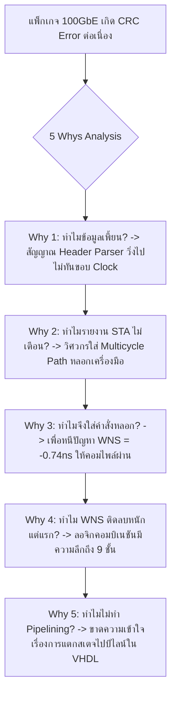

# Lesson 116: Advanced Timing Constraints & High-Speed STA Closure in VHDL (高度なタイミング制約と高周波STA収束)

---

## 1. ทฤษฎีวิศวกรรมเชิงลึก (高度なエンジニアリング理論)

### 1.1 คณิตศาสตร์และสมการวิเคราะห์เวลาขั้นสูง (Advanced STA Equations)
ในระดับสถาปัตยกรรมดิจิทัลความเร็วสูง ($f_{clk} \ge 300\text{ MHz}$) การปิดความเสี่ยงเชิงเวลา (Timing Closure) ไม่สามารถพึ่งพาเพียงความสามารถของโปรแกรมสังเคราะห์ (Synthesis Tool) ในการเดาสุ่มได้ แต่ต้องอาศัยการคำนวณและสร้างข้อกำหนดเวลา (Synopsys Design Constraints: SDC / XDC) ที่สะท้อนฟิสิกส์ของสัญญาณนาฬิกาอย่างแม่นยำ

ทุกเส้นทางสัญญาณภายใน FPGA ถูกควบคุมโดยสมการหลักมูลของ **Setup Slack ($S_{setup}$)** และ **Hold Slack ($S_{hold}$)**:

```
               Complete Synchronous Timing Path Decomposition
        Launch Flip-Flop                                Capture Flip-Flop
        +--------------+                                +--------------+
        |              |       Data Path (Logic + Net)  |              |
  CLK --+-> CLK      Q +-----[ LUTs / Carry / Nets ]----+-> D        Q |--
        |              |                                |              |
        +-------+------+                                +-------+------+
                |                                               |
     Launch Clock Latency                             Capture Clock Latency
          $T_{launch}$                                     $T_{capture}$
                |                                               |
                +-------------------[ Clock Tree ]--------------+
```

#### 1.1.1 สมการ Setup Slack แบบคิดรวมผลกระทบเชิงกายภาพ:
$$S_{setup} = (T_{clk\_period} + T_{capture} - T_{launch}) - (t_{co} + t_{data\_logic} + t_{data\_net}) - t_{su} - T_{uncertainty}$$

โดยกำหนดให้ **Clock Skew ทางกายภาพ** คือ $T_{skew} = T_{capture} - T_{launch}$:
* หาก $T_{skew} > 0$ (Positive Skew: ขอบ Clock มาถึงตัวรับช้ากว่าตัวส่ง) จะช่วย **"เพิ่ม"** Setup Slack (วงจรมีเวลาเดินทางมากขึ้น) แต่จะไป **"ลด"** Hold Slack ทำให้เสี่ยงต่อ Hold Violation!
* หาก $T_{skew} < 0$ (Negative Skew: ขอบ Clock มาถึงตัวรับเร็วกว่าตัวส่ง) จะทำให้ Setup Slack แย่ลง

#### 1.1.2 องค์ประกอบของ Clock Uncertainty ($T_{uncertainty}$):
$$T_{uncertainty} = T_{jitter\_period} + T_{jitter\_phase} + T_{phase\_error} + T_{clock\_tree\_distortion}$$
ในชิประดับ 16nm/7nm ค่า $T_{uncertainty}$ ของ PLL/MMCM ทั่วไปจะอยู่ที่ประมาณ $0.150 - 0.280\text{ ns}$ ซึ่งกินสัดส่วนถึงเกือบ $10\%$ ของคาบเวลาที่ $300\text{ MHz}$ ($T_{clk} = 3.333\text{ ns}$)

---

### 1.2 สถาปัตยกรรม Register Retiming ในระดับ RTL
เมื่อเส้นทางข้อมูลมีลอจิกคอมบิเนชันที่กระจายตัวไม่สมดุล:

```
                  การทำ Register Retiming เพื่อปรับสมดุลความล่าช้า
  
  [ ก่อนทำ Retiming: Critical Path ติดลบ Setup Violation ]
  +----+                                                 +----+
  | FF |--->[ LUT 1 ]--->[ LUT 2 ]--->[ LUT 3 ]--->[ LUT 4 ]--->| FF |
  +----+ <---------------- Delay = 3.6 ns -------------> +----+ (คาบ = 3.0 ns -> WNS = -0.6 ns)
  
  [ หลังทำ Retiming: ย้าย Register ขั้นกลางด้วย Pipelining ใน VHDL ]
  +----+                                 +----+                 +----+
  | FF |--->[ LUT 1 ]--->[ LUT 2 ]------>| FF |--->[ LUT 3 ]--->[ LUT 4 ]--->| FF |
  +----+ <------ Delay = 1.8 ns -------> +----+ <-- Delay = 1.8 ns --> +----+ (WNS = +1.2 ns)
```

ในภาษา VHDL การเปิดใช้งาน Retiming สามารถทำได้ทั้งในระดับโค้ด RTL และการสั่ง Synthesis Attribute:

```vhdl
-- การสั่งให้ Synthesis Tool ทำ Register Retiming บนสถาปัตยกรรม VHDL
signal pipe_reg1, pipe_reg2 : std_logic_vector(31 downto 0);

attribute register_retiming : string;
attribute register_retiming of rtl : architecture is "yes";
```

---

### 1.3 การกำหนดข้อจำกัดเวลาขั้นสูง (Advanced SDC Constraints for VHDL)

#### 1.3.1 Generated Clocks (`create_generated_clock`)
เมื่อสร้างสัญญาณนาฬิกาความถี่ต่ำลงผ่านตัวหารความถี่ (Clock Divider) ใน VHDL:

```vhdl
-- โค้ดสร้าง Clock หาร 2 ใน VHDL
proc_clk_div: process(clk_in)
begin
    if rising_edge(clk_in) then
        clk_div2 <= not clk_div2;
    end if;
end process;
```

ต้องเขียน SDC Constraint เชื่อมโยงเฟสและที่มาอย่างเป็นทางการ (ห้ามใช้ `create_clock` อิสระเด็ดขาด!):

```tcl
# การเขียน Generated Clock ที่ถูกต้อง
create_generated_clock -name clk_div2_out \
    -source [get_ports clk_in] \
    -divide_by 2 \
    [get_pins u_div/clk_div2_reg/Q]
```

#### 1.3.2 Multicycle Path สำหรับวงจรที่ทำงานหลายรอบสัญญาณนาฬิกา
สำหรับวงจรหาร (Divider) หรือฟังก์ชันลอการิทึมที่ยอมให้ใช้เวลาคำนวณ 3 รอบสัญญาณนาฬิกา โดยมีสัญญาณ `enable` ควบคุม:

```tcl
# บังคับ Setup Check ไปที่ขอบที่ 3
set_multicycle_path 3 -setup -from [get_cells u_calc/src_reg*] -to [get_cells u_calc/dst_reg*]
# ดึง Hold Check ถอยกลับมาอยู่ที่ขอบก่อนหน้า (ขอบที่ 2) เสมอ
set_multicycle_path 2 -hold  -from [get_cells u_calc/src_reg*] -to [get_cells u_calc/dst_reg*]
```

---

## 2. ทริคหน้างาน OJT แบบ Step-by-Step (現場の実践テクニック)

### 2.1 กรณีศึกษาความล้มเหลวหน้างาน (失敗事例: Shippai Jirei)
* **บริบท:** การ์ดประมวลผลแพ็กเกจเครือข่าย 100GbE (SmartNIC) บนชิป Xilinx Virtex UltraScale+ วงจรส่วนถอดรหัสแพ็กเกจ (Packet Parser) เขียนด้วย VHDL ทำงานที่ความถี่เป้าหมาย $f_{clk} = 322.265\text{ MHz}$ ($T_{clk} = 3.103\text{ ns}$)
* **อาการเสียหน้างาน:** หลังรัน Place & Route รายงานเวลาล้มเหลวอย่างรุนแรงโดยมีค่า Worst Negative Slack ติดลบถึง **$\text{WNS} = -0.740\text{ ns}$** ความถี่ทำได้จริงเพียง $260\text{ MHz}$
* **การกระทำที่ผิดพลาดของวิศวกรฝึกหัด:** วิศวกรพยายามแก้ไขโดยการเขียนคำสั่ง `set_multicycle_path 2` ครอบเส้นทางที่มีปัญหา โดยเข้าใจผิดคิดว่าระบบจะยอมให้ช้าได้ ผลลัพธ์คือการสังเคราะห์ผ่านฉลุย แต่เมื่อนำบอร์ดไปต่อเข้ากับสวิตช์เครือข่ายจริง พบว่าเกิดอาการ **Packet CRC Error ถล่มทลาย ($> 5\%$)** ข้อมูลแพ็กเกจพังทลายทันทีเมื่อมีทราฟฟิกหนาแน่น

```
            การสืบสวนสาเหตุความล้มเหลว Packet Parser (Shippai Analysis)
   +--------------------------------------------------------------------------+
   | พฤติกรรม: มีการละเมิด Setup Time จริงในฮาร์ดแวร์ (-0.740 ns)             |
   | แต่วิศวกรปกปิดปัญหาโดยการใส่คำสั่ง `set_multicycle_path` ใน XDC          |
   +--------------------------------------------------------------------------+
                                       |
                                       v
   +--------------------------------------------------------------------------+
   | ความเป็นจริงในระดับฮาร์ดแวร์:                                              |
   | ลอจิก Parser ต้องถอดรหัสและส่งต่อข้อมูล "ในทุกๆ ไซเคิลต่อเนื่อง (Back-to-Back)"|
   | วงจรไม่ได้มีสัญญาณ Enable คั่นเพื่อรอ 2 ไซเคิลจริง                        |
   | ผลลัพธ์: Capture FF จับข้อมูลที่ยังคำนวณไม่เสร็จ เกิด CRC Error ทันที!    |
   +--------------------------------------------------------------------------+
                                       |
                                       v
   +--------------------------------------------------------------------------+
   | การตรวจซอร์สโค้ด VHDL: พบโครงสร้างถอดรหัส Header ขนาด 128 บิต             |
   | เขียนด้วยลอจิกคอมบิเนชันก้อนเดียวยาว 9 ระดับของ LUT (Logic Depth = 9)!  |
   +--------------------------------------------------------------------------+
```

---

### 2.2 การวิเคราะห์หาสาเหตุรากเหง้า (Root Cause Analysis: 5 Whys & Ishikawa)



#### Ishikawa Diagram (ผังก้างปลา)
* **Design/RTL:** ออกแบบฟังก์ชันถอดรหัสแพ็กเกจขนาด 128 บิตแบบขั้นตอนเดียว (Monolithic Combinational Process) ขาดการทำ Pipeline
* **Constraints Abuse:** ใช้คำสั่ง `set_multicycle_path` เพื่อปกปิดข้อผิดพลาดเชิงเวลาแทนที่จะแก้ที่ระดับโค้ด
* **Verification:** ขาดการทำ Gate-Level Timing Simulation ที่ความเร็วเต็มพิกัด $322\text{ MHz}$
* **Design Review:** ไม่มีกระบวนการตรวจสอบความชอบธรรมของ Timing Exceptions (Audit of SDC Exceptions)

---

### 2.3 มาตรการแก้ไขและกฎการทำ Timing Closure (Pipelining Architecture)
1. **ตัดคำสั่ง Multicycle Path หลอกทิ้งโดยสิ้นเชิง:**
   * คืนค่าการวิเคราะห์กลับสู่ Single-Cycle Constraint ตามข้อเท็จจริงของโปรโตคอล
2. **ปรับปรุงสถาปัตยกรรม VHDL เป็น 3-Stage Pipeline:**
   * **Stage 1:** ถอดรหัสส่วนหัว Ethernet Header (MAC Addresses, VLAN) $\to$ บันทึกลง Register
   * **Stage 2:** ถอดรหัสส่วนหัว IP Header (IPv4/IPv6, Source/Dest IP) $\to$ บันทึกลง Register
   * **Stage 3:** ถอดรหัสส่วนหัว Transport Layer (TCP/UDP Ports, Flags) $\to$ สรุปผลลัพธ์
3. **ผลลัพธ์หลังแก้ไข:** ความลึกของลอจิกลดลงจาก 9 ชั้นเหลือเพียง **3 ชั้นของ LUT ในแต่ละสเตจ** ค่า Setup Slack ดีดกลับมาเป็นบวก **$\text{WNS} = +0.220\text{ ns}$** ที่ความถี่ $322.265\text{ MHz}$ ระบบส่งผ่านข้อมูลระดับ 100Gbps Line Rate ได้อย่างราบรื่น ปราศจาก CRC Error $100\%$

---

### 2.4 ตารางตรวจสอบหน้างาน SOP สำหรับ Timing Closure (STA SOP Checklist)

| ลำดับ | จุดตรวจสอบทางวิศวกรรม | เกณฑ์การยอมรับ (Acceptance Criteria) | เครื่องมือตรวจสอบ | ผลการตรวจ |
| :---: | :--- | :--- | :--- | :---: |
| 1 | Worst Negative Slack (WNS) | $\text{WNS} \ge 0.000\text{ ns}$ ที่ Worst Slow Corner ($125^\circ\text{C}, V_{min}$) | Vivado Timing Summary | ผ่าน / ไม่ผ่าน |
| 2 | Worst Hold Slack (WHS) | $\text{WHS} \ge 0.000\text{ ns}$ ที่ Fast Corner ($-40^\circ\text{C}, V_{max}$) | Fast Corner Timing Report | ผ่าน / ไม่ผ่าน |
| 3 | ตรวจสอบความชอบธรรมของ Exceptions | ทุกคำสั่ง `set_multicycle_path` ต้องมีเอกสารพิสูจน์สัญญาณ Enable | SDC Exception Audit | ผ่าน / ไม่ผ่าน |
| 4 | ความลึกของลอจิก (Logic Levels) | ที่ความถี่ $\ge 300\text{ MHz}$ จำนวน LUT ระหว่าง FF ต้อง $\le 4\text{ ชั้น}$ | Report Design Analysis | ผ่าน / ไม่ผ่าน |
| 5 | Clock Uncertainty Specification | ต้องระบุค่า Jitter ของ MMCM/PLL ครบทุกโดเมนตาม Datasheet | Constraint Verification | ผ่าน / ไม่ผ่าน |

---

## 3. คำศัพท์และประโยคภาษาญี่ปุ่นสำหรับตรวจแบบ (検図 - Kenzu)

### 3.1 ตารางคำศัพท์เทคนิคเฉพาะทาง (専門用語一覧)

| คำศัพท์คันจิ/คาตาคานะ | การอ่าน (Romaji) | คำแปลภาษาไทย / ภาษาอังกฤษ |
| :--- | :--- | :--- |
| **タイミング収束** | Taimingu shūsoku | การทำให้ไทม์มิ่งบรรลุเป้าหมาย (Timing Closure) |
| **レジスタリタイミング** | Rejisuta ritaimingu | การปรับสมดุลตำแหน่งรีจิสเตอร์ (Register Retiming) |
| **最悪負遅延余裕** | Saiaku fu-chien yoyū | ค่าความเผื่อเวลาติดลบที่เลวร้ายที่สุด (Worst Negative Slack: WNS) |
| **クロック分配遅延** | Kurokku bunpai chien | ความล่าช้าในการกระจายสัญญาณนาฬิกา (Clock Tree Insertion Delay) |
| **配線混雑度** | Haisen konzatsudo | ความหนาแน่นของการเดินสายสัญญาณ (Routing Congestion) |
| **マルチサイクルパス** | Maruchisaikuru pasu | เส้นทางสัญญาณแบบหลายไซเคิล (Multicycle Path) |
| **偽パス制約** | Nise pasu seiyaku | ข้อกำหนดเส้นทางหลอก (False Path Constraint) |
| **論理段数削減** | Ronri dansū sakugen | การลดทอนระดับชั้นของลอจิกเกต (Logic Depth Reduction) |
| **位相不確実性** | Isō fukakujitsusei | ความไม่แน่นอนของเฟสและจิตเตอร์ (Phase Uncertainty / Jitter) |
| **ファンアウト分割** | Fan'auto bunkatsu | การแบ่งแยกโหลดปลายทาง (Fan-out Duplication / Splitting) |

---

### 3.2 บทสนทนาการตรวจแบบหน้างานจริง (検図での指摘事項)

#### การตรวจแบบจุดที่ 1: การตรวจพบการใช้ Multicycle Path โดยมิชอบเพื่อซ่อนบั๊ก
* **審査役 (Lead Chief Engineer):**
  「このパケットパーサーの制約ファイルを確認したところ、322MHz動作の主要データパスに対して `set_multicycle_path 2 -setup` が適用されていますね。しかしRTL記述を見ると、毎サイクル連続してパケットデータが流入するパイプライン構造になっています。2サイクル待機するイネーブル制御が存在しないため、これは不正な制約（タイトなタイミングの隠蔽）です。実機でデータ化け（CRCエラー）を引き起こします。制約を解除し、RTL側を3段パイプラインに分割してタイミングを収束させてください。」
  *(ผมได้ตรวจสอบไฟล์ Constraints ของตัว Packet Parser ตัวนี้ พบว่ามีการใส่คำสั่ง `set_multicycle_path 2 -setup` ให้กับ Data Path หลักที่รันที่ 322MHz นะครับ แต่เมื่อดูโค้ด RTL ระบบเป็นโครงสร้างไปป์ไลน์ที่มีข้อมูลแพ็กเกจไหลเข้ามาต่อเนื่องทุกไซเคิล โดยไม่มีสัญญาณ Enable ให้รอ 2 ไซเคิลเลย นี่เป็นการใส่ข้อกำหนดที่ไม่ถูกต้อง (การปกปิดปัญหาไทม์มิ่ง) ครับ และจะทำให้ข้อมูลเพี้ยน (CRC Error) ในเครื่องจริง ช่วยปลดข้อกำหนดนี้ออก แล้วแบ่งโค้ด RTL เป็นไปป์ไลน์ 3 สเตจเพื่อแก้ไทม์มิ่งให้ถูกต้องครับ)*
* **設計担当 (FPGA Design Engineer):**
  「ご指摘誠に申し訳ございません。WNSのマイナスを解消するために誤った制約を適用してしまっておりました。直ちにマルチサイクル制約を削除し、ヘッダー解析処理を3段のレジスタパイプラインへ再設計して、正規のシングルサイクル制約下で $+0.2\text{ ns}$ 以上のスラックを確保いたします。」
  *(ต้องกราบขออภัยด้วยครับ ผมใส่ข้อกำหนดที่ผิดพลาดไปเพื่อหนีปัญหา WNS ติดลบครับ ผมจะรีบลบคำสั่ง Multicycle ออกทันที และออกแบบกระบวนการถอดรหัส Header ใหม่เป็นไปป์ไลน์ 3 สเตจ เพื่อสร้างมาร์จินมากกว่า $+0.2\text{ ns}$ ภายใต้ข้อกำหนด Single-Cycle ที่ถูกต้องครับ)*

#### การตรวจแบบจุดที่ 2: ปัญหา Logic Depth สูงเกินไปในวงจรตัดสินใจความเร็วสูง
* **審査役 (Lead Chief Engineer):**
  「この300MHz動作のアービเทคลジックですが、Report Design Analysisで見ると論理段数が8段（LUTが8直列）に達しています。UltraScale+アーキテクチャにおいて300MHzを達成するための限界論理段数は4段以下です。これ以上配置配線ツールで無理に引っ張っても配線遅延で破綻します。優先順位判定論理をツリー構造化し、論理段数を3段以内に収めてください。」
  *(วงจรอาร์บิเตอร์ที่รันที่ 300MHz ตัวนี้ รายงาน Design Analysis ระบุว่ามีระดับลอจิกสูงถึง 8 ระดับ (LUT ต่ออนุกรมกัน 8 ตัว) นะครับ ในสถาปัตยกรรม UltraScale+ ขีดจำกัดของ Logic Depth สำหรับความถี่ 300MHz คือไม่เกิน 4 ระดับครับ ฝืนให้เครื่องมือ P&R เดินสายต่อไปก็จะพังเพราะ Routing Delay ช่วยปรับลอจิกการจัดลำดับความสำคัญให้เป็นโครงสร้างต้นไม้ และควบคุมให้ระดับลอจิกไม่เกิน 3 ระดับด้วยครับ)*
* **設計担当 (FPGA Design Engineer):**
  「承知いたしました。直列判定構造を2段のバイナリツリー構造へリファクタリングし、LUT段数を最大3段まで削減して配置配線マージンを改善いたします。」
  *(รับทราบครับ ผมจะรีแฟกเตอร์โครงสร้างการตัดสินใจแบบอนุกรมให้กลายเป็น Binary Tree 2 สเตจ ซึ่งจะลดทอนระดับ LUT เหลือไม่เกิน 3 ระดับ และปรับปรุงมาร์จินในการทำ P&R ให้ผ่านได้อย่างปลอดภัยครับ)*

---

## 4. ควิซวิเคราะห์ปัญหาระดับวิศวกรอาวุโส (上級技術クイズ)

### ข้อที่ 1: การคำนวณความถี่สูงสุด ($F_{max}$) หลังการทำ Register Retiming อย่างสมบูรณ์
พิจารณาเส้นทางข้อมูลคอมบิเนชันที่มีความล่าช้ารวมทั้งหมด $T_{data\_total} = 7.500\text{ ns}$ ระหว่าง Register ต้นทางและ Register ปลายทาง
* ในระบบเดิม: เป็น Combinational Logic ก้อนเดียวยาวต่อเนื่อง ($1\text{ ไซเคิล}$)
* ในระบบใหม่: วิศวกรทำการแทรก Flip-Flop ขั้นกลางจำนวน 2 ตำแหน่ง (แบ่งวงจรออกเป็น **3 Stage Pipeline**)
* ทว่าเนื่องจากโครงสร้างลอจิกทางคณิตศาสตร์ไม่สามารถแบ่งได้เท่ากันอย่างสมบูรณ์แบบ ความล่าช้าของแต่ละสเตจหลังการจัดวาง (Post-Route) จึงกระจายตัวดังนี้:
  * Stage 1: $T_{stage1} = 2.800\text{ ns}$
  * Stage 2: $T_{stage2} = 2.600\text{ ns}$
  * Stage 3: $T_{stage3} = 2.100\text{ ns}$

กำหนดพารามิเตอร์ของฟลิปฟลอป:
* $t_{co} = 0.350\text{ ns}$
* $t_{su} = 0.150\text{ ns}$
* Clock Uncertainty: $T_{unc} = 0.200\text{ ns}$
* Clock Skew ระหว่างแต่ละสเตจ: $T_{skew} = 0.000\text{ ns}$

จงคำนวณหา **คาบเวลาต่ำสุด ($T_{min}$)** และ **ความถี่สูงสุด ($F_{max}$)** ของระบบใหม่หลังการทำ Pipelining:

a) $T_{min} = 3.500\text{ ns}$, $F_{max} = 285.7\text{ MHz}$  
b) $T_{min} = 3.300\text{ ns}$, $F_{max} = 303.0\text{ MHz}$  
c) $T_{min} = 2.900\text{ ns}$, $F_{max} = 344.8\text{ MHz}$  
d) $T_{min} = 8.200\text{ ns}$, $F_{max} = 121.9\text{ MHz}$  

---

#### เฉลยและบทวิเคราะห์เชิงลึกข้อที่ 1
**คำตอบที่ถูกต้องคือ: a) $T_{min} = 3.500\text{ ns}$, $F_{max} = 285.7\text{ MHz}$**

**ขั้นตอนการคำนวณทางคณิตศาสตร์:**
1. หา Critical Path ของระบบใหม่:
   * ความเร็วสูงสุดของระบบไปป์ไลน์จะถูกจำกัดโดย **"สเตจที่ช้าที่สุด (Worst-Case Bottleneck Stage)"**
   * ในที่นี้คือ **Stage 1** ซึ่งมีความล่าช้า $T_{stage1} = 2.800\text{ ns}$
2. คำนวณคาบเวลาต่ำสุดที่ปลอดภัย ($T_{min}$) ตามสมการ Setup Slack ($S_{setup} \ge 0$):
   $$T_{min} \ge t_{co} + T_{stage\_max} + t_{su} + T_{unc} - T_{skew}$$
   $$T_{min} = 0.350\text{ ns} + 2.800\text{ ns} + 0.150\text{ ns} + 0.200\text{ ns} - 0.000\text{ ns} = 3.500\text{ ns}$$
3. คำนวณความถี่สัญญาณนาฬิกาสูงสุด ($F_{max}$):
   $$F_{max} = \frac{1}{T_{min}} = \frac{1}{3.500 \times 10^{-9}\text{ s}} \approx 285.714 \times 10^6\text{ Hz} \approx 285.7\text{ MHz}$$
4. **การประเมินผลเชิงเปรียบเทียบ:**
   * ในระบบเดิม (ก่อนทำ Pipeline): $T_{min\_old} = 0.350 + 7.500 + 0.150 + 0.200 = 8.200\text{ ns} \implies F_{max\_old} \approx 121.9\text{ MHz}$
   * การทำ 3-Stage Pipeline ช่วยเพิ่มความเร็วการทำงานของระบบขึ้นจาก $121.9\text{ MHz}$ กลายเป็น **$285.7\text{ MHz}$ (เร็วขึ้นถึง $+134\%$!)**

---

### ข้อที่ 2: การวิเคราะห์ Hold Slack เมื่อเกิด Positive Clock Skew
พิจารณาเส้นทางส่งข้อมูลสั้นมากระหว่าง Flip-Flop $X$ และ Flip-Flop $Y$ ที่อยู่ติดกัน:
* Data Delay ต่ำสุด: $t_{co\_min} + t_{net\_min} = 0.220\text{ ns}$
* Hold Time ข้อกำหนดของตัวรับ: $t_{h} = 0.080\text{ ns}$
* Clock Uncertainty สำหรับ Hold: $T_{unc\_hold} = 0.050\text{ ns}$

หากโครงข่ายสัญญาณนาฬิกามีปัญหา Clock Skew แบบบวก (Positive Clock Skew: สัญญาณนาฬิกามาถึงตัวรับช้ากว่าตัวส่ง) เท่ากับ **$T_{skew} = T_{clk\_Y} - T_{clk\_X} = +0.150\text{ ns}$**

จงคำนวณค่า **Hold Slack ($S_{hold}$)** และวิเคราะห์ผลลัพธ์:

a) $S_{hold} = +0.240\text{ ns}$ (ปลอดภัย)  
b) $S_{hold} = -0.060\text{ ns}$ (เกิด Hold Violation ข้อมูลรอบใหม่วิ่งไปกลืนข้อมูลรอบเก่า)  
c) $S_{hold} = +0.090\text{ ns}$ (ปลอดภัยแบบฉิวเฉียด)  
d) $S_{hold} = -0.150\text{ ns}$ (เกิด Hold Violation)  

---

#### เฉลยและบทวิเคราะห์เชิงลึกข้อที่ 2
**คำตอบที่ถูกต้องคือ: b) $S_{hold} = -0.060\text{ ns}$ (เกิด Hold Violation ข้อมูลรอบใหม่วิ่งไปกลืนข้อมูลรอบเก่า)**

**ขั้นตอนการคำนวณทางคณิตศาสตร์:**
1. คำนวณ Earliest Data Arrival Time:
   $$T_{arrival\_hold} = t_{co\_min} + t_{net\_min} = 0.220\text{ ns}$$
2. คำนวณ Data Required Time สำหรับ Hold:
   $$T_{required\_hold} = T_{skew} + t_{h} + T_{unc\_hold} = 0.150\text{ ns} + 0.080\text{ ns} + 0.050\text{ ns} = 0.280\text{ ns}$$
3. คำนวณ Hold Slack ($S_{hold}$):
   $$S_{hold} = T_{arrival\_hold} - T_{required\_hold} = 0.220\text{ ns} - 0.280\text{ ns} = -0.060\text{ ns}$$
4. **บทวิเคราะห์เชิงวิศวกรรม:**
   * ผลลัพธ์ติดลบ $-0.060\text{ ns}$ แสดงถึงอันตรายของ **Positive Clock Skew** ต่อวงจร Hold Time
   * การที่ Clock ของตัวรับมาช้ากว่าตัวส่ง ทำให้หน้าต่าง Hold Time ของตัวรับถูกเลื่อนออกไปข้างหน้า ในขณะที่ข้อมูลใหม่วิ่งมาถึงเร็วเกินไป ($0.220\text{ ns}$) จึงพุ่งเข้าชนหน้าต่าง Hold Time เกิดข้อมูลลื่นไถล
   * เพื่อแก้ไข เครื่องมือ P&R จะต้องแทรก Delay Buffer บนสายข้อมูลอย่างน้อย $+0.060\text{ ns}$ เพื่อดึงให้ $S_{hold} \ge 0$

---

### ข้อที่ 3: ผลกระทบของคำสั่ง `set_multicycle_path -setup 2` โดยปราศจากคำสั่ง `-hold`
วิศวกรระบุคำสั่งใน SDC:
`set_multicycle_path 2 -setup -from RegA -to RegB`
แต่ลืมระบุคำสั่ง `-hold` คู่ขนาน บนระบบสัญญาณนาฬิกา $T_{clk} = 10.0\text{ ns}$

การกระทำนี้จะส่งผลให้เครื่องมือ STA ทำการตรวจสอบ Hold Time (Hold Check) ณ ขอบเวลาใด และบังคับให้ Data Path ต้องมีความล่าช้าขั้นต่ำเท่าใด?

a) Hold Check อยู่ที่ขอบ $0.0\text{ ns}$, ความล่าช้าขั้นต่ำ $\approx 0\text{ ns}$  
b) Hold Check ถูกเลื่อนตามไปอยู่ที่ขอบ $10.0\text{ ns}$, บังคับให้ Data Path ต้องมีความล่าช้าขั้นต่ำมากกว่า $10.0\text{ ns}$ ส่งผลให้เครื่องมือระดมใส่ Delay Buffer นับร้อยตัวเพื่อหน่วงเวลา  
c) เครื่องมือจะเกิด Syntax Error และหยุดการทำงาน  
d) Hold Check จะถูกปิดการทำงานโดยสมบูรณ์  

---

#### เฉลยและบทวิเคราะห์เชิงลึกข้อที่ 3
**คำตอบที่ถูกต้องคือ: b) Hold Check ถูกเลื่อนตามไปอยู่ที่ขอบ $10.0\text{ ns}$, บังคับให้ Data Path ต้องมีความล่าช้าขั้นต่ำมากกว่า $10.0\text{ ns}$ ส่งผลให้เครื่องมือระดมใส่ Delay Buffer นับร้อยตัวเพื่อหน่วงเวลา**

**บทวิเคราะห์เชิงลึกระดับ Lead Architect:**
* ในนิยามมาตรฐานของอัลกอริทึม SDC ทุกสำนัก (Synopsys, Cadence, Xilinx, Intel):
  * ขอบ Hold Check โดยปกติจะถูกตั้งไว้ที่ **"1 ไซเคิลก่อนหน้าขอบ Setup Check เสมอ"**
  * เมื่อ Setup Check อยู่ที่ไซเคิล 1 ($10\text{ ns}$) $\to$ Hold Check จะอยู่ที่ไซเคิล 0 ($0\text{ ns}$) ซึ่งถูกต้อง
* เมื่อผู้ใช้สั่ง `set_multicycle_path 2 -setup` ขอบ Setup Check จะถูกเลื่อนไปเป็นไซเคิล 2 ($20\text{ ns}$)
* **ผลข้างเคียงโดยอัตโนมัติ (Default Behavior):** Hold Check จะถูกเลื่อนตามไปอยู่ที่ไซเคิล 1 ($10\text{ ns}$) ทันที!
* ผลลัพธ์คือเครื่องมือจะบังคับว่า: *"ข้อมูลใหม่จะต้องเดินทางช้ากว่า $10\text{ ns}$ เพื่อไม่ให้ไปทับข้อมูลในไซเคิล 1"* เครื่องมือ P&R จึงต้องระดมใส่บัฟเฟอร์ต่อเรียงกันเป็นขบวนยาวเพื่อหน่วงเวลาให้เกิน $10\text{ ns}$ สิ้นเปลืองพื้นที่และพลังงานอย่างมหาศาล
* **วิธีแก้:** ต้องใส่คำสั่งคู่เสมอ:
  `set_multicycle_path 2 -setup -from RegA -to RegB`
  `set_multicycle_path 1 -hold  -from RegA -to RegB`
  เพื่อดึงขอบ Hold Check กลับมาอยู่ที่ไซเคิล 0 ($0\text{ ns}$) ตามพฤติกรรมจริงของฮาร์ดแวร์
