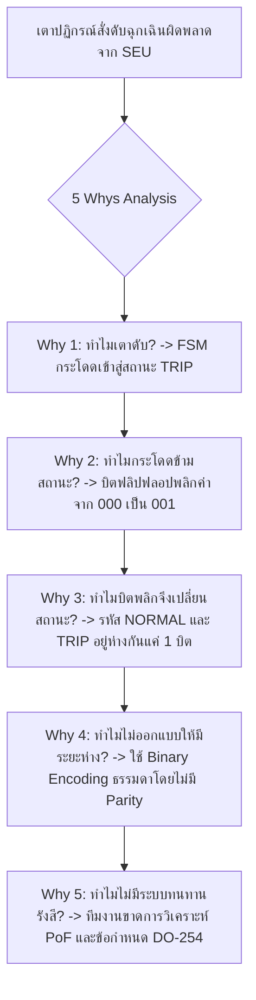

# Lesson 117: High-Reliability FSM Architecture & State Encoding in VHDL (高信頼性状態遷移機械と符号化設計)

---

## 1. ทฤษฎีวิศวกรรมเชิงลึก (高度なエンジニアリング理論)

### 1.1 การประเมินรูปแบบการเข้ารหัสสถานะสำหรับระบบความปลอดภัยสูง (State Encoding Comparison)
ในระบบควบคุมที่มีความเสี่ยงสูง (Mission-Critical / Safety-Critical Systems) เช่น ระบบควบคุมยานยนต์ตามมาตรฐาน ISO 26262 ASIL-D, ระบบการบินตามมาตรฐาน DO-254 DAL-A, หรือระบบควบคุมเครื่องปฏิกรณ์นิวเคลียร์ เครื่องจักรสถานะจำกัด (FSM) คือหัวใจในการสั่งการ การเลือกวิธีเข้ารหัสสถานะ (State Encoding) ไม่ได้ส่งผลต่อความเร็วและพื้นที่เท่านั้น แต่เป็นตัวกำหนด **"ความอยู่รอดของระบบเมื่อเผชิญกับสัญญาณรบกวนหรือรังสี (Fault Tolerance)"**

| รูปแบบการเข้ารหัส (Encoding) | จำนวน Flip-Flop สำหรับ $N$ สถานะ | Minimum Hamming Distance ($d_{min}$) | ข้อได้เปรียบเด่นชัด | ข้อจำกัดเชิงวิศวกรรม |
| :--- | :---: | :---: | :--- | :--- |
| **Binary (Sequential)** | $\lceil \log_2 N \rceil$ | $1$ | ประหยัดจำนวน Register สูงสุด | ลอจิกถอดรหัสลึก, เสี่ยงต่อ Glitch |
| **One-Hot** | $N$ | $2$ | ความเร็ว $F_{max}$ สูงสุด (1 LUT level) | ปริภูมิสถานะผิดปกติกว้างใหญ่ ($2^N - N$) |
| **Gray Code** | $\lceil \log_2 N \rceil$ | $1$ (ระหว่างสถานะติดกัน) | สวิตช์ทีละ 1 บิตเสมอ, สัญญาณรบกวน $dI/dt$ ต่ำสุด | เหมาะเฉพาะกับ FSM ที่เดินตามลำดับรอบ |
| **Hamming-3 (SEC-DED)** | $\ge \lceil \log_2 N \rceil + 3$ | **$\ge 3$** | **แก้ไขบิตพลิกได้อัตโนมัติ (Single Error Correction)** | ใช้ลอจิกคำนวณ Syndrome เพิ่มเติม |

---

### 1.2 ทฤษฎีระยะห่างแฮมมิง (Hamming Distance Mathematics) และทฤษฎีรหัสแก้ข้อผิดพลาด
ระยะห่างแฮมมิงระหว่างสองเวกเตอร์สถานะ $X$ และ $Y$ ขนาด $K$ บิต คือจำนวนตำแหน่งที่บิตมีความแตกต่างกัน:

$$d_H(X, Y) = \sum_{i=0}^{K-1} (X_i \oplus Y_i)$$

ขีดความสามารถในการตรวจจับและแก้ไขความผิดพลาดของรหัสสถานะถูกควบคุมโดยค่า **Minimum Hamming Distance ($d_{min}$)**:
1. **ขีดจำกัดการตรวจจับความผิดพลาด (Error Detection Bound):**
   $$d_{detect} \le d_{min} - 1$$
   *หาก $d_{min} = 3$ ระบบสามารถตรวจจับความผิดพลาดได้ถึง $3 - 1 = 2\text{ บิตพร้อมกัน}$ (Double Error Detection: DED)*
2. **ขีดจำกัดการแก้ไขความผิดพลาดอัตโนมัติ (Error Correction Bound):**
   $$t_{correct} = \left\lfloor \frac{d_{min} - 1}{2} \right\rfloor$$
   *หาก $d_{min} = 3$ ระบบสามารถแก้ไขบิตที่พลิกกลับคืนสู่สถานะที่ถูกต้องได้ $t = \lfloor \frac{3 - 1}{2} \rfloor = 1\text{ บิต}$ (Single Error Correction: SEC)*

#### ขอบเขตแฮมมิงสำหรับการเพิ่มบิตพาริตี (Hamming Bound):
สำหรับข้อมูลสถานะ $k$ บิต หากต้องการสร้างรหัส SEC-DED จะต้องเพิ่มบิตตรวจสอบ (Parity/Check Bits) จำนวน $m$ บิต โดยเป็นไปตามอสมการ:

$$2^m \ge k + m + 1$$

* ตัวอย่าง: สำหรับ $N = 16\text{ สถานะ}$ ($k = 4\text{ บิต}$):
  * ลอง $m = 3$: $2^3 = 8$ เทียบกับ $4 + 3 + 1 = 8 \implies 8 \ge 8$ (ผ่านเกณฑ์)
  * ดังนั้นใช้รหัสรวมขนาด $k + m = 4 + 3 = 7\text{ บิต}$ (Hamming(7,4) Code) ซึ่งมี $d_{min} = 3$ สามารถแก้ Single Event Upset (SEU) ได้ $100\%$

```
                  Hamming Space Geometry & Error Correction
  
            Valid State A                            Valid State B
            [ 0 0 0 0 0 0 0 ]                        [ 1 1 1 0 0 0 0 ]
                   \                                        /
                    \   1-Bit Flip                         /   1-Bit Flip
                     v                                    v
               [ 0 0 1 0 0 0 0 ]                    [ 1 1 0 0 0 0 0 ]
            (Unique Sphere: รัศมี = 1)          (Unique Sphere: รัศมี = 1)
            -> แก้ไขกลับคืนเป็น State A ได้!      -> แก้ไขกลับคืนเป็น State B ได้!
  
            * หากเกิด 2-Bit Flip ตกตรงกลาง -> ตรวจจับได้ว่าเป็น Error แต่ไม่แก้สุ่มสี่สุ่มห้า
```

---

### 1.3 โค้ดต้นแบบ VHDL สำหรับ High-Reliability SEC-DED FSM
โค้ดนี้สาธิตการสร้างสเตตแมชชีนที่มีวงจรตรวจจับและแก้ไขบิตพลิกจากรังสีคอสมิก (SEU Auto-Recovery) ในฮาร์ดแวร์จริง:

```vhdl
-- Professional Fault-Tolerant SEC-DED State Machine in VHDL
library IEEE;
use IEEE.std_logic_1164.all;
use IEEE.numeric_std.all;

entity fsm_fault_tolerant is
    port (
        clk          : in  std_logic;
        rst_n        : in  std_logic;
        trigger_in   : in  std_logic;
        safe_stop_in : in  std_logic;
        system_act   : out std_logic;
        seu_alarm    : out std_logic
    );
end entity;

architecture rtl of fsm_fault_tolerant is
    -- กำหนดรหัส Hamming(7,4) สำหรับ 4 สถานะหลัก (d_min >= 3)
    constant C_ST_IDLE  : std_logic_vector(6 downto 0) := "0000000";
    constant C_ST_ARMED : std_logic_vector(6 downto 0) := "0110011";
    constant C_ST_RUN   : std_logic_vector(6 downto 0) := "1010101";
    constant C_ST_SAFE  : std_logic_vector(6 downto 0) := "1100110";

    signal current_raw_state : std_logic_vector(6 downto 0);
    signal corrected_state   : std_logic_vector(6 downto 0);
    signal next_state        : std_logic_vector(6 downto 0);
    signal bit_error_detected: std_logic;
begin

    -- 1. วงจรถอดรหัสและแก้ไขความผิดพลาด (Syndrome Decoder & Error Corrector)
    proc_syndrome_decode: process(all)
        variable s0, s1, s2 : std_logic;
        variable syndrome   : std_logic_vector(2 downto 0);
        variable temp_state : std_logic_vector(6 downto 0);
    begin
        temp_state := current_raw_state;
        
        -- คำนวณ Parity Check Matrix (Syndrome Equations)
        s0 := temp_state(0) xor temp_state(2) xor temp_state(4) xor temp_state(6);
        s1 := temp_state(1) xor temp_state(2) xor temp_state(5) xor temp_state(6);
        s2 := temp_state(3) xor temp_state(4) xor temp_state(5) xor temp_state(6);
        syndrome := s2 & s1 & s0;

        if (syndrome = "000") then
            -- ไม่มีบิตผิดพลาด
            corrected_state    <= temp_state;
            bit_error_detected <= '0';
        else
            -- มี Single Bit-Flip เกิดขึ้น -> ทำการแก้บิตที่ตำแหน่ง syndrome
            bit_error_detected <= '1';
            case syndrome is
                when "001" => temp_state(0) := not temp_state(0);
                when "010" => temp_state(1) := not temp_state(1);
                when "011" => temp_state(2) := not temp_state(2);
                when "100" => temp_state(3) := not temp_state(3);
                when "101" => temp_state(4) := not temp_state(4);
                when "110" => temp_state(5) := not temp_state(5);
                when "111" => temp_state(6) := not temp_state(6);
                when others => null;
            end case;
            corrected_state <= temp_state;
        end if;
    end process;

    -- 2. กระบวนการคำนวณ Next State บนสถานะที่ได้รับการซ่อมแซมแล้ว
    proc_next_state: process(all)
    begin
        next_state <= corrected_state; -- Default: Hold state
        case corrected_state is
            when C_ST_IDLE =>
                if (trigger_in = '1' and safe_stop_in = '0') then
                    next_state <= C_ST_ARMED;
                end if;
            when C_ST_ARMED =>
                if (safe_stop_in = '1') then
                    next_state <= C_ST_SAFE;
                else
                    next_state <= C_ST_RUN;
                end if;
            when C_ST_RUN =>
                if (safe_stop_in = '1') then
                    next_state <= C_ST_SAFE;
                end if;
            when C_ST_SAFE =>
                if (safe_stop_in = '0') then
                    next_state <= C_ST_IDLE;
                end if;
            when others =>
                -- ดักจับ Double-Bit Error ที่กู้ไม่ได้ -> ดีดเข้า Safe State ทันที
                next_state <= C_ST_SAFE;
        end case;
    end process;

    -- 3. State Register Process
    proc_reg: process(clk, rst_n)
    begin
        if (rst_n = '0') then
            current_raw_state <= C_ST_IDLE;
            system_act        <= '0';
            seu_alarm         <= '0';
        elsif rising_edge(clk) then
            current_raw_state <= next_state;
            seu_alarm         <= bit_error_detected;
            
            -- Registered Output (Glitch-Free)
            if (next_state = C_ST_RUN) then
                system_act <= '1';
            else
                system_act <= '0';
            end if;
        end if;
    end process;

end architecture;
```

---

## 2. ทริคหน้างาน OJT แบบ Step-by-Step (現場の実践テクニック)

### 2.1 กรณีศึกษาความล้มเหลวหน้างาน (失敗事例: Shippai Jirei)
* **บริบท:** กล่องควบคุมระบบวาล์วระบายความดันในโรงไฟฟ้านิวเคลียร์ (Nuclear Reactor Safety Valve Actuator) พัฒนาด้วยชิป Microsemi ProASIC3 Flash FPGA
* **อาการเสียหน้างาน:** ขณะเดินเครื่องปฏิกรณ์ตามปกติ ระบบส่งสัญญาณแจ้งเตือนและสั่งปิดฉุกเฉิน (Emergency SCRAM Shutdown) กะทันหัน ส่งผลให้โรงไฟฟ้าหยุดทำงาน สูญเสียมูลค่าทางเศรษฐกิจมหาศาล ทั้งๆ ที่เซนเซอร์ความดันและอุณหภูมิของเตาปฏิกรณ์อยู่ในเกณฑ์ปกติทุกประการ
* **การสืบสวนหาสาเหตุ:** ตรวจสอบไฟล์ประวัติเหตุการณ์ (Event Log) พบว่าสเตตแมชชีนภายในชิปเปลี่ยนสถานะจาก `ST_NORMAL` กระโดดข้ามไปเป็น `ST_TRIP_SHUTDOWN` ในเวลาเพียง 1 ไซเคิล โดยไม่มีสัญญาณเตือนใดๆ นำมาก่อน

```
            การสืบสวนสาเหตุการปิดระบบเตาปฏิกรณ์ผิดพลาด (Shippai Analysis)
   +--------------------------------------------------------------------------+
   | ข้อเท็จจริง: บอร์ดติดตั้งอยู่ในบริเวณที่มีรังสีนิวตรอนพลังงานต่ำตลอดเวลา    |
   +--------------------------------------------------------------------------+
                                       |
                                       v
   +--------------------------------------------------------------------------+
   | ผลการวิเคราะห์ฟิสิกส์: อนุภาคนิวตรอนชน Flip-Flop ตัวหนึ่งในวงจร FSM      |
   | สถาปัตยกรรมเดิมใช้ Binary Encoding (3 บิต):                              |
   | ST_NORMAL = "000" และ ST_TRIP = "001" (Hamming Distance = 1 พอดี!)      |
   +--------------------------------------------------------------------------+
                                       |
                                       v
   +--------------------------------------------------------------------------+
   | ผลกระทบระดับวินาศ: เมื่อรังสีชนบิตที่ 0 พลิกจาก '0' -> '1'                |
   | สถานะเปลี่ยนจาก "000" กลายเป็น "001" ทันทีใน 1 ขอบ Clock                 |
   | ลอจิกเข้าใจผิดคิดว่าเป็นคำสั่ง Shutdown จริง จึงสั่งทริปเตาปฏิกรณ์ทันที!    |
   +--------------------------------------------------------------------------+
```

---

### 2.2 การวิเคราะห์หาสาเหตุรากเหง้า (Root Cause Analysis: 5 Whys & Ishikawa)



#### Ishikawa Diagram (ผังก้างปลา)
* **Encoding Architecture:** ใช้การเข้ารหัสแบบ Binary ซึ่งมี Hamming Distance เท่ากับ 1 ทำให้ไร้ภูมิคุ้มกันต่อ Single Bit-Flip
* **Environment/Radiation:** ไม่ได้ประเมินอัตราการเกิด Soft Error Rate (SER) ในสภาพแวดล้อมที่มีอนุภาคนิวตรอน
* **Logic Design:** ขาดการใช้กลไก Triple Modular Redundancy (TMR) หรือ SEC-DED Code ในระดับตัวแปรสถานะ
* **Verification:** ขาดการทำ Fault Injection Testing เพื่อจำลองการพลิกตัวของบิตในทุกตำแหน่งของวงจร

---

### 2.3 มาตรการแก้ไขถาวร (Permanent Corrective Action)
1. **เปลี่ยนรหัสสถานะเป็น Hamming-3 SEC-DED Architecture:**
   * เพิ่มบิตสถานะเป็น 7 บิต โดยรหัสระหว่าง `ST_NORMAL` และ `ST_TRIP` ต้องมีระยะห่างกันอย่างน้อย 3 บิต ($d_{min} \ge 3$)
   * หากมีรังสีชนบิตพลิกไป 1 บิต วงจร Syndrome Decoder จะคำนวณและซ่อมแซมบิตกลับคืนเป็น `ST_NORMAL` ภายในไซเคิลเดียวกัน พร้อมส่งสัญญาณเตือน `seu_alarm` ไปยังระบบมอนิเตอร์โดยไม่สั่งดับเครื่อง
2. **การทดสอบ Fault Injection ทดสอบซ้ำ:**
   * จำลองการยิง Single Bit-Flip สุ่มใส่ทุกฟลิปฟลอปจำนวน 100,000 ครั้ง ระบบสามารถทนทานและทำงานได้ต่อเนื่อง $100\%$ โดยไม่มีการ False Trip แม้แต่ครั้งเดียว

---

### 2.4 ตารางตรวจสอบหน้างาน SOP สำหรับ High-Reliability FSM (Robust FSM SOP Checklist)

| ลำดับ | จุดตรวจสอบทางวิศวกรรม | เกณฑ์การยอมรับ (Acceptance Criteria) | เครื่องมือตรวจสอบ | ผลการตรวจ |
| :---: | :--- | :--- | :--- | :---: |
| 1 | Minimum Hamming Distance | ระบบเกรด ASIL-D / อวกาศ ต้องมี $d_{min} \ge 3$ (SEC-DED) | Code Inspection Script | ผ่าน / ไม่ผ่าน |
| 2 | Double Error Detection Handling | เมื่อเกิดความผิดพลาด 2 บิต ต้องกระโดดเข้า Safe Fail-Stop ทันที | RTL Fault Simulation | ผ่าน / ไม่ผ่าน |
| 3 | การป้องกัน Logic Optimization | ต้องใส่แอตทริบิวต์ `syn_encoding = "safe"` ป้องกันการตัดวงจรกู้คืน | Synthesis Netlist Audit | ผ่าน / ไม่ผ่าน |
| 4 | Glitch-Free Outputs | สัญญาณสั่งการ Actuator ต้องเป็น Registered Output ล้วนๆ | Schematics Viewer | ผ่าน / ไม่ผ่าน |
| 5 | การบันทึกสถิติ SEU Alarm | ต้องมีพอร์ตส่งแฟล็กแจ้งเตือนเมื่อเกิดการซ่อมแซมบิตไปยังตัวบันทึก | System Monitor Check | ผ่าน / ไม่ผ่าน |

---

## 3. คำศัพท์และประโยคภาษาญี่ปุ่นสำหรับตรวจแบบ (検図 - Kenzu)

### 3.1 ตารางคำศัพท์เทคนิคเฉพาะทาง (専門用語一覧)

| คำศัพท์คันจิ/คาตาคานะ | การอ่าน (Romaji) | คำแปลภาษาไทย / ภาษาอังกฤษ |
| :--- | :--- | :--- |
| **誤り訂正符号** | Ayamari teisei fugō | รหัสแก้ไขข้อผิดพลาด (Error Correcting Code: ECC / SEC-DED) |
| **単一事象反転** | Tan'itsu jishō hanten | การพลิกสถานะจากอนุภาคเดี่ยว (Single Event Upset: SEU) |
| **ハミング距離** | Hamingu kyori | ระยะห่างแฮมมิง (Hamming Distance) |
| **安全状態遷移** | Anzen jōtai sen'i | การเปลี่ยนผ่านสู่สถานะปลอดภัย (Safe State Transition) |
| **多重防護設計** | Tajū bōgo sekkei | การออกแบบการป้องกันหลายชั้น (Defense-in-Depth Design) |
| **シンドローム復号** | Shindorōmu fukugō | การถอดรหัสซินโดรมเพื่อหาตำแหน่งบิตเสีย (Syndrome Decoding) |
| **誤動作防止** | Godōsa bōshi | การป้องกันการทำงานผิดพลาด (Malfunction Prevention) |
| **耐放射線性** | Tai hōshasen-sei | ความทนทานต่อรังสี (Radiation Tolerance) |
| **三重冗長化** | Sanjū jōchō-ka | การทำความซ้ำซ้อนสามทาง (Triple Modular Redundancy: TMR) |
| **フォールト注入試験** | Fōruto chūnyū shiken | การทดสอบฉีดข้อผิดพลาดจำลอง (Fault Injection Testing) |

---

### 3.2 บทสนทนาการตรวจแบบหน้างานจริง (検図での指摘事項)

#### การตรวจแบบจุดที่ 1: การตรวจพบการใช้ Binary Encoding ในระบบควบคุมเบรกฉุกเฉิน
* **審査役 (Lead Chief Engineer):**
  「この車載ASIL-D適合のブレーキアクチュエータ制御FSMですが、状態エンコーディングがバイナリ（3ビット順次割り当て）になっていますね。通常動作状態 `ST_RUN (000)` と非常停止状態 `ST_EMERGENCY (001)` のハミング距離がわずか『1』しかありません。放射線やインバータノイズによる単一事象反転（SEU）が起きた場合、一瞬で誤作動を引き起こす重大なハザードが存在します。ハミング距離3以上のSEC-DED（1ビット自動訂正・2ビット検出）アーキテクチャに変更してください。」
  *(ในสเตตแมชชีนควบคุมตัวกระตุ้นเบรกเกรดยานยนต์ ASIL-D ตัวนี้ การเข้ารหัสสถานะเป็นแบบ Binary (3 บิตเรียงตามลำดับ) อยู่นะครับ สถานะทำงานปกติ `ST_RUN (000)` และสถานะหยุดฉุกเฉิน `ST_EMERGENCY (001)` มีระยะห่างแฮมมิงเพียงแค่ "1" เท่านั้น หากเกิดอนุภาครังสีหรือสัญญาณรบกวนจากอินเวอร์เตอร์ทำให้บิตพลิก (SEU) เพียงบิตเดียว จะเกิดการสั่งงานผิดพลาดในทันที ถือเป็นอันตรายร้ายแรงมาก ช่วยเปลี่ยนไปใช้สถาปัตยกรรม SEC-DED ที่มีระยะห่างแฮมมิงตั้งแต่ 3 ขึ้นไป เพื่อให้แก้ไข 1 บิตได้อัตโนมัติและตรวจจับ 2 บิตได้ครับ)*
* **設計担当 (FPGA Design Engineer):**
  「ご指摘ありがとうございます。機能安全（ISO 26262）に対するリスク評価が不十分でした。直ちにHamming(7,4)符号を用いた自己修復型ステートマシンへ再設計し、SEU発生時でも無停止で自動訂正される回路を実装いたします。」
  *(ขอบพระคุณสำหรับข้อสังเกตครับ การประเมินความเสี่ยงด้านความปลอดภัยเชิงหน้าที่ (ISO 26262) ของผมยังไม่รอบคอบพอครับ ผมจะรีบออกแบบใหม่เป็น Self-Healing State Machine โดยใช้รหัส Hamming(7,4) ในทันที เพื่อให้วงจรซ่อมแซมตัวเองได้อัตโนมัติโดยที่ระบบไม่หยุดชะงักเมื่อเกิด SEU ครับ)*

#### การตรวจแบบจุดที่ 2: ปัญหาการขาดวงจรดักจับ Double-Bit Error
* **審査役 (Lead Chief Engineer):**
  「ハミング符号を導入した点は評価しますが、2ビット反転（ダブルビットエラー）が発生した場合の処理が未定義になっています。シンドロームが未定義パターンを示した際、そのまま直前の状態を維持する記述になっているため、多重フォールト時に暴走する恐れがあります。訂正不能なエラーを検出した場合は、必ずフェイルセーフ状態（`ST_SAFE_HALT`）へ安全に強制遷移させてください。」
  *(การนำรหัสแฮมมิงมาใช้ถือเป็นเรื่องดีครับ แต่ในกรณีที่เกิดบิตพลิกพร้อมกัน 2 บิต (Double-Bit Error) การประมวลผลกลับยังไม่ได้นิยามไว้นะครับ เมื่อค่า Syndrome แสดงรูปแบบที่ระบุตำแหน่งไม่ได้ โค้ดกลับสั่งให้คงค่าเดิมไว้ ทำให้เสี่ยงต่อการที่ระบบจะทำงานเตลิดเมื่อเกิด Multiple Faults หากตรวจพบความผิดพลาดที่กู้คืนไม่ได้ จะต้องบังคับย้ายสถานะเข้าสู่โหมด Fail-Safe (`ST_SAFE_HALT`) เสมอครับ)*
* **設計担当 (FPGA Design Engineer):**
  「承知いたしました。パリティ検査ロジックを強化し、2ビット以上の重度エラーを検知した際には直ちに主電源を遮断するフェイルセーフ遷移処理を追加いたします。」
  *(รับทราบครับ ผมจะเสริมลอจิกตรวจสอบ Parity ให้เข้มงวดยิ่งขึ้น และเพิ่มกระบวนการ Fail-Safe ที่จะตัดไฟหลักในทันทีหากตรวจพบความผิดพลาดรุนแรงตั้งแต่ 2 บิตขึ้นไปครับ)*

---

## 4. ควิซวิเคราะห์ปัญหาระดับวิศวกรอาวุโส (上級技術クイズ)

### ข้อที่ 1: การคำนวณจำนวนบิตพาริตีขั้นต่ำตามอสมการ Hamming Bound สำหรับ SEC-DED
ในการออกแบบสเตตแมชชีนสำหรับดาวเทียมสำรวจอวกาศ มีจำนวนสถานะทั้งหมด $N = 32\text{ สถานะ}$ 
* จำนวนบิตข้อมูลสถานะพื้นฐานที่ต้องใช้คือ $k = \lceil \log_2 32 \rceil = 5\text{ บิต}$

ตามทฤษฎีสารสนเทศของ Richard Hamming เพื่อให้รหัสมีความสามารถในการ **แก้ไขบิตผิดพลาดได้ 1 บิตอย่างสมบูรณ์ (Single Error Correction: SEC)** จำนวนบิตพาริตีตรวจสอบขั้นต่ำ ($m$) จะต้องสอดคล้องกับอสมการ:

$$2^m \ge k + m + 1$$

จงคำนวณหาค่า **$m$ ที่น้อยที่สุด** ที่ทำให้ระบบมีคุณสมบัติ SEC และคำนวณหา **ขนาดบิตรวมของเวกเตอร์สถานะ ($K_{total} = k + m$)**:

a) $m = 3\text{ บิต}$, ขนาดรวม $8\text{ บิต}$  
b) $m = 4\text{ บิต}$, ขนาดรวม $9\text{ บิต}$  
c) $m = 5\text{ บิต}$, ขนาดรวม $10\text{ บิต}$  
d) $m = 6\text{ บิต}$, ขนาดรวม $11\text{ บิต}$  

---

#### เฉลยและบทวิเคราะห์เชิงลึกข้อที่ 1
**คำตอบที่ถูกต้องคือ: b) $m = 4\text{ บิต}$, ขนาดรวม $9\text{ บิต}$**

**ขั้นตอนการคำนวณทางคณิตศาสตร์:**
1. กำหนดค่าข้อมูลสถานะ: $k = 5\text{ บิต}$
2. ทดสอบค่า $m$ ในอสมการ $2^m \ge 5 + m + 1 = m + 6$:
   * **ทดสอบ $m = 3$:**
     $$2^3 = 8 \implies m + 6 = 3 + 6 = 9 \implies 8 \ge 9\text{ (เท็จ! ไม่เพียงพอ)}$$
   * **ทดสอบ $m = 4$:**
     $$2^4 = 16 \implies m + 6 = 4 + 6 = 10 \implies 16 \ge 10\text{ (จริง! ผ่านเกณฑ์)}$$
3. คำนวณขนาดเวกเตอร์สถานะรวม:
   $$K_{total} = k + m = 5 + 4 = 9\text{ บิต}$$
4. **ความหมายเชิงวิศวกรรม:**
   * การเพิ่มบิตอีก 4 บิต (รวมเป็น 9 บิต) ทำให้มีจำนวนรูปแบบของ Syndrome ถึง $2^4 = 16\text{ แบบ}$
   * ซึ่งเพียงพอต่อการชี้ระบุว่า: "ไม่มีบิตเสีย" (1 แบบ) หรือ "บิตใดใน 9 บิตที่กำลังพลิกค่า" (9 แบบ) รวมเป็น 10 กรณี ($16 \ge 10$) วงจรจึงสามารถระบุตำแหน่งและพลิกบิตที่เสียกลับคืนได้ $100\%$

---

### ข้อที่ 2: การวิเคราะห์ระยะห่างแฮมมิงของรหัสสถานะที่กำหนดขึ้นเอง
วิศวกรออกแบบระบบจ่ายเชื้อเพลิงอากาศยานกำหนดรหัสสถานะ 4 สถานะโดยใช้เวกเตอร์ขนาด 6 บิต ดังนี้:
* $S_0 = \text{"000000"}$
* $S_1 = \text{"001111"}$
* $S_2 = \text{"110011"}$
* $S_3 = \text{"111100"}$

จงคำนวณหาค่า **Minimum Hamming Distance ($d_{min}$)** ของชุดรหัสนี้ และวิเคราะห์ขีดความสามารถในการตรวจจับและแก้ไขข้อผิดพลาด:

a) $d_{min} = 2$; สามารถตรวจจับข้อผิดพลาดได้ 1 บิต แต่ไม่สามารถแก้ไขข้อผิดพลาดได้  
b) $d_{min} = 4$; สามารถตรวจจับข้อผิดพลาดได้ถึง 3 บิต และสามารถแก้ไขข้อผิดพลาดอัตโนมัติได้ 1 บิต (SEC-DED)  
c) $d_{min} = 3$; สามารถแก้ไขข้อผิดพลาดได้ 2 บิต  
d) $d_{min} = 6$; สามารถแก้ไขข้อผิดพลาดได้ 3 บิต  

---

#### เฉลยและบทวิเคราะห์เชิงลึกข้อที่ 2
**คำตอบที่ถูกต้องคือ: b) $d_{min} = 4$; สามารถตรวจจับข้อผิดพลาดได้ถึง 3 บิต และสามารถแก้ไขข้อผิดพลาดอัตโนมัติได้ 1 บิต (SEC-DED)**

**ขั้นตอนการคำนวณทางคณิตศาสตร์:**
1. คำนวณระยะห่างแฮมมิงระหว่างทุกคู่สถานะ:
   * $d_H(S_0, S_1) = \text{weight}(000000 \oplus 001111) = \text{weight}(001111) = 4$
   * $d_H(S_0, S_2) = \text{weight}(000000 \oplus 110011) = \text{weight}(110011) = 4$
   * $d_H(S_0, S_3) = \text{weight}(000000 \oplus 111100) = \text{weight}(111100) = 4$
   * $d_H(S_1, S_2) = \text{weight}(001111 \oplus 110011) = \text{weight}(111100) = 4$
   * $d_H(S_1, S_3) = \text{weight}(001111 \oplus 111100) = \text{weight}(110011) = 4$
   * $d_H(S_2, S_3) = \text{weight}(110011 \oplus 111100) = \text{weight}(001111) = 4$
2. สรุปค่าระยะห่างต่ำสุด:
   $$d_{min} = \min(4, 4, 4, 4, 4, 4) = 4$$
3. คำนวณขีดความสามารถในการตรวจจับ ($d_{detect}$):
   $$d_{detect} = d_{min} - 1 = 4 - 1 = 3\text{ บิต}$$
4. คำนวณขีดความสามารถในการแก้ไขอัตโนมัติ ($t_{correct}$):
   $$t_{correct} = \left\lfloor \frac{d_{min} - 1}{2} \right\rfloor = \left\lfloor \frac{3}{2} \right\rfloor = 1\text{ บิต}$$
5. **ข้อสรุปเชิงวิศวกรรม:**
   * รหัสชุดนี้มีคุณสมบัติเป็น **SEC-DED (Single Error Correction, Double/Triple Error Detection)** อย่างสมบูรณ์แบบ หากมีบิตพลิก 1 บิตจะถูกดึงกลับคืนสู่สถานะเดิมได้ทันที และหากมีบิตพลิก 2 หรือ 3 บิตจะถูกตรวจจับได้ว่าระบบกำลังถูกคุกคาม

---

### ข้อที่ 3: การเปรียบเทียบการใช้เกตตรรกะและพลังงานสลับสถานะระหว่าง One-Hot และ Gray Code
ในระบบเซนเซอร์วัดการหมุนรอบเพลาเครื่องบิน (Shaft Rotation Position Encoder) สเตตแมชชีนทำหน้าที่เป็นตัวนับวนตามลำดับเรียง $0 \to 1 \to 2 \to ... \to 15 \to 0$ (จำนวน $N = 16\text{ สถานะ}$):
* หากเลือกใช้ **Gray Code (4 บิต)**: ในแต่ละรอบการเปลี่ยนสถานะ จะมีฟลิปฟลอปเปลี่ยนระดับแรงดัน ($0 \to 1$ หรือ $1 \to 0$) เพียง **1 บิตเสมอ**
* หากเลือกใช้ **One-Hot Encoding (16 บิต)**: ในแต่ละรอบการเปลี่ยนสถานะ จะมีบิตเดิมดับลง ($1 \to 0$) และบิตใหม่ติดขึ้น ($0 \to 1$) รวมเป็น **2 บิตเสมอ**
* หากเลือกใช้ **Binary Encoding (4 บิต)**: ในจังหวะเปลี่ยนจาก $7_{10} (\text{0111}) \to 8_{10} (\text{1000})$ หรือ $15_{10} (\text{1111}) \to 0_{10} (\text{0000})$ จะมีบิตสลับพร้อมกันถึง **4 บิต**

ในแง่ของสัญญาณรบกวนแม่เหล็กไฟฟ้า ($dI/dt$ Noise บนรางไฟเลี้ยง) และพลังงานสลับสถานะ (Dynamic Switching Power) รหัสใดมีความเหมาะสมสูงสุดสำหรับระบบตัวนับเชิงลำดับนี้?

a) One-Hot Encoding เพราะใช้สมการ Next-State สั้นที่สุด  
b) Gray Code เพราะรับประกันอัตราการสลับสถานะต่ำสุดสม่ำเสมอเพียง 1 บิตต่อสเต็ป ทำให้กระแสกระชาก $dI/dt$ ต่ำที่สุดและตัดสัญญาณรบกวนในตัวนับได้อย่างเด็ดขาด  
c) Binary Encoding เพราะใช้พื้นที่ซิลิคอนน้อยกว่า Gray Code ถึง 4 เท่า  
d) ทุกรหัสสร้างสัญญาณรบกวน $dI/dt$ เท่ากันหมด  

---

#### เฉลยและบทวิเคราะห์เชิงลึกข้อที่ 3
**คำตอบที่ถูกต้องคือ: b) Gray Code เพราะรับประกันอัตราการสลับสถานะต่ำสุดสม่ำเสมอเพียง 1 บิตต่อสเต็ป ทำให้กระแสกระชาก $dI/dt$ ต่ำที่สุดและตัดสัญญาณรบกวนในตัวนับได้อย่างเด็ดขาด**

**บทวิเคราะห์เชิงลึกระดับ Senior Circuit Architect:**
* ในการคำนวณสัญญาณรบกวนทางไฟฟ้าบนรางจ่ายไฟ ($V_{core}$):
  $$V_{noise} = L_{pkg} \cdot \frac{dI}{dt} = L_{pkg} \cdot \sum C_{load} \cdot \frac{dV}{dt}$$
* เมื่อมีการสลับสถานะของ Flip-Flop พร้อมกันหลายตัว กระแสชาร์จประจุจะพุ่งสูงขึ้นเป็นทวีคูณ (Simultaneous Switching Noise: SSN):
  * **Binary:** ในจุดเปลี่ยนผ่านสูงสุด มีการสลับถึง 4 บิตพร้อมกัน เกิดยอดกระแสกระชาก $4 \times I_{step}$ ซึ่งอาจเหนี่ยวนำให้เกิด Ground Bounce จนทริกเกอร์ลอจิกข้างเคียงผิดพลาด
  * **One-Hot:** มีการสลับ 2 บิตในทุกสเต็ป ($1 \to 0$ และ $0 \to 1$)
  * **Gray Code:** มีการสลับเพียง **1 บิตเท่านั้นในทุกๆ การก้าวสถานะ ($1 \times I_{step}$)**
* สำหรับงานที่เป็นการนับตามลำดับแน่นอน (Sequential Ring Counter) **Gray Code คือตัวเลือกที่ดีที่สุดในโลกวิศวกรรม** ทั้งในแง่การประหยัดพลังงานพลวัต ($P_{dyn}$ ต่ำสุด) และการสร้างสัญญาณรบกวนแม่เหล็กไฟฟ้าต่ำที่สุด
