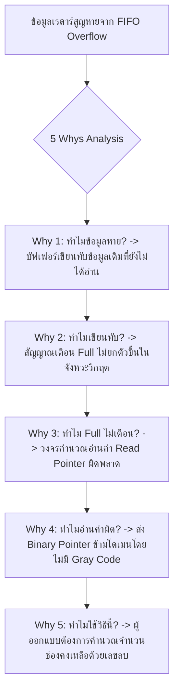

# Lesson 118: Asynchronous FIFO & Dual-Clock Data Synchronization in VHDL (非同期FIFOとデュアルクロックデータ同期)

---

## 1. ทฤษฎีวิศวกรรมเชิงลึก (高度なエンジニアリング理論)

### 1.1 สถาปัตยกรรมระดับฮาร์ดแวร์ของ Dual-Clock Asynchronous FIFO
การส่งผ่านสตรีมข้อมูลความเร็วสูงข้ามระหว่างสองโดเมนสัญญาณนาฬิกาที่ไม่สอดคล้องกัน (Asynchronous Clock Domains เช่น สัญญาณจาก ADC ความถี่ $160\text{ MHz}$ ส่งเข้าบัส PCIe ความถี่ $100\text{ MHz}$) ไม่สามารถใช้เพียงวงจร Handshake แบบง่ายได้ เนื่องจากจะสูญเสีย Throughput อย่างรุนแรง สถาปัตยกรรมที่เป็นมาตรฐานระดับสากลคือ **Asynchronous FIFO (Dual-Clock FIFO: DCFIFO)**

โครงสร้างภายในของ Asynchronous FIFO ประกอบด้วย 5 องค์ประกอบหลักที่ทำงานร่วมกันอย่างสมบูรณ์:

```
               Complete Dual-Clock Asynchronous FIFO Architecture
  
      WRITE CLOCK DOMAIN (clk_wr)                     READ CLOCK DOMAIN (clk_rd)
  +---------------------------------+             +---------------------------------+
  | Write Data (wdata)              |             | Read Data (rdata)               |
  | Write Enable (winc)             |             | Read Enable (rinc)              |
  |                                 |             |                                 |
  | +-----------------------------+ |  Dual-Port  | +-----------------------------+ |
  | | Write Pointer Logic (Binary)| |  Block RAM  | | Read Pointer Logic (Binary) | |
  | +--------------+--------------+ | (DP-BRAM)   | +--------------+--------------+ |
  |                |                |=== MEM =====|                |                |
  |                v                |   ARRAY     |                v                |
  |       Binary-to-Gray (wptr)     |             |       Binary-to-Gray (rptr)     |
  |                |                |             |                |                |
  |                +----------------+======+      |                +----------------+======+
  |                |                       |      |                |                       |
  |                v                       |      |                v                       |
  |         [ Full Flag Gen ]              |      |         [ Empty Flag Gen ]             |
  |                ^                       |      |                ^                       |
  |                | 2-Stage Sync          v      |                | 2-Stage Sync          v
  |         +------+------+          (To clk_rd)  |         +------+------+          (To clk_wr)
  |         | Sync rd_ptr |                       |         | Sync wr_ptr |
  |         +-------------+                       |         +-------------+
  +---------------------------------+             +---------------------------------+
```

1. **Dual-Port Block RAM Core:** หน่วยความจำบัฟเฟอร์ข้อมูล โดยพอร์ตเขียนใช้สัญญาณนาฬิกา $CLK_{wr}$ และพอร์ตอ่านใช้สัญญาณนาฬิกา $CLK_{rd}$
2. **Write Pointer Logic (ฝั่งเขียน):** ตัวนับแอดเดรสเขียนขนาด $N+1$ บิต (มีบิตเกินมา 1 บิตสำหรับตรวจสอบ Wrap-around)
3. **Read Pointer Logic (ฝั่งอ่าน):** ตัวนับแอดเดรสอ่านขนาด $N+1$ บิต
4. **Binary-to-Gray Converters:** แปลงพอยน์เตอร์แอดเดรสเป็นรหัสเทา (Gray Code) เพื่อส่งข้ามโดเมนอย่างปลอดภัยโดยปราศจากปัญหาสัญญาณรบกวนบัส (Bus Skew Immunity)
5. **Flag Generators:** วงจรเปรียบเทียบพอยน์เตอร์เพื่อสร้างสถานะ `wfull` (เต็ม) และ `rempty` (ว่าง)

---

### 1.2 คณิตศาสตร์และสมการการสร้างสัญญาณ Empty และ Full ใน Gray Domain
เพื่อให้การตัดสินสถานะปลอดภัยจากการเกิด Metastability และ Skew **การเปรียบเทียบแอดเดรสจะต้องทำใน Gray Code Domain เสมอ**

กำหนดให้ FIFO มีขนาดความลึก $D = 2^N$ ช่อง พอยน์เตอร์จะมีขนาด $N+1$ บิต:
* บิตต่ำ $N$ บิตแรก $[N-1:0]$ คือแอดเดรสจริงในหน่วยความจำ
* บิตบนสุดบิตที่ $N$ คือ **MSB (Wrap-around Bit)** ซึ่งทำหน้าที่บอกว่าตัวนับวนรอบกลับมาที่จุดเริ่มต้นแล้วกี่ครั้ง

#### 1.2.1 เงื่อนไข FIFO Empty (ว่างเปล่า):
FIFO จะว่างเปล่าเมื่อ **"พอยน์เตอร์อ่าน เดินตามมาทันพอยน์เตอร์เขียนพอดี"** นั่นคือทั้งแอดเดรสและสถานะการวนรอบตรงกันทุกประการ:

$$\text{FIFO Empty Condition} \iff \text{rptr\_gray} == \text{sync\_wptr\_gray}$$

ทุกบิตของเวกเตอร์ Gray Code ขนาด $N+1$ บิตต้องมีค่าเหมือนกัน $100\%$

#### 1.2.2 เงื่อนไข FIFO Full (เต็มพิกัด):
FIFO จะเต็มเมื่อ **"พอยน์เตอร์เขียน เดินวนรอบแซงหน้าพอยน์เตอร์อ่านมาครบรอบพอดี ($D$ ช่อง)"** 
* ในรหัสฐานสอง (Binary): บิต MSB จะตรงข้ามกัน ($W_{MSB} \ne R_{MSB}$) ในขณะที่บิตแอดเดรสที่เหลือมีค่าเท่ากันทุกบิต
* ในรหัสเทา (Gray Code): คุณสมบัติการสะท้อนของ Gray Code กำหนดให้:
  * **บิต 2 ตัวบนสุด ($MSB$ และ $MSB-1$) จะต้องกลับขั้วกัน (Inverted)**
  * **บิตที่เหลือทั้งหมดตั้งแต่ $[N-2:0]$ จะต้องมีค่าเหมือนกันทุกประการ!**

$$\text{FIFO Full Condition} \iff \text{wptr\_gray} == \{\sim \text{sync\_rptr\_gray}[N:N-1], \text{sync\_rptr\_gray}[N-2:0]\}$$

```
                  Gray Code Full Flag Inversion Geometry (Depth = 8, 4-bit Pointers)
  
   ตัวอย่าง: FIFO ความลึก 8 ช่อง (พอยน์เตอร์ 4 บิต: [3:0])
   * สมมติพอยน์เตอร์อ่านอยู่ที่แอดเดรส 0:
     rptr_bin  = "0000" -> rptr_gray = "0000"
   
   * เมื่อพอยน์เตอร์เขียนวนรอบมาเต็ม 8 ช่องพอดี (แอดเดรส 0 ในรอบถัดไป):
     wptr_bin  = "1000" -> wptr_gray = "1100"
   
   เปรียบเทียบ rptr_gray ("0000") และ wptr_gray ("1100"):
   * บิต [3] (MSB):   '1' เทียบกับ '0' -> กลับขั้วกัน (Inverted)
   * บิต [2] (MSB-1): '1' เทียบกับ '0' -> กลับขั้วกัน (Inverted)
   * บิต [1:0]:       "00" เทียบกับ "00" -> เหมือนกันทุกประการ!
   -> นี่คือที่มาของสูตร ~sync_rptr_gray[N:N-1] & sync_rptr_gray[N-2:0]
```

---

### 1.3 พฤติกรรมแบบมองโลกในแง่ร้าย (Pessimistic / Conservative Flag Mechanics)
เนื่องจากพอยน์เตอร์ของอีกฝั่งต้องใช้เวลาเดินทางผ่าน 2-Stage Synchronizer เป็นเวลา $2\text{ ไซเคิลสัญญาณนาฬิกา}$ ข้อมูลพอยน์เตอร์ที่นำมาเปรียบเเทียบจึงเป็น **"ข้อมูลในอดีต (Delayed Information)"** เสมอ

แต่สถาปัตยกรรมนี้มีความปลอดภัยสมบูรณ์แบบ $100\%$ ด้วยเหตุผลทางคณิตศาสตร์:
1. **ทางฝั่งเขียน (Write Domain):**
   * ฝั่งเขียนเห็นพอยน์เตอร์อ่านล่าช้าไป 2 ไซเคิล
   * ฝั่งเขียนจึงเข้าใจว่า: *"ฝั่งอ่านยังอ่านข้อมูลออกไปน้อยกว่าความเป็นจริง (มีที่ว่างเหลือน้อยกว่าจริง)"*
   * สัญญาณ `wfull` อาจเตือนว่าเต็มเร็วกว่าความเป็นจริงชั่วครู่ (Pessimistic Full) แต่ **ไม่มีทางปล่อยให้เกิดการเขียนทับข้อมูล (No Overflow Risk) เด็ดขาด!**
2. **ทางฝั่งอ่าน (Read Domain):**
   * ฝั่งอ่านเห็นพอยน์เตอร์เขียนล่าช้าไป 2 ไซเคิล
   * ฝั่งอ่านจึงเข้าใจว่า: *"ฝั่งเขียนเพิ่งเขียนข้อมูลเข้ามาน้อยกว่าความเป็นจริง (มีข้อมูลให้ดึงน้อยกว่าจริง)"*
   * สัญญาณ `rempty` อาจเตือนว่าว่างนานกว่าความเป็นจริงชั่วครู่ (Pessimistic Empty) แต่ **ไม่มีทางปล่อยให้เกิดการอ่านข้อมูลขยะ (No Underflow Risk) เด็ดขาด!**

---

### 1.4 การคำนวณขนาดความลึกขั้นต่ำของ FIFO สำหรับ Burst Transfer
เมื่อข้อมูลถูกส่งเข้ามาเป็นกลุ่มก้อน (Burst) ด้วยอัตราความถี่สูง $f_{wr}$ ไปยังตัวประมวลผลที่อ่านข้อมูลด้วยความถี่ต่ำกว่า $f_{rd}$:

$$Depth_{min} \ge Burst\_Size \cdot \left(1 - \frac{f_{rd}}{f_{wr}}\right) + Latency\_Overhead$$

---

## 2. ทริคหน้างาน OJT แบบ Step-by-Step (現場の実践テクニック)

### 2.1 กรณีศึกษาความล้มเหลวหน้างาน (失敗事例: Shippai Jirei)
* **บริบท:** ระบบเรดาร์ตรวจจับอากาศยานไร้คนขับ (Drone Surveillance Radar System) ส่งข้อมูลดิจิทัลความเร็วสูงจาก ADC 16-bit ($160\text{ MHz}$) ข้ามไปยังชิปประมวลผล PCIe Interface ($100\text{ MHz}$) บนชิป FPGA Xilinx Kintex UltraScale
* **อาการเสียหน้างาน:** ระบบทำงานได้ปกติเมื่อข้อมูลเข้ามาแบบประปราย แต่เมื่อเปิดโหมดสแกนรอบทิศทางที่มีการส่งข้อมูลแบบ Burst ขนาด 512 คำต่อเนื่อง พบว่าเกิดอาการ **"เป้าหมายเรดาร์กระพริบและหายไปจากจอ (Target Dropouts)"** อัตราการสูญเสียข้อมูลเกิดขึ้นสุ่มเฉลี่ย 1 ครั้งในทุกๆ 500 ถึง 1,000 เบิสต์
* **การตรวจสอบด้วย Logic Analyzer (ILA):** ดักจับสถานะของ FIFO ขณะเกิดเหตุการณ์ พบปรากฏการณ์ประหลาด:
  * สัญญาณ `wfull` ไม่ได้ยกตัวขึ้นเตือน
  * แต่ข้อมูลชุดใหม่กลับเขียนทับแอดเดรสที่ยังไม่ได้อ่านออกไป ส่งผลให้ข้อมูลเรดาร์เสียหาย (Data Corruption)

```
            การสืบสวนหาสาเหตุ FIFO Overrun (Shippai Analysis)
   +--------------------------------------------------------------------------+
   | ตรวจสอบซอร์สโค้ด VHDL ของ FIFO ที่พัฒนาขึ้นเอง:                           |
   | พบว่าวิศวกรนำพอยน์เตอร์ Binary `wr_ptr_bin` และ `rd_ptr_bin`              |
   | มาลบกันใน Write Domain ตรงๆ เพื่อหาช่องว่างคงเหลือ (Remaining Words)!      |
   +--------------------------------------------------------------------------+
                                       |
                                       v
   +--------------------------------------------------------------------------+
   | ความผิดพลาดระดับวิกฤต: สัญญาณ `rd_ptr_bin` ถูกส่งข้าม Clock 160MHz       |
   | โดยใช้ 2-Stage Synchronizer แยกกันทีละบิต (Binary Direct Sync)!          |
   | ในจังหวะที่พอยน์เตอร์เปลี่ยนจาก 01111 -> 10000                           |
   | เกิด Routing Skew ทำให้บิตบนมาช้ากว่าบิตล่าง                             |
   +--------------------------------------------------------------------------+
                                       |
                                       v
   +--------------------------------------------------------------------------+
   | ฝั่งเขียนสุ่มจับค่าพอยน์เตอร์อ่านเพี้ยนเป็นค่าลวงชั่วขณะ                   |
   | วงจรคำนวณเข้าใจผิดว่า "ยังมีที่ว่างเหลือเฟือ" จึงปลดสัญญาณ `wfull` ลง '0'|
   | DMA อัดข้อมูลเพิ่มเข้ามาจนล้นทับข้อมูลเดิมพังทลาย!                        |
   +--------------------------------------------------------------------------+
```

---

### 2.2 การวิเคราะห์หาสาเหตุรากเหง้า (Root Cause Analysis: 5 Whys & Ishikawa)



#### Ishikawa Diagram (ผังก้างปลา)
* **Design/Architecture:** นำ Binary Pointer ส่งข้าม Asynchronous Clock Domain แทนที่จะแปลงเป็น Gray Code
* **Comparison Domain:** ทำการเปรียบเทียบขนาดช่องว่างในโดเมนที่ไม่เสถียร
* **Verification:** Testbench ในขั้นตอนจำลองใช้ความถี่ Clock ที่เป็นจำนวนเต็มลงตัว ($1:1$) ทำให้ไม่เกิด Asynchronous Race Condition
* **Review Process:** ขาดการตรวจสอบ CDC Guidelines เรื่องห้าม Synchronize สัญญาณ Multi-Bit Bus

---

### 2.3 มาตรการแก้ไขถาวร (Permanent Corrective Action)
1. **ปรับปรุงวงจรเปรียบเทียบพอยน์เตอร์เป็น Full/Empty ใน Gray Domain $100\%$:**
   * สัญญาณ Binary Pointer ใช้เฉพาะในการชี้แอดเดรส BRAM ภายในโดเมนของตนเองเท่านั้น
   * การส่งข้ามโดเมนและการสร้างแฟล็ก `wfull` และ `rempty` ต้องทำบน Gray Code เสมอ ตามสมการบิตกลับขั้ว
2. **หากต้องการสัญญาณ Almost Full ให้คำนวณผ่านวงจรถอดรหัส Gray อย่างระมัดระวัง:**
   * หรือใช้ IP Core มาตรฐานที่ผ่านการรับรอง เช่น Xilinx FIFO Generator หรือ Intel DCFIFO
3. **ผลลัพธ์หลังแก้ไข:** ทำการทดสอบสตรีมข้อมูลต่อเนื่อง $10,000,000\text{ เบิสต์}$ ปราศจากการสูญเสียข้อมูลโดยสิ้นเชิง ($100\%$ Zero Dropouts) สัญญาณเรดาร์แสดงผลนิ่งสนิท

---

### 2.4 ตารางตรวจสอบหน้างาน SOP สำหรับ Asynchronous FIFO (DCFIFO SOP Checklist)

| ลำดับ | จุดตรวจสอบทางวิศวกรรม | เกณฑ์การยอมรับ (Acceptance Criteria) | เครื่องมือตรวจสอบ | ผลการตรวจ |
| :---: | :--- | :--- | :--- | :---: |
| 1 | การส่งสัญญาณ Pointer ข้ามโดเมน | ต้องแปลงเป็น Gray Code ก่อนเข้า Synchronizer เสมอ ($100\%$) | RTL Code Review | ผ่าน / ไม่ผ่าน |
| 2 | สมการตัดสินสถานะ Full Flag | ต้องใช้วิธี Invert บิต $MSB$ และ $MSB-1$ ใน Gray Domain | Verification Assertion | ผ่าน / ไม่ผ่าน |
| 3 | การกำหนด Timing Constraints | ต้องมีคำสั่ง `set_max_delay -datapath_only` กำกับสาย Gray Bus | SDC / XDC Audit | ผ่าน / ไม่ผ่าน |
| 4 | ขนาดความลึกบัฟเฟอร์ (Depth) | ต้องรองรับขนาด Burst สูงสุดบวก Latency Margin อย่างน้อย 4 ไซเคิล | Sizing Calculation Sheet | ผ่าน / ไม่ผ่าน |
| 5 | การจำลองสภาวะแวดล้อมจริง | ต้องรัน UVM Simulation โดยสุ่มความถี่และเฟสของ Clock ทั้งสองฝั่ง | Randomized Simulation | ผ่าน / ไม่ผ่าน |

---

## 3. คำศัพท์และประโยคภาษาญี่ปุ่นสำหรับตรวจแบบ (検図 - Kenzu)

### 3.1 ตารางคำศัพท์เทคนิคเฉพาะทาง (専門用語一覧)

| คำศัพท์คันจิ/คาตาคานะ | การอ่าน (Romaji) | คำแปลภาษาไทย / ภาษาอังกฤษ |
| :--- | :--- | :--- |
| **非同期FIFO** | Hidōki faifo | ฟีโฟข้ามโดเมนสัญญาณนาฬิกา (Asynchronous / Dual-Clock FIFO) |
| **書き込みポインタ** | Kakikomi pointa | พอยน์เตอร์ชี้ตำแหน่งเขียน (Write Pointer) |
| **読み出しポインタ** | Yomidashi pointa | พอยน์เตอร์ชี้ตำแหน่งอ่าน (Read Pointer) |
| **満杯判定** | Manpai hantei | วงจรตัดสินสถานะเต็ม (Full Flag Condition Determination) |
| **空判定** | Kara hantei | วงจรตัดสินสถานะว่าง (Empty Flag Condition Determination) |
| **グレイコード同期** | Gurei kōdo dōkika | การซิงโครไนซ์ด้วยรหัสเทา (Gray Code Synchronization) |
| **悲観的フラグ** | Hikanteki furagu | แฟล็กเตือนล่วงหน้าแบบมองโลกในแง่ร้าย (Pessimistic / Safe Flag) |
| **データ追い越し** | Dēta oikoshi | การเขียนข้อมูลวนแซงหน้าจนทับข้อมูลเดิม (Data Overrun / Overflow) |
| **空読み出し** | Kara yomidashi | การอ่านข้อมูลจากบัฟเฟอร์ที่ว่างเปล่า (Underflow Read) |
| **巡回ビット** | Junkai bitto | บิตระบุรอบการวนซ้ำ (Wrap-around / Cycle Bit) |

---

### 3.2 บทสนทนาการตรวจแบบหน้างานจริง (検図での指摘事項)

#### การตรวจแบบจุดที่ 1: การตรวจพบการนำ Binary Pointer ไปเปรียบเทียบข้ามโดเมน
* **審査役 (Lead Chief Engineer):**
  「この独自設計の非同期FIFOですが、書き込み側の満杯判定（Full判定）回路で、受信した `rd_ptr` をバイナリに逆変換してから減算器で残容量を計算していますね。各ビットの配線遅延差（スキュー）によって、同期化途中で一時的な異常値（グリッチ値）が発生した場合、Fullフラグが誤って解除され、データの上書き破壊（オーバーラン）を引き起こします。満杯判定はグレイコードのビット反転比較を用いて、グレイコードドメイン上で直接行ってください。」
  *(ในวงจร Asynchronous FIFO ที่ออกแบบเองตัวนี้ ในส่วนการตัดสินสถานะเต็ม (Full) ทางฝั่งเขียน คุณแปลง `rd_ptr` ที่รับมากลับเป็น Binary แล้วใช้ตัวลบคำนวณหาช่องว่างคงเหลือนะครับ ด้วยความต่างของดีเลย์บนสายทองแดง (Skew) ระหว่างบิต ในระหว่างการซิงโครไนซ์อาจเกิดค่าลวงชั่วขณะ ทำให้สัญญาณ Full ดับลงอย่างผิดพลาดจนเกิดการเขียนทับข้อมูลเสียหายได้ การตัดสินสถานะเต็มจะต้องเปรียบเทียบใน Gray Code Domain โดยตรงผ่านการกลับขั้วบิตตามสูตรมาตรฐานครับ)*
* **設計担当 (FPGA Design Engineer):**
  「ご指摘ありがとうございます。残容量の数値計算を優先したため、マルチビット・スキューのリスクを軽視しておりました。直ちにグレイコードの最上位2ビットを反転させる標準コンパレータ回路へ修正し、グリッチによる誤判定を物理的に排除いたします。」
  *(ขอบพระคุณสำหรับข้อสังเกตครับ ผมมุ่งแต่จะคำนวณตัวเลขช่องว่างคงเหลือจนมองข้ามความเสี่ยงเรื่อง Multi-Bit Skew ไปครับ ผมจะรีบแก้ไขไปใช้วงจรเปรียบเทียบมาตรฐานที่กลับขั้ว 2 บิตบนสุดใน Gray Domain ในทันที เพื่อกำจัดความผิดพลาดจากค่าลวงได้อย่างสมบูรณ์ครับ)*

#### การตรวจแบบจุดที่ 2: ปัญหาความจุ FIFO ไม่เพียงพอต่อการรองรับ Burst Transfer
* **審査役 (Lead Chief Engineer):**
  「ADC（160MHz）からPCIe（100MHz）へのバースト転送において、FIFOの深さが256ワードしか確保されていません。ADCから最大512ワードの連続バーストが入力された場合、読み出し側の速度差を考慮すると、計算上少なくとも $512 \times (1 - 100/160) = 192\text{ ワード}$ の蓄積に加えて同期化遅延マージンが必要です。安全係数を考慮すると容量が極めて逼迫しています。深さを512または1024ワードへ拡張してください。」
  *(ในการส่งข้อมูลแบบ Burst จาก ADC (160MHz) ไปยัง PCIe (100MHz) ขนาดความลึกของ FIFO ถูกจัดสรรไว้เพียง 256 คำเท่านั้นนะครับ หากมีเบิสต์ต่อเนื่องสูงสุด 512 คำส่งเข้ามาจาก ADC เมื่อคิดจากอัตราความเร็วที่ต่างกัน ตามการคำนวณจะต้องสะสมข้อมูลอย่างน้อย $512 \times (1 - 100/160) = 192\text{ คำ}$ บวกกับมาร์จินของความล่าช้าในการซิงโครไนซ์ เมื่อคำนึงถึงค่าความปลอดภัยแล้ว ความจุนี้ตึงตัวเกินไปอย่างยิ่ง ช่วยขยายขนาดเป็น 512 หรือ 1,024 คำด้วยครับ)*
* **設計担当 (FPGA Design Engineer):**
  「承知いたしました。Block RAMの空きリソースを確認の上、FIFOの深さを1024ワードへ拡張し、最悪のバースト流入条件下でもオーバーフローが発生しないよう安全マージンを確保いたします。」
  *(รับทราบครับ ผมจะตรวจสอบทรัพยากร Block RAM ที่ยังว่างอยู่ และขยายความลึกของ FIFO เป็น 1,024 คำ เพื่อรับประกันมาร์จินความปลอดภัยไม่ให้เกิด Overflow แม้ในสภาวะเบิสต์ที่เลวร้ายที่สุดครับ)*

---

## 4. ควิซวิเคราะห์ปัญหาระดับวิศวกรอาวุโส (上級技術クイズ)

### ข้อที่ 1: การคำนวณขนาดความลึกขั้นต่ำ (Minimum FIFO Depth) สำหรับ Asynchronous Burst
ในระบบการประมวลผลภาพทางการแพทย์:
* กล้องความเร็วสูงส่งข้อมูลพิกเซลเข้า FIFO ด้วยความถี่เขียน: $f_{wr} = 200\text{ MHz}$ ($T_{wr} = 5.0\text{ ns}$)
* ฝั่งอ่านส่งข้อมูลเข้าหน่วยความจำ DDR ด้วยความถี่อ่าน: $f_{rd} = 80\text{ MHz}$ ($T_{rd} = 12.5\text{ ns}$)
* ขนาดเบิสต์สูงสุดของข้อมูลพิกเซลที่ส่งเข้ามาต่อเนื่องใน 1 รอบ: $B = 1,000\text{ คำ (Words)}$ (เขียนติดต่อกัน 1,000 ไซเคิลโดยไม่มีหยุดพัก)
* ในระหว่างเบิสต์ ฝั่งอ่านสามารถอ่านข้อมูลออกไปได้อย่างต่อเนื่องทันทีที่มีข้อมูลเข้ามา
* กำหนดให้ค่าความล่าช้าในการซิงโครไนซ์สัญญาณ Empty/Full และ Latency ในการเริ่มอ่านข้อมูลรวม: $N_{latency} = 6\text{ ไซเคิลของฝั่งเขียน}$

จงคำนวณหา **ขนาดความลึกขั้นต่ำของ FIFO ($Depth_{min}$)** ที่ต้องใช้เพื่อรับประกันว่าจะ **ไม่มีข้อมูลสูญหาย (Zero Data Loss)** และเลือกขนาดความจุที่เป็นเลขยกกำลังสอง ($2^K$) ที่เหมาะสมที่สุด:

a) $Depth_{min} = 400\text{ คำ}$; เลือกขนาดความจุ $512\text{ คำ}$  
b) $Depth_{min} = 606\text{ คำ}$; เลือกขนาดความจุ $1,024\text{ คำ}$  
c) $Depth_{min} = 750\text{ คำ}$; เลือกขนาดความจุ $1,024\text{ คำ}$  
d) $Depth_{min} = 200\text{ คำ}$; เลือกขนาดความจุ $256\text{ คำ}$  

---

#### เฉลยและบทวิเคราะห์เชิงลึกข้อที่ 1
**คำตอบที่ถูกต้องคือ: b) $Depth_{min} = 606\text{ คำ}$; เลือกขนาดความจุ $1,024\text{ คำ}$**

**ขั้นตอนการคำนวณทางคณิตศาสตร์:**
1. คำนวณระยะเวลาทั้งหมดที่ใช้ในการเขียนเบิสต์ 1,000 คำ ($T_{burst}$):
   $$T_{burst} = B \times T_{wr} = 1,000 \times 5.0\text{ ns} = 5,000\text{ ns} = 5.0\text{ }\mu\text{s}$$
2. คำนวณจำนวนคำที่ฝั่งอ่านสามารถดึงข้อมูลออกไปได้ในระหว่างช่วงเวลานี้ ($N_{read}$):
   $$N_{read} = \left\lfloor \frac{T_{burst}}{T_{rd}} \right\rfloor = \left\lfloor \frac{5,000\text{ ns}}{12.5\text{ ns}} \right\rfloor = 400\text{ คำ}$$
3. คำนวณจำนวนคำสะสมส่วนเกินที่ต้องตกค้างอยู่ในบัฟเฟอร์:
   $$N_{accum} = B - N_{read} = 1,000 - 400 = 600\text{ คำ}$$
4. บวกค่าความล่าช้าของวงจรซิงโครไนซ์ (Latency Margin):
   $$Depth_{min} = N_{accum} + N_{latency} = 600 + 6 = 606\text{ คำ}$$
5. เลือกขนาดที่เป็นเลขฐานสองยกกำลังสอง ($2^K$):
   * ขนาด $512$ คำ ($2^9$) ไม่เพียงพอ ($512 < 606$)
   * จึงต้องเลือกขนาดถัดไปคือ **$1,024\text{ คำ}$ ($2^{10}$ หรือ $K = 10\text{ บิต}$)**
6. **ข้อสรุปเชิงวิศวกรรม:**
   * การเลือกขนาด $1,024$ คำช่วยรองรับเบิสต์ได้อย่างสมบูรณ์ และมีมาร์จินสำรองเผื่อกรณีที่ระบบ DDR ฝั่งรับติดสถานะ Refresh Cycle ชั่วคราวได้อีกด้วย

---

### ข้อที่ 2: การพิสูจน์เงื่อนไข Full Flag ใน Gray Code Domain
พิจารณา FIFO ขนาดความลึก 16 ช่อง ($N = 4$ บิต, พอยน์เตอร์ขนาด 5 บิต: $[4:0]$):
* พอยน์เตอร์อ่านอยู่ที่แอดเดรส $5_{10}$ ในรอบแรก:
  $$\text{rptr\_bin} = \text{"00101"}$$
  $$\text{rptr\_gray} = 00101 \oplus 00010 = \text{"00111"}$$

หากพอยน์เตอร์เขียนวนรอบมาจน FIFO เต็มพิกัดพอดี (แอดเดรส $5_{10}$ ในรอบถัดไป นั่นคือ $5 + 16 = 21_{10}$):
* $\text{wptr\_bin} = 21_{10} = \text{"10101"}$

จงคำนวณหาค่า $\text{wptr\_gray}$ และพิสูจน์ว่าตรงกับสูตร $\{\sim \text{rptr\_gray}[4:3], \text{rptr\_gray}[2:0]\}$ หรือไม่:

a) $\text{wptr\_gray} = \text{"11111"}$; ตรงกับสูตรโดยบิต [4:3] กลับขั้วจาก "00" เป็น "11" และบิต [2:0] คือ "111" เหมือนเดิม  
b) $\text{wptr\_gray} = \text{"10111"}$; ไม่ตรงกับสูตรเพราะบิต [3] ไม่ได้เปลี่ยนค่า  
c) $\text{wptr\_gray} = \text{"00111"}$; เหมือนกับ rptr_gray ทุกประการ  
d) $\text{wptr\_gray} = \text{"11000"}$; ตรงข้ามกันทุกบิต  

---

#### เฉลยและบทวิเคราะห์เชิงลึกข้อที่ 2
**คำตอบที่ถูกต้องคือ: a) $\text{wptr\_gray} = \text{"11111"}$; ตรงกับสูตรโดยบิต [4:3] กลับขั้วจาก "00" เป็น "11" และบิต [2:0] คือ "111" เหมือนเดิม**

**ขั้นตอนการคำนวณทางคณิตศาสตร์:**
1. คำนวณ $\text{wptr\_gray}$ จาก $\text{wptr\_bin} = \text{"10101"}$ ตามสูตร $G = B \oplus (B \gg 1)$:
   $$\text{wptr\_bin} = 10101_2$$
   $$\text{wptr\_bin} \gg 1 = 01010_2$$
   $$\text{wptr\_gray} = 10101 \oplus 01010 = \text{11111}_2$$
2. ตรวจสอบสูตรการสร้าง Full Flag จาก $\text{rptr\_gray} = \text{"00111"}$:
   * สองบิตบนสุดของ $\text{rptr\_gray}$ คือ `rptr_gray[4:3] = "00"`
     * ทำการ Invert: `~"00" = "11"`
   * สามบิตล่างของ $\text{rptr\_gray}$ คือ `rptr_gray[2:0] = "111"`
     * คงค่าเดิม: `"111"`
   * รวมเวกเตอร์ตามสูตร:
     $$\text{Expected Full Pattern} = \{\sim \text{rptr\_gray}[4:3], \text{rptr\_gray}[2:0]\} = \text{"11111"}$$
3. **การเปรียบเทียบ:**
   * ค่าที่คำนวณได้จริง $\text{wptr\_gray} = \text{"11111"}$ มีค่าเท่ากับค่าตามสูตร $\text{"11111"}$ พอดิบพอดี $100\%$
   * นี่คือการพิสูจน์ทางคณิตศาสตร์ว่าเหตุใดวงจรเปรียบเทียบ Full ในฮาร์ดแวร์จึงต้อง Invert บิตบนสุด 2 บิตเสมอ

---

### ข้อที่ 3: การวิเคราะห์ความล่าช้าในการปลดสถานะ Empty (Write-to-Empty De-assertion Latency)
สมมติว่า FIFO กำลังอยู่ในสถานะว่างเปล่าสมบูรณ์ (`rempty = '1'`)
* ณ เวลา $t = 0$: ฝั่งเขียนทำการเขียนข้อมูลคำแรกลงไปใน FIFO (`winc = '1'`) ที่ความถี่ $f_{wr} = 100\text{ MHz}$ ($T_{wr} = 10.0\text{ ns}$)
* ฝั่งอ่านทำงานที่ความถี่ $f_{rd} = 50\text{ MHz}$ ($T_{rd} = 20.0\text{ ns}$)
* วงจรซิงโครไนซ์พอยน์เตอร์เขียนข้ามมายังฝั่งอ่านใช้ **2-Stage Synchronizer (2 Flip-Flops)** ที่ขับด้วย $CLK_{rd}$

จงวิเคราะห์ว่าฝั่งอ่านจะต้องใช้เวลารอคอยอย่างน้อยที่สุดเท่าใด สัญญาณ `rempty` จึงจะลดระดับลงเป็น '0' เพื่อแจ้งให้ฝั่งอ่านรู้ว่ามีข้อมูลพร้อมให้อ่านแล้ว?

a) $10.0\text{ ns}$ (1 ไซเคิลของฝั่งเขียน)  
b) ระหว่าง $40.0\text{ ns}$ ถึง $60.0\text{ ns}$ (ประมาณ 2 ถึง 3 ไซเคิลของฝั่งอ่าน)  
c) $100.0\text{ ns}$  
d) สัญญาณ `rempty` จะลดลงทันทีแบบ Zero-Delay  

---

#### เฉลยและบทวิเคราะห์เชิงลึกข้อที่ 3
**คำตอบที่ถูกต้องคือ: b) ระหว่าง $40.0\text{ ns}$ ถึง $60.0\text{ ns}$ (ประมาณ 2 ถึง 3 ไซเคิลของฝั่งอ่าน)**

**ขั้นตอนการวิเคราะห์ลำดับเวลา (Timing Sequence Analysis):**
1. **ในฝั่งเขียน ($t = 0$):**
   * ที่ขอบขาขึ้นของ $CLK_{wr}$ ข้อมูลถูกเขียนลงใน BRAM และพอยน์เตอร์ `wr_ptr_gray` อัปเดตค่าจาก $0 \to 1$
2. **การเดินทางผ่าน Synchronizer ของฝั่งอ่าน:**
   * สัญญาณ `wr_ptr_gray` มาจ่อที่ขาอินพุตของ Sync FF ตัวแรกในโดเมน $CLK_{rd}$
   * เนื่องจาก Clock ทั้งสองไม่ตรงกัน ขอบของ $CLK_{rd}$ ถัดไปจะมาถึงในเวลาสุ่มระหว่าง $0$ ถึง $20.0\text{ ns}$ (เฉลี่ย 1 คาบของ $T_{rd}$)
   * **Stage 1 Capture:** ขอบ Clock ที่ 1 บันทึกค่าเข้า Sync FF1
   * **Stage 2 Capture:** ขอบ Clock ที่ 2 ($+20\text{ ns}$) ส่งค่าต่อไปยัง Sync FF2
   * **Empty Logic Evaluation:** ขอบ Clock ที่ 3 ($+20\text{ ns}$) วงจรเปรียบเทียบ `sync_wptr_gray /= rptr_gray` ตัดสินว่าไม่ว่างแล้ว จึงปลด `rempty <= '0'`
3. **คำนวณเวลารวม:**
   $$T_{latency} = (1 \text{ ถึง } 2 \text{ ไซเคิล Phase Offset}) + (2 \times T_{rd}) = 2\text{ ถึง } 3 \text{ ไซเคิลของ } T_{rd}$$
   $$T_{latency} = 2 \times 20.0\text{ ns} \text{ ถึง } 3 \times 20.0\text{ ns} = 40.0\text{ ns} \text{ ถึง } 60.0\text{ ns}$$
4. **ความสำคัญเชิงวิศวกรรม:**
   * ความล่าช้า $40 - 60\text{ ns}$ นี้เป็นเรื่องปกติของ Asynchronous FIFO และสะท้อนถึงธรรมชาติของ Pessimistic Empty ที่ป้องกันไม่ให้ฝั่งอ่านรีบอ่านข้อมูลก่อนที่สัญญาณใน BRAM จะเสถียร
