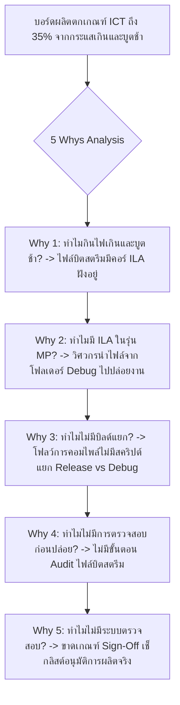

# Lesson 120: Advanced On-Chip Hardware Debugging & Production Sign-Off in VHDL (オンチップ実機デバッグと量産サインオフ)

---

## 1. ทฤษฎีวิศวกรรมเชิงลึก (高度なエンジニアリング理論)

### 1.1 สถาปัตยกรรมการตรวจวัดและดีบักระดับฮาร์ดแวร์จริง (On-Chip Debugging Framework)
เมื่อระบบดิจิทัลถูกสังเคราะห์และบรรจุลงในชิปจริง การเปิดเครื่องทดสอบ (Hardware Bring-Up) มักเผชิญกับพฤติกรรมที่ไม่สามารถคาดเดาได้จากการจำลองเพียงอย่างเดียว การควบคุมและสังเกตการณ์ภายในเนื้อซิลิคอนอาศัยโครงสร้างดีบัก 4 เสาหลัก:

```
               Modern FPGA Hardware Bring-Up & Debug Framework
  
   Host PC (Vivado Hardware Manager / Intel System Console)
         |
      [ JTAG Interface: TCK, TMS, TDI, TDO ]
         |
         v
   +-------------------------------------------------------------------------+
   | FPGA Silicon On-Chip Debug Hub (BSCANE2 / JTAG TAP Controller)           |
   |                                                                         |
   |  +--------------------+  +--------------------+  +-------------------+  |
   |  | Integrated Logic   |  | Virtual Input/     |  | In-System Memory  |  |
   |  | Analyzer (ILA)     |  | Output (VIO)       |  | Editor (BRAM)     |  |
   |  | (จับ Waveform ลึก) |  | (สวิตช์/ไฟ LED จำลอง)|  | (แก้ไข LUT/ตาราง) |  |
   |  +---------+----------+  +---------+----------+  +---------+---------+  |
   |            |                       |                       |            |
   |            v                       v                       v            |
   |  [ User RTL Logic ]=============================================        |
   +-------------------------------------------------------------------------+
         |
   +-------------------------------------------------------------------------+
   | JTAG Boundary-Scan Infrastructure (IEEE 1149.1 / IEEE 1149.6 Standard)  |
   | (ทดสอบรอยเชื่อมต่อ BGA Solder Balls, ขาลอย, ลัดวงจร บนแผ่น PCB)         |
   +-------------------------------------------------------------------------+
```

1. **JTAG Boundary-Scan (IEEE 1149.1):**
   * โครงข่าย Shift Register รอบขอบชิป (Boundary-Scan Cells: BSC) ที่เชื่อมต่อกับขาทุกขาของชิป
   * ช่วยให้วิศวกรสามารถสั่งขับแรงดันสูง/ต่ำ หรืออ่านค่าแรงดันที่ขา BGA ใต้ตัวถังได้ โดยไม่ต้องต่อโพรบสัมผัส ช่วยตรวจสอบรอยเชื่อมบัดกรีร้าว (Solder Joint Cracks) หรือสายทองแดงขาดบน PCB
2. **Virtual Input/Output (VIO):**
   * คอร์เสมือนที่สร้างสัญญาณควบคุม (Virtual Push Buttons, Reset Switches) และอ่านสถานะ (Virtual LEDs, Error Flags) แบบเรียลไทม์ผ่านบัส JTAG โดยไม่ต้องเดินสายสวิตช์จริง
3. **Storage Qualification ใน Integrated Logic Analyzer (ILA):**
   * ระบบกรองข้อมูลก่อนบันทึก: แทนที่จะบันทึกทุกรอบสัญญาณนาฬิกา ILA สามารถตั้งเงื่อนไขให้ **"บันทึกเฉพาะเมื่อข้อมูลตรงตามเงื่อนไข (Qualifier Condition) เท่านั้น"** เช่น บันทึกเฉพาะไซเคิลที่มี AXI Error ช่วยขยายหน้าต่างการสังเกตการณ์จากระดับไมโครวินาทีไปสู่ระดับ **หลายนาทีหรือหลายชั่วโมง** โดยใช้หน่วยความจำ BRAM เท่าเดิม!
4. **In-System BRAM Content Editor:**
   * เครื่องมืออ่านและเขียนข้อมูลใน Block RAM แบบสดๆ ขณะชิปกำลังทำงาน เหมาะสำหรับการปรับแต่งตารางสัมประสิทธิ์ตัวกรอง (Filter Tuning) หรือการโหลดตารางสอบเทียบเซนเซอร์ (Calibration Tables)

---

### 1.2 กระบวนการตรวจรับและอนุมัติสู่สายการผลิตจริง (Mass Production Sign-Off Gate)
ก่อนที่จะปล่อยไฟล์บิตสตรีม (Bitstream) เข้าสู่สายการผลิตระดับอุตสาหกรรม (Mass Production: MP) Lead Chief Engineer จะต้องทำการตรวจสอบผ่านประตูคุณภาพ (Quality Gate) อย่างเข้มงวด:

```
                  Mass Production Release Sign-Off Pipeline
  
  [ ขั้นที่ 1: RTL Freeze & Code Clean ]
  +-- ตรวจสอบ DRC (Design Rule Check) ต้องไม่มีข้อผิดพลาด (0 Errors, 0 Critical Warnings)
  
  [ ขั้นที่ 2: Multi-Corner Timing Sign-Off ]
  +-- WNS >= 0.000 ns และ WHS >= 0.000 ns ทั้ง Slow (+125°C) และ Fast (-40°C) Corners
  
  [ ขั้นที่ 3: Debug Core Stripping (กฎเหล็ก!) ]
  +-- ถอดคอร์ ILA, VIO และคำสั่ง `mark_debug` ออกจากบิตสตรีม 100%
  
  [ ขั้นที่ 4: Security & Bitstream Encryption ]
  +-- เข้ารหัส AES-256-GCM, ล็อก eFUSE JTAG Disable, เปิดใช้งาน Watchdog Timer
  
  [ ขั้นที่ 5: Checksum & MES Release ]
  +-- สร้างค่าแฮช SHA-256 ของไฟล์ .bit/.bin และบันทึกลงระบบ Manufacturing Execution System
```

---

### 1.3 ผลกระทบของคอร์ดีบักตกค้างต่อสายการผลิต (The Danger of Residual Debug Cores)
หากวิศวกรส่งไฟล์บิตสตรีมที่มีคอร์ ILA ฝังอยู่ไปให้โรงงานผลิต:
1. **การใช้พลังงานสแตนด์บายพุ่งสูง (Elevated Quiescent Power):** คอร์ ILA ที่คอยแซมเปิลข้อมูลด้วยสัญญาณนาฬิกาความถี่สูงจะกินไฟต่อเนื่อง ส่งผลให้กระแสสแตนด์บายของบอร์ดเกินพิกัดการทดสอบ In-Circuit Test (ICT)
2. **ความเสี่ยงด้านความมั่นคงปลอดภัย (Security Hole):** คอร์ ILA ต่อเชื่อมตรงกับบัส JTAG ภายนอก ผู้ไม่หวังดีสามารถต่อสาย JTAG Pod เข้ามาสั่งดักจับข้อมูลคีย์ลับหรืออัลกอริทึมที่วิ่งอยู่บนบัสภายในได้โดยตรง
3. **การสูญเสียพื้นที่และอายุการใช้งาน:** การใช้งาน Block RAM หลายสิบบล็อกโดยเปล่าประโยชน์จะเพิ่มความหนาแน่นของความร้อน (Thermal Flux) และลดทอนอายุการใช้งานของชิป

---

## 2. ทริคหน้างาน OJT แบบ Step-by-Step (現場の実践テクニック)

### 2.1 กรณีศึกษาความล้มเหลวหน้างาน (失敗事例: Shippai Jirei)
* **บริบท:** สายการผลิตคอมพิวเตอร์ควบคุมเครื่องจักรอุตสาหกรรม (Industrial Embedded Box PC) ใช้ชิป Xilinx Kintex-7 FPGA ในการควบคุมบัสสื่อสาร EtherCAT และมอเตอร์
* **อาการเสียหายในสายการผลิต:** ในขั้นตอนการทดสอบขั้นสุดท้ายในโรงงาน (In-Circuit Test & Functional Board Test: FCT) พบว่ามีบอร์ดไม่ผ่านเกณฑ์การทดสอบสูงถึง **$35\%$ (First-Pass Yield ตกต่ำเหลือ $65\%$)**
  * อาการที่ 1: เครื่อง ICT ฟ้องว่าบอร์ดกินกระแสไฟสแตนด์บายที่ราง $V_{core}$ สูงเกินเกณฑ์มาตรฐาน ($I_{standby} = 1.45\text{ A}$ ในขณะที่สเปกระบุห้ามเกิน $0.65\text{ A}$)
  * อาการที่ 2: บอร์ดบางตัวเกิดอาการบูตไม่ติดจากแฟลช (FPGA Configuration Timeout) เป็นระยะๆ
* **การสืบสวนหาสาเหตุ:** ทีมงานนำไฟล์บิตสตรีมรุ่นผลิตจริง (`production_v1.0.bit`) มาเปิดตรวจสอบโครงสร้างด้วยสคริปต์ตรวจสอบบิตสตรีม:

```
               ผลการตรวจสอบบิตสตรีมรุ่นผลิตจริง (Shippai Forensic Analysis)
   +--------------------------------------------------------------------------+
   | ตรวจสอบไฟล์บิตสตรีมที่ส่งมอบให้ฝ่ายผลิต:                                  |
   | พบว่ามีอินสแตนซ์ของคอร์ ILA จำนวน 3 ชุด และ VIO จำนวน 2 ชุด                |
   | ยังคงถูกฝังอยู่ในเฟิร์มแวร์รุ่นผลิตจริง (Debug Cores Not Stripped!)!       |
   +--------------------------------------------------------------------------+
                                       |
                                       v
   +--------------------------------------------------------------------------+
   | ผลกระทบทางกายภาพ: คอร์ ILA ทั้ง 3 ชุดต่อเข้ากับ Clock 200MHz               |
   | ทำการแซมเปิลสัญญาณ 192 จุดตลอดเวลา และแย่งใช้ Block RAM ไปถึง 24 บล็อก!  |
   | กระแสสวิตชิ่งจาก ILA ดึงไฟราง V_core พุ่งขึ้นอีก 0.80 A -> ICT ตกเกณฑ์!   |
   +--------------------------------------------------------------------------+
                                       |
                                       v
   +--------------------------------------------------------------------------+
   | สาเหตุของการบูตไม่ติด: ขนาดไฟล์บิตสตรีมใหญ่ขึ้น 40% จากคอร์ดีบัก          |
   | ทำให้เวลาในการโหลดผ่าน SPI Flash เกินหน้าต่าง Watchdog Timeout ของบอร์ด   |
   +--------------------------------------------------------------------------+
```

---

### 2.2 การวิเคราะห์หาสาเหตุรากเหง้า (Root Cause Analysis: 5 Whys & Ishikawa)



#### Ishikawa Diagram (ผังก้างปลา)
* **Build Automation:** ขาดระบบ CI/CD ที่แยกกระบวนการสร้างบิตสตรีมรุ่น Debug และ Release ออกจากกันโดยอัตโนมัติ
* **Configuration Management:** วิศวกรคัดลอกไฟล์ `.bit` แบบ Manual ผ่านไดรฟ์แชร์ร่วมกัน
* **Test Specification:** ฝ่ายทดสอบการผลิตไม่ได้ตรวจสอบ Checksum และเวอร์ชันของบิตสตรีมก่อนทำการโปรแกรม
* **Quality Assurance Gate:** ขาดขั้นตอนการเซ็นอนุมัติ (Sign-Off Sheet) โดย Lead Architect ก่อนส่งไฟล์ให้โรงงาน

---

### 2.3 มาตรการแก้ไขถาวร (Permanent Corrective Action)
1. **สร้าง Automated Release Script ใน Tcl:**
   * สคริปต์จะปลดคำสั่ง `mark_debug` ทั้งหมดออก และลบ Debug Nets ทิ้งก่อนเข้าสู่ขั้นตอน Implementation สำหรับรุ่น MP:
   ```tcl
   # Tcl Command for Mass Production Bitstream Generation
   # 1. ปลดคำสั่ง Debug ทั้งหมดออกจาก Netlist
   set_property -quiet MARK_DEBUG false [get_nets -hier -filter {MARK_DEBUG == true}]
   # 2. ลบ Debug Cores ที่ตกค้าง
   delete_debug_core [get_debug_cores]
   # 3. รัน Implementation ใหม่ให้สะอาดบริสุทธิ์
   reset_run impl_1
   launch_runs impl_1 -to_step write_bitstream
   ```
2. **ผสานระบบตรวจสอบ SHA-256 Checksum:**
   * ไฟล์บิตสตรีมทุกไฟล์ต้องมีค่า SHA-256 บันทึกกำกับในเอกสารปล่อยงาน และเครื่องโปรแกรมในสายการผลิตจะปฏิเสธการโหลดหากค่าแฮชไม่ตรง
3. **ผลลัพธ์หลังแก้ไข:**
   * กระแสไฟสแตนด์บายลดลงเหลือ **$0.48\text{ A}$ (ผ่านเกณฑ์ ICT ฉลุย)**
   * ขนาดบิตสตรีมลดลง $38\%$ เวลาในการบูตเร็วขึ้น
   * อัตรา First-Pass Yield ดีดกลับขึ้นมาเป็น **$99.4\%$**

---

### 2.4 ตารางตรวจสอบหน้างาน SOP สำหรับการปล่อยผลิตจริง (Production Sign-Off SOP Checklist)

| ลำดับ | รายการตรวจสอบการปล่อยงานผลิต | เกณฑ์การยอมรับ (Acceptance Criteria) | เครื่องมือตรวจสอบ | ผลการตรวจ |
| :---: | :--- | :--- | :--- | :---: |
| 1 | การถอดคอร์ดีบัก (Debug Core Removal) | ต้องไม่มี ILA, VIO, หรือ MIG Debug ปรากฏในรายงาน ($\text{Debug Cores} = 0$) | Report Debug Cores | ผ่าน / ไม่ผ่าน |
| 2 | Timing Closure Sign-Off | $\text{WNS} \ge 0.000\text{ ns}$ และ $\text{WHS} \ge 0.000\text{ ns}$ ครบทุก Corner | Sign-off Timing Report | ผ่าน / ไม่ผ่าน |
| 3 | Unconstrained Pins Check | ขา I/O ทั้งหมดต้องได้รับการกำหนด Location และ I/O Standard ($100\%$) | DRC Pin Check | ผ่าน / ไม่ผ่าน |
| 4 | Bitstream Compression & Checksum | เปิดออปชัน `BITSTREAM.GENERAL.COMPRESS` พร้อมสร้างไฟล์ `.sha256` | Tcl Script Verification | ผ่าน / ไม่ผ่าน |
| 5 | Master Sign-Off อนุมัติโดยหัวหน้า | มีลายเซ็นอนุมัติของ Chief Engineer ในเอกสาร Release Gate | Quality Gate Document | ผ่าน / ไม่ผ่าน |

---

## 3. คำศัพท์และประโยคภาษาญี่ปุ่นสำหรับตรวจแบบ (検図 - Kenzu)

### 3.1 ตารางคำศัพท์เทคนิคเฉพาะทาง (専門用語一覧)

| คำศัพท์คันจิ/คาตาคานะ | การอ่าน (Romaji) | คำแปลภาษาไทย / ภาษาอังกฤษ |
| :--- | :--- | :--- |
| **量産サインオフ** | Ryōsan sain'ofu | การลงนามอนุมัติปล่อยผลิตจำนวนมาก (Production Release Sign-Off) |
| **バウンダリスキャン** | Baundari sukyan | การสแกนขอบเขตตามมาตรฐาน JTAG (JTAG Boundary-Scan) |
| **仮想入出力** | Kasō nyūshutsuryoku | อินพุต/เอาต์พุตเสมือนบนชิป (Virtual I/O: VIO) |
| **格納選別** | Kakunō senbetsu | การคัดเลือกบันทึกเฉพาะข้อมูลที่ต้องการ (Storage Qualification) |
| **ビットストリーム検証** | Bittosutorīmu kenshō | การตรวจสอบความถูกต้องของไฟล์บิตสตรีม (Bitstream Verification) |
| **初期歩留まり** | Shoki budomari | อัตราผลได้ในรอบแรกของการผลิต (First-Pass Yield: FPY) |
| **静止時リーク電流** | Seishi-ji rīku denryū | กระแสไฟฟ้ารั่วไหลขณะสแตนด์บาย (Quiescent Leakage Current) |
| **デバッグコア除去** | Debaggukoa jokyo | การถอดคอร์ดีบักออกจากระบบ (Debug Core Stripping) |
| **設計変更通知** | Sekkei henkō tsūchi | ใบแจ้งการเปลี่ยนแปลงแบบทางวิศวกรรม (Engineering Change Order: ECO) |
| **品質ゲート通過** | Hinshitsu gēto tsūka | การผ่านเกณฑ์ประตูคุณภาพ (Quality Gate Clearance) |

---

### 3.2 บทสนทนาการตรวจแบบหน้างานจริง (検図での指摘事項)

#### การตรวจแบบจุดที่ 1: การตรวจพบ Debug Core หลงเหลืออยู่ในบิตสตรีมรุ่นผลิตจริง
* **審査役 (Lead Chief Engineer):**
  「量産（MP）リリース予定のビットストリームレポートを確認したところ、デバッグ用のILAコアが2基、VIOコアが1基残存しています。これにより高価なBlock RAMが12個も無駄に消費され、待機電流が仕様上限の0.8Aを超過しています。量産工場へデータを引き渡す前に、直ちに自動ビルドスクリプトを実行してデバッグコアを全数除去（Stripping）し、正規のクリーンビルドでチェックサムを発行してください。」
  *(ผมได้ตรวจสอบรายงานบิตสตรีมสำหรับรุ่นเตรียมผลิตจริง (MP) แล้ว พบว่ายังมีคอร์ ILA ตกค้างอยู่ 2 ชุด และ VIO อีก 1 ชุดนะครับ ทำให้สูญเสีย Block RAM ราคาแพงไปถึง 12 บล็อกโดยเปล่าประโยชน์ และกระแสสแตนด์บายพุ่งเกินพิกัดสเปก 0.8A ก่อนส่งมอบข้อมูลให้โรงงานผลิตจริง ช่วยรันสคริปต์บิลด์อัตโนมัติเพื่อถอดคอร์ดีบักออกทั้งหมดในทันที และออกค่า Checksum ด้วย Clean Build ที่ถูกต้องครับ)*
* **設計担当 (FPGA Design Engineer):**
  「ご指摘誠に申し訳ございません。試作機での最終確認後、デバッグ属性の解除手順が漏れておりました。直ちにCI/CDパイプライン上で `MARK_DEBUG` を完全無効化し、デバッグコアがゼロであることを検証した量産用ビットストリームを再生成いたします。」
  *(ต้องกราบขออภัยด้วยครับ หลังจากการยืนยันรอบสุดท้ายบนบอร์ดต้นแบบ ผมตกหล่นขั้นตอนการปลดแอตทริบิวต์ดีบักไปครับ ผมจะรีบปิดการทำงานของ `MARK_DEBUG` บน CI/CD Pipeline โดยสมบูรณ์ และสร้างไฟล์บิตสตรีมรุ่นผลิตจริงที่ผ่านการยืนยันว่ามี Debug Core เป็นศูนย์ขึ้นมาใหม่ครับ)*

#### การตรวจแบบจุดที่ 2: ปัญหาพิน JTAG Boundary-Scan ขาดตัวต้านทาน Pull-Up/Pull-Down
* **審査役 (Lead Chief Engineer):**
  「基板回路図のFPGA JTAGピン周りを確認しましたが、`TMS` と `TCK` 端子に外付けプルアップ／プルダウン抵抗が実装されていません。工場でのインサーキットテスタ（ICT）接続時に、ノイズによってTAPコントローラが誤動作し、バウンダリスキャンテストが失敗する危険性があります。IEEE 1149.1規格に準拠し、`TCK` に $10\text{k}\Omega$ のプルダウン、`TMS/TDI` に $10\text{k}\Omega$ のプルアップ抵抗を追加してください。」
  *(เมื่อตรวจสอบผังวงจรบริเวณพิน JTAG ของ FPGA พบว่าขา `TMS` และ `TCK` ไม่ได้ใส่ตัวต้านทาน Pull-Up/Pull-Down ภายนอกไว้นะครับ ในขั้นตอนการต่อเครื่อง In-Circuit Tester (ICT) ที่โรงงาน สัญญาณรบกวนอาจทำให้ TAP Controller ทำงานผิดพลาดจนการทดสอบ Boundary-Scan ล้มเหลวได้ เพื่อให้ถูกต้องตามมาตรฐาน IEEE 1149.1 ช่วยเพิ่ม Pull-Down $10\text{k}\Omega$ ที่ขา `TCK` และ Pull-Up $10\text{k}\Omega$ ที่ขา `TMS/TDI` ทันทีครับ)*
* **設計担当 (FPGA Design Engineer):**
  「承知いたしました。量産用回路図へ直ちに抵抗を追加し、工場での自動テスト治具との接続信頼性を確保いたします。」
  *(รับทราบครับ ผมจะเพิ่มตัวต้านทานลงในผังวงจรรุ่นผลิตจริงในทันที เพื่อรับประกันความน่าเชื่อถือในการเชื่อมต่อกับจิ๊กทดสอบอัตโนมัติของโรงงานครับ)*

---

## 4. ควิซวิเคราะห์ปัญหาระดับวิศวกรอาวุโส (上級技術クイズ)

### ข้อที่ 1: การคำนวณเวลาในการทดสอบ JTAG Boundary-Scan สำหรับแผงวงจรความหนาแน่นสูง
ในสายการผลิตเมนบอร์ดเซิร์ฟเวอร์ มีการใช้เครื่องทดสอบ ICT เพื่อรันการทดสอบ **Boundary-Scan Interconnect Test (IEEE 1149.1)** บนชิป FPGA ขนาดใหญ่:
* ความยาวของสายโซ่ Boundary-Scan ทั้งหมดรอบชิป (Scan Chain Length): $L_{chain} = 3,200\text{ บิต}$ (3,200 BSC Cells)
* ความถี่ของสัญญาณนาฬิกาการทดสอบ JTAG: $f_{TCK} = 20\text{ MHz}$ ($T_{TCK} = 50.0\text{ ns}$)
* อัลกอริทึมการทดสอบสายส่งเปิด/ลัดวงจร (Walking 1s & 0s Test Pattern) ต้องการส่งเวกเตอร์ทดสอบทั้งหมด: $N_{patterns} = 64\text{ เวกเตอร์}$
* แต่ละเวกเตอร์ต้องใช้เวลาในการเลื่อนข้อมูลเข้า (Shift-DR) เท่ากับ $L_{chain}$ ไซเคิล และมี Overhead ของสถานะ TAP Controller (Update-DR, Capture-DR) อีก $5\text{ ไซเคิล}$

จงคำนวณหา **เวลาที่ใช้ในการทดสอบ Boundary-Scan รวมทั้งหมด (Total Test Execution Time)** ในหน่วยมิลลิวินาที (ms):

a) $2.56\text{ ms}$  
b) $10.26\text{ ms}$  
c) $51.28\text{ ms}$  
d) $102.56\text{ ms}$  

---

#### เฉลยและบทวิเคราะห์เชิงลึกข้อที่ 1
**คำตอบที่ถูกต้องคือ: b) $10.26\text{ ms}$**

**ขั้นตอนการคำนวณทางคณิตศาสตร์:**
1. คำนวณจำนวนรอบสัญญาณนาฬิกา $TCK$ ที่ใช้ต่อ 1 เวกเตอร์ทดสอบ ($Cycles_{vec}$):
   $$Cycles_{vec} = L_{chain} + \text{Overhead} = 3,200 + 5 = 3,205\text{ ไซเคิล}$$
2. คำนวณจำนวนรอบสัญญาณนาฬิกาทั้งหมดสำหรับ 64 เวกเตอร์ ($Cycles_{total}$):
   $$Cycles_{total} = N_{patterns} \times Cycles_{vec} = 64 \times 3,205 = 205,120\text{ ไซเคิล}$$
3. คำนวณเวลาที่ใช้ทั้งหมดในหน่วยวินาที ($T_{test}$):
   $$T_{test} = \frac{Cycles_{total}}{f_{TCK}} = \frac{205,120}{20 \times 10^6\text{ Hz}} = 0.010256\text{ วินาที} \approx 10.26\text{ ms}$$
4. **ความสำคัญเชิงวิศวกรรมการผลิต:**
   * การทดสอบรอยเชื่อมต่อ BGA นับพันจุดเสร็จสิ้นในเวลาเพียง **$10.26\text{ มิลลิวินาที}$** ช่วยให้โรงงานสามารถตรวจพบขา BGA ลอยหรือบัดกรีช็อตได้อย่างแม่นยำ $100\%$ โดยแทบไม่เสียเวลาในสายการผลิตเลย

---

### ข้อที่ 2: ประสิทธิภาพการประหยัดหน่วยความจำของ ILA Storage Qualification
ในระบบสื่อสารใยแก้วนำแสง ทราฟฟิกข้อมูลขนาด 64 บิตวิ่งผ่านที่ความถี่ $f_{clk} = 200\text{ MHz}$ ($200\text{ ล้านไซเคิลต่อวินาที}$):
* ข้อผิดพลาดของแพ็กเกจ (Error Event) เกิดขึ้นเฉลี่ยเพียง **$1\text{ ครั้งในทุกๆ } 50,000\text{ ไซเคิล}$**
* **กรณีที่ 1 (ไม่มี Storage Qualification):** ILA บันทึกข้อมูลติดต่อกันทุกไซเคิล หากบัฟเฟอร์มีความลึก $D = 8,192\text{ ตัวอย่าง}$ หน้าต่างเวลาที่บันทึกได้คือ:
  $$T_{window1} = \frac{8,192}{200 \times 10^6} \approx 40.96\text{ }\mu\text{s}$$
  *(ซึ่งสั้นเกินไป โอกาสที่จะมี Error เกิดขึ้นภายใน $40.96\text{ }\mu\text{s}$ มีน้อยมาก)*
* **กรณีที่ 2 (เปิดใช้งาน Storage Qualification):** ILA ถูกตั้งค่าให้บันทึกเฉพาะไซเคิลที่มีแฟล็ก `error_strobe = '1'` เท่านั้น

ด้วยขนาดบัฟเฟอร์ $8,192$ ตัวอย่างเท่าเดิม จงคำนวณว่าในกรณีที่ 2 ILA จะสามารถครอบคลุมระยะเวลาการสังเกตการณ์พฤติกรรมจริงของระบบได้ยาวนานกี่วินาที?

a) $40.96\text{ }\mu\text{s}$  
b) $81.92\text{ ms}$  
c) $2.048\text{ วินาที}$ (ยาวนานกว่าเดิมถึง $50,000\text{ เท่า!}$)  
d) $10.24\text{ วินาที}$  

---

#### เฉลยและบทวิเคราะห์เชิงลึกข้อที่ 2
**คำตอบที่ถูกต้องคือ: c) $2.048\text{ วินาที}$ (ยาวนานกว่าเดิมถึง $50,000\text{ เท่า!}$)**

**ขั้นตอนการคำนวณทางคณิตศาสตร์:**
1. วิเคราะห์ความจุของบัฟเฟอร์:
   * บัฟเฟอร์ขนาด $8,192$ ตัวอย่าง จะสามารถเก็บเหตุการณ์ Error ที่คัดกรองแล้วได้ถึง **$8,192\text{ ครั้งพอดี}$**
2. คำนวณจำนวนไซเคิลจริงของระบบที่ครอบคลุม:
   * เนื่องจาก Error เกิดขึ้นเฉลี่ย 1 ครั้งต่อ $50,000$ ไซเคิล
   * จำนวนไซเคิลจริงในระบบที่ ILA นี้สามารถเฝ้าดูได้คือ:
     $$Total\_Cycles = 8,192 \times 50,000 = 409,600,000\text{ ไซเคิล}$$
3. คำนวณระยะเวลาสังเกตการณ์จริงในทางฟิสิกส์:
   $$T_{window2} = \frac{409,600,000\text{ ไซเคิล}}{200 \times 10^6\text{ ไซเคิล/วินาที}} = 2.048\text{ วินาที}$$
4. **ข้อสรุปเชิงวิศวกรรมระดับ Lead Bring-up Architect:**
   * การเปิดใช้งาน Storage Qualification ช่วยขยายหน้าต่างการเฝ้าดูจากเดิมเพียง $40.96\text{ ไมโครวินาที}$ กลายมาเป็น **$2.048\text{ วินาที}$ (เพิ่มขึ้น 50,000 เท่า!)** โดยไม่ต้องเพิ่มขนาด Block RAM เลยแม้แต่บิตเดียว ทำให้สามารถดักจับบั๊กแบบสุ่มที่เกิดขึ้นไม่บ่อยได้อย่างแม่นยำ

---

### ข้อที่ 3: การประเมินพลังงานสูญเสียที่เกิดจาก Debug Cores ตกค้างในบิตสตรีม
ในชิป FPGA มีการเผลอปล่อยคอร์ ILA ขนาดความกว้างโพรบรวม 256 บิต ความลึก 16,384 ตัวอย่าง ตกค้างอยู่ในบิตสตรีมรุ่นผลิตจริง:
* คอร์นี้ใช้บล็อก **RAMB36E2 จำนวน 16 บล็อก** ทำงานที่ความถี่ $CLK_{sample} = 250\text{ MHz}$
* โพรบ 256 เส้นต่อตรงเข้ากับบัสข้อมูลที่มีอัตรา Toggle Rate เฉลี่ย $\alpha = 20\%$
* จากการจำลองพลังงาน (Power Analysis): แต่ละบล็อก BRAM ที่สลับสถานะต่อเนื่องกินไฟเฉลี่ย $22\text{ mW}$ และโหลดสายทองแดงของโพรบ 256 เส้นกินไฟเพิ่มอีก $140\text{ mW}$

หากอุปกรณ์นี้เป็นอุปกรณ์ IoT เซนเซอร์ภาคสนามที่ใช้พลังงานจากแบตเตอรี่ โดยมีพิกัดการกินไฟเป้าหมายของทั้งระบบอยู่ที่ **$500\text{ mW}$**:

จงคำนวณหากำลังไฟฟ้าสูญเสียส่วนเกินทั้งหมดที่เกิดจาก ILA ตกค้าง และคำนวณว่ากำลังไฟฟ้ารวมของระบบพุ่งสูงขึ้นกว่าเป้าหมายกี่เปอร์เซ็นต์ (%)?

a) พลังงานส่วนเกิน $492\text{ mW}$; กำลังไฟพุ่งสูงขึ้นเกือบ **$+98.4\%$ (กินไฟเพิ่มขึ้นเท่าตัว!)**  
b) พลังงานส่วนเกิน $162\text{ mW}$; กำลังไฟพุ่งสูงขึ้น $+32.4\%$  
c) พลังงานส่วนเกิน $250\text{ mW}$; กำลังไฟพุ่งสูงขึ้น $+50.0\%$  
d) พลังงานส่วนเกิน $48\text{ mW}$; กำลังไฟพุ่งสูงขึ้น $+9.6\%$  

---

#### เฉลยและบทวิเคราะห์เชิงลึกข้อที่ 3
**คำตอบที่ถูกต้องคือ: a) พลังงานส่วนเกิน $492\text{ mW}$; กำลังไฟพุ่งสูงขึ้นเกือบ $+98.4\%$ (กินไฟเพิ่มขึ้นเท่าตัว!)**

**ขั้นตอนการคำนวณทางคณิตศาสตร์:**
1. คำนวณกำลังไฟฟ้าของบล็อก BRAM ทั้ง 16 บล็อก:
   $$P_{bram} = 16 \times 22\text{ mW} = 352\text{ mW}$$
2. รวมกำลังไฟฟ้าของสายโพรบ 256 เส้น:
   $$P_{probes} = 140\text{ mW}$$
3. คำนวณกำลังไฟฟ้าสูญเสียส่วนเกินรวมที่เกิดจากคอร์ ILA ($P_{ila\_waste}$):
   $$P_{ila\_waste} = P_{bram} + P_{probes} = 352\text{ mW} + 140\text{ mW} = 492\text{ mW}$$
4. คำนวณสัดส่วนที่เพิ่มขึ้นเทียบกับเป้าหมายระบบ ($500\text{ mW}$):
   $$\% \text{ Power Increase} = \left(\frac{492\text{ mW}}{500\text{ mW}}\right) \times 100\% = 98.4\%$$
5. **บทสรุปเชิงวิศวกรรม:**
   * การลืมถอด ILA ออกเพียงตัวเดียวทำให้ **อุปกรณ์กินไฟเพิ่มขึ้นเกือบ $100\%$ (เท่าตัว!)** แบตเตอรี่ที่ควรอยู่ได้ 5 ปีจะหมดเกลี้ยงภายในเวลาเพียง 2.5 ปี นี่คือเหตุผลที่กระบวนการ Production Sign-Off ถือว่าการถอด Debug Cores เป็นกฎเหล็กที่ละเมิดไม่ได้
