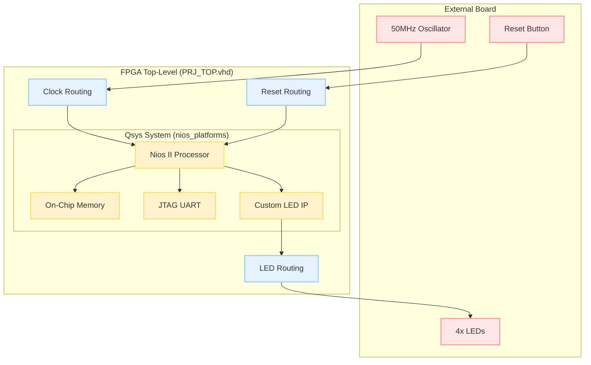
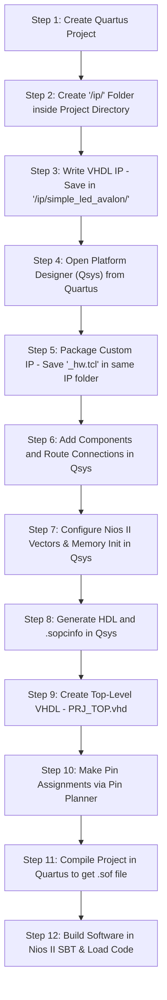

# สรุปบทเรียน: การสร้าง Custom IP และระบบ Nios II บน FPGA (คัมภีร์วิศวกร Embedded)

เอกสารนี้รวบรวมเนื้อหาการเรียนรู้ทั้งหมด ตั้งแต่วิธีคิด ขั้นตอนการทำงาน ปัญหาที่พบในการออกแบบ Hardware/Software ตลอดจนวิธีการนำไฟล์ระบบไปใช้งานต่ออย่างถูกต้องตามมาตรฐานสากลครับ

---

## 🗺️ 1. ภาพรวมสถาปัตยกรรมระบบ (System Architecture)

ระบบฝังตัว (Embedded System) บนชิป FPGA นี้ ประกอบด้วย Nios II Processor ที่เชื่อมต่อสื่อสารกับอุปกรณ์ปลายทางผ่านบัส **Avalon-MM (Avalon Memory-Mapped) Bus** และส่งออกสัญญาณภายนอกชิปผ่านขาพินไปยังบอร์ดจริง ดังแสดงใน Block Diagram ด้านล่างนี้ครับ:



---

## 🔄 2. ขั้นตอนการทำงานตั้งแต่เริ่มต้นจน Compile ผ่าน (Design Flow)

ในทางปฏิบัติการเริ่มต้นออกแบบระบบจะต้องเริ่มจากการตั้งโปรเจกต์ Quartus ก่อนเป็นลำดับแรกสุด เพื่อให้การสร้างโฟลเดอร์เก็บไฟล์และตัวไอพีจัดเก็บอยู่ในพื้นที่เดียวกัน ป้องกันปัญหาตำแหน่งไฟล์หลุด (Path Error):



---

## 🔌 3. รายละเอียดการเชื่อมต่อ (Routing) และการตั้งค่าใน Qsys

สำหรับมือใหม่ จุดที่ยากและสับสนที่สุดมักจะเป็นการต่อเส้นวงกลมเชื่อมสัญญาณ (Routing) และการตั้งค่าพารามิเตอร์ภายในตัวโปรเซสเซอร์และหน่วยความจำครับ มีรายละเอียดกฎการตั้งค่าดังนี้:

### 3.1 การเชื่อมต่อสัญญาณนาฬิกา (Clock) และรีเซ็ต (Reset)
ภายใน Qsys คุณต้องมั่นใจว่าเชื่อมต่อจุดตัดวงกลมเป็นจุดสีดำทึบตามกฎการต่อสายเหล่านี้:

* **Clock Network:**
  * สัญญาณนาฬิกาจากภายนอกบอร์ดวิ่งเข้าบอร์ดที่ `clk_in` ของบล็อก `clk_0`
  * เอาต์พุตสัญญาณจาก `clk_0.clk` จะจ่ายเข้าขา `refclk` (Reference Clock) ของ `pll_0` เท่านั้น
  * เอาต์พุตสัญญาณหลักจาก **`pll_0.outclk0`** (สัญญาณนาฬิกาที่ผ่านการปรับจูนความถี่และล้างจิสเตอร์แล้ว) จะต้องจ่ายไปที่ขา `clk` ของทุกอุปกรณ์ในระบบ ได้แก่:
    * `nios2_gen2_0.clk`
    * `onchip_memory2_0.clk1`
    * `jtag_uart_0.clk`
    * `simple_led_avalon_0.clk`
* **Reset Network:**
  * ขารีเซ็ตภายนอก `clk_in_reset` ของบล็อก `clk_0` จะส่งไปรีเซ็ตตัว `pll_0`
  * เอาต์พุตการรีเซ็ตที่เสถียรจาก **`pll_0.reset_source`** (หรือ `clk_0.clk_reset`) จะต้องต่อเชื่อมไปยังขารีเซ็ตของทุกอุปกรณ์ ได้แก่:
    * `nios2_gen2_0.reset`
    * `onchip_memory2_0.reset1`
    * `jtag_uart_0.reset`
    * `simple_led_avalon_0.reset` (หรือ `reset_n` ซึ่งเป็น Active-Low)

### 3.2 การตั้งค่าเวกเตอร์ของ Nios II Processor (Vectors Config)
เมื่อชิป CPU สตาร์ตหรือเจอปัญหา มันจำเป็นต้องรู้ว่าจะให้วิ่งไปหาโปรแกรม C ที่ตำแหน่งใดในหน่วยความจำ 
1. ดับเบิลคลิกที่คอมโพเนนต์ **`nios2_gen2_0`** เพื่อเปิดหน้าต่างการตั้งค่า
2. ไปที่แถบ **Vectors**
3. ตั้งค่า **Reset vector memory** ให้ชี้ไปที่หน่วยความจำเก็บโค้ดของเรา ซึ่งก็คือ **`onchip_memory2_0.s1`** (กำหนด Offset เป็น `0x0`)
4. ตั้งค่า **Exception vector memory** ให้ชี้ไปที่ **`onchip_memory2_0.s1`** (กำหนด Offset เป็น `0x20`)

### 3.3 การเปิดระบบเตรียมความพร้อมหน่วยความจำ (Memory Initialization)
ในกรณีที่เราต้องการให้ระบบทำงานใน **Boot Option 3** (คือให้โปรเซสเซอร์บูตโปรแกรมที่ถูกโหลดฝังอยู่ใน FPGA ทันทีเมื่อเปิดสวิตช์จ่ายไฟเข้าบอร์ด) เราต้องทำตามขั้นตอนเหล่านี้:

1. ดับเบิลคลิกเปิดการตั้งค่าคอมโพเนนต์ **`onchip_memory2_0`**
2. ⚠️ **ต้องทำเครื่องหมายถูก (Tick) ที่ช่อง "Initialize memory content"** 
3. เมื่อเลือกตัวเลือกนี้ Qsys จะสร้างไฟล์ข้อมูลแรมเริ่มต้นขึ้นมาในรูปแบบไฟล์ **`.hex`** 
4. **ข้อควรระวังสำคัญสำหรับมือใหม่:**
   * ตอนที่เรา Compile โปรเจกต์ใน Quartus เป็นครั้งแรกสุด **เรายังไม่ได้เริ่มเขียนโปรแกรม C เลยด้วยซ้ำ** ทำให้ยังไม่มีไฟล์ `.hex` ที่แท้จริง 
   * ตัว Qsys จะช่วยโดยการเจนไฟล์ `.hex` แบบหลอกๆ (Dummy/Placeholder) ขึ้นมาให้ก่อนเพื่อให้ Quartus นำไปคอมไพล์บอร์ดจนผ่านได้โดยไม่ Error
   * หลังจากฮาร์ดแวร์ผ่านแล้ว และเราเขียนโปรแกรม C ใน Nios II SBT เสร็จแล้ว เราจะต้องกด Build เพื่อสร้างไฟล์ `.hex` จริงขึ้นมาทับ
   * จากนั้นใน Quartus ให้กดเมนู **Tools -> Update Memory Initialization Files** และกด **Processing -> Start -> Start Assembler** เพื่ออัปเดตโค้ด C ลงไปในไฟล์โปรแกรมฮาร์ดแวร์บอร์ด (`.sof`) โดยตรงโดยไม่ต้องเสียเวลา Compile วงจรใหม่ทั้งหมด (ใช้เวลาเพียง 5-10 วินาทีก็เสร็จ)

---

## 📄 4. เจาะลึก: ไฟล์ `.sopcinfo` คืออะไร และมีบทบาทอย่างไร?

เมื่อเรากด **Generate HDL** ใน Qsys โปรแกรมจะสร้างไฟล์ที่ชื่อว่า **`[ชื่อโปรเจกต์].sopcinfo`** (ย่อมาจาก **System On a Programmable Chip Information**)

### 💡 `.sopcinfo` คืออะไร?
* มันคือไฟล์ข้อมูลประเภท XML ที่ทำหน้าที่เก็บ **"Hardware Blueprint"** ทั้งหมดที่เราจัดแจงไว้ใน Qsys 
* ข้อมูลข้างในประกอบไปด้วย: สเปกของ Nios II Processor, ขนาดของ On-Chip Memory, ค่า Base Address ของอุปกรณ์ต่างๆ (เช่น ค่าตำแหน่งรีจิสเตอร์ของไฟ LED ที่ `0x00041000`), สัญญาณ Interrupt (IRQ) และข้อมูลโครงสร้างของบัสภายในชิป

### ⚙️ การนำไปใช้งานต่อในฝั่งซอฟต์แวร์ C (Nios II SBT):
1. **การสร้างบอร์ดจำลอง (BSP Generation):**
   เมื่อเราเปิดโปรแกรม Nios II Software Build Tools (SBT) เพื่อเขียนภาษา C เราจะต้องนำไฟล์ `.sopcinfo` ตัวนี้ไปโหลดเข้าโปรเจกต์ซอฟต์แวร์
2. **การแปลงข้อมูลฮาร์ดแวร์เป็นภาษา C:**
   ตัวคอมไพเลอร์ C จะอ่านไฟล์ `.sopcinfo` แล้วสร้างไฟล์ระบบที่ชื่อว่า **`system.h`** ขึ้นมาให้เราโดยอัตโนมัติ 
   * ในไฟล์ `system.h` จะปรากฏตัวแปรค่าคงที่และมาโครต่างๆ เช่น `#define SIMPLE_LED_AVALON_0_BASE 0x41000` 
   * ทำให้ฝั่งซอฟต์แวร์ C สามารถเขียนโค้ดเรียกใช้งานชื่อตัวแปรของฮาร์ดแวร์ได้โดยตรง ป้องกันข้อผิดพลาดจากการจำเลขแอดเดรสผิด
3. **การทำงานซ้ำเมื่อเปลี่ยนฮาร์ดแวร์ (Syncing changes):**
   หากคุณมีการปรับแก้ไขโครงสร้างใดๆ ใน Qsys (เช่น เปลี่ยนฐานแอดเดรส, เพิ่มอุปกรณ์ใหม่) 
   * **ลำดับขั้นที่ต้องทำ:** ต้องกด Generate HDL ใน Qsys ใหม่ (เพื่อให้ได้ `.sopcinfo` ตัวล่าสุด) $\rightarrow$ จากนั้นในโปรแกรม Nios II SBT ให้คลิกขวาที่โปรเจกต์ BSP แล้วเลือก **Nios II -> Generate BSP** เพื่ออัปเดตไฟล์ `system.h` ให้ตรงกับฮาร์ดแวร์ปัจจุบันเสมอ

---

## ⚠️ 5. ปัญหาที่พบหน้างาน (Troubleshooting) และข้อควรระวัง

สรุปข้อควรระวังและเทคนิคการดีบั๊กที่สำคัญในการทำงานออกแบบระบบฝังตัวดังนี้ครับ:

### 1) ปัญหาตำแหน่งไฟล์ `.tcl` และไฟล์ `.vhd` (IP Directory Placement)
* 🔴 **ปัญหาที่เจอ:** เมื่อไฟล์ `.tcl` อยู่คนละโฟลเดอร์กับโปรเจกต์ Qsys จะเกิดการโหลด IP ไม่ขึ้นและเกิด Error
* 💡 **ข้อควรระวัง:** ไฟล์ควบคุมไอพี (`_hw.tcl`) และไฟล์ฮาร์ดแวร์ VHDL (`.vhd`) **ควรเก็บไว้ในโฟลเดอร์เดียวกันเสมอ** เช่น อยู่ใน `/ip/simple_led_avalon/` ภายใต้โปรเจกต์ Quartus เพื่อป้องกันปัญหาพิกัดตำแหน่งไฟล์แบบ Relative Path คลาดเคลื่อน

### 2) ปัญหาชนิดพอร์ตและการแมปข้อมูลใน Component Editor
* 🔴 **ปัญหาที่เจอ:** สัญญาณควบคุมภายนอก ดันไปแมปอยู่ใต้บัสข้อมูล หรือสัญญาณบัสไม่ตรงมาตรฐานของบัสข้อมูล
* 💡 **ข้อควรระวัง:** 
  * ขาสัญญาณที่ต่อออกไปนอกชิป (เช่น ขา LED) ต้องเลือก Interface Type เป็นแบบ **Conduit** และ Signal Type เป็น **export** เท่านั้น
  * สัญญาณบัสข้อมูล `avl_writedata` และ `avl_readdata` ต้องมีขนาดเป็นพาวเวอร์ของสอง (เช่น 8, 16, 32 บิต) และต้องเลือก Signal Type ให้ตรงหน้าที่ของบัสด้วย (`writedata` และ `readdata`)

### 3) มาตรฐานการอ่านของบัส Avalon-MM (Read Gating)
* 🔴 **ปัญหาที่เจอ:** หากปล่อยให้เอาต์พุตข้อมูลอ่าน (`avl_readdata`) ส่งออกตลอดเวลา อาจเกิดปัญหาสัญญาณชนกันหรือกินพลังงานโดยไม่จำเป็น
* 💡 **ข้อควรระวัง:** ควรเพิ่มพอร์ตอินพุต **`avl_read`** และใช้การควบคุมเงื่อนไขเพื่อส่งข้อมูลออกเฉพาะยามที่บัสมีคำสั่งส่งสัญญาณอ่านมาจริงเท่านั้น:
  ```vhdl
  avl_readdata <= led_regs(to_integer(unsigned(avl_address))) when avl_read = '1' else (others => '0');
  ```

### 4) การใช้อินสแตนซ์แม่แบบ (Instantiation Template Mismatch)
* 🔴 **ปัญหาที่เจอ:** ชื่อคอมโพเนนต์ หรือพอร์ตในไฟล์ Top-Level เขียนไม่ตรงกับบล็อก Qsys จริงที่เจนมา
* 💡 **ข้อควรระวัง:** หลังจาก Gen HDL ใน Qsys สำเร็จแล้ว ให้เปิดดึงโครงสร้างพอร์ตมาจากไฟล์อินสแตนซ์ที่ Qsys เจนมาให้ตรงตัว (เช่น ไฟล์ `[ชื่อระบบ]_inst.vhd`) เพื่อนำมาปรับปรุงใน PRJ_TOP.vhd เสมอ เพื่อลดความผิดพลาดในการเขียนคำสะกด